## Natural language processing

### Uber: NLP ticket classification to find map-data errors ([source](https://www.uber.com/gb/en/blog/nlp-deep-learning-uber-maps/))

Uber classifies customer support tickets to surface which map-data types (bad geometry, wrong turn restrictions, missing roads) triggered complaints, then routes them to map-editing teams. The first version encoded tickets by averaging Word2Vec embeddings (trained unsupervised on ~1M tickets) concatenated with a one-hot contact type, fed to logistic regression. The final version replaced averaging with a WordCNN, which behaves like keyword spotting and beat both logistic regression and LSTM (AUC_ROC 0.849, AUC_PR 0.620) using trainable Word2Vec embeddings. It runs as a weekly Spark pipeline with a TensorFlow SavedModel wrapped as a Spark model and served through Michelangelo.

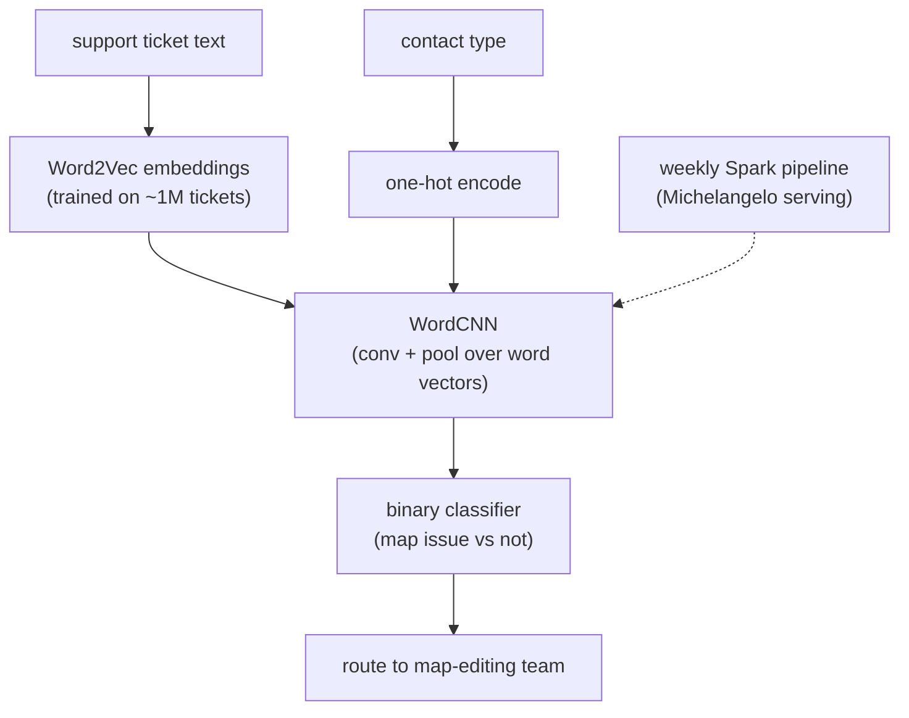

**Interview questions this design invites**
- Why train Word2Vec on tickets instead of using pretrained GloVe or Wikipedia embeddings?
- Why did WordCNN beat LSTM here, and when would that reverse?
- Why concatenate contact type as a one-hot feature rather than learning it?
- How do you pick the precision/recall operating point when misroutes are cheap but misses lose map fixes?
- Why is a weekly batch cadence acceptable instead of real-time inline scoring?
- How would you extend an English-only model to new languages given the labeling cost?

**Tricks and gotchas**
- Averaging embeddings loses word-order and phrase salience; a CNN recovers local n-gram signal cheaply.
- In-domain Word2Vec captures Uber slang and abbreviations that generic embeddings miss.
- Trainable embeddings beat frozen ones here because the corpus is large enough to fine-tune without overfitting.
- Manual labeling of 10K-20K tickets took 3-6 person-months; the labels, not the model, were the bottleneck.

**Common mistakes and how to fix them**
- Reaching for an LLM per ticket at 15M trips/day; fix with a distilled CNN in a batch pipeline.
- Reporting accuracy on an imbalanced issue label; fix by reporting AUC_PR and per-class precision/recall.
- Freezing embeddings by default; fix by A/B testing frozen vs trainable on your own corpus.
- Treating contact-type metadata as noise; fix by fusing structured features with the text representation.

### Airbnb: CNN NER extracting listing attributes into a taxonomy ([source](https://medium.com/airbnb-engineering/wisdom-of-unstructured-data-building-airbnbs-listing-knowledge-from-big-text-data-7c533466a63c))

Airbnb's Listing Attribute Extraction Platform (LAEP) pulls structured attributes (amenities, facilities, hospitality, location, structural details) out of free-text listing fields so guest search can match on things hosts described but never checked a box for. Stage one is a CNN-based NER over English-detected, tokenized text that emits entity label plus start/end span, trained on ~30K labeled examples. Stage two maps the many surface variants (a dozen ways to say "lockbox") onto an 800+ attribute taxonomy using word2vec cosine similarity with a "No Mapping" threshold. Stage three is a fine-tuned BERT classifier over a 65-word context window that scores each attribute as YES / Unknown / NO, evaluated with strict-match (boundary and category both correct).

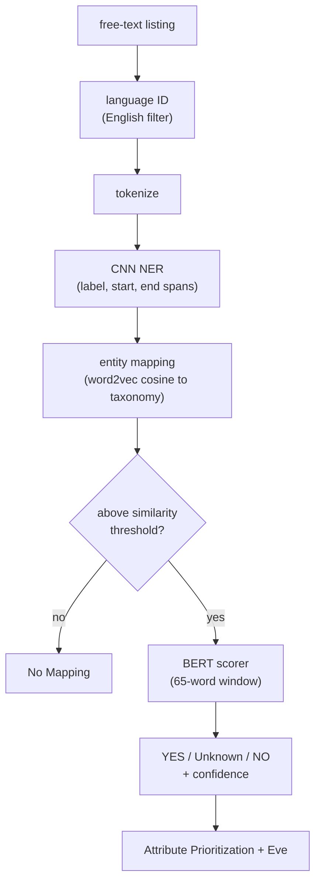

**Interview questions this design invites**
- Why split extraction into NER, mapping, and scoring rather than one end-to-end model?
- Why word2vec cosine for variant normalization instead of a supervised classifier?
- How do you set the "No Mapping" similarity threshold, and what breaks if it is wrong?
- Why add a separate BERT presence-scorer after NER already found the span?
- Why use strict-match evaluation, and when would partial-match be more honest?
- How do you keep an 800+ attribute taxonomy from drifting as hosts invent new phrasing?

**Tricks and gotchas**
- NER finds spans, but surface variance is huge, so a dedicated normalization stage is unavoidable.
- The YES/Unknown/NO scorer guards against false positives where a phrase appears but is negated ("no lockbox").
- A 32-token context window on each side gives the scorer enough to disambiguate presence from mention.
- Confidence scores at both mapping and scoring stages let downstream systems set their own precision bar.

**Common mistakes and how to fix them**
- Treating every string variant as its own attribute; fix with embedding-based collapse to a canonical taxonomy.
- Trusting NER span detection as presence confirmation; fix by adding a context-aware YES/NO scorer.
- Scoring extraction with loose partial-match; fix by using strict boundary-plus-category match.
- Ignoring language mix; fix by running language ID up front and filtering before tagging.

### Meta: proactive hate-speech detection at scale ([source](https://ai.meta.com/blog/how-ai-is-getting-better-at-detecting-hate-speech/))

Meta proactively detects hate speech across text, image, and video, reporting 94.7% of removed hate speech is caught by automation (up from 24% in 2017). The Reinforced Integrity Optimizer (RIO) optimizes end-to-end on live production data rather than a frozen offline dataset, tightening the sampling-to-A/B-test loop. Linformer cuts transformer attention from quadratic to linear so heavy language models can run at production scale and near real time. Whole Post Integrity Embeddings (WPIE) fuse modalities to catch cases benign in isolation but hateful together, and XLM-R (RoBERTa-based) extends coverage across many languages.

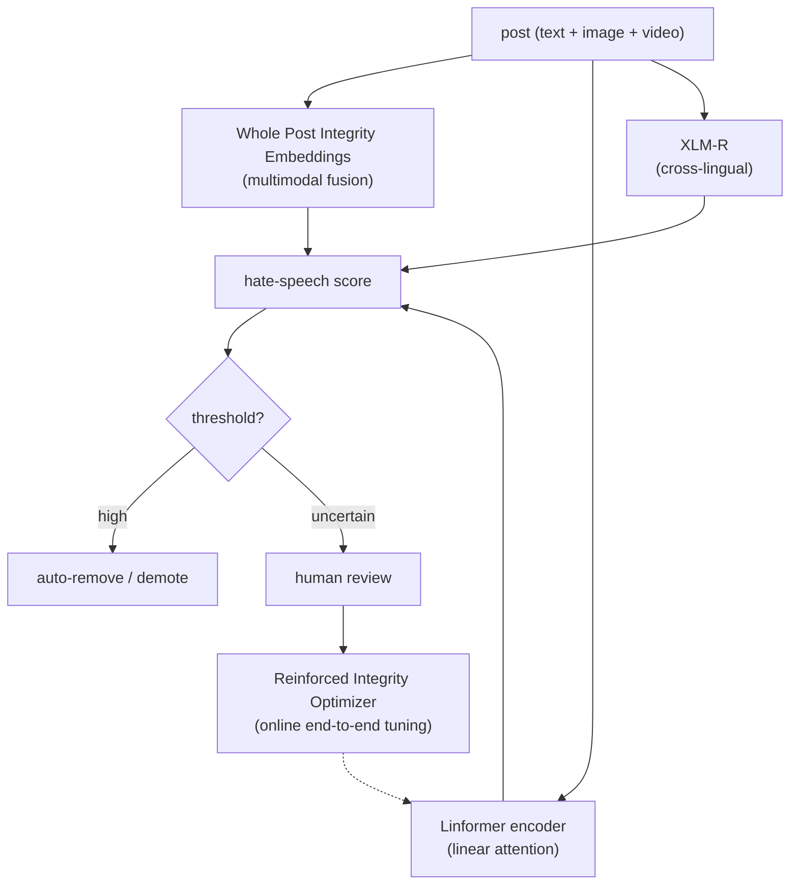

**Interview questions this design invites**
- Why optimize on live production data (RIO) instead of a fixed labeled benchmark?
- What does Linformer's linear attention buy you, and what accuracy do you trade for it?
- When is multimodal fusion (WPIE) necessary versus text-only classification?
- How do you balance recall against false-block harm on a free-expression platform?
- How does a cross-lingual encoder like XLM-R help low-resource languages, and where does it fall short?
- How do you keep up with adversarial obfuscation of hate speech over time?

**Tricks and gotchas**
- Text and image can each look benign while the combination is hateful; single-modality models miss this.
- Static offline datasets decay fast against adversaries; online end-to-end optimization keeps the model current.
- Linear-attention efficiency is what makes near-real-time proactive scanning of the firehose affordable.
- A false positive here silences a real user, so the precision bar is a policy decision, not just a metric.

**Common mistakes and how to fix them**
- Optimizing only offline then shipping; fix by closing the loop with online sampling and A/B tests.
- Running full quadratic attention on the firehose; fix with efficient attention (Linformer) for scale.
- Reporting one global accuracy; fix by slicing per language and tracking false-block rate separately.
- Treating text and image pipelines as independent; fix with joint multimodal embeddings for combined-meaning cases.

### Google: GNMT seq2seq machine translation at production scale ([source](https://research.google/blog/a-neural-network-for-machine-translation-at-production-scale/))

Google Neural Machine Translation (GNMT) replaced phrase-based translation with a deep sequence-to-sequence encoder-decoder RNN plus attention: the encoder turns the whole source sentence into vectors, the decoder emits target words one at a time while attending to a weighted distribution over the encoded source. Rare words are handled by subword units and alignment models, and serving runs on TensorFlow with TPUs to meet latency. Human raters on a 0-6 scale showed 55% to 85% error reduction over phrase-based systems on major language pairs. The authors note the model still drops words and mistranslates proper nouns because it translates sentences in isolation.

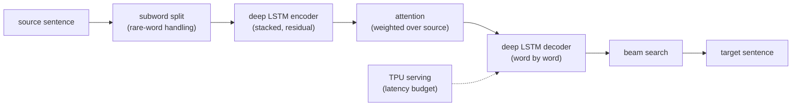

**Interview questions this design invites**
- Why does attention matter versus a single fixed-length encoding of the source?
- How do subword units solve the rare-word and out-of-vocabulary problem?
- Why serve on TPUs, and what latency constraint drives that choice?
- How do you evaluate translation quality, and why lean on human 0-6 ratings over BLEU alone?
- Why does translating sentences in isolation cause dropped words and proper-noun errors?
- How would you extend from one language pair to many without training N-squared models?

**Tricks and gotchas**
- A fixed-length bottleneck loses information on long sentences; attention gives the decoder direct source access.
- Subword tokenization trades vocabulary size for the ability to represent any word by pieces.
- Deep stacked LSTMs need residual connections to train stably.
- Automatic metrics miss meaning; human adequacy/fluency ratings are the real release gate.

**Common mistakes and how to fix them**
- Encoding the whole sentence into one vector; fix with an attention mechanism over encoder states.
- Keeping a fixed word vocabulary; fix with subword units to cover rare and unseen words.
- Reporting only BLEU; fix by adding human adequacy and fluency ratings.
- Ignoring latency in model choice; fix by co-designing model size with accelerator serving (TPU).

### Meta: neural machine translation across 2,000+ directions ([source](https://engineering.fb.com/2017/08/03/ml-applications/transitioning-entirely-to-neural-machine-translation/))

Meta moved all of its translation off phrase-based statistical models onto neural networks, starting with sequence-to-sequence LSTM plus attention (which captures full source context and handles heavy reordering between distant pairs like English-Turkish) and later adding CNN seq2seq. It runs 2,000+ translation directions and 4.5B translations per day, with an average 11% relative BLEU gain over phrase-based, and CNN gains of +4.3 BLEU (English-French) and +3.4 (English-German). Attention soft-alignment lets it look up untranslatable source words in bilingual lexicons (for example "tmrw" to "manana"). Serving uses Caffe2 with vocabulary reduction, weight quantization, and blob recycling for a 2.5x speedup, plus beam search implemented as a single forward pass.

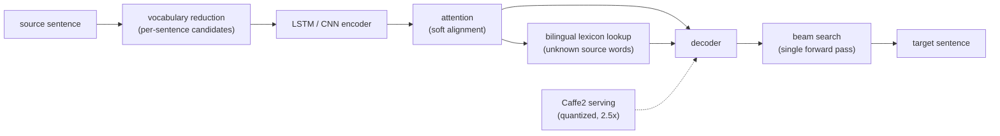

**Interview questions this design invites**
- Why start with LSTM+attention and later move to CNN seq2seq; what does each win?
- How does attention soft-alignment enable bilingual-lexicon fallback for unknown words?
- How do you serve 2,000+ directions without an unmanageable model count?
- What does vocabulary reduction do to latency, and what does it risk?
- Why quantize weights and recycle blobs, and where does quality degrade?
- How do you measure an 11% relative BLEU gain fairly across many languages?

**Tricks and gotchas**
- Distant language pairs need whole-sentence context to reorder words; phrase-based systems cannot.
- Per-sentence vocabulary shortlists slash the softmax cost without a full vocabulary pass.
- Beam search folded into one Caffe2 RNN forward pass keeps decoding fast.
- Weight quantization plus blob recycling gave 2.5x throughput with acceptable quality loss.

**Common mistakes and how to fix them**
- Shipping a full-vocabulary softmax at scale; fix with vocabulary reduction to per-sentence candidates.
- Dropping unknown source words; fix with attention alignment plus a bilingual lexicon lookup.
- Serving unquantized models; fix by quantizing and reusing memory blobs for throughput.
- Averaging BLEU across languages without slicing; fix by reporting per-language deltas.

### LinkedIn: entity resolution and standardization for the Knowledge Graph ([source](https://www.linkedin.com/blog/engineering/knowledge/building-the-linkedin-knowledge-graph))

LinkedIn's Knowledge Graph standardizes user-generated entities (450M members, 9M companies, 35K skills, 24K titles, 28K schools) into a canonical taxonomy. Auto-created entities go through a pipeline: candidate generation mines common phrases from profiles and job descriptions, disambiguation uses co-occurrence vectors and soft clustering to split a phrase's multiple meanings, de-duplication uses word2vec plus manual validation to merge synonyms, and expert linguists (with MT for the long tail) translate high-coverage entities. Relationships between entities are inferred by per-type binary classifiers trained on member-selected relationships as positives, with crowdsourced labels for the tail; accepted recommendations become new training data in a feedback loop.

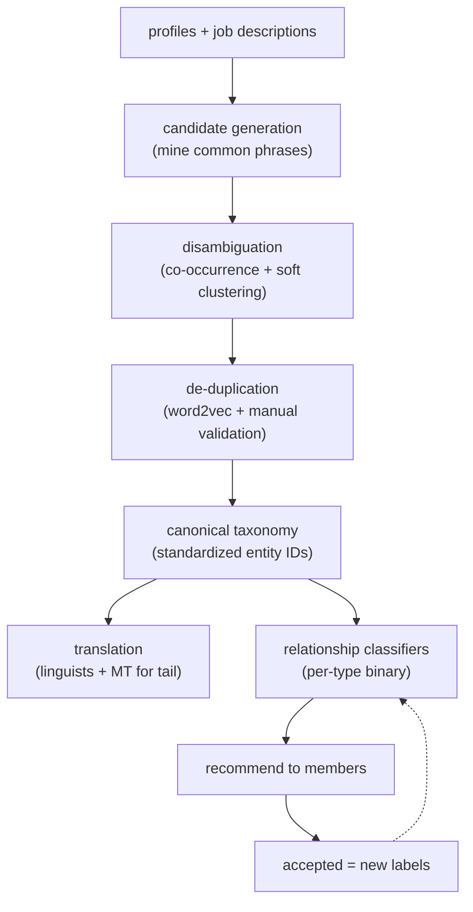

**Interview questions this design invites**
- Why does one surface phrase need both disambiguation and de-duplication?
- How do co-occurrence vectors separate a polysemous phrase's senses?
- Why use member-selected relationships as free positive training labels?
- How do you handle the long tail where entities are rare and labels are scarce?
- How do you keep human validation in the loop without it becoming the bottleneck?
- How would you evaluate entity-resolution quality (pairwise precision/recall on matches)?

**Tricks and gotchas**
- The same string can mean different things (disambiguation) and different strings can mean the same thing (de-dup); both directions are needed.
- Member-accepted recommendations are a self-refreshing label source, closing the loop cheaply.
- Word2vec embeddings surface synonym clusters that exact-match rules miss.
- High-coverage entities get expert translation; the tail gets MT, spending human budget where it counts.

**Common mistakes and how to fix them**
- Treating standardization as exact string matching; fix with embedding clustering plus disambiguation.
- Hand-labeling every relationship; fix by mining member-confirmed edges as positives.
- Ignoring polysemy; fix with co-occurrence-based sense splitting before merging.
- Translating every entity manually; fix by reserving linguists for high-coverage and using MT for the tail.

### Pinterest: spam detection with DNN, clustering, and graph label propagation ([source](https://medium.com/pinterest-engineering/how-pinterest-fights-spam-using-machine-learning-d0ee2589f00a))

Pinterest fights spam with a layered reactive-plus-proactive system. A real-time rules engine and lightweight models catch obvious cases inline, while heavier deep models run proactively. A DNN classifies spam domains (not individual links) so enforcement covers every pin sharing that domain, using link, webpage-content, and user-domain interaction features scored in batch with PySpark and TensorFlow. For users, a supervised DNN on synthetically labeled data scores accounts, lightweight clustering catches emerging bot patterns the supervised model misses, and a bipartite user-domain graph runs semi-supervised label propagation to flag spam accounts and domains together. Sampled human review of high-traffic and tail domains cuts false positives before enforcement and feeds future training.

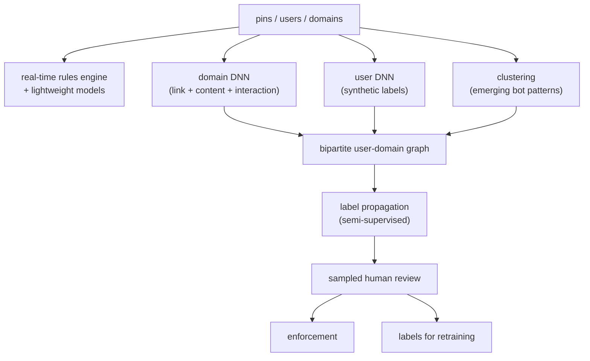

**Interview questions this design invites**
- Why classify domains rather than individual links or pins?
- What does clustering catch that a supervised DNN misses, and why?
- How does bipartite-graph label propagation flag accounts and domains jointly?
- Why keep a real-time rules layer alongside heavier proactive models?
- How do you generate synthetic labels without baking in a blind spot?
- How do you sample for human review so it reduces false positives efficiently?

**Tricks and gotchas**
- Enforcing at the domain level generalizes one signal across all pins sharing it.
- Supervised models miss novel attacks; unsupervised clustering surfaces emerging bot behavior.
- The user-domain graph lets a few known-bad seeds propagate to connected spam.
- Human review of both head and tail domains calibrates false-positive rate before acting.

**Common mistakes and how to fix them**
- Relying only on supervised labels; fix by adding clustering to catch novel patterns.
- Scoring links one at a time; fix by classifying domains for broader enforcement.
- Acting on model scores without review; fix with sampled human audit before enforcement.
- Treating accounts and domains as independent; fix with graph label propagation across the bipartite structure.

### LinkedIn: LSTM over member-activity sequences for abuse detection ([source](https://www.linkedin.com/blog/engineering/trust-and-safety/using-deep-learning-to-detect-abusive-sequences-of-member-activi))

LinkedIn's Anti-Abuse AI team frames abuse as sequence classification over a member's raw activity rather than scoring isolated events. Each HTTP request becomes a token for the action type (profile view, search, login), integer-encoded by request frequency, so a member's session reads like a sentence describing their behavior. An LSTM consumes this token sequence plus inter-request timing and outputs an abuse score from the type, order, and frequency of request paths. The first use case is logged-in account scraping, with training labels bootstrapped from an unsupervised isolation-forest outlier detector: legitimate activity is heterogeneous and irregular while scrapers are homogeneous and repetitive, hard to fake. One architecture and input format generalizes to new abuse types by swapping the label set.

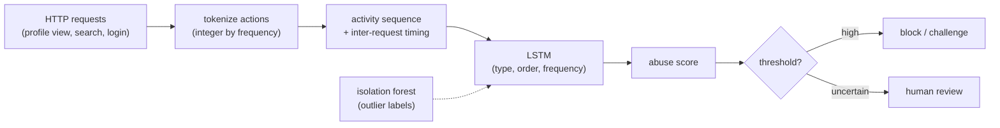

**Interview questions this design invites**
- Why model a sequence of actions instead of scoring each event independently?
- How does tokenizing requests by frequency turn a session into an NLP-style input?
- Why bootstrap labels from an isolation forest instead of hand-labeling?
- Why is a raw-sequence model more adversarially robust than handcrafted features?
- How does one architecture generalize across abuse types by only changing labels?
- What role does inter-request timing play beyond the action tokens?

**Tricks and gotchas**
- Scrapers reveal themselves in the pattern over time, not in any single request.
- Frequency-based integer encoding gives common actions stable low IDs, like a vocabulary.
- Learning directly from the sequence avoids the information loss of handcrafted features attackers can reverse-engineer.
- Unsupervised outlier labels give a starting signal where no ground truth exists.

**Common mistakes and how to fix them**
- Classifying single events; fix by modeling the full activity sequence with an LSTM.
- Over-engineering handcrafted features; fix by feeding raw tokenized sequences to the model.
- Waiting for hand labels; fix by bootstrapping with isolation-forest outlier detection.
- Building a bespoke model per abuse type; fix with one architecture and swappable labels.

### Uber: COTA ticket routing and solution suggestion ([source](https://www.uber.com/blog/cota/))

COTA (Customer Obsession Ticket Assistant) suggests the three most likely issue types and solutions to support agents on Uber's Michelangelo platform, cutting resolution time over 10% while holding satisfaction steady. The NLP pipeline preprocesses text (cleaning, tokenization, stopword removal, lemmatization) into bag-of-words, extracts topics with TF-IDF and LSA, then engineers features as cosine similarities between ticket and candidate-solution topic vectors instead of feeding high-dimensional vectors directly. A learning-to-rank, retrieval-based pointwise random forest scores solution-ticket pairs; this beat direct multi-class classification by 25% in accuracy with 70% less training time. Experimental CNN/RNN models added roughly 10% more accuracy and were in final productization.

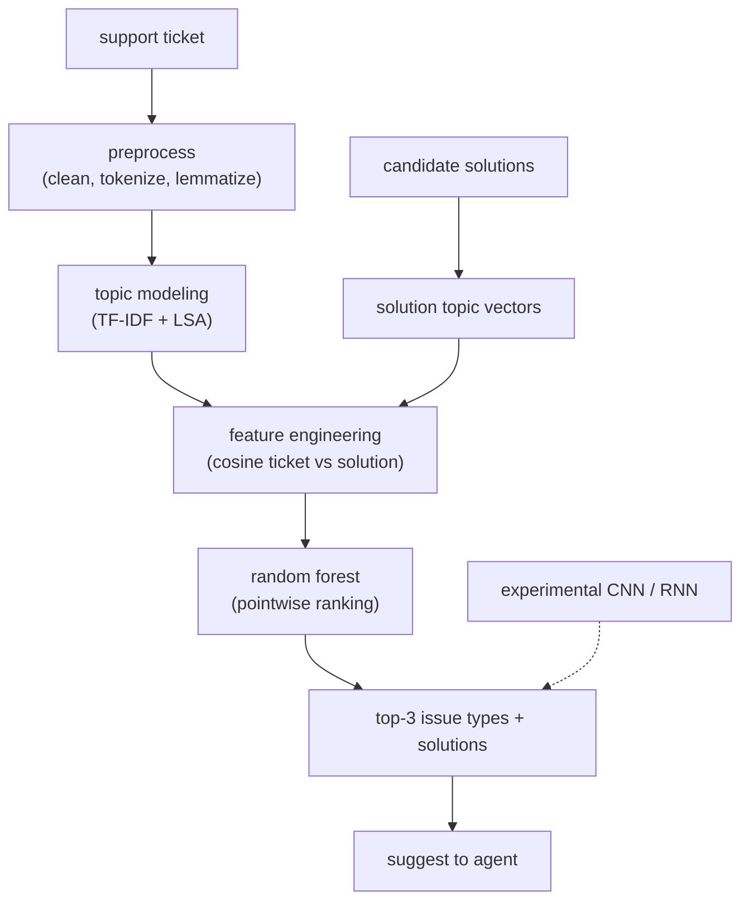

**Interview questions this design invites**
- Why frame ticket resolution as learning-to-rank rather than multi-class classification?
- Why compute cosine similarity features instead of feeding topic vectors directly?
- What do TF-IDF and LSA buy over raw bag-of-words?
- Why did pointwise ranking beat classification by 25% with less training time?
- When is the +10% from CNN/RNN worth the added serving complexity?
- How do you measure that suggestions actually speed up agents in production?

**Tricks and gotchas**
- Turning topic vectors into a single cosine feature slashes dimensionality and training time.
- Ranking solution-ticket pairs handles a large, shifting solution space better than fixed classes.
- Offline and online A/B results matched, validating the offline metric as a proxy.
- Lemmatization plus stopword removal keeps the bag-of-words signal focused.

**Common mistakes and how to fix them**
- Forcing a huge solution space into multi-class labels; fix with a retrieval-and-rank formulation.
- Feeding high-dimensional topic vectors raw; fix with cosine-similarity feature engineering.
- Jumping straight to deep models; fix by proving a random forest baseline first.
- Trusting offline metrics blindly; fix by A/B testing that suggestions cut real handle time.

### Airbnb: contact-reason detection for voice support ([source](https://airbnb.tech/ai-ml/listening-learning-and-helping-at-scale-how-machine-learning-transforms-airbnbs-voice-support-experience/))

Airbnb rebuilt its phone IVR around ML in four stages. A domain-specific ASR tuned for phone audio and Airbnb terminology cut word error rate from 33% to about 10%, which lifts everything downstream. A Contact Reason Detection classifier reads the transcript and categorizes the inquiry (refund, account issue) with average latency under 50ms via parallel processing. Based on intent, the system either serves a self-service help article or routes to a human agent, using a semantic-embedding retrieval plus LLM-based ranking that finds articles within 60ms. A paraphrasing model summarizes before presenting articles, hitting over 90% precision through nearest-neighbor embedding matching, which raised article engagement and reduced agent load.

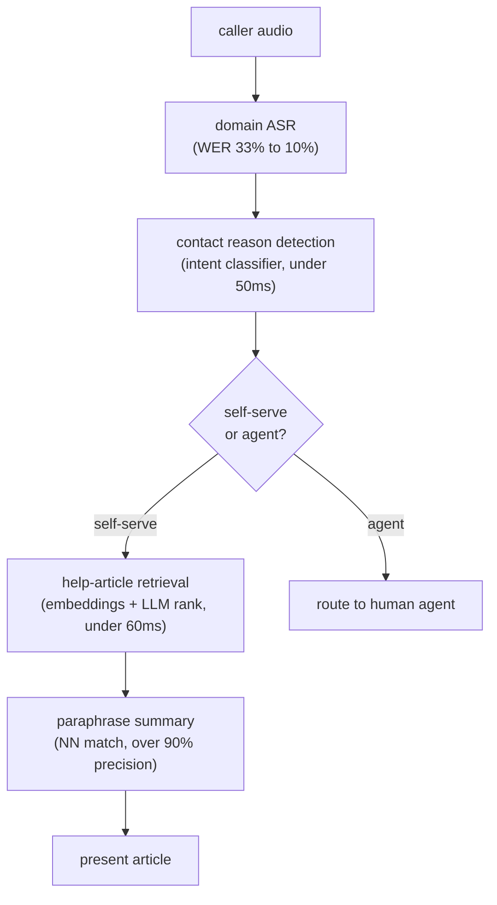

**Interview questions this design invites**
- Why does ASR word error rate dominate every downstream stage's quality?
- How do you keep intent classification under 50ms on transcribed speech?
- When do you self-serve versus route to a human, and how do you set that boundary?
- Why combine embedding retrieval with LLM ranking for article lookup?
- How do you measure the paraphrase model's 90% precision meaningfully?
- How do you avoid frustrating callers when intent is misclassified?

**Tricks and gotchas**
- Domain-tuned ASR on phone audio is the highest-leverage fix; a bad transcript dooms everything after.
- Parallel processing keeps intent latency low enough for a live phone call.
- Retrieval plus LLM rank separates cheap candidate generation from expensive precise ranking.
- A paraphrase summary before the article boosts engagement by setting expectation.

**Common mistakes and how to fix them**
- Using generic ASR on phone audio; fix by tuning on domain audio and terminology.
- Putting a slow model inline on a live call; fix by budgeting sub-50ms with parallelism.
- Auto-serving articles for every intent; fix by routing uncertain or high-risk reasons to agents.
- Ranking articles with embeddings alone; fix by adding an LLM re-ranker for precision.

### Grammarly: GECToR grammatical error correction by tagging ([source](https://www.grammarly.com/blog/engineering/gec-tag-not-rewrite/))

GECToR reframes grammatical error correction from sequence-to-sequence rewriting into sequence tagging: assign an edit transformation to each token, reducing the task to language understanding. A BERT-like encoder feeds two linear heads, one for error detection and one for token tagging, over a vocabulary of ~5,000 edit tags (basic KEEP/DELETE/APPEND/REPLACE plus g-transformations for pluralization, verb conjugation, casing, merges and splits) covering 98% of common errors. Training is three-stage: 9M synthetic pairs, then 500K and 34K real learner sentences, with error-free sentences in the last stage proving crucial. It runs up to 10x faster than seq2seq (0.40s vs 1.25s+ per sentence), applies edits iteratively until convergence (usually two passes), and hits F0.5 of 65.3 on CoNLL-2014 and 72.4 on BEA-2019.

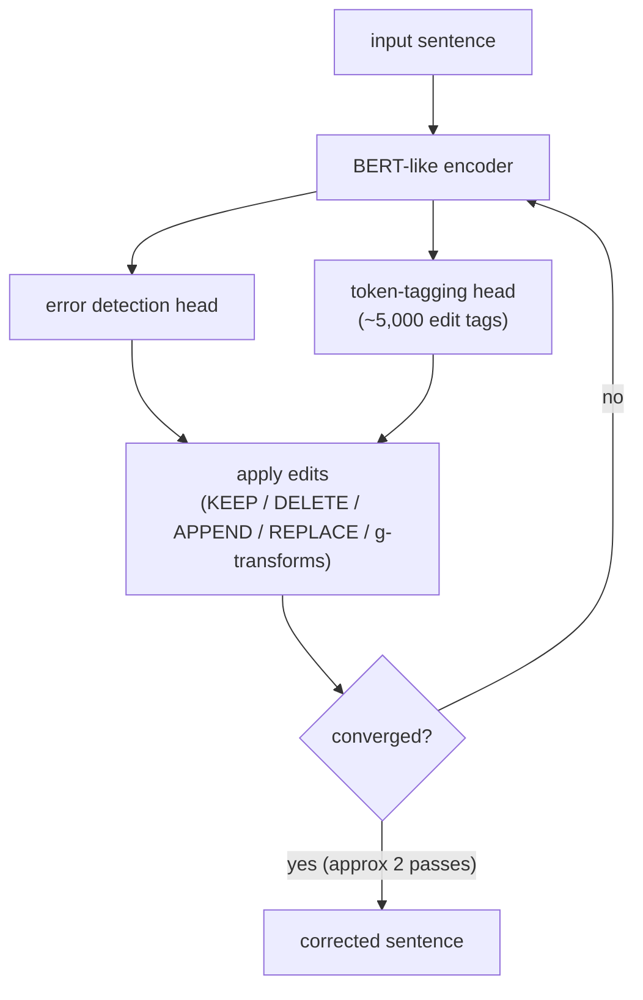

**Interview questions this design invites**
- Why is tagging faster than seq2seq generation for correction?
- How do you design an edit-tag vocabulary that covers 98% of errors without exploding?
- Why iterative re-tagging, and why does it converge in about two passes?
- Why does adding error-free sentences in the final training stage help?
- Why report F0.5 rather than F1 for grammar correction?
- What are g-transformations solving that fixed replace tags cannot?

**Tricks and gotchas**
- Tagging edits is a fixed-output-per-token problem, far cheaper than autoregressive generation.
- G-transformations parameterize morphology (plural, tense) so one tag family covers many surface forms.
- Iterative application catches errors exposed only after a first edit.
- Including correct sentences teaches the model to leave good text alone, cutting false edits.

**Common mistakes and how to fix them**
- Defaulting to seq2seq generation for correction; fix with token-level edit tagging for speed and interpretability.
- Building a tag set that misses morphology; fix with parameterized g-transformations.
- Training only on erroneous sentences; fix by adding error-free examples to reduce over-correction.
- Scoring with F1; fix by using F0.5 to weight precision, since false corrections annoy users most.

_Not reachable: none_
