## Demand forecasting and time series

### Uber: classical + ML + deep forecasting stack with prediction intervals ([source](https://www.uber.com/blog/forecasting-introduction/))

Uber forecasts across three surfaces: marketplace supply and demand (spatiotemporal), hardware capacity planning, and marketing effectiveness. They deliberately span three model families (classical ARIMA / Holt-Winters / Theta, ML like quantile regression forests and gradient boosting, and deep RNN / LSTM when exogenous regressors are plentiful) rather than betting on one, and they stress that prediction intervals are "just as important as the point forecast itself" because capacity reserves and driver positioning depend on the spread. Validation is strictly chronological (sliding or expanding windows) through an internal parallel backtesting framework called Omphalos, and models are benchmarked against naive forecasts rather than raw error.

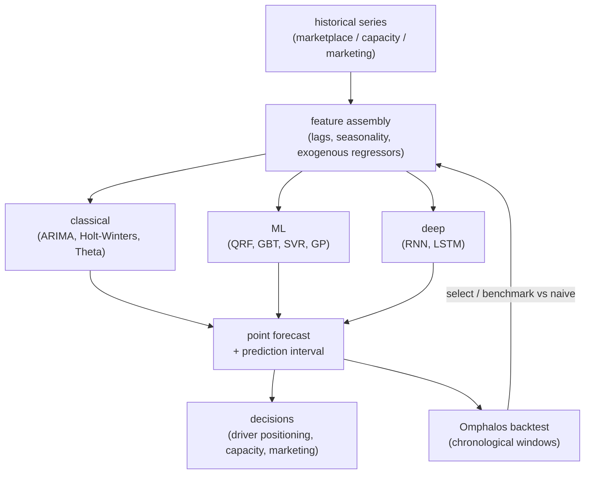

**Interview questions this design invites**
- When do you reach for classical vs ML vs deep, and how do you prove the deep model earns its cost?
- Why are prediction intervals as important as the point forecast for capacity planning?
- How does spatiotemporal marketplace forecasting differ from a plain temporal series?
- What does a chronological (sliding / expanding window) backtest protect against?
- Why benchmark against a naive forecast instead of an absolute error target?
- How do you keep one framework comparing many model families fairly?

**Tricks and gotchas**
- Prediction intervals widen with horizon, data scarcity, and volatility; they drive the reserve, not the mean.
- A shared backtesting harness (Omphalos) lets heterogeneous methods be compared apples-to-apples.
- Exogenous regressors are the gate for deep models; without them RNN / LSTM rarely pull ahead.
- Naive-baseline benchmarking keeps teams honest about whether complexity buys anything.

**Common mistakes and how to fix them**
- Optimizing a single point metric and skipping intervals: emit and evaluate the interval, size reserves off it.
- Random train / test splits that leak the future: use chronological expanding / sliding windows.
- Defaulting to deep nets: baseline classical and ML first, only escalate when regressors justify it.

### Uber DeepETA: Transformer residual on a routing baseline under global latency ([source](https://www.uber.com/us/en/blog/deepeta-how-uber-predicts-arrival-times/))

DeepETA predicts the residual between a physical routing-engine ETA and the real-world observed time, using an encoder-decoder Transformer that won a bake-off against seven other architectures (MLP, NODE, TabNet, MoE, HyperNetworks, standard and linear Transformers). To meet inline latency it uses a linear-attention Transformer (dropping self-attention from O(K squared d) to O(K d squared)), pushes almost all parameters into embedding lookup tables (only about 0.25 percent of parameters touched per request), and stays shallow. Continuous features are bucketized into quantile buckets then embedded, a fully-connected decoder applies segment-bias adjustment layers to specialize by trip type and route length, and training uses an asymmetric Huber loss so under and over prediction can be penalized differently. It serves via uRoute plus Michelangelo online prediction and is evaluated on MAE against an XGBoost baseline.

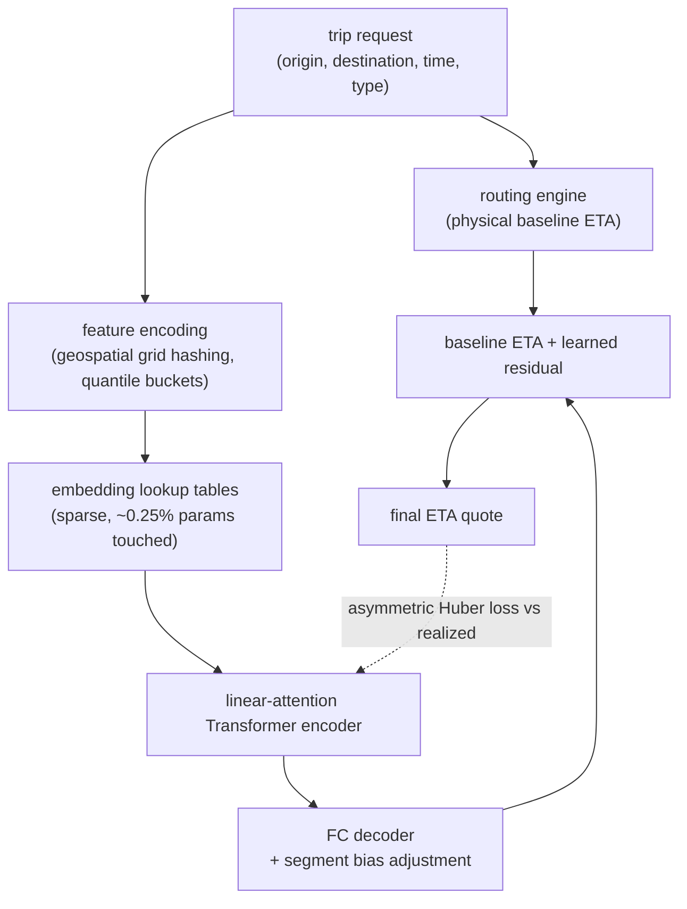

**Interview questions this design invites**
- Why predict a residual on a routing baseline instead of absolute travel time?
- How does linear attention change the latency profile versus standard self-attention?
- Why bucketize continuous features into embeddings instead of feeding raw values?
- What does asymmetric Huber loss buy you when late and early errors cost differently?
- How do segment-bias layers let one model serve delivery and rideshare trips?
- Why is embedding-table lookup (O(1)) preferable to tree or dense compute at serve time?

**Tricks and gotchas**
- Residual learning is easier and lets you update the ML layer without refactoring the routing engine.
- Putting parameters in lookup tables makes a huge model cheap to serve inline.
- Quantile bucketing plus feature hashing tames high-cardinality geospatial inputs.
- Asymmetry in the loss encodes the real business cost of a late vs early ETA.

**Common mistakes and how to fix them**
- Modeling absolute ETA from scratch: learn a correction on the physical baseline instead.
- Using full self-attention inline and blowing the latency budget: switch to linear attention.
- Symmetric loss when errors are not symmetric in cost: parameterize an asymmetric Huber.

### Amazon Science: end-to-end coherent probabilistic hierarchical forecasts ([source](https://www.amazon.science/publications/end-to-end-learning-of-coherent-probabilistic-forecasts-for-hierarchical-time-series))

This ICML 2021 method folds hierarchical reconciliation directly into a neural network rather than running a two-stage forecast-then-reconcile pipeline. Because reconciliation is an optimization with a closed-form solution, it can be embedded as a differentiable layer, and a reparameterization trick lets the model emit full probabilistic (not point) forecasts that are coherent across levels by construction. It learns jointly from every series in the hierarchy and generalizes to grouped, temporal, and cross-temporal aggregation structures, beating state-of-the-art on real hierarchical datasets.

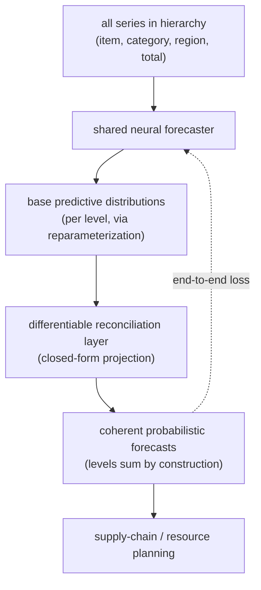

**Interview questions this design invites**
- Why is post-hoc reconciliation (MinT, bottom-up) suboptimal compared to end-to-end learning?
- How can reconciliation be made a differentiable layer inside the network?
- What does the reparameterization trick give you for probabilistic hierarchical output?
- What is coherence and why must child forecasts sum to the parent?
- How does joint learning across all levels borrow strength for sparse leaves?
- How would you extend this to temporal (cross-temporal) hierarchies?

**Tricks and gotchas**
- Closed-form reconciliation means it can be a fixed differentiable layer, not an extra training loop.
- Coherence-by-construction removes the drift between forecast and reconcile stages.
- Probabilistic output at every level is what the downstream optimizer actually needs.
- One model over the whole hierarchy shares signal that per-level models throw away.

**Common mistakes and how to fix them**
- Forecasting each level independently and getting numbers that do not add up: enforce coherence in-model.
- Reconciling only point forecasts: carry the full distribution through the reconciliation.
- Treating reconciliation as post-processing: make it a differentiable part of the objective.

### Google DeepMind: Graph Neural Networks for Google Maps ETA ([source](https://deepmind.google/blog/traffic-prediction-with-advanced-graph-neural-networks/))

DeepMind and Google Maps model the road network as a graph and group adjacent, traffic-correlated segments into Supersegments (from two nodes to 100-plus). A Graph Neural Network passes messages between adjacent nodes to capture how congestion diffuses across connected roads, predicting travel times 10 to 50 minutes ahead and handling variable-length routes with a single model instead of millions of per-route models. Two training tricks stabilized it: MetaGradients dynamically adapt the learning rate across batches with wildly different graph sizes, and a combined loss (L2 / L1 on traversal time plus Huber and per-node negative-log-likelihood) improves generalization. Deployment raised ETA accuracy up to 50 percent (51 percent Taichung, 43 percent Sydney) for over a billion users.

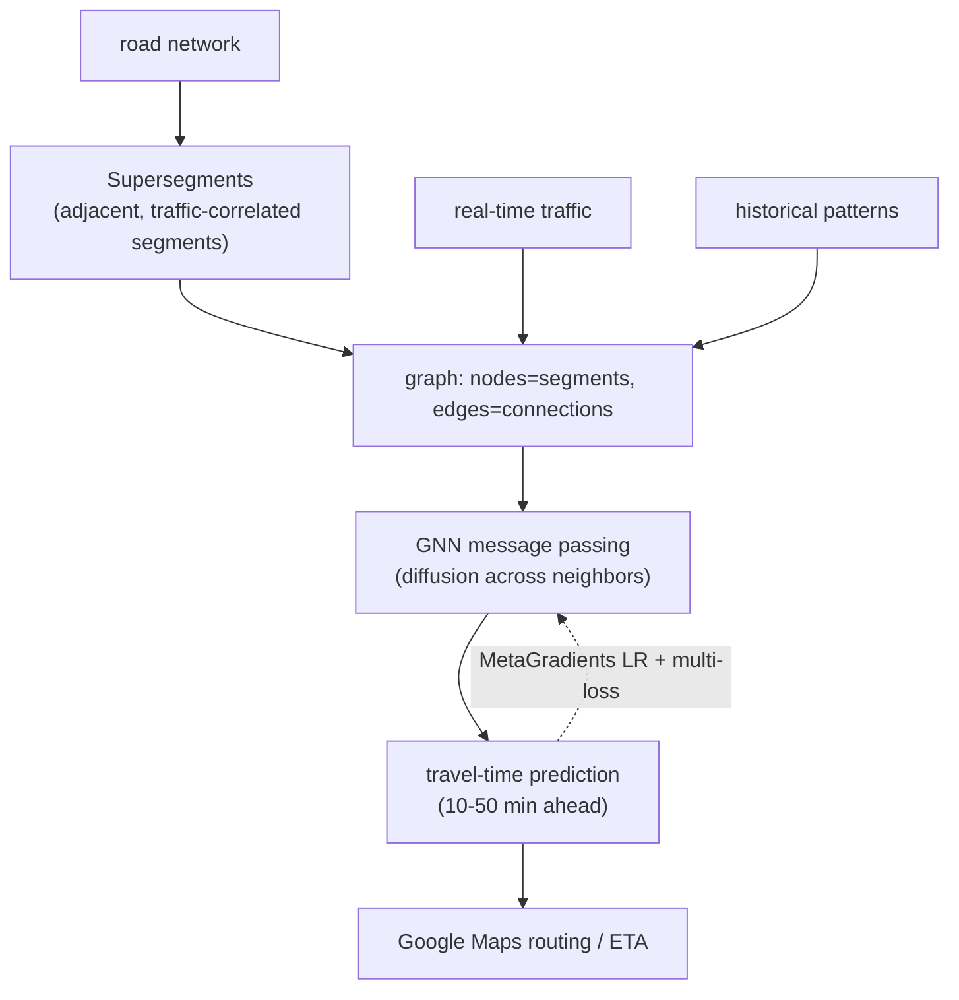

**Interview questions this design invites**
- Why model the road network as a graph instead of independent segment regressions?
- What do Supersegments buy you over per-segment or per-route models?
- How does message passing capture congestion diffusion (side street to main road)?
- Why did variable graph sizes destabilize training, and how did MetaGradients fix it?
- Why combine multiple losses (L2 / L1 / Huber / per-node NLL)?
- How do you serve a GNN ETA under tight inline latency?

**Tricks and gotchas**
- Supersegments cut a million-model problem down to one shared model over the graph.
- MetaGradients auto-tune the learning rate when batch graph sizes vary enormously.
- A multi-term loss regularizes toward unseen test graphs.
- Message passing naturally encodes turn delays and cascading stop-and-go effects.

**Common mistakes and how to fix them**
- Treating segments independently and missing diffusion: use a GNN over the connectivity graph.
- Fixed learning rate across heterogeneous graph batches: adapt it with MetaGradients.
- One model per route (unscalable): a single graph model handles variable-length routes.

### Instacart: hierarchical general / trending / real-time availability model ([source](https://company.instacart.com/tech-innovation/how-instacart-modernized-the-prediction-of-real-time-availability-for-hundreds-of-millions-of-items-while-saving-costs))

Instacart predicts the probability (0 to 1) that a specific item in a specific store is available, using a three-layer model: General captures typical 7-to-180-day availability and beats sparsity by borrowing from similar items and regions (store-level for popular items, nationwide aggregation for the tail); Trending is an XGBoost layer detecting near-term deviations from that baseline; Real-time infers from the latest shopper and retailer signals (time since last observation, last known status, retailer inventory) and learns restock-time distributions. The big cost win (about 80 percent) comes from stratified scoring cadence: only about 1 percent of head items get hourly real-time inference, torso items (about 85 percent) get daily general plus trending, and tail items get general plus trending only. It runs on the Griffin MLOps platform with streaming and a feature store, and the API serves different model versions per consumer (real-time for logistics routing, scheduled predictions for customer ordering).

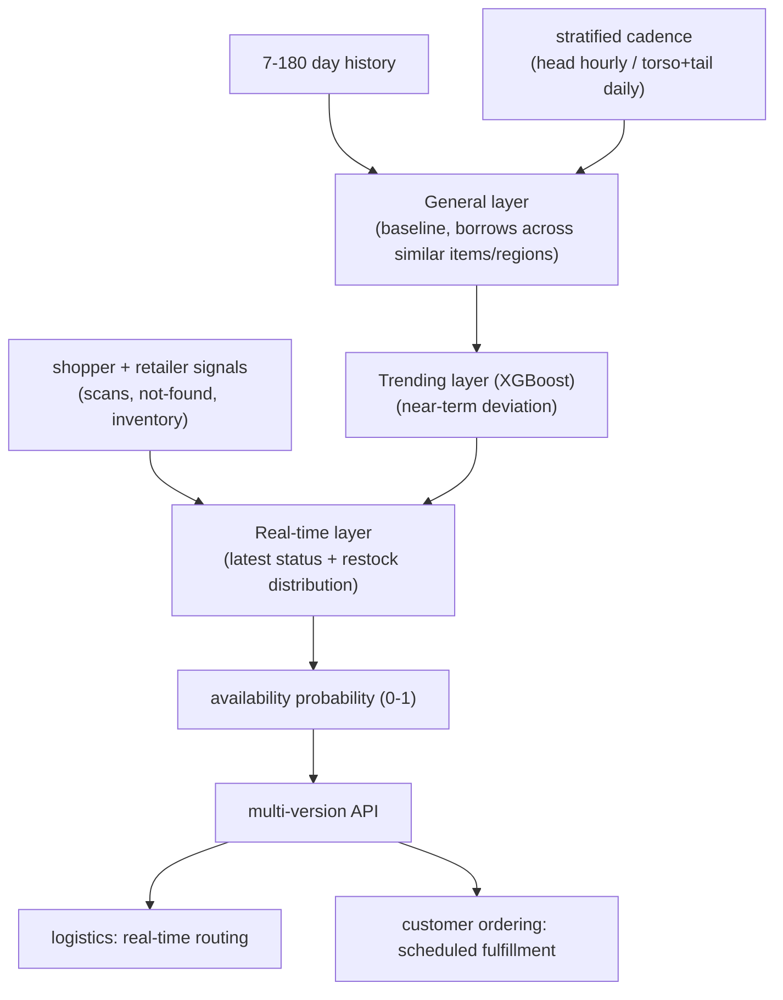

**Interview questions this design invites**
- Why layer general, trending, and real-time instead of one flat model?
- How do you predict availability for a brand-new or tail item with almost no signal?
- Why treat the same product in two stores as two separate prediction targets?
- How does stratified scoring cadence cut cost about 80 percent without tanking freshness?
- Why serve different model versions to logistics vs customer ordering?
- How do you learn a restock-time distribution from sparse shopper observations?

**Tricks and gotchas**
- Borrowing from similar items / regions handles sparsity where per-item history is thin.
- Only about 1 percent of items justify real-time inference; scoring the rest daily saves most of the cost.
- Consumer-specific model versions match freshness to the decision that consumes them.
- Restock-time distributions turn a stale out-of-stock into a predicted return time.

**Common mistakes and how to fix them**
- Scoring every item in real time: stratify by traffic so only head items get hourly inference.
- One model for head and tail: layer a borrowing baseline under a trending / real-time correction.
- Serving one prediction to all consumers: version the API so each gets the right freshness.

### Zalando: probabilistic forecast plus Monte Carlo replenishment optimization ([source](https://engineering.zalando.com/posts/2025/06/inventory-optimisation-system.html))

Zalando's ZEOS platform frames replenishment as minimizing total cost across storage, lost sales, overstock, operations, and inbound, answering what to stock, when, and where. It is a two-stage pipeline: a demand forecaster generates probabilistic 12-week forecasts for 5 million SKUs weekly, then a Monte Carlo optimizer converts those distributions into order recommendations. They chose LightGBM with Nixtla's MLForecast over Temporal Fusion Transformers for faster iteration and a lighter training footprint (2.5 years of history, PySpark preprocessing, weekly run under 2 hours). The optimizer uses gradient-free optimizers under uncertainty over an extended (R, s, Q) policy (reorder point, safety stock, order quantity), consuming probabilistic demand, lead-time forecasts, stock state, and cost factors. It serves both offline (SageMaker batch) and online (Lambda workers off SQS, 10 to 20 ms online feature-store lookups) with shared algorithms and features.

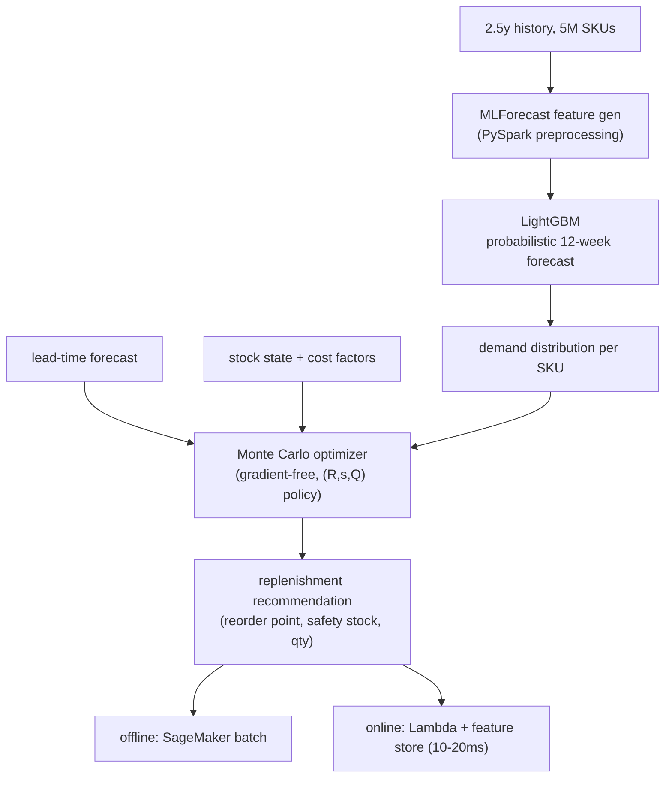

**Interview questions this design invites**
- Why chose LightGBM over a Temporal Fusion Transformer here?
- Why must the optimizer receive a distribution, not a mean forecast?
- How does Monte Carlo optimization under uncertainty beat a closed-form newsvendor here?
- What does an extended (R, s, Q) policy encode beyond a single order quantity?
- How do you keep offline batch and online real-time recommendations consistent?
- Why fold lead-time uncertainty into the same optimization as demand?

**Tricks and gotchas**
- The forecast is the intermediate; the cost-minimizing decision is the actual product.
- A lighter GBT beats a heavy Transformer when iteration speed and cost dominate.
- Sharing algorithms and features across offline / online paths prevents recommendation skew.
- Gradient-free Monte Carlo handles a non-differentiable cost with stochastic inputs.

**Common mistakes and how to fix them**
- Passing the optimizer a mean: emit a full demand distribution so safety stock is computable.
- Optimizing forecast accuracy in isolation: optimize the downstream cost the forecast feeds.
- Diverging offline and online logic: share the same algorithm and feature store on both paths.

### Grab: geo-temporal supply-demand ratios for matching and rebalancing ([source](https://engineering.grab.com/understanding-supply-demand-ride-hailing-data)) 

Grab quantifies marketplace balance with two geo-temporal metrics: a supply-demand ratio and an absolute supply-demand difference, aggregated over geohash cells and time slots. Supply is drivers online and idle (by GPS); demand is passengers checking fares (by pickup address). Crucially, a fraction of each supply unit is assigned to demand in neighboring geohashes, inversely weighted by distance, so nearby idle drivers count more toward a passenger's availability. The metrics drive spatial rebalancing (a driver-app heatmap steering drivers from oversupplied CBD zones to undersupplied areas) and temporal demand shifting (a travel-trends widget nudging flexible riders off peak). Compute scales poorly with unit count, so aggregation is essential.

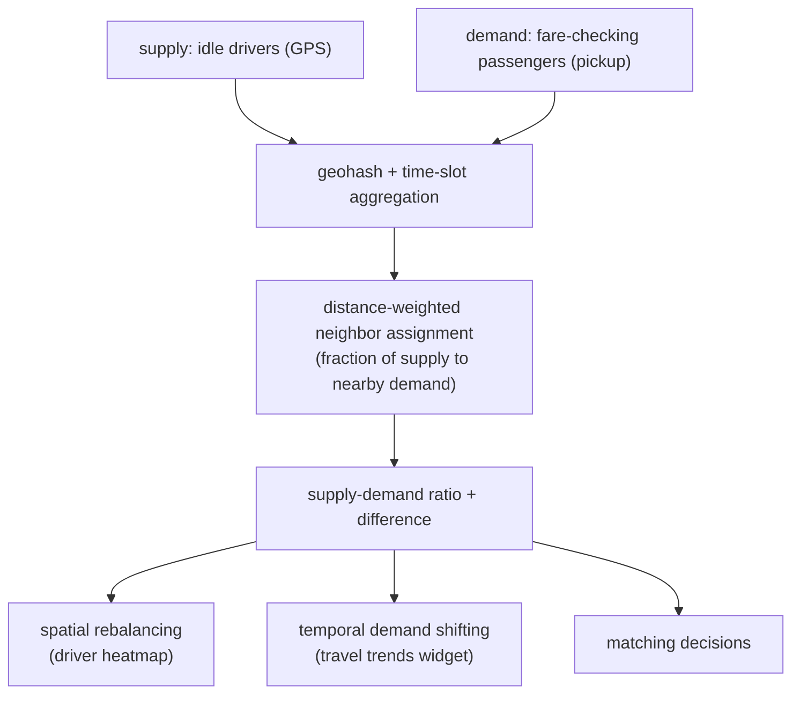

**Interview questions this design invites**
- Why compute both a ratio and an absolute difference of supply and demand?
- Why distance-weight supply across neighboring geohashes instead of counting per-cell only?
- How do you pick spatial (geohash) and temporal granularity for the metric?
- How do these ratios feed matching vs rebalancing vs demand shaping?
- Why does compute grow so fast with supply and demand units, and how do you contain it?
- How would you turn these descriptive ratios into a predictive forecast?

**Tricks and gotchas**
- Distance-weighted neighbor assignment reflects that a nearby idle driver is real availability.
- A ratio alone hides magnitude; the absolute difference restores it.
- Geohash-plus-time aggregation is what makes the computation tractable at scale.
- The same metric drives supply (heatmap) and demand (trends widget) interventions.

**Common mistakes and how to fix them**
- Counting supply strictly per cell: spread it to neighbors inversely weighted by distance.
- Reporting a bare ratio: pair it with the absolute gap so operators see magnitude.
- Ignoring spatial granularity choice: tune geohash and slot size to the rebalancing action.

### Company: Ocado ([source](https://careers.ocadogroup.com/blogs/careers-blogs/our-technologies/finding-the-sweet-spot))

Ocado forecasts grocery demand to hit a sweet spot between availability (never running out for a customer) and waste (over-buying perishables that get purged). Rather than one model, they run a tiered stack of rising complexity: heuristics (rolling averages of recent sales, pre-order and checked-out analysis) for cold-start retailers with no history, feed-forward neural networks that learn how to combine all those heuristics per product, and deep sequence-to-sequence models that read long historical windows. Two learning behaviours are deliberately balanced: memorization (remember what drives demand for a product, forget what does not) and generalization (learn behaviour across all products so a new item borrows from similar ones). Built in Python and TensorFlow, it emits millions of forecasts a day per fulfilment centre, continuously retraining on the freshest data, and the availability-vs-waste balance is tuned per retailer preference.

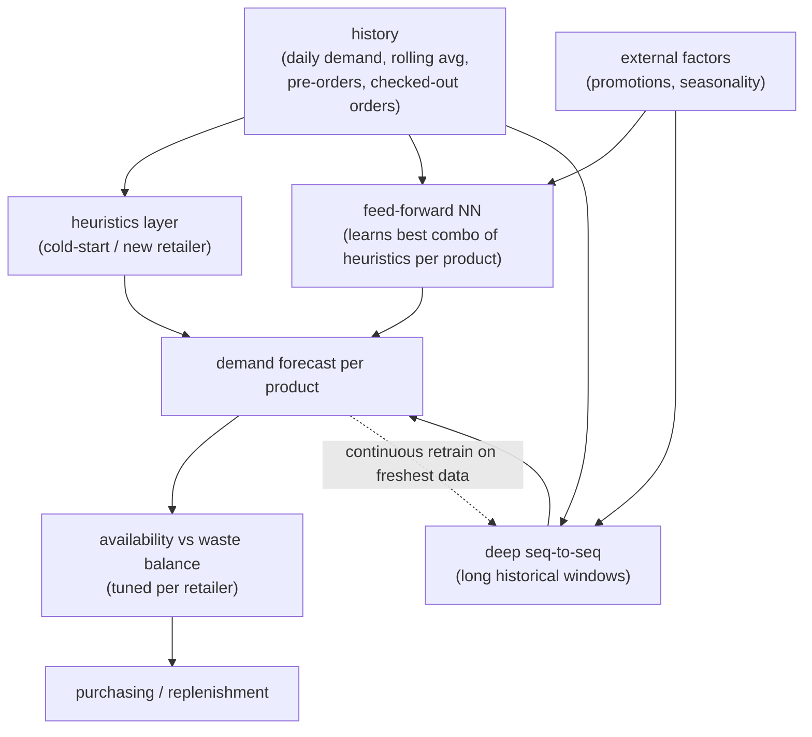

**Interview questions this design invites**
- Why run a tier of heuristic, feed-forward, and seq-to-seq models instead of one architecture?
- How do you forecast a brand-new product or a brand-new retailer with no history?
- What is the concrete tradeoff between availability and waste, and how do you tune it per retailer?
- Why does a perishable-grocery objective differ from generic demand forecasting?
- How do memorization and generalization pull in different directions in one model?
- How do you serve and retrain millions of forecasts a day per fulfilment centre?

**Tricks and gotchas**
- A feed-forward net that learns to blend heuristics is a cheap, strong baseline before deep sequence models.
- Generalization across products is what rescues new-item forecasting where per-item history is empty.
- The business target is not accuracy, it is the availability-vs-waste sweet spot, tuned per retailer.
- Perishability makes over-forecasting expensive (purge), so the loss is asymmetric in practice.

**Common mistakes and how to fix them**
- Optimizing raw forecast error and ignoring waste: score the availability-vs-waste tradeoff the business cares about.
- One heavy model for every product and retailer: tier heuristics for cold-start, escalate to deep models where history is rich.
- Treating new items as unforecastable: generalize across similar products to borrow signal.

### Company: Mercado Libre ([source](https://medium.com/mercadolibre-tech/global-time-series-forecasting-models-for-item-level-demand-and-sales-forecasts-in-our-marketplace-aee2956957ae))

Mercado Libre forecasts two different things on purpose: sales (actual transactions, capped by stock) and demand (what customers would have bought with unlimited inventory). Observed sales understate true interest whenever an item stocks out, so they train separate global time-series (LSTM) models, one for each target, at item level across every operating country. A global model learns one set of weights over a heterogeneous item population instead of one model per series, which keeps complexity far lower than thousands of individual models. Both consume 12 weeks of log-transformed sales plus engagement signals (visits, questions) and product attributes (stock, price); the sales model additionally sees available-stock history, while the demand model adds price elasticity for promotions. They evaluate with MAE because it handles zero-sales items cleanly and is trivially interpretable per item. The two models diverge exactly where it matters: for a stocked-out item the sales model correctly predicts near-zero forced sales while the demand model predicts the recovery it would see if restocked. A post-processing step adjusts for marketing events; a planned next step is probabilistic output via Monte Carlo Dropout.

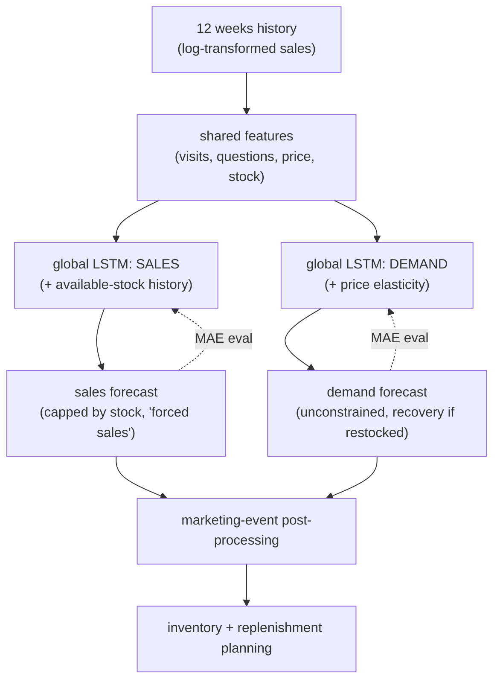

**Interview questions this design invites**
- Why forecast demand and sales as two separate targets instead of one?
- How does a stockout bias observed sales, and why does that matter for planning?
- Why a global LSTM over the item population instead of one model per item?
- Why log-transform the sales history before training?
- Why choose MAE over MAPE or RMSE for intermittent, zero-heavy item sales?
- How would you extend point forecasts to probabilistic ones (and why Monte Carlo Dropout)?

**Tricks and gotchas**
- Sales are censored by stock, so training a sales model on them teaches you the stock ceiling, not true demand.
- A global model shares strength across items and is simpler to run than thousands of per-item models.
- Log-transforming tames extreme variance across a heterogeneous catalogue.
- MAE sidesteps the divide-by-zero and undefined-percentage pain that MAPE hits on zero-sales weeks.

**Common mistakes and how to fix them**
- Planning inventory off observed sales alone: model latent demand separately so stockouts do not hide interest.
- One model per series at marketplace scale: use a global time-series model over the whole population.
- Using MAPE on intermittent demand: switch to MAE which is defined and interpretable at zero.

### Company: Wayfair ([source](https://www.aboutwayfair.com/careers/tech-blog/how-wayfair-uses-predicted-winners-models-to-accelerate-success-for-new-products))

Wayfair's Predicted Winners solves cold-start demand: predict which brand-new products will sell before they have any sales history, so they can be surfaced and stocked early. It is a four-pillar system. The Day Zero model is a neural network that scores launch-day potential from intrinsic features only (wholesale cost, deep-learning embeddings of product images, text embeddings of descriptions), since no engagement data exists yet. Once a product goes live, the Continuous Winners model, a time-series neural net, ingests early engagement (page visits, add-to-cart, orders) and uses LSTM feature extraction to capture multi-dimensional comovement across those signals instead of hand-curated features. One universal architecture serves many categories and transfers knowledge (lawn-chair learnings inform outdoor sofas). Training objectives are distribution-matched to each target: Bernoulli and Log-Normal for revenue, Negative Binomial for order counts, giving uncertainty rather than bare point estimates. A Sentinel testing framework controls for exposure bias so high scores do not become self-fulfilling. High Day Zero scorers get better storefront sort placement; high Continuous Winners scorers become candidates for supplier-exclusivity partnerships.

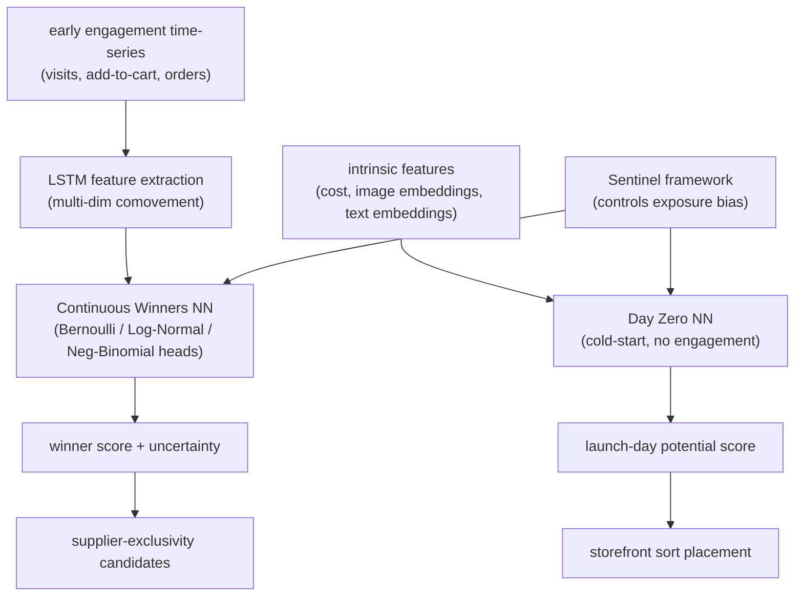

**Interview questions this design invites**
- How do you forecast demand for a product with literally zero sales history?
- Why split into a Day Zero (intrinsic-only) and a Continuous Winners (engagement) model?
- Why use LSTM feature extraction over engagement signals instead of hand-crafted features?
- Why match output distributions (Bernoulli, Log-Normal, Negative Binomial) to each target?
- What is exposure bias here, and how does Sentinel stop winners from being self-fulfilling?
- How does one universal model transfer knowledge across product categories?

**Tricks and gotchas**
- Image and text embeddings are the only signal you have at Day Zero; they carry the cold-start forecast.
- Splitting revenue (Log-Normal) from order count (Negative Binomial) matches each target's real distribution.
- LSTM feature extraction captures how engagement signals move together, which manual features miss.
- Better placement for predicted winners creates exposure bias; Sentinel's controlled testing breaks the feedback loop.

**Common mistakes and how to fix them**
- Waiting for sales history before ranking new products: score cold-start from intrinsic content embeddings on day zero.
- Emitting point forecasts: use distribution-matched heads so downstream decisions see uncertainty.
- Letting winner predictions become self-fulfilling via placement: control exposure bias with a Sentinel-style holdout.

### Company: Oda ([source](https://medium.com/oda-product-tech/how-we-went-from-zero-insight-to-predicting-service-time-with-a-machine-learning-model-part-2-2-ad8b0c3e4838))

Oda predicts per-stop service time (park, re-stack the car, scan the order, carry groceries to the door), which is roughly half a delivery driver's workday, so the route planner can sequence stops on data-driven estimates instead of manual rules. The model is LightGBM, tuned with Bayesian optimization via Optuna, trained on two years of geofence-measured service times. Features are order characteristics (weight, item count, box count), geography (delivery area as a parking-difficulty proxy), and customer attributes (historical service time, floor level, elevator availability). It is evaluated on MAE and beat the legacy business-logic rules by about 30 seconds per stop (a 23 percent MAE reduction), and a spatial analysis showed it removed a systematic urban-vs-rural bias the old rules carried. The honest twist: despite the big per-stop accuracy win, real-world delay standard deviation improved only about 10 percent, because errors on a well-tuned ~30-stop route partly cancel out, masking per-stop inaccuracy. Rolled out from a six-week 10 percent pilot in Sandvika (Nov 2021) to the full delivery area in Jan 2022, feeding the route planner alongside a parallel driving-time model.

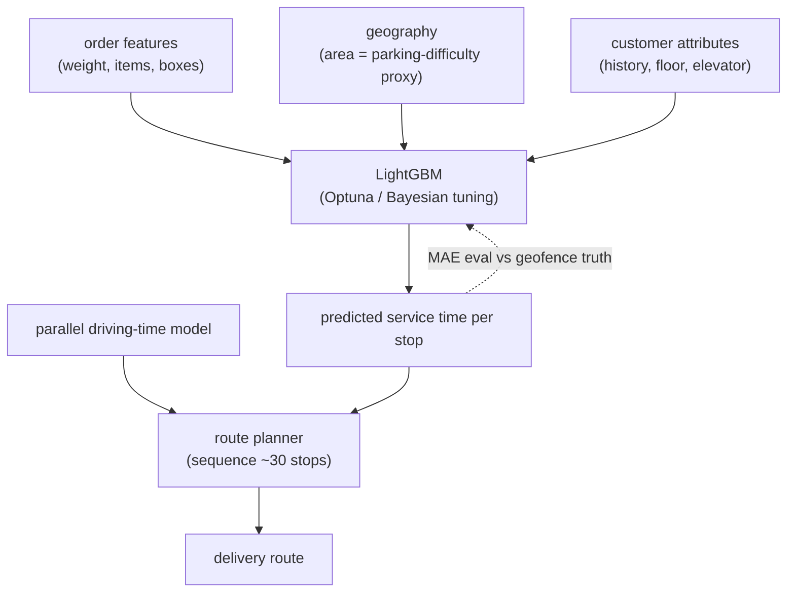

**Interview questions this design invites**
- Why predict service time per stop separately from driving time?
- Why LightGBM here instead of a deep sequence model?
- How does a 23 percent per-stop MAE gain translate to only ~10 percent route-level delay improvement?
- Why can well-tuned legacy rules mask per-stop error across a 30-stop route?
- How did you detect and remove the urban-vs-rural bias in the old rules?
- How do you measure ground-truth service time (geofencing) and what noise does that add?

**Tricks and gotchas**
- Per-stop errors partly cancel over a long route, so stop-level accuracy overstates the routing win.
- Geofence-measured labels are noisy; the target definition (park to door) has to be pinned precisely.
- Delivery area is a cheap proxy for parking difficulty, a feature hard to measure directly.
- Removing a systematic spatial bias can matter more than the average MAE number.

**Common mistakes and how to fix them**
- Judging the model on per-stop MAE alone: evaluate the route-level delay distribution the planner actually cares about.
- Assuming a big accuracy gain guarantees a big operational gain: measure end-to-end, errors can cancel.
- Ignoring systematic geographic bias: do a spatial error analysis, not just aggregate MAE.
_Not reachable: Uber Engineering Uncertainty Estimation (not attempted, 8-case cap), Lyft Causal Forecasting Part 1 (off-host redirect)_
