## Predictive modeling on tabular data

### Nubank: risk model for scalable credit limit increases ([source](https://building.nubank.com/how-nubank-models-risk-for-smarter-scalable-credit-limit-increases/))

Nubank runs a two-stage risk framework to decide credit line increases for 122M+ customers across Brazil, Mexico, and Colombia. A robust ranking model provides a stable relative-risk ordering that updates less often, then survival curves model time-to-default (default defined as not paying within a 60 to 180 day window) and recalibrate more frequently on top of the ranking signal. They deliberately chose simple, robust methods over pure parametric or non-parametric models for scalability and to adapt across countries and macro cycles, backed by feature stores, CI/CD, and drift monitoring.

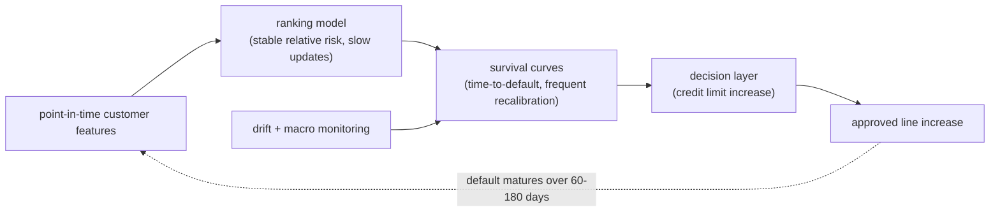

**Interview questions this design invites**
- Why split into a slow ranking model plus a faster-recalibrated survival layer instead of one model?
- How do survival curves let you read risk at any horizon versus a fixed-window binary label?
- How do you keep a single framework valid across Brazil, Mexico, and Colombia with different populations?
- What breaks when a macroeconomic cycle shifts the applicant mix, and how does monitoring catch it?
- Why is calibration first-class when the score sets an actual credit limit, not just an approve/decline sort?
- How do you handle immature accounts whose default label has not resolved yet?

**Tricks and gotchas**
- Survival modeling keeps censored (not-yet-defaulted) accounts contributing instead of discarding recent vintages.
- Decoupling ranking from calibration lets each update on its own cadence, cheaper than retraining one monolith.
- "Simple but robust" is a deliberate hedge against distribution shift, complex models drift harder in credit.
- A stable rank signal guides the survival calibration so the two stages do not fight each other.

**Common mistakes and how to fix them**
- Counting immature accounts as good biases risk downward; restrict to matured vintages or use survival censoring.
- Treating a regulated credit score as a pure sorter ignores calibration; the absolute probability sets the money.
- Building one global model ignores per-country base rates; make the framework modular and recalibrate per market.
- Ignoring macro drift triggers silent miscalibration; monitor feature, score, and label-maturation drift on a ladder.

### Block (Square): conditional survival forest for subscription churn timing ([source](https://developer.squareup.com/blog/pysurvival-tutorial-churn-modeling/))

Square models SaaS subscription churn as a time-to-event problem with a conditional survival forest of 200 trees, reaching a C-index of 0.83 and an Integrated Brier Score of 0.13. Five categoricals (product type, region, company size) are one-hot encoded alongside satisfaction scores, product usage, and support interaction time; censoring is handled via a months-active duration plus a churned event flag so still-active customers still inform the fit. Predicted survival curves stratify customers into low, medium, and high risk tiers to time proactive retention.

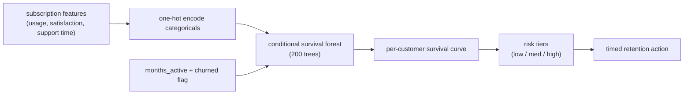

**Interview questions this design invites**
- Why frame churn as time-to-event instead of a fixed-window "churned in 30 days" binary?
- What does the C-index measure and why is 0.83 a meaningful bar here?
- How does the survival forest use censored (still-active) customers rather than dropping them?
- What does the Integrated Brier Score add beyond the C-index?
- How does a survival curve improve retention timing versus a single churn probability?
- Which features risk leakage (support-call volume that only spikes once churn is imminent)?

**Tricks and gotchas**
- Survival forests capture non-linear interactions a Cox model would miss while still handling censoring.
- The output is a curve, not a scalar; you can read risk at any horizon and drive intervention timing.
- One-hot encoding low-cardinality categoricals is fine; high-cardinality ids would need embeddings or target encoding.
- C-index rewards ranking, Brier rewards calibration; report both because one alone hides failure modes.

**Common mistakes and how to fix them**
- Collapsing to a fixed-window binary discards when churn happens and mishandles active customers; keep survival framing.
- Dropping censored rows biases the training set toward early churners; encode duration plus event flag.
- Using post-churn features (final support blitz) leaks; audit features for point-in-time correctness.
- Acting on rank alone wastes retention budget; time the intervention off the survival curve's hazard.

### Airbnb: ML framework for listing lifetime value ([source](https://medium.com/airbnb-engineering/how-airbnb-measures-listing-lifetime-value-a603bf05142c))

Airbnb built a three-tier LTV framework over a 365-day horizon. A baseline layer predicts total bookings a listing makes in the next year from listing attributes (availability, pricing, location, host tenure), discounted to present value; an incremental layer subtracts bookings cannibalized from existing supply using production-function modeling of supply-demand balance per segment; and a marketing-induced layer isolates value attributable to internal campaigns. COVID exposed drift, so they shifted to shorter training windows, granular geo features, LightGBM for high-cardinality, and daily correction with realized bookings.

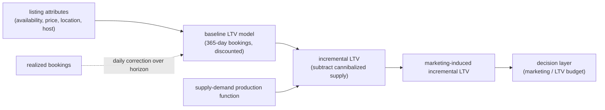

**Interview questions this design invites**
- Why separate baseline, incremental, and marketing-induced LTV instead of predicting one number?
- What is cannibalization in a two-sided marketplace and why does it change the budget decision?
- How do you evaluate a 365-day-horizon model without waiting a full year?
- Why is incremental (causal) LTV the right input for a marketing spend, not baseline LTV?
- How did COVID break the model and what made the fix (shorter windows, daily correction) work?
- Why LightGBM for high-cardinality geography features over plain one-hot?

**Tricks and gotchas**
- Raw historical revenue is not LTV; survivorship bias and horizon-blindness inflate it, so model forward bookings.
- Daily updates with realized bookings progressively shrink the initial-estimate error across the horizon.
- Incremental LTV needs a production function, not just a per-listing prediction, because supply cannibalizes supply.
- Marketing spend must be justified on incremental, not baseline, value or you pay for organic growth.

**Common mistakes and how to fix them**
- Regressing raw revenue and calling it LTV; predict discounted forward bookings over an explicit horizon.
- Using baseline LTV to size marketing budget; that is a causal question, use incremental / marketing-induced LTV.
- Assuming a pre-shock training window still holds; shorten windows and add granular geo when the world shifts.
- Ignoring cannibalization; subtract bookings shifted from existing listings via supply-demand modeling.

### Airbnb: XGBoost home value prediction with a productionized pipeline ([source](https://medium.com/airbnb-engineering/using-machine-learning-to-predict-value-of-homes-on-airbnb-9272d3d4739d))

Airbnb predicts listing value from 150+ tabular features (location, pricing, availability, booking history, review scores, amenities) using XGBoost, chosen by AutoML over baseline models for accuracy over interpretability. Features come from Zipline, their internal feature repository of pre-vetted features at multiple granularities; scikit-learn pipelines guarantee identical transforms across training and scoring. The headline is productionization: ML Automator translates a data scientist's notebook (fit and transform functions) into Airflow DAGs handling serialization, scheduled retraining, and distributed scoring without data-engineering work.

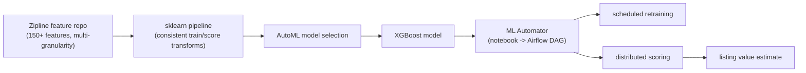

**Interview questions this design invites**
- Why XGBoost over a deep net for 150+ heterogeneous tabular features?
- How does a shared feature repository (Zipline) prevent training-serving skew?
- Why wrap transforms in a pipeline object rather than applying them ad hoc?
- What does ML Automator buy you, and what is the risk of auto-translating notebooks to DAGs?
- When is trading interpretability for accuracy acceptable, and when is it not?
- How would this pipeline change if the target were a regulated credit decision?

**Tricks and gotchas**
- The same transform object in train and score is what kills skew; do not recompute features separately at serving.
- AutoML shortcuts model search but you still own feature quality and leakage audits.
- Notebook-to-DAG tooling lowers the barrier but hides scheduling and serialization failures if unmonitored.
- Multi-granularity features from a repo save work but inherit any leakage baked into the shared definitions.

**Common mistakes and how to fix them**
- Transforming data differently in training and scoring; use one pipeline object across both paths.
- Rebuilding features from scratch per project; reuse a vetted repo to cut cost and skew.
- Shipping accuracy-first models where the domain needs reasons; pick the model family to fit the decision.
- Treating "notebook works" as production-ready; automate DAGs, retraining, and monitoring explicitly.

### Expedia Group: cross-brand CatBoost customer lifetime value ([source](https://medium.com/expedia-group-tech/expedia-groups-customer-lifetime-value-prediction-model-7927cdd44342))

Expedia predicts customer lifetime value across brands with CatBoost, chosen for native high-cardinality categorical and missing-value handling. The system segments customers into 30 models by five geographic regions plus recency and frequency, ingesting 200+ engineered booking and engagement features under a cutoff-date scheme (pre-cutoff data makes features, post-cutoff cash flows are targets). It runs on a unified platform: Spark on Kubernetes over federated Hive/S3, Airflow monthly retrain and daily scoring for hundreds of millions of customers, with Datadog/Splunk monitoring. Eval combines ranking (Lorenz/Gini) and calibration plots plus RMSE across segments.

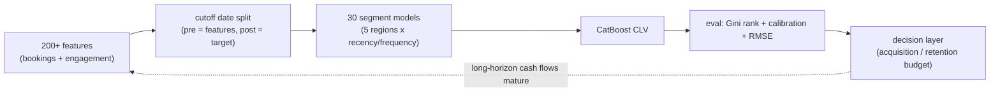

**Interview questions this design invites**
- Why CatBoost specifically over other GBDTs for this feature mix?
- Why segment into 30 models by region and recency/frequency instead of one global model?
- How does the cutoff-date scheme enforce point-in-time correctness for a CLV target?
- Why report both Gini (ranking) and calibration when the score feeds a budget?
- How do monthly retrain and daily scoring split the freshness-versus-cost tradeoff?
- What leakage risk hides in aggregating booking history across a window that touches the target period?

**Tricks and gotchas**
- Segmenting by region and RFM lets each cohort get tailored features and its own base rate.
- The cutoff date is the leakage firewall; features only see pre-cutoff data, targets only post-cutoff cash flow.
- CatBoost's native categorical handling avoids manual target encoding and its leakage traps.
- A CLV budget reads absolute value, so calibration plots matter as much as Gini ranking.

**Common mistakes and how to fix them**
- One global CLV model washes out regional base rates; segment by geography and RFM.
- Letting feature windows overlap the target period leaks; enforce a strict cutoff-date split.
- Reporting only ranking metrics; add calibration and segment-wise RMSE since the number sets budget.
- Retraining too rarely on a shifting travel market; schedule monthly retrain with daily scoring.

### Wayfair: propensity plus uplift for programmatic marketing (WayLift) ([source](https://www.aboutwayfair.com/careers/tech-blog/building-scalable-and-performant-marketing-ml-systems-at-wayfair))

Wayfair's WayLift platform layers three model types. General propensity models predict buy/engage likelihood from observational data, cheap and scalable, retrained quarterly or yearly. Channel-specific uplift models target persuadables whose conversions are caused by the ad, which needs RCT data and costs more but performs better per program. A decision-optimization layer picks treatments per customer context (daily/weekly refresh), and forecasting models generate delayed rewards (60-day revenue, LTV change) to feed reinforcement learners. The explicit tradeoff: propensity scales but over-messages, uplift is precise but hard to scale across hundreds of campaigns.

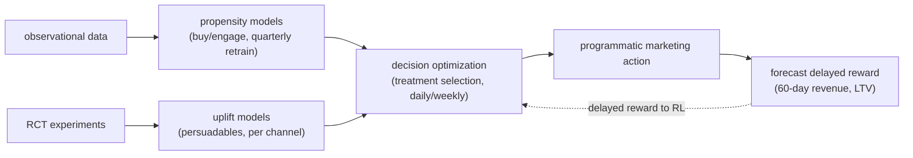

**Interview questions this design invites**
- When do you use propensity versus uplift, and why not always use uplift?
- Why does uplift require RCT data while propensity trains on observational logs?
- How does the delayed-reward forecaster let reinforcement learning optimize a 60-day KPI?
- What is the cost of over-messaging and how does a decision layer prevent it?
- How do you scale uplift to hundreds of campaigns without an RCT for each?
- Why refresh scoring models daily/weekly but propensity only quarterly?

**Tricks and gotchas**
- Propensity is cheap and scalable but targets sure things too, wasting impressions; uplift finds persuadables.
- Uplift needs randomized treatment to identify the causal effect; observational data alone confounds it.
- Forecasting delayed rewards turns a slow business KPI into a trainable near-term signal for RL.
- Separate the scoring cadence from the treatment-optimization cadence; they change at different speeds.

**Common mistakes and how to fix them**
- Using a propensity score to decide interventions; switch to uplift so budget hits persuadables not sure things.
- Training uplift on observational data; collect RCT slices or the treatment effect is confounded.
- Optimizing only near-term clicks; forecast delayed 60-day revenue/LTV as the true reward.
- Blasting the same high-propensity audience; add a decision layer that caps over-messaging.

### Uber: causally-informed ML plus convex optimization for marketplace budgets ([source](https://arxiv.org/abs/2407.19078))

Uber automates city-level budget allocation across marketplace levers (driver incentives, rider promotions) with an end-to-end causal-ML-plus-optimization pipeline. A deep-learning S-learner estimates how budget changes affect driver supply and rider demand, and a novel tensor B-spline regression gives flexible, interpretable spend-to-outcome curves. Those curves feed convex optimization (ADMM for distributed solving, primal-dual interior point for the constrained problem) that respects real budget constraints. The full loop covers feature engineering, training/serving, solvers, and backtesting; it appeared at KDD 2024's causal-ML-in-practice workshop.

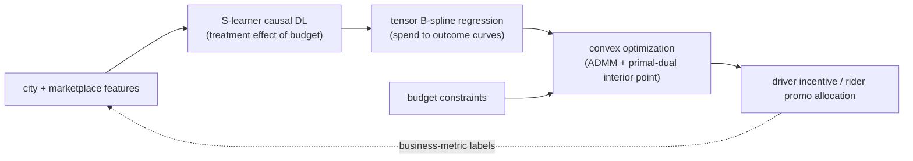

**Interview questions this design invites**
- Why an S-learner causal estimator instead of a plain predictive model for budget effects?
- What does the tensor B-spline regression add between the causal estimate and the optimizer?
- Why separate the ML (estimating response curves) from the optimizer (making the allocation)?
- When do you reach for ADMM versus interior-point methods in the convex solve?
- How do you validate a causal-plus-optimization system offline before it moves real budget?
- What confounds a naive spend-versus-outcome regression and how does causal framing fix it?

**Tricks and gotchas**
- The ML produces response curves, an optimizer makes the call; drawing them as separate boxes is the senior move.
- Convexity of the allocation problem is what makes city-scale solving tractable and provably optimal.
- B-splines keep the spend-to-outcome relationship flexible yet interpretable for constraint reasoning.
- Business-metric labels (supply, demand) are the causal targets, not a click proxy.

**Common mistakes and how to fix them**
- Regressing outcomes on spend without causal correction; use an S-learner to get the treatment effect.
- Folding allocation into the model; keep a separate convex optimizer that enforces the budget constraint.
- Ignoring constraints and picking top-scoring cities greedily; solve the constrained convex problem.
- Skipping backtesting; validate the pipeline offline before it reallocates real money.

### Gojek: deep causal uplift plus knapsack for voucher allocation ([source](https://medium.com/gojekengineering/how-gojek-allocates-personalised-vouchers-at-scale-41cad5d6f218))

Gojek allocates personalized vouchers to hundreds of millions of customers with a deep-learning causal inference model that predicts both uplift and cost per customer-voucher pairing, sorting customers into persuadables, sure things, lost causes, and do-not-disturbs. Those predictions feed a knapsack optimizer that maximizes the business objective under a fixed budget, chosen for efficiency at scale. Infrastructure is dbt for features over hundreds of tables, Elementary for data-quality monitoring, Hydra for per-geography configs, and in-house Merlin plus a Campaign Portal that allocates in minutes.

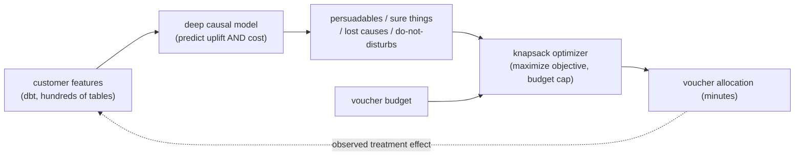

**Interview questions this design invites**
- Why predict both uplift and cost per customer rather than uplift alone?
- What are the four persuadability segments and why does targeting only persuadables save budget?
- Why a knapsack formulation for allocation and what makes it efficient at this scale?
- How do you estimate uplift from observed past treatments without a clean RCT for everyone?
- What breaks if you target sure things or do-not-disturbs, and how does the model avoid them?
- How does per-geography config (Hydra) let one system serve many markets?

**Tricks and gotchas**
- Predicting cost alongside uplift lets the knapsack rank by uplift-per-dollar, not raw uplift.
- The four-quadrant framing makes do-not-disturbs explicit; a churn/propensity model would miss that they backfire.
- Knapsack is chosen for computational efficiency; a convex allocation is the alternative when constraints soften.
- Data-quality monitoring (Elementary) guards a causal model that silently degrades if inputs drift.

**Common mistakes and how to fix them**
- Ranking by uplift alone; include per-customer cost so the knapsack optimizes uplift-per-dollar.
- Using a propensity model for interventions; it wastes budget on sure things and lost causes, use causal uplift.
- Targeting everyone with positive predicted response; do-not-disturbs reduce transactions, exclude them.
- Letting feature drift silently corrupt causal estimates; monitor data quality upstream of the model.

### Pinterest: proactive advertiser churn prevention with a GBDT snapshot model ([source](https://medium.com/pinterest-engineering/an-ml-based-approach-to-proactive-advertiser-churn-prevention-3a7c0c335016))

Pinterest predicts whether an active advertiser will stop spending within 14 days so account managers can intervene before revenue drops. Active is defined as spend in the last 7 days and churned as no spend in the last 7 days, and a GBDT snapshot model over 200+ features (performance metrics, budget utilization, ads-manager activity, property attributes, week-over-week trends) scores each advertiser. SHAP explains each score (sigmoid of summed SHAP contributions equals the model probability), and probabilities map to high/medium/low risk tiers tuned to about 70% precision and above 70% recall at the high tier. A treatment-vs-control A/B test on high-risk pods showed a 24% reduction in churn rate.

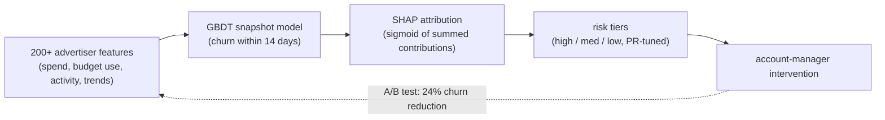

**Interview questions this design invites**
- Why define churn as a 14-day forward binary label instead of a time-to-event horizon?
- Why does a snapshot GBDT beat a sequential model as the first version, and when would you switch?
- How do precision and recall thresholds translate a raw probability into actionable high/medium/low tiers?
- Why pair the model with an A/B test rather than trusting offline AUC to prove churn was prevented?
- What does SHAP buy an account manager beyond a bare risk score?
- How would you tell a healthy zero-spend week apart from the onset of churn?

**Tricks and gotchas**
- Defining active/churn off a rolling 7-day spend window makes the label cheap but sensitive to seasonal spend gaps.
- SHAP is not just interpretability here: the sigmoid-of-sum identity lets managers read which features drove the flag.
- Tiering by precision/recall targets aligns model output with finite account-manager capacity, not raw probability.
- A snapshot model discards sequence, so a sharp recent drop and a slow decline can look identical without trend features.

**Common mistakes and how to fix them**
- Judging churn prevention by offline metrics alone; run a treatment-vs-control A/B test to measure prevented churn.
- Treating the score as calibrated truth without tiers; set precision/recall thresholds that match manager bandwidth.
- Ignoring recent trajectory in a snapshot model; add week-over-week and month-over-month trend features.
- Firing on every dip; a natural spend pause reads as churn unless the label window and features account for cadence.

### PayPal: two-layer ensemble for sales-opportunity propensity ([source](https://medium.com/paypal-tech/sales-pipeline-management-with-machine-learning-15398bab913b))

PayPal scores sales opportunities by propensity to close using a lightweight two-layer ensemble that produces a progressive, daily-updated score. Layer one is a Gradient Boosting Machine that runs once when an opportunity is created, consuming only static attributes and collapsing many features into a single propensity score (a form of dimension reduction). Layer two is a logistic regression that takes the GBM score plus time-varying signals (opportunity duration, contact frequency) and adjusts it daily, chosen for interpretable coefficients so reps see which factors (for example extended duration) lower win likelihood. The final score prioritizes opportunities against reps' limited outreach capacity.

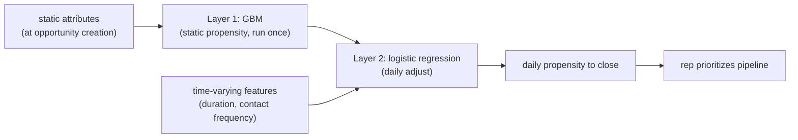

**Interview questions this design invites**
- Why split static and dynamic signals into two layers instead of one model over all features?
- Why feed the GBM output into a logistic regression rather than stacking two GBMs?
- How does collapsing static features into one GBM score act as dimension reduction for the second layer?
- Why is interpretability worth choosing logistic regression for the layer reps actually read?
- How do you avoid leaking future pipeline outcomes into the daily-updated dynamic features?
- What is the cost of scoring once at creation versus rescoring statics every day?

**Tricks and gotchas**
- Running the GBM once at creation is deliberate: static attributes do not change, so re-scoring them daily is wasted compute.
- The GBM score is a learned feature; the second layer only has to model how time-varying signals move it.
- Logistic-regression coefficients give signed, ranked explanations reps trust more than a black-box delta.
- A daily-updating score can whipsaw if noisy contact-frequency features are not smoothed.

**Common mistakes and how to fix them**
- Building one monolith over static plus dynamic features; separate the once-computed baseline from the daily adjustment.
- Using an opaque model for the rep-facing layer; pick logistic regression so the score comes with reasons.
- Recomputing unchanging static features every day; freeze the layer-one score and only refresh dynamics.
- Letting duration or contact features peek at closed outcomes; enforce point-in-time correctness on time-varying inputs.

### Gousto: behavioral gradient-boosted churn model for subscription retention ([source](https://medium.com/gousto-engineering-techbrunch/using-data-science-to-retain-customers-63f19a03a0b6))

Gousto predicts recipe-box subscription churn, defined as not ordering a box for 4 weeks, as a binary classification with a probability threshold set just below 50%. A gradient-boosted tree trains on over 300 purely behavioral features (order frequency, app usage, recipe selections, subscription-pause history), and SHAP quantifies each feature's contribution. The prediction is evaluated against actual churn four weeks later, and the precision-recall threshold is tunable so Finance and Marketing can trade catching every churner against acting only on high-confidence cases. Predicted churners are routed to interventions (push notifications, promotions, emails) chosen by a separate Promotion Optimization algorithm.

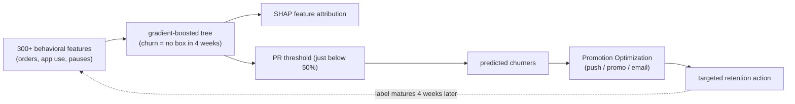

**Interview questions this design invites**
- Why is a 4-week no-order window a reasonable churn label for a weekly-cadence subscription?
- Why train on purely behavioral features and exclude demographics?
- How does the precision-recall threshold let Finance and Marketing pick an operating point by cost-benefit?
- Why keep churn scoring separate from the promotion-selection algorithm?
- How do you validate a model whose label only resolves four weeks after the prediction?
- What leakage risk hides in a subscription-pause feature that overlaps the label window?

**Tricks and gotchas**
- A pause is not the same as churn; pause-history features must be point-in-time so they do not encode the outcome.
- The threshold is a business lever, not a fixed 0.5; the right point depends on intervention cost versus saved revenue.
- Splitting churn prediction from promotion optimization lets each be tuned and swapped independently.
- SHAP on 300+ features surfaces which behaviors drive risk, guiding what the retention message should address.

**Common mistakes and how to fix them**
- Fixing the threshold at 0.5; tune the precision-recall operating point to the cost of each intervention.
- Leaking the label via features that span the 4-week window; freeze features strictly before the prediction date.
- Predicting churn but blasting one generic offer; route flagged users through a dedicated promotion optimizer.
- Ignoring that a binary label hides timing; if you need when-they-churn, move to a survival formulation.

### Asos: Ithax and Promotheus markdown-pricing systems ([source](https://medium.com/asos-techblog/optimizing-markdown-in-fashion-e-commerce-with-machine-learning-9f173be08ace))

Asos runs two deployed markdown-pricing systems that split the cold-start and steady-state problems. Ithax is a supply-side, multi-objective optimizer inspired by binary search that sets markdowns to sell out inventory without any demand or elasticity model, balancing stock value (revenue proxy) against stock depth (margin proxy), and serves as a bootstrapping engine. Promotheus is the full solution: a price-elasticity model forecasts likely outcomes across the pricing action space, handling the partial-information problem that unobserved prices have no historical outcome, then optimizes expected sales and profit at the product level under offline-validation constraints. Both beat manual operations by 79 to 86% on profitability in randomized testing.

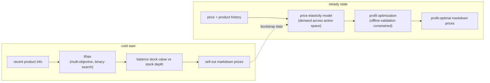

**Interview questions this design invites**
- Why run a demand-free optimizer (Ithax) at all when Promotheus models elasticity properly?
- What is the partial-information problem in markdown pricing and how does an elasticity model address it?
- Why optimize two competing objectives (stock value vs stock depth) instead of a single revenue target?
- How does offline-validation data constrain the feasible pricing region and why is that necessary?
- How do you evaluate a pricing policy that changes the very demand you are trying to observe?
- When do you graduate a product from Ithax to Promotheus?

**Tricks and gotchas**
- Ithax deliberately skips demand modeling so it works on day one before you have price-response data.
- The partial-information trap is that you never observe outcomes for prices you did not set; elasticity must extrapolate.
- Stock value and stock depth encode revenue and margin as competing objectives, so a single-metric optimizer misleads.
- Constraining to an offline-validated region keeps the optimizer from recommending prices it cannot trust.

**Common mistakes and how to fix them**
- Waiting for a perfect elasticity model before pricing new stock; use a supply-side bootstrapper like Ithax first.
- Optimizing revenue alone; markdown needs revenue and margin balanced, so keep the multi-objective formulation.
- Trusting elasticity forecasts for prices far outside history; constrain the action space to the validated region.
- Judging a pricing change by observed sales alone; use randomized tests so demand shifts do not confound the lift.
_Not reachable: none_
