## Content moderation and trust and safety

### Roblox: real-time voice-safety classifier from machine-labeled audio ([source](https://about.roblox.com/newsroom/2024/07/deploying-ml-for-voice-safety))

Roblox built an end-to-end transformer audio classifier that flags policy-violating speech (profanity, bullying, discrimination, dating) across millions of daily voice minutes, feeding a downstream consequence model that issues warnings and escalations. To avoid years of hand-labeling, they machine-labeled training data with a three-stage pipeline (split audio at silence, run ASR, classify the transcript with an existing text-filter ensemble), reserving human labels only for evaluation. They compared a fine-tuned WavLM (96M params, 102ms), an end-to-end model (52M, 83ms), and a Whisper-to-WavLM distilled student (48M, 50ms), landing on the distilled model with quantization, MFCC-plus-CNN front end, and VAD preprocessing. The system serves 2,000-plus requests per second at peak, scores PR-AUC above 0.95 on English, and cut severe voice-abuse reports by 15.3 percent.

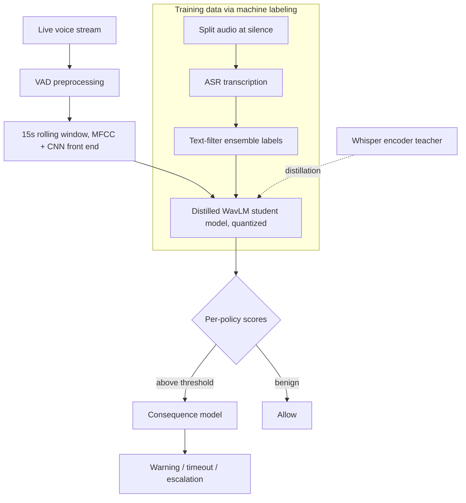

**Interview questions this design invites**
- Why machine-label training data with an existing text filter instead of paying for human labels, and what bias does that inject?
- How does student-teacher distillation from Whisper to WavLM trade accuracy for the latency budget of streaming voice?
- Why is human labeling reserved for evaluation only, and how does that keep the eval honest?
- How do you moderate a rolling 15-second window when there is no pre-publish gate?
- What does PR-AUC above 0.95 hide, and why report it instead of accuracy?
- How would you extend a single English classifier to more languages given unequal labeled data?

**Tricks and gotchas**
- The text-filter labels become the ceiling on the audio model: any harm the text ensemble misses never enters training.
- ASR errors on slang, names, and obfuscation silently corrupt labels before the audio model ever sees them.
- Quantization plus MFCC plus VAD stack multiplicatively for speed but each step can shave recall on quiet or noisy segments.
- A 15-second window covers only about 75 percent of utterances, so long harmful exchanges can straddle window boundaries.

**Common mistakes and how to fix them**
- Assuming you need thousands of hand-labeled hours up front. Fix: bootstrap labels from an existing modality (text) and only hand-label the eval set.
- Optimizing the largest model for accuracy. Fix: distill and quantize to hit the sub-100ms streaming budget, which is the real constraint.
- Treating voice like text with a pre-publish block. Fix: score rolling windows and act during the conversation, accepting some content is seen before action.
- Trusting one global PR-AUC. Fix: measure per-policy and per-language recall at a fixed precision floor.

### Roblox: multimodal moderation at billions of messages across 25 languages ([source](https://about.roblox.com/newsroom/2025/07/roblox-ai-moderation-massive-scale))

Roblox described a platform-wide stack of large transformer models, purpose-built per policy and per modality (text, voice, images), distilled and quantized for throughput, backed by thousands of human experts. Text filters handle 6.1 billion chat messages per day at 750,000-plus requests per second, PII detection runs 370,000 RPS on GPUs, and the voice classifier peaks at 8,300 RPS with 92 percent higher recall than its first version. Their deployment rule is to ship AI only where it beats humans on both precision and recall at scale, with humans handling complex cases, appeals, red-teaming, and golden-set curation. Quality is tracked by alignment (multiple humans agreeing 80-plus percent on the same example) and golden-set validation.

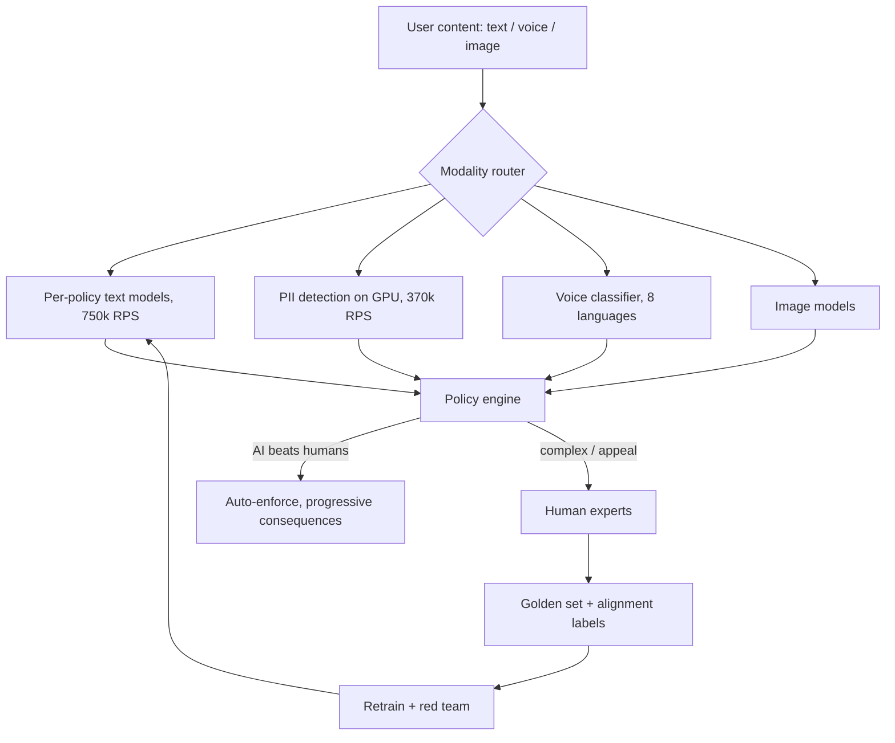

**Interview questions this design invites**
- Why many purpose-built per-policy models instead of one large multimodal classifier?
- What does the rule "deploy AI only when it beats humans on both precision and recall at scale" actually gate?
- How do alignment (inter-rater agreement) and golden-set quality differ as metrics, and why keep both?
- How do distillation and quantization let a transformer stack serve 750,000 RPS?
- Why does voice cover fewer languages (8) than text (28), and how do you close the gap?
- How do progressive consequences (warning to timeout to suspension) change measured harm versus one-shot removal?

**Tricks and gotchas**
- Per-policy models multiply operational surface: each has its own threshold, drift rate, and retrain cadence.
- 80 percent inter-rater agreement is a floor, not proof of correctness, if all raters share the same policy blind spot.
- Golden sets go stale as adversaries move, so curation is continuous work, not a one-time asset.
- A 5 percent drop in filtered messages can be behavior change or a new evasion, and the writeup credits behavior.

**Common mistakes and how to fix them**
- Proposing one giant model for all harms. Fix: shared backbone with per-policy heads and per-policy thresholds.
- Reporting a single global quality number. Fix: break out alignment and golden-set quality per policy, modality, and language.
- Deploying AI everywhere to cut cost. Fix: gate auto-action on AI provably beating humans, route the rest to experts.
- Ignoring appeals capacity. Fix: staff human experts for complex cases and appeals as a first-class part of the loop.

### Pinterest: hybrid batch-online scoring of Pins and boards ([source](https://medium.com/pinterest-engineering/how-pinterest-fights-misinformation-hate-speech-and-self-harm-content-with-machine-learning-1806b73b40ef))

Pinterest scores billions of Pins for six violation classes plus safe using a hybrid architecture: a daily Spark batch model scores the full corpus with PinSage graph embeddings and OCR text for high precision, while an online Kafka/Flink model scores fresh Pins in near real time (dropping the Pin-board graph feature to gain speed). A feedforward Pin model outputs a seven-way distribution, and a board model averages recent-Pin PinSage vectors, runs them through the Pin model, and propagates scores to image-signatures so identical images enforce uniformly. Labels come from millions of human-reviewed Pins via reports and proactive sampling, adjudicated by the Trust and Safety operations team. Since fall 2019 policy-violating reports per impression fell 52 percent and self-harm reports fell 80 percent.

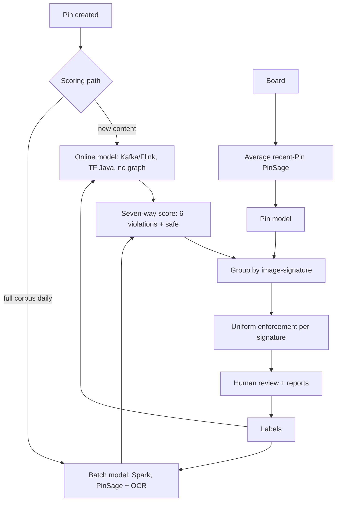

**Interview questions this design invites**
- Why run both a batch and an online model, and what does each buy you?
- Why can the online model drop the Pin-board graph feature, and what precision cost does that carry?
- How does grouping by image-signature amortize one decision across many Pins, and where does that backfire?
- How does the board model reuse the Pin model rather than training a separate classifier?
- Why one seven-way head (six violations plus safe) here versus separate per-policy models elsewhere?
- How do report-driven and proactively sampled labels differ in distribution, and why mix them?

**Tricks and gotchas**
- Image-signature grouping propagates a wrong decision to every matching Pin at once, amplifying a single false positive.
- The online model trades away the graph feature, so freshly created adversarial content hits the weaker classifier first.
- Batch runs daily, so a fast-spreading violation can accrue a day of reach before the precise model catches it.
- Board scores are averages of recent Pins, so a board can dilute a few violating Pins below threshold.

**Common mistakes and how to fix them**
- Assuming one model can be both fast and precise. Fix: split into online (speed) and batch (precision) that reconcile on the same signature.
- Scoring every Pin independently. Fix: cluster by image-signature to reuse decisions and cut compute.
- Training only on reported content. Fix: add proactive sampling so labels are not purely report-biased.
- Letting board-level averaging hide violations. Fix: track per-Pin scores alongside board aggregates.

### Pinterest: Pinqueue3.0 human-review and labeling platform ([source](https://medium.com/pinterest-engineering/introducing-pinqueue3-0-pinterests-next-gen-content-moderation-platform-fcfa972bf39c))

Pinqueue3.0 is a generic content-moderation and human-labeling platform that lets reviewers act on pins, boards, comments, users, and video through four stages: receive events, fetch data, execute decisions, and persist to Hive. It abstracts every content entity as an object with its own data fetcher, reusable UI presentation, and decision handlers, and it is driven by JSON queue configs (supported actions, hotkeys, labeling rules, decision options) plus a self-service template engine for per-agent UI. The stack is ReactJS/Gestalt frontend, Flask backend, and PinLater async job execution. Labeling is a built-in first-class feature so every reviewer decision becomes clean training data, and operational touches like Kitty Mode (swap sensitive images for kittens), item passing to the right queue, and auditable review history keep the human loop safe and traceable.

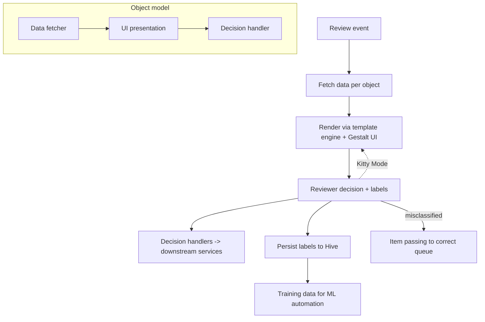

**Interview questions this design invites**
- Why treat the review platform as first-class engineering rather than an internal tool?
- How does the object abstraction (fetcher, UI, handler) let one platform serve pins, boards, comments, and video?
- Why make labeling a built-in feature instead of a side export, and how does that improve the flywheel?
- How do JSON queue configs and templates enable self-service without redeploys?
- What is the value of auditable review history for appeals and regulators?
- How would you prioritize the queue by severity times reach on top of this design?

**Tricks and gotchas**
- Reviewer UI design directly affects label quality: bad widget placement produces noisy gold labels.
- Kitty Mode exists because reviewers must screenshot without re-exposing harmful imagery, an easy safety miss.
- Item passing means a queue can silently receive out-of-distribution items that its config does not handle.
- Self-service configs let non-engineers change labeling rules, which can drift the label schema underneath the models.

**Common mistakes and how to fix them**
- Bolting review on as an afterthought tool. Fix: engineer it as a platform whose primary output is training labels.
- Hardcoding UI per content type. Fix: object abstraction plus template engine so new types are config, not code.
- Ignoring reviewer safety and auditability. Fix: Kitty Mode for imagery and immutable who-decided-what history.
- Losing label lineage. Fix: persist every decision to Hive tied to reviewer, item, and time.

### LinkedIn: funnel of defenses for fake-account detection ([source](https://www.linkedin.com/blog/engineering/trust-and-safety/automated-fake-account-detection-at-linkedin))

LinkedIn stacks defenses along the account lifecycle. At registration, an ML model scores every signup for abuse risk: low risk registers immediately, high risk is blocked, medium risk gets a human-verification challenge (this stage blocked five million accounts in under a day during one attack). Accounts that pass are grouped by shared attributes, and supervised cluster-level models flag statistically abnormal clusters, propagating the suspicious label to members faster than waiting for bad behavior. Accounts slipping through face activity-based models detecting specific abuse or anomalous patterns, with member reports and manual investigation as the final redundant layer feeding back into the models.

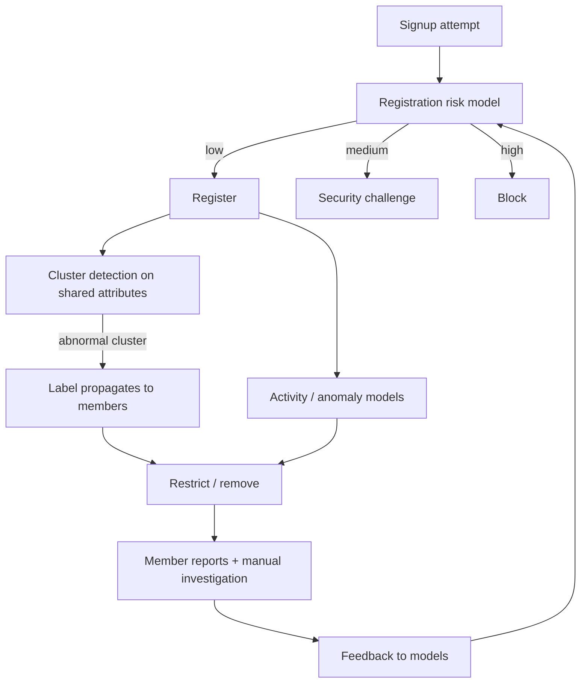

**Interview questions this design invites**
- Why a lifecycle funnel instead of one account classifier?
- How does cluster-level detection catch bulk fakes faster than per-account behavior models?
- Why challenge medium-risk signups rather than block or allow, and how do you set those two thresholds?
- How does label propagation from cluster to member risk over-blocking, and how do you bound it?
- What makes registration scoring the highest-leverage stage against bulk attacks?
- How do you keep redundant stages from all sharing the same blind spot?

**Tricks and gotchas**
- Cluster labels propagate to every member, so one mislabeled cluster wrongly bans many real users.
- Sophisticated single accounts look benign at registration and only reveal themselves via later activity.
- The medium-risk challenge is a UX tax on real users, so a loose threshold erodes signup conversion.
- Redundancy only helps if stages use independent signals, otherwise they fail together.

**Common mistakes and how to fix them**
- Scoring only at registration. Fix: add cluster and activity stages so late-revealing fakes are still caught.
- Judging accounts one at a time. Fix: cluster on shared attributes to catch coordinated bulk creation early.
- Binary allow/block at signup. Fix: a medium band routed to a human-verification challenge.
- Assuming a blocked pattern stays blocked. Fix: feed reports and investigations back into continuous retraining.

### LinkedIn: proactive plus reactive viral-spam detection ([source](https://www.linkedin.com/blog/engineering/trust-and-safety/viral-spam-content-detection-at-linkedin))

LinkedIn pairs two classifiers. Proactive deep neural networks (TensorFlow on the Pro-ML platform) score content as soon as it surfaces on the feed, targeting specific categories like hate speech and content types like videos and articles, filtering or escalating to human review. Reactive models (boosted trees plus heuristics) watch post-publication engagement and step in before content reaches large audiences. Features span post signals (type, polarity, spamminess), member signals (followers, connections, geographic diversity, history), and engagement signals (temporal sequences of likes, shares, comments), where the engagement cascade is called the strongest virality signal. The combination cut spam-content views 7.3 percent and policy-violating views 12 percent.

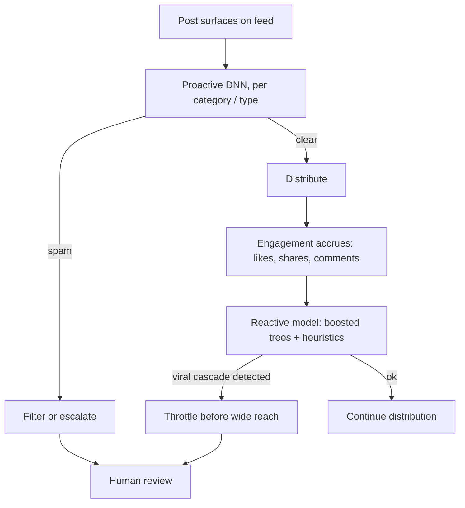

**Interview questions this design invites**
- Why run proactive and reactive classifiers instead of one, and what does each catch?
- Why is the engagement cascade the strongest virality signal, and how do you featurize a temporal sequence?
- Why use deep nets proactively but boosted trees reactively?
- How does a virality circuit-breaker throttle fast-spreading unreviewed content without hurting normal posts?
- How do you set the reactive trigger so it fires before wide reach but not on every popular post?
- What are the risks of consolidating all classifiers into one unified model, as they plan?

**Tricks and gotchas**
- Reactive detection acts after some reach, so the miss cost scales with how fast the content spread.
- Engagement features can be gamed by coordinated early likes to fake or suppress virality signals.
- Proactive nets are per category and type, so a novel format falls outside all of them until retrained.
- The two systems can disagree, so you need a policy for proactive-clear but reactive-flagged content.

**Common mistakes and how to fix them**
- Relying only on ingest-time scoring. Fix: add reactive engagement monitoring as a virality circuit-breaker.
- Ignoring temporal engagement structure. Fix: featurize the like/share/comment sequence, not just counts.
- One model for all content types. Fix: category- and type-specific proactive models, consolidated only carefully.
- Treating reach as free. Fix: throttle distribution of fast-spreading unreviewed content until cleared.

### Bumble: Private Detector for unsolicited lewd images ([source](https://medium.com/bumble-tech/bumble-inc-open-sources-private-detector-and-makes-another-step-towards-a-safer-internet-for-women-8e6cdb111d81))

Bumble built Private Detector, an EfficientNetV2 binary classifier that detects lewd images and auto-blurs them with a warning before the recipient opens the photo, deployed across Bumble and Badoo. The model uses MBConv and FusedMBConv blocks for a fast, parameter-efficient backbone. Despite only 0.1 percent of users sending lewd images, Bumble's scale let them build a large positive-and-negative dataset, deliberately curating hard negatives (legs, arms, other body parts) to hold down false positives, and iteratively expanding the set from real misclassifications. It reaches above 98 percent accuracy in offline and production settings with balanced precision and recall, and Bumble open-sourced the code, a TensorFlow Serving SavedModel, and training checkpoints under Apache 2.0.

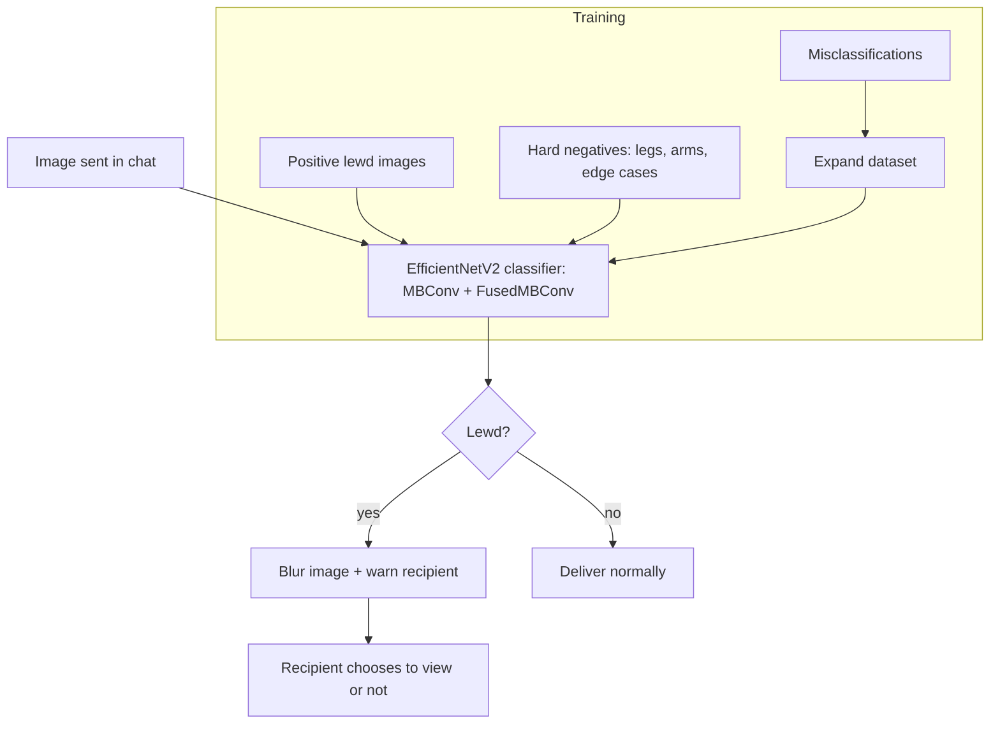

**Interview questions this design invites**
- Why EfficientNetV2, and what do MBConv and FusedMBConv buy in speed versus capacity?
- With only 0.1 percent positive rate, how do you build a balanced training set and avoid a degenerate classifier?
- Why deliberately mine hard negatives like arms and legs, and how does that shift the precision-recall curve?
- Why blur-and-warn instead of hard-blocking the image?
- How do you keep above 98 percent accuracy honest when the base rate is so skewed?
- What does open-sourcing the model give and cost you against adversaries?

**Tricks and gotchas**
- A 0.1 percent base rate means accuracy is a misleading metric; a trivial all-negative model scores 99.9 percent.
- Hard negatives (limbs, skin tone, swimwear) are exactly where naive nudity classifiers over-flag.
- Blur-and-warn preserves recipient agency but still surfaces the image if they choose to open it.
- Open-sourcing lets adversaries probe the exact decision boundary offline.

**Common mistakes and how to fix them**
- Reporting accuracy on skewed data. Fix: report balanced precision and recall at the operating threshold.
- Training only on positives and random negatives. Fix: curate hard negatives to control false positives.
- Hard-deleting flagged images. Fix: blur with a warning so the recipient keeps control and appeals are unnecessary.
- Freezing the dataset. Fix: iteratively fold in production misclassifications.

### Meta AI: Hateful Memes challenge and dataset ([source](https://ai.meta.com/blog/hateful-memes-challenge-and-data-set/))

Meta released a 10,000-plus example multimodal benchmark, with a 100,000 dollar competition at NeurIPS 2020, designed so that hatefulness emerges only from image and text together, forcing genuine joint reasoning. They sourced real hateful memes, replaced originals with licensed Getty images preserving meaning, and crucially added benign confounders: near-identical memes that are harmless, so a model cannot cheat on the image or the text alone. Baselines spanned late fusion (average per-modality predictions), mid-fusion ConcatBERT (concatenate BERT and ResNet-152), and early-fusion ViLBERT, VisualBERT, and MMBT, with early fusion winning but all models trailing human performance. Baselines ship via Meta's MMF PyTorch framework, and dataset access is gated to researchers under strict terms.

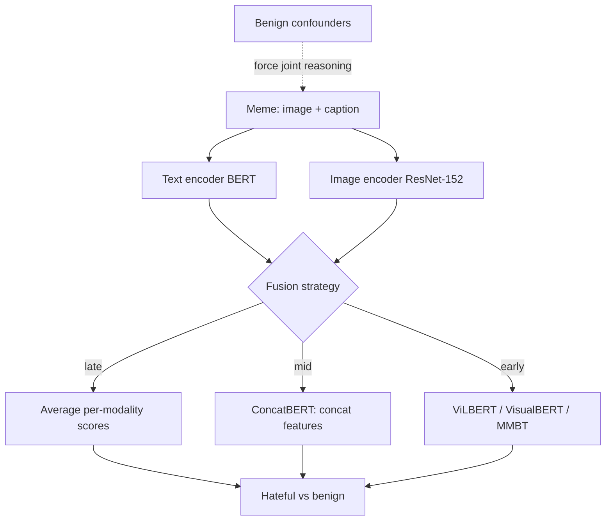

**Interview questions this design invites**
- Why do unimodal text-only and image-only classifiers fail on hateful memes?
- What are benign confounders and why are they essential to a fair multimodal benchmark?
- How do late, mid, and early fusion differ, and why does early fusion win here?
- Why did Meta replace original images with licensed photos, and what does that risk for realism?
- Why does a human-versus-model gap matter as an eval bar?
- How would you turn this benchmark model into a production classifier with a precision floor?

**Tricks and gotchas**
- OR-ing a text model and an image model is exactly the approach benign confounders are built to defeat.
- Replacing real images with stock photos can shift the distribution away from real memes seen in production.
- Early fusion is stronger but heavier, so production must gate it behind cheap unimodal pre-filters.
- A benchmark score is not an operating point; you still must pick a threshold per precision floor.

**Common mistakes and how to fix them**
- Running separate text and image models and combining scores. Fix: a joint early-fusion vision-language model.
- Evaluating without confounders. Fix: include benign near-duplicates so the model cannot shortcut on one modality.
- Chasing benchmark accuracy. Fix: report recall at a fixed precision floor for the real enforcement decision.
- Invoking the heavy joint model on everything. Fix: pre-filter with cheap unimodal models and escalate only ambiguous cases.

### Google: Content Safety API and CSAI Match for CSAM ([source](https://protectingchildren.google/tools-for-partners/))

Google offers two complementary CSAM tools to partners. The Content Safety API uses AI classifiers to assign priority scores to previously unseen images and videos so partners focus scarce human review on the most likely abuse, processing billions of items. CSAI Match uses hash-matching (fingerprinting) against YouTube's database of known abusive video, robust to re-encodes and obfuscated near-duplicates. Both keep a human in the loop: partners fetch files, call the API, receive priority scores or match results, then manually review and action per local law. Fingerprinting for CSAI Match is done locally so only fingerprints, not the content, leave the partner, and the tools integrate with complementary systems like Microsoft PhotoDNA.

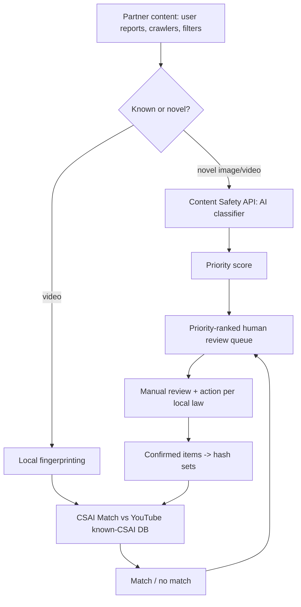

**Interview questions this design invites**
- Why split into a classifier for novel content and hash-matching for known content?
- Why does hash-matching stay near-zero false positive and legally actionable while classifiers only prioritize?
- Why fingerprint locally and send only the hash, not the file?
- How does perceptual hashing survive re-encoding, resizing, and obfuscation?
- Why never auto-action CSAM on a classifier score, and always route to human review?
- How does the confirmed-item-to-hash-set loop stop re-upload campaigns?

**Tricks and gotchas**
- Classifiers here only prioritize the queue; they do not auto-remove, because the false-positive cost is unacceptable.
- Hash matching only catches known material, so novel abuse depends entirely on the classifier plus human experts.
- Local fingerprinting is a privacy and legal necessity, not an optimization.
- The known-bad database grows continuously, so lookup must stay fast at ingest scale.

**Common mistakes and how to fix them**
- Auto-actioning on a CSAM classifier score. Fix: hash for known material, classify to prioritize, always human-review novel.
- Sending content to a third party for matching. Fix: fingerprint locally and transmit only the hash.
- Relying on exact hashing. Fix: perceptual hashing robust to re-encode and minor edits.
- Letting confirmed material re-upload. Fix: add confirmed items to shared hash sets to catch the next occurrence.

### Nextdoor: Kindness Reminder pre-post nudge ([source](https://blog.nextdoor.com/2019/09/18/announcing-our-new-feature-to-promote-kindness-in-neighborhoods))

Nextdoor built Kindness Reminder, an ML nudge that detects potentially offensive comments as they are written and prompts the author to review community guidelines, edit, or reconsider before posting rather than removing content after the fact. Detection blends signals from previously flagged comments with a model trained on the nuanced ways incivility appears across different communities, developed with Stanford professor Dr. Jennifer Eberhardt to address racial-profiling feedback. In US testing, 1 in 5 people who saw the reminder edited their comment, yielding 20 percent fewer negative comments, and prompt frequency declined over time in tested areas. Nextdoor deliberately accepted an engagement dip to favor healthier interactions.

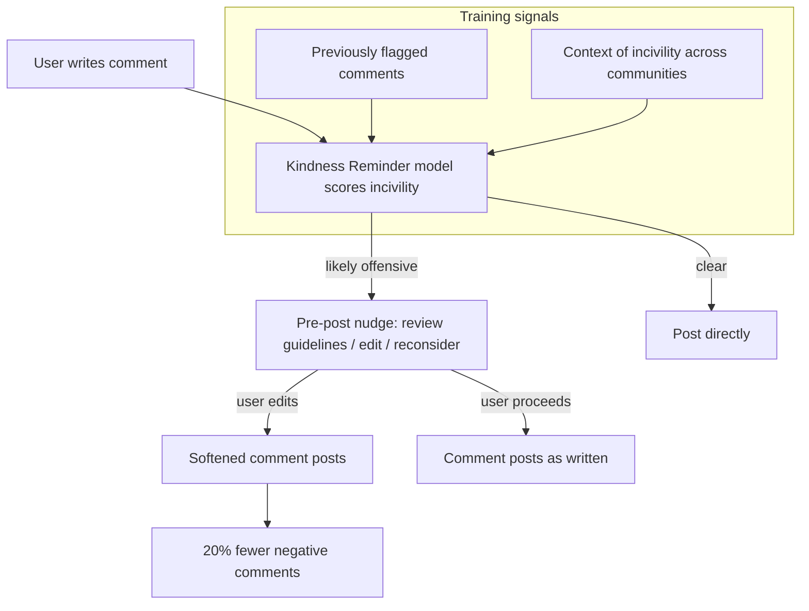

**Interview questions this design invites**
- Why nudge before posting instead of removing after, and how does that change the cost equation?
- How do you detect incivility without over-flagging legitimate strong opinions?
- Why involve a bias researcher, and how does that address racial-profiling complaints?
- How do you measure success when the goal is behavior change, not removal volume?
- Why is Nextdoor willing to trade engagement for civility, and how do you defend that to product?
- How does declining prompt frequency over time indicate real behavior change versus habituation?

**Tricks and gotchas**
- A pre-post nudge avoids the appeal entirely when it works, but only if the model fires on genuinely offensive text.
- Over-nudging trains users to ignore or resent the prompt, killing the effect.
- Declining prompt rate could be learned civility or users routing around the trigger with new phrasing.
- Incivility is context-dependent, so a model trained on one community can misfire in another.

**Common mistakes and how to fix them**
- Only removing content after harm. Fix: add a pre-post nudge to prevent the violation from being created.
- Optimizing removal counts. Fix: measure edit rate and reduction in negative comments as the real outcome.
- Ignoring bias in the classifier. Fix: partner with bias research and audit for disparate flag rates.
- Treating one civility model as universal. Fix: account for community-specific context in training and thresholds.

### Company: Slack: sparse logistic regression to block invite spam ([source](https://slack.engineering/blocking-slack-invite-spam-with-machine-learning/))

Slack replaced a hand-tuned wall of IP denylists, regexes, and string matches (maintained by engineers watching a Slack channel) with a single sparse logistic regression model that scores invitations in real time. The model spans roughly 60 million features while staying interpretable: known team/user IDs, emails, domains, and IPs, word stems for Western languages, character sequences for Chinese text, mentioned websites, and team age. Rather than crowdsourcing spam labels, they used a proxy label, team-level invite acceptance, counting only invites accepted within 4 days (over 90 percent of legitimate accepts land in that window), which lets the label react quickly to new spammer behavior. It serves through a lightweight Python model-serving microservice on Kubernetes, pulling periodic updates from S3, and scores production traffic proactively before invites go out. Blocked invites still log to a channel for periodic human review, but human interaction is now rarely required. Only 3 percent of ML-flagged invites were later accepted (a true-negative proxy), versus 70 percent under the old rules, meaning the manual system had been blocking mostly legitimate invites, and the coordination channel went from hundreds of messages a month to basically dormant.

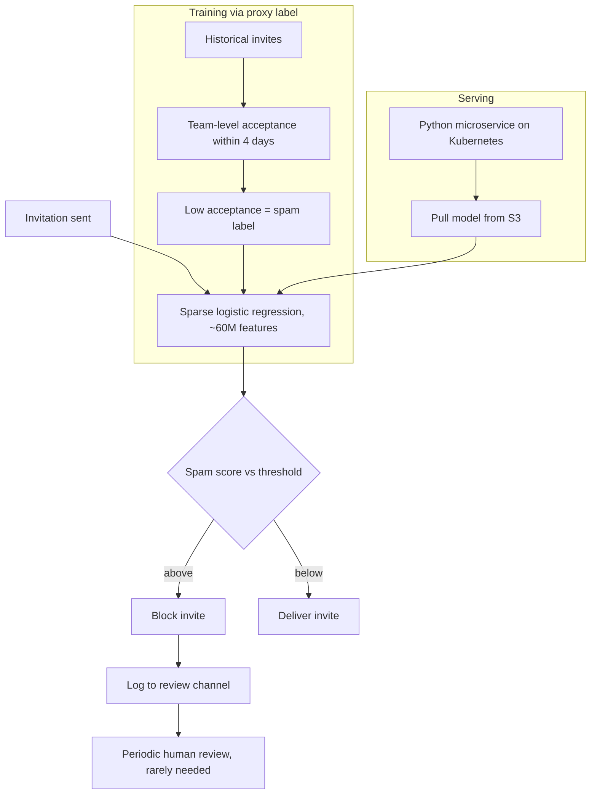

**Interview questions this design invites**
- Why sparse logistic regression over a deep model when the feature space is 60 million wide?
- Why use invite-acceptance as a proxy label instead of paying for human spam labels, and what bias does that inject?
- Why cap the acceptance window at 4 days, and how does that window trade label accuracy for reaction speed?
- How do you keep an interpretable linear model competitive against adversaries who probe its weights?
- Why block proactively at send time rather than react after recipients complain?
- What does the 3 percent versus 70 percent acceptance comparison actually prove, and what does it hide?

**Tricks and gotchas**
- The proxy label conflates spam with any low-acceptance invite, so a legitimate but unpopular team looks like a spammer.
- A 4-day window mislabels slow-but-real accepts as spam and rewards spammers who can wait it out.
- Sparsity and interpretability are a defense-in-depth benefit: you can read why an invite was blocked, but a linear boundary is also easier to reverse-engineer.
- Team age as a feature penalizes brand-new legitimate teams, the exact cohort most sensitive to a bad first experience.

**Common mistakes and how to fix them**
- Maintaining rules by hand and watching a channel. Fix: learn the patterns with a model and let humans audit the tail.
- Waiting for human spam labels before shipping. Fix: bootstrap a proxy label from an existing behavioral signal (acceptance).
- Judging quality by how much you block. Fix: measure the acceptance rate of what you blocked, since real spam is almost never accepted.
- Reacting to spam after recipients see it. Fix: score at invite-send time and block before delivery.
_Not reachable: none_
