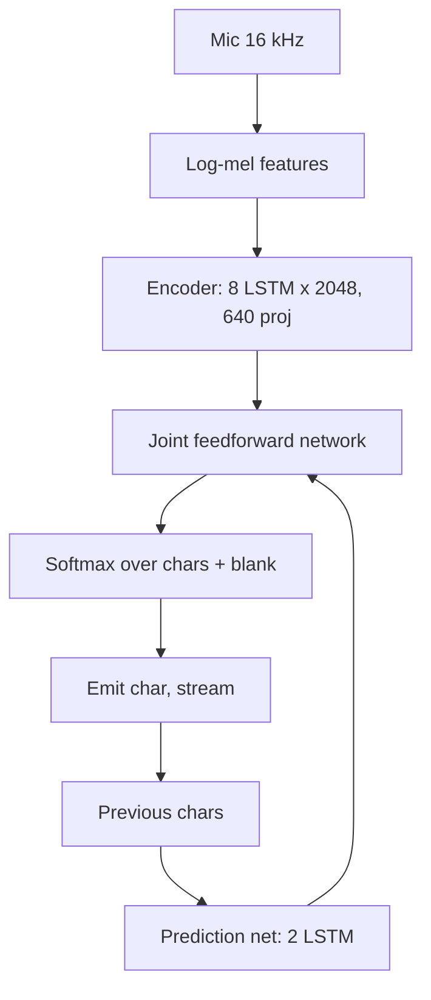
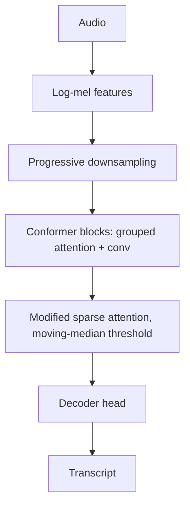
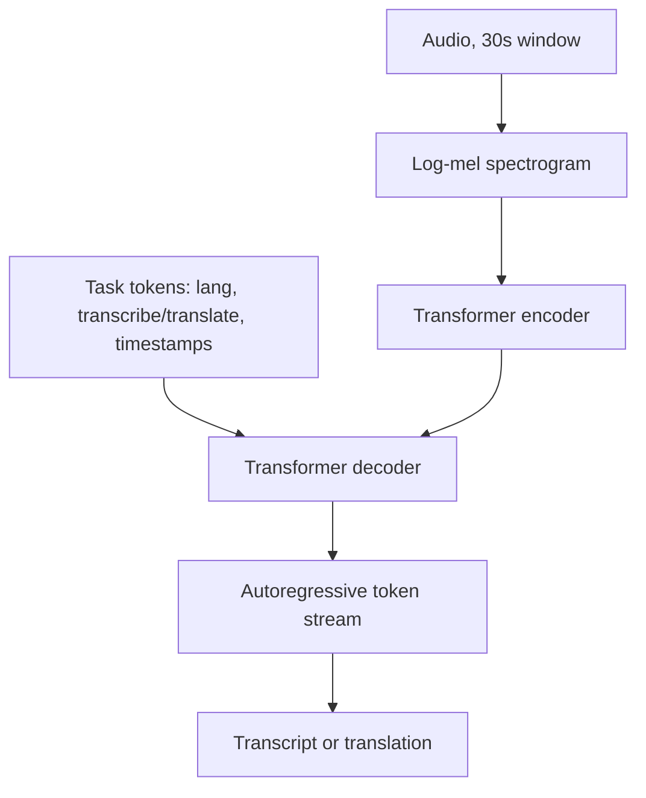
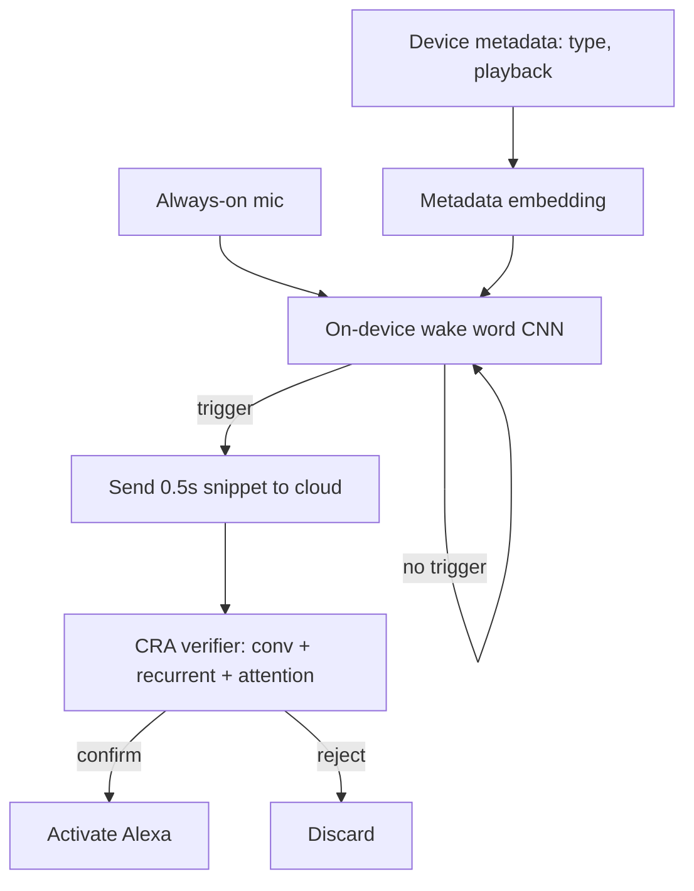
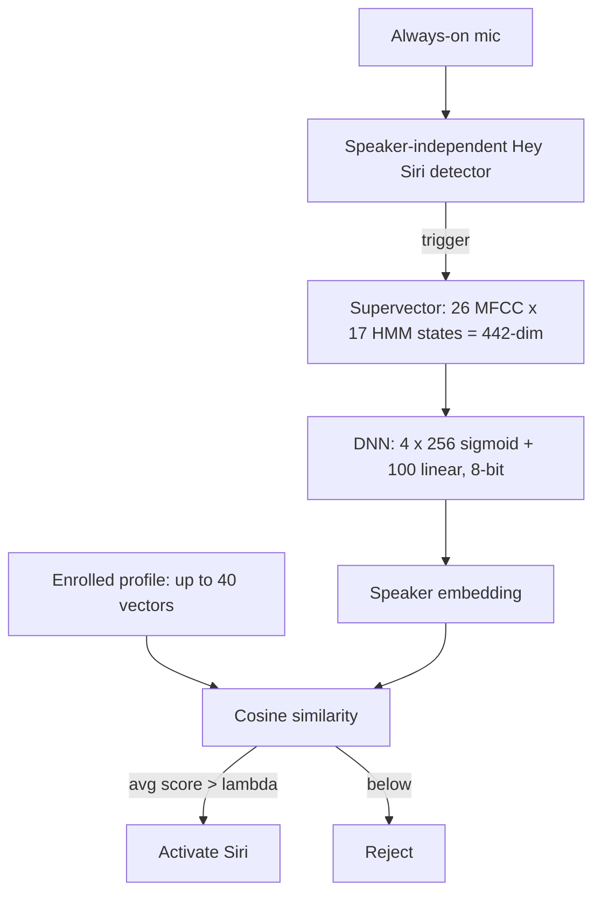
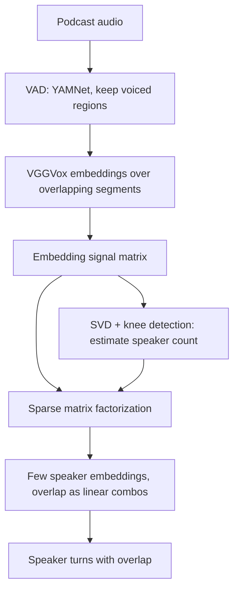
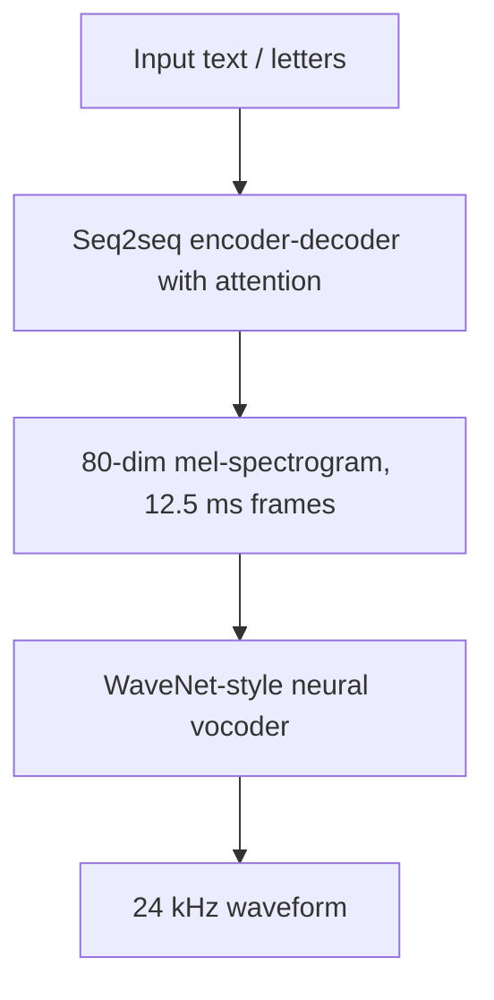
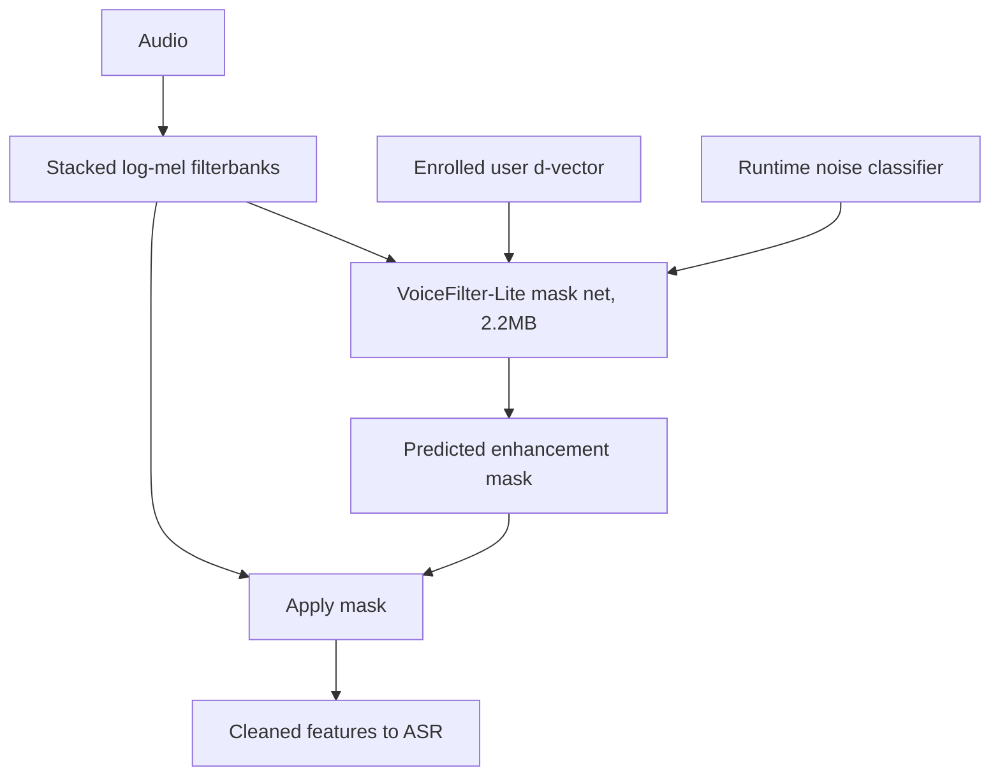

## Speech and audio

### Google: An all-neural on-device RNN-T speech recognizer for Gboard voice typing ([source](https://research.google/blog/an-all-neural-on-device-speech-recognizer/))

Google shipped an end-to-end RNN-Transducer that runs streaming ASR entirely on Pixel phones, replacing the cloud round trip for Gboard voice typing. The encoder is 8 LSTM layers (2048 units, 640-dim projection), the prediction network is 2 LSTM layers, and a feedforward joint network fuses them to emit characters incrementally. Parameter quantization plus hybrid kernels shrank the model from 450MB to 80MB (a 4x compression) with a 4x runtime speedup, letting it run faster than real time on a single CPU core. Accuracy matched the server recognizer despite being fully offline, initially for American English.

**Interview questions this design invites**
- Why RNN-T over CTC or attention seq2seq for on-device streaming dictation?
- What does the prediction network buy you that CTC lacks, and at what cost?
- How does quantization achieve 4x compression, and how do you validate the WER hit?
- Why does the joint network combine encoder and prediction outputs instead of a single stack?
- How do you handle endpointing so the model knows the user stopped talking?
- What breaks when you move from American English to multilingual on the same budget?

**Tricks and gotchas**
- RNN-T commits monotonically left to right, so it cannot revise a bad early hypothesis the way batch attention can.
- Quantization gains are architecture-dependent; LSTM state and kernel fusion matter as much as int8 weights.
- On-device means no audio logging, so you lose the retraining signal and need on-device or federated metrics.
- Decoder state and beam width must stay tiny to fit the memory and power envelope.

**Common mistakes and how to fix them**
- Proposing one giant Conformer for on-device streaming; fix by picking RNN-T sized to the NPU and memory budget.
- Assuming quantization is free; fix by measuring per-slice WER before and after, not assuming a small hit.
- Ignoring endpointing latency because WER looks good; fix by tracking endpoint latency and false cutoffs separately.
- Forgetting the retraining data wall on-device; fix by designing federated or on-device metric collection up front.

### AssemblyAI: Conformer-1, a batch ASR trained on 650K hours for noise robustness ([source](https://www.assemblyai.com/blog/conformer-1))

AssemblyAI built Conformer-1, a full-context batch ASR that interleaves self-attention and convolution and was scaled on a 650K-hour, 60TB English dataset drawn from proprietary and internet sources. They made three architecture changes to the base Conformer: progressive downsampling to shorten the encoded sequence, grouped attention to make attention cost independent of sequence length, and modified sparse attention using moving-median thresholds instead of averaging so noise contributions get pruned rather than amplified. These changes gave 29 percent faster inference and 36 percent faster training. The result showed 43 percent fewer errors on noisy real-world audio versus competitors, generalizing across call centers, podcasts, broadcasts, and webinars, with a streaming variant reporting a 24.3 percent relative accuracy gain.

**Interview questions this design invites**
- Why does the Conformer mix convolution and attention, and what does each capture in speech?
- What problem does grouped attention solve as utterances get long?
- Why replace averaging with a moving-median threshold in sparse attention for noisy audio?
- How do you scale data and model together, and how do you know 650K hours was worth it?
- How do you evaluate noise robustness without overfitting to one noisy test set?
- Why is a full-context batch model a poor fit for live dictation?

**Tricks and gotchas**
- Aggregate WER hides subgroup collapse; robustness claims need slicing by noise, domain, and accent.
- Progressive downsampling trades some temporal resolution for speed, which can hurt short or fast speech.
- Sparse attention that prunes too aggressively can drop real low-energy speech, not just noise.
- Internet-sourced training data carries label noise that must be weakly supervised, not trusted verbatim.

**Common mistakes and how to fix them**
- Claiming a single WER number proves robustness; fix by reporting per-condition slices as a release gate.
- Using a batch Conformer for streaming; fix by deriving a causal streaming variant with bounded look-ahead.
- Scaling model without scaling data; fix by following proportional data-and-model scaling.
- Ignoring inference cost on transcription farms; fix by measuring throughput per GPU, not just WER.

### OpenAI: Whisper, weakly supervised multitask speech recognition and translation ([source](https://github.com/openai/whisper))

Whisper is a Transformer encoder-decoder trained on large-scale weak supervision rather than curated labels, aiming for zero-shot robustness across domains without dataset-specific fine-tuning. Audio becomes a log-mel spectrogram processed in 30-second windows, the encoder embeds it, and the decoder autoregressively predicts a token stream that jointly encodes the task. A single model handles multilingual ASR, speech-to-English translation, spoken language identification, and voice activity detection, with the task selected by special tokens in the decoder sequence. Six sizes span 39M (tiny) to 1.55B (large) parameters, plus a faster 809M turbo, and evaluation reports WER and CER across Common Voice and Fleurs by language.

**Interview questions this design invites**
- What does large-scale weak supervision buy versus clean labeled data, and what does it cost?
- How does encoding tasks as decoder tokens replace a multi-stage pipeline?
- Why is zero-shot cross-dataset WER a fairer robustness signal than in-domain WER?
- What causes hallucinated transcript on silence, and how do you gate it?
- How does the 30-second window constrain long-audio transcription, and how do you stitch chunks?
- When would you not use Whisper (latency, on-device, streaming)?

**Tricks and gotchas**
- Weakly supervised models can emit fluent transcript for non-speech; add speech/no-speech gating and confidence thresholds.
- Attention decoders can loop, repeat, or truncate; monitor for degenerate output.
- Identical text normalization is required before comparing WER against any other system.
- The 30-second window makes precise long-form timestamps and streaming awkward.

**Common mistakes and how to fix them**
- Treating Whisper as a streaming dictation model; fix by using a causal RNN-T/CTC for live latency.
- Trusting fluent output on noisy or silent audio; fix with VAD gating and confidence filtering.
- Comparing WER across systems with different normalizers; fix by normalizing identically first.
- Assuming one model size fits all; fix by matching size to the latency and cost budget of the surface.

### Amazon: A metadata-aware on-device Alexa wake word plus cloud verification ([source](https://www.amazon.science/blog/amazon-alexas-new-wake-word-research-at-interspeech))

Amazon runs a two-stage wake word: a small always-on on-device model that must fit a tight memory footprint, and a heavier cloud verifier that confirms triggers. The on-device model embeds device metadata (device type, whether audio is playing) into a vector and injects it two ways, concatenating it with flattened audio features before classification and modulating channel-normalization parameters, which cut the false-reject rate 14.6 percent versus a baseline CNN. When the device fires, a half-second snippet goes to the cloud to absorb start-time misalignment, where a Convolutional-Recurrent-Attention model re-checks it. On noisily aligned audio the CRA verifier reduced false accepts 60 percent versus 31 percent for a CNN-only approach.

**Interview questions this design invites**
- Why split wake word into a loose on-device stage and a strict cloud verifier?
- How does device metadata improve detection, and why modulate normalization rather than only concatenate?
- Why send a half-second snippet instead of just the detected frame to the cloud?
- What operating point on the DET curve do you pick, and how does it differ by device class?
- How do you measure false accepts meaningfully (per hour of ambient audio, not recall)?
- What are the privacy implications of always-on capture and cloud verification?

**Tricks and gotchas**
- The on-device stage is deliberately loose to avoid false rejects; the cloud stage kills the resulting false accepts.
- Wake word start times are noisily aligned, so the verifier must tolerate timing offset.
- Metadata that helps one device class can hurt generalization if not embedded and modulated carefully.
- Thresholds must be tuned per device (phone vs far-field), not globally.

**Common mistakes and how to fix them**
- Using one strict on-device threshold; fix with a loose first stage plus second-stage verification.
- Reporting recall only; fix by measuring false accepts per hour of ambient audio.
- Sending a single frame to the cloud; fix by sending a short window to cover misalignment.
- Sharing one threshold across device classes; fix by tuning per device tolerance and acoustics.

### Apple: Personalized Hey Siri with on-device speaker-recognition embeddings ([source](https://machinelearning.apple.com/research/personalized-hey-siri))

Apple adds a personalization stage so the device responds to its owner, not similar phrases or other voices. First a speaker-independent DNN detector spots the "Hey Siri" trigger; then a speaker-recognition stage extracts a voice embedding and compares it to the user's profile. Enrollment is both explicit (five recorded phrases yield five speaker vectors) and implicit (later accepted utterances update the profile up to 40 vectors, adapting to real acoustic variation). Each utterance is turned into a 442-dimensional supervector (26 MFCCs by 17 HMM states) then transformed by a DNN of four 256-neuron sigmoid layers plus a 100-neuron linear layer, quantized to 8-bit; cosine similarity above threshold lambda activates. The 4x256 model hit 4.3 percent equal error rate and cut false accepts to about one per month end to end.

**Interview questions this design invites**
- Why separate key-phrase detection from speaker recognition into two phases?
- What does personalization fix that a speaker-independent wake word cannot?
- Why combine explicit and implicit enrollment, and what is the risk of implicit updates?
- How does equal error rate summarize the false-accept vs false-reject tradeoff?
- Why cosine similarity on embeddings rather than a classifier over raw features?
- How does 8-bit quantization affect the embedding quality and EER?

**Tricks and gotchas**
- Implicit enrollment can drift the profile if it absorbs an impostor or bad-acoustic utterance.
- Averaging scores across stored vectors stabilizes the decision but can mask a single strong match.
- The supervector fixes variable-length audio to a fixed size before the DNN, which constrains what it can model.
- EER is a single operating summary; the product still needs a chosen threshold lambda.

**Common mistakes and how to fix them**
- Relying on the trigger detector alone for personalization; fix by adding a speaker-verification stage.
- Enrolling only explicitly; fix by adapting the profile implicitly within a bounded vector count.
- Optimizing EER but ignoring end-to-end false accepts; fix by measuring accepts per unit time in situ.
- Letting implicit updates run unbounded; fix by capping stored vectors and gating updates by score.

### Spotify: Unsupervised, overlap-aware speaker diarization via sparse optimization ([source](https://research.atspotify.com/2022/09/unsupervised-speaker-diarization-using-sparse-optimization))

Spotify built a diarization method that is unsupervised, language-agnostic, and overlap-aware, so it scales to podcasts without labeled data or language-specific features. YAMNet voice-activity detection finds voiced regions, VGGVox embeddings are computed over overlapping segments to form an embedding signal, and diarization is framed as a sparse matrix factorization that reconstructs that signal from as few distinct speaker embeddings as possible. Overlapping speech is modeled as a linear combination of existing embeddings, so the sparsity penalty naturally handles overlap instead of forcing new speakers. Speaker count is estimated tuning-free via SVD with knee detection on the singular values (scaled by 2.5 for margin). On hour-long podcasts averaging 18 speakers it beat Google Cloud diarization on error rate, purity, and coverage.

**Interview questions this design invites**
- Why frame diarization as sparse matrix factorization rather than clustering?
- How does the sparsity penalty make the method overlap-aware for free?
- Why is unsupervised and language-agnostic a scaling advantage for podcasts?
- How does SVD knee detection estimate an unknown speaker count without tuning?
- What is diarization error rate, and why report purity and coverage alongside it?
- Where do short turns and unknown speaker count still break this pipeline?

**Tricks and gotchas**
- Modeling overlap as linear combinations avoids spawning phantom speakers, unlike naive clustering.
- The 2.5 safety multiplier on estimated count trades over-segmentation risk against missing speakers.
- Embedding quality bounds everything downstream; VAD errors propagate into false or missed turns.
- Tuning-free does not mean assumption-free; the knee heuristic can misfire on very balanced spectra.

**Common mistakes and how to fix them**
- Assuming a known speaker count; fix by estimating it from the singular-value knee.
- Clustering that assigns overlap to one speaker; fix by modeling overlap as embedding combinations.
- Relying on language-specific features; fix by using audio-only embeddings for scalability.
- Reporting DER alone; fix by adding purity and coverage to expose the error composition.

### Google: Tacotron 2, seq2seq mel-spectrogram acoustic model plus WaveNet vocoder ([source](https://research.google/blog/tacotron-2-generating-human-like-speech-from-text/))

Tacotron 2 is a two-stage neural TTS pipeline. A sequence-to-sequence model maps letters to an 80-dimensional mel-spectrogram at 12.5 millisecond frames, encoding pronunciation, volume, speed, and intonation, and a WaveNet-style vocoder renders that spectrogram into a 24 kHz waveform. Splitting the problem lets each stage train and swap independently: the mel-spectrogram is a compact learnable target that decouples what to say and how to prosody it from high-fidelity sample rendering. It learns directly from speech and transcripts with no hand-crafted linguistic features, and reached mean opinion scores comparable to professional recordings. Known limits: hard words, occasional artifacts, no real-time synthesis, and no control of emotion or speaking style.

**Interview questions this design invites**
- Why split TTS into an acoustic model and a separate vocoder?
- Why is a mel-spectrogram a good intermediate target versus predicting samples directly?
- Why judge TTS by MOS from humans rather than a spectrogram loss?
- What causes an autoregressive acoustic model to skip or repeat words, and how do you catch it?
- Where does most of the compute sit, and what blocks real-time synthesis?
- How would you add prosody or speaking-style control to this pipeline?

**Tricks and gotchas**
- Autoregressive attention can lose alignment monotonicity, producing skipped or repeated words.
- Spectrogram-domain loss can look good while MOS is poor; only human ratings track naturalness.
- The vocoder carries most of the compute and most of the naturalness, so it dominates cost and quality.
- Decoupling stages helps iteration but a mismatch between acoustic model and vocoder degrades output.

**Common mistakes and how to fix them**
- Optimizing spectrogram reconstruction loss as the quality metric; fix by evaluating with human MOS.
- Assuming autoregressive synthesis is robust; fix by monitoring alignment and preferring non-autoregressive variants where stability matters.
- Expecting real-time output from a WaveNet vocoder; fix by swapping in a faster vocoder (WaveRNN, HiFi-GAN).
- Ignoring rare-word pronunciation; fix with phoneme inputs or a lexicon for hard words.

### Google: VoiceFilter-Lite, a 2.2MB streaming speaker-conditioned separation model ([source](https://research.google/blog/improving-on-device-speech-recognition-with-voicefilter-lite/))

VoiceFilter-Lite suppresses overlapping voices on-device by conditioning on the enrolled user's speaker embedding, cleaner than blind source separation because you already know whose voice you want. It operates on stacked log-mel filterbank features (not raw waveform) plus a d-vector, and predicts a mask that enhances the target speaker and suppresses everything else, feeding directly into the recognizer. TensorFlow Lite quantization brings it to a 2.2MB footprint suitable for mobile, and it degrades gracefully to a passthrough when no enrollment exists. It improves WER 25.1 percent on additive overlapping speech and 14.7 percent on reverberant overlap while preserving single-speaker and quiet performance, using asymmetric loss (penalizing over-suppression harder) and runtime noise classification to avoid deleting real speech.

**Interview questions this design invites**
- Why condition on a target-speaker embedding instead of doing blind source separation?
- Why operate on filterbank features rather than raw waveform for an on-device separator?
- What is over-suppression, and why does asymmetric loss penalize it more?
- How does the model stay a no-op when no enrollment exists, and why does that matter?
- How do you keep single-speaker and quiet WER from regressing while helping overlap?
- What is the interplay between the separator and the downstream ASR model?

**Tricks and gotchas**
- Feature-domain masking keeps it tiny and streamable but limits how much it can reconstruct.
- Over-suppression can remove the target user's own speech; the asymmetric loss guards against it.
- Runtime noise classification adapts suppression strength so quiet audio is not over-filtered.
- It needs a reliable d-vector; a bad enrollment embedding degrades separation.

**Common mistakes and how to fix them**
- Using blind separation when you know the target speaker; fix by conditioning on the enrolled d-vector.
- Penalizing over- and under-suppression equally; fix with an asymmetric loss favoring speech preservation.
- Applying fixed suppression strength; fix with runtime noise classification to adapt by condition.
- Regressing clean-audio WER to help overlap; fix by validating on single-speaker and quiet sets as a gate.

_Not reachable: none_
