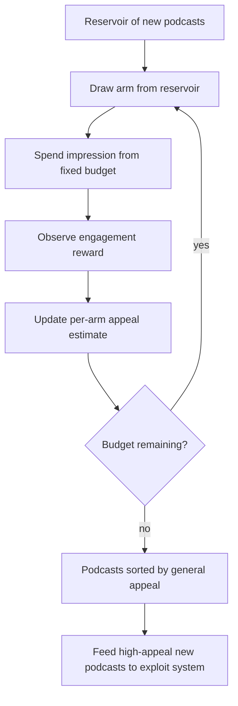
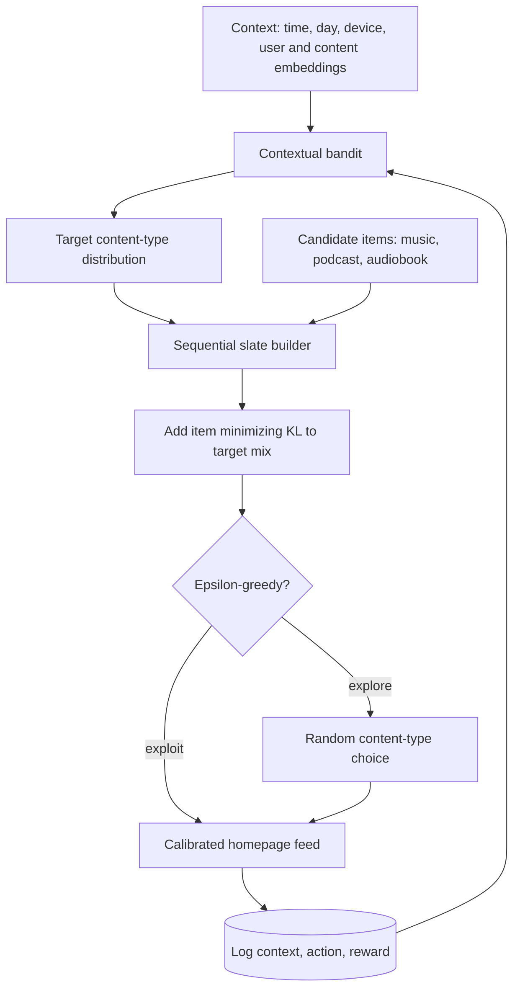
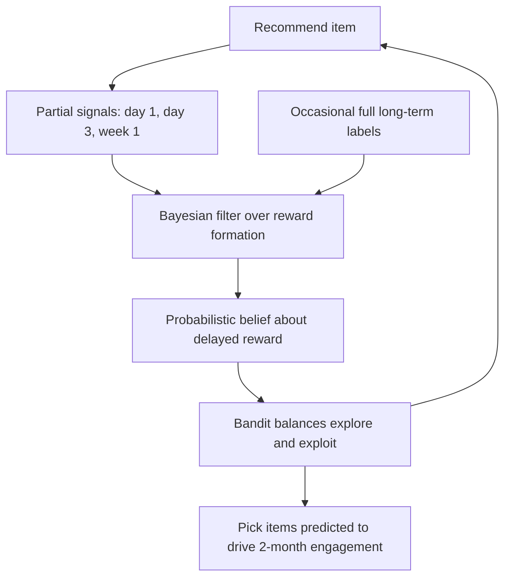
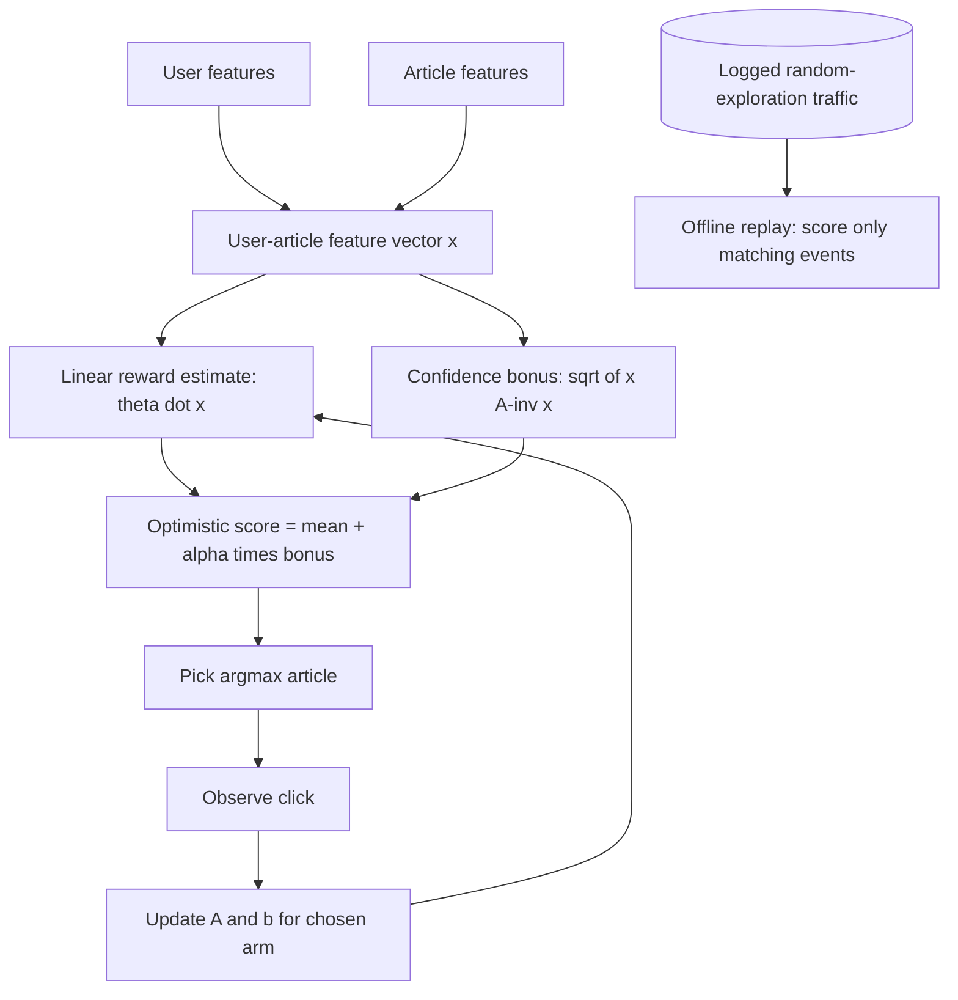
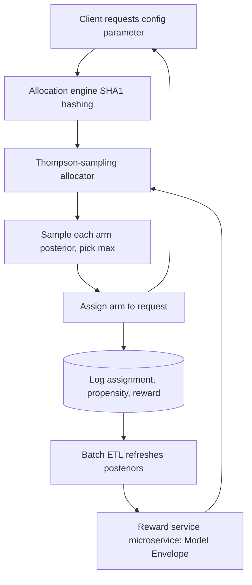
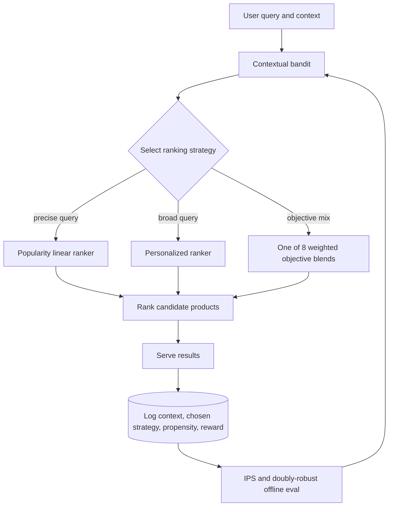
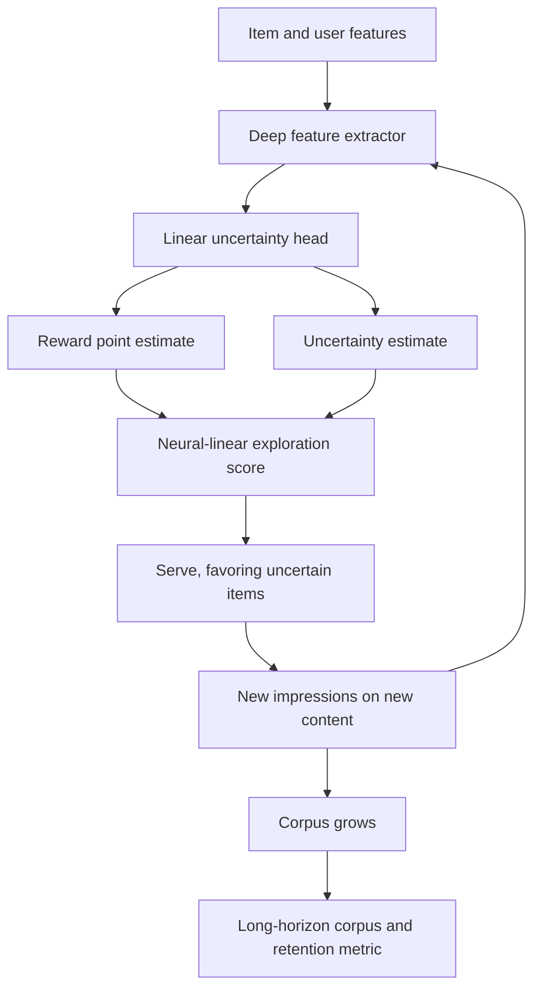

## Cold start and exploration

### Spotify: pure-exploration infinitely-armed bandit for surfacing new podcasts ([source](https://research.atspotify.com/publications/identifying-new-podcasts-with-high-general-appeal-using-a-pure-exploration-infinitely-armed-bandit-strategy))

Spotify wanted to identify newly released podcasts with broad audience appeal, but supervised methods failed because new shows have almost no content or consumption signal and inherit popularity bias from historical data. They instead built a non-contextual bandit in the fixed-budget, infinitely-armed, pure-exploration setting: each new podcast is an arm drawn from a reservoir, and a fixed impression budget is spent on best-arm identification rather than on maximizing immediate engagement. In simulation the algorithm efficiently sorts podcasts into groups by increasing appeal and beats several state-of-the-art alternatives, decoupling discovery from the exploit feed so popularity does not dominate.

**Interview questions this design invites**
- Why is pure exploration decoupled from the exploit feed instead of folded into one ranker?
- What does "infinitely-armed" mean and why does a reservoir formulation fit new-podcast discovery?
- How does a fixed-budget best-arm-identification objective differ from regret minimization?
- How does this design avoid popularity bias that supervised ranking would reproduce?
- How would you set the exploration budget, and who pays the short-term cost?
- How do you validate a discovery bandit offline before it touches real users?

**Tricks and gotchas**
- Best-arm identification optimizes final selection quality, not cumulative reward, so classic UCB regret intuition does not transfer directly.
- Reservoir distribution assumptions drive performance; a skewed arm-quality reservoir changes how aggressively you should sample.
- Pure exploration is a separate channel; it needs its own guardrail so bad new content does not flood the main feed.

**Common mistakes and how to fix them**
- Treating new-item discovery as a supervised ranking problem: it inherits popularity bias; use a dedicated exploration channel instead.
- Optimizing cumulative clicks during discovery: switch the objective to best-arm identification under a fixed budget.
- Assuming a fixed arm set: model new supply as an infinite reservoir so fresh podcasts keep entering the pool.

### Spotify: calibrated content-type mix on the homepage with a contextual bandit ([source](https://research.atspotify.com/2025/9/calibrated-recommendations-with-contextual-bandits-on-spotify-homepage))

Spotify's homepage must balance music, podcasts, and audiobooks per user, and simply mirroring a user's historical consumption ratio ignores context (time of day, device, session intent). They frame calibration as supervised learning with bandit feedback: a contextual bandit picks a target content-type distribution to maximize engagement, using temporal signals, device type, and user/content embeddings as context. Slates are built sequentially, adding items with a Kullback-Leibler divergence penalty that keeps the realized mix near the chosen target, and an epsilon-greedy branch supplies exploration. Offline the method beat a 7-day historical baseline by 35 percent on podcast accuracy and a multinomial blend by 16.6 percent; the March 2025 A/B lifted podcast impression-to-stream ratio 36.6 percent and total consumption 1.28 percent.

**Interview questions this design invites**
- What does "calibration" mean here and why is the historical ratio a bad target?
- Why frame it as supervised learning with bandit feedback rather than full RL?
- How does the KL penalty translate a target distribution into an actual slate?
- Why epsilon-greedy over UCB or Thompson for this surface?
- How do offline accuracy gains relate to the online impression-to-stream lift?
- How would you keep calibration from starving a content type a user genuinely dislikes?

**Tricks and gotchas**
- The bandit chooses a distribution, not individual items; slate construction is a separate greedy KL step.
- Historical-ratio calibration is context-blind; the same user wants a different mix by time and device.
- Epsilon-greedy explores uniformly, so on a high-traffic homepage the flat tax must be small and bounded.

**Common mistakes and how to fix them**
- Calibrating to long-run historical ratios: add context features so the target mix shifts with session and device.
- Optimizing per-item score and hoping the mix works out: enforce the target with an explicit KL divergence penalty during slate assembly.
- Judging only on offline accuracy: confirm with an online impression-to-stream and total-consumption A/B before trusting it.

### Spotify: Impatient Bandits, acting on delayed long-term reward ([source](https://research.atspotify.com/publications/impatient-bandits-optimizing-for-the-long-term-without-delay))

The core tension is that waiting weeks for the true long-term reward slows learning, while a myopic proxy like an immediate click reflects the real goal only imperfectly. Impatient Bandits models the reward-formation process itself: a Bayesian filter fuses partial short and medium-term observations with occasional full observations into a probabilistic belief about the eventual delayed reward, and the bandit acts on that belief rather than waiting. Tested on podcast recommendations targeting shows users engage with repeatedly over two months, it substantially beat both short-term-proxy optimization and waiting for the fully realized long-term outcome.

**Interview questions this design invites**
- Why not just optimize the immediate click proxy, and why not wait for the true reward?
- How does modeling the reward-formation process let you act on partial observations?
- What role does the Bayesian filter play, and what does it output to the bandit?
- How do you validate that the early belief actually predicts the 2-month outcome?
- How does delayed reward interact with exploration and off-policy evaluation?
- What breaks if the reward-formation model is miscalibrated?

**Tricks and gotchas**
- The learned early signal is a belief with uncertainty, not a point proxy; the bandit should use the whole posterior.
- You still need occasional full long-term labels to anchor the filter, or the belief drifts.
- A well-fitting proxy today can decouple from the true target as content or behavior shifts.

**Common mistakes and how to fix them**
- Optimizing a myopic click: it produces clickbait; model an early signal predictive of long-term value instead.
- Blocking updates until the full reward lands: fuse partial observations through a filter so learning keeps pace.
- Treating the proxy as ground truth: keep long-horizon holdouts to detect proxy-to-target drift.

### Yahoo: LinUCB contextual bandit for news, with offline replay ([source](https://arxiv.org/abs/1003.0146))

Yahoo Front Page has a dynamic pool of news articles unsuited to collaborative filtering, so the paper models article selection as a contextual bandit and introduces LinUCB: the expected click reward is linear in a user-article feature vector, and a closed-form confidence bonus derived from that linear model directs exploration toward uncertain choices. Because the reward model is shared across arms via features, a brand-new article still gets an uncertainty estimate from its features rather than needing per-arm history. Evaluated by offline replay on 33M-plus Yahoo events with logged uniformly-random exploration traffic, LinUCB delivered a 12.5 percent click lift over a context-free bandit, with the advantage growing as data got sparser.

**Interview questions this design invites**
- Why does LinUCB scale to a changing article pool where collaborative filtering does not?
- Where does the closed-form confidence bonus come from in the linear model?
- Why does sharing parameters across arms via features solve item cold start?
- Why does offline replay require uniformly-random logged traffic to be unbiased?
- What does the alpha exploration coefficient trade off?
- Why does LinUCB's advantage grow as data becomes sparser?

**Tricks and gotchas**
- Replay only scores events where the new policy's choice matches the logged choice, so you burn most of the log; you need lots of random traffic.
- Linearity is an assumption; real reward can be nonlinear, motivating neural-linear extensions that keep a linear uncertainty head.
- The confidence bonus depends on the feature-covariance inverse, which must stay well-conditioned as features grow.

**Common mistakes and how to fix them**
- Using per-arm independent parameters: it cannot cold-start new articles; share a feature-parameterized model across arms.
- A/B testing every candidate policy: use unbiased offline replay on logged random traffic first.
- Deterministic argmax serving with no logged randomness: you lose the unbiased-replay guarantee; log stochastic exploration with known propensities.

### Stitch Fix: Thompson-sampling bandits as a first-class experiment type ([source](https://multithreaded.stitchfix.com/blog/2020/08/05/bandits/))

Stitch Fix extended its existing experimentation platform so multi-armed bandits run alongside classic A/B tests instead of as a bespoke service. Data scientists ship a reward model as a microservice via the Model Envelope tool, returning posterior parameters (for example Beta alpha and beta) that a Thompson-sampling allocator queries; batch ETLs refresh those estimates. The allocator samples each arm's posterior and shifts traffic toward winners while the experiment runs, chosen for Thompson sampling's convergence and instantaneous self-correction and its low regret. Crucially, client apps need no changes: they keep requesting configuration parameters from the platform's deterministic SHA1-hash allocation engine as if nothing changed, so propensity logging and metric computation come for free.

**Interview questions this design invites**
- Why deliver bandits inside the experimentation platform instead of as a standalone ranker feature?
- Why Thompson sampling over UCB or epsilon-greedy for adaptive experiments?
- How does the reward service return posteriors and how are they refreshed?
- How does client-transparent config delivery keep propensity logging honest?
- What does batch (rather than streaming) posterior updates cost you in adaptivity?
- How do you govern and audit exploration when it lives in the experiment platform?

**Tricks and gotchas**
- Thompson sampling gives clean stochastic propensities for free, which is exactly what off-policy evaluation needs.
- Batch ETL refresh means the posteriors lag reality; fast-moving arms adapt only as often as the ETL runs.
- Deterministic SHA1 assignment must be reconciled with stochastic sampling so logged propensities match what actually served.

**Common mistakes and how to fix them**
- Building a separate bandit service: reuse the experiment platform so logging, assignment, and metrics are already handled.
- Hardcoding fixed traffic splits: let the Thompson allocator shift traffic toward better arms during the run.
- Forgetting to log propensities: emit the sampling probability per assignment so OPE stays valid.

### Instacart: contextual bandits over a large action space ([source](https://company.instacart.com/tech-innovation/using-contextual-bandit-models-in-large-action-spaces-at-instacart))

A standard discrete-action contextual bandit needs many examples per action across contexts, which is infeasible with millions of products. Instacart made the action space tractable by not treating individual products as arms: instead the bandit selects among a small set of ranking strategies. One model chose between ranking formulas (linear popularity ranking for precise queries like "milk" versus personalized models for broad queries like "healthy snack"), and another chose among eight weighted combinations of objectives (relevance, popularity, price, availability). They trained with XGBoost (action as a categorical feature), an X-learner for treatment effects, and Ray RLlib for neural variants, evaluating counterfactually with IPS and doubly-robust estimators before A/B. An XGBoost bandit lifted CAPS about 0.6 percent for Android users.

**Interview questions this design invites**
- Why is a per-product discrete-action bandit infeasible at catalog scale?
- How does choosing among ranking strategies shrink the action space while staying useful?
- Why parameterize arms by features so a never-seen product still gets an estimate?
- What do IPS and doubly-robust estimators each buy you before an A/B?
- Why might XGBoost-as-bandit beat a neural RLlib variant in practice here?
- How do you decide the granularity of the strategy action set?

**Tricks and gotchas**
- The arms are ranking policies, not items, so exploration cost is bounded to a handful of strategies.
- Doubly-robust estimation guards against either a bad reward model or bad propensities, but not both at once.
- Query type is itself a strong context feature; misclassifying precise versus broad queries mis-routes the ranker.

**Common mistakes and how to fix them**
- Enumerating products as arms: collapse the action space to a small set of ranking strategies or objective blends.
- Trusting a single offline estimator: combine IPS and doubly-robust to hedge model and propensity error.
- Reaching for a neural bandit by default: a categorical-action XGBoost model can win on data efficiency; benchmark it first.

### Google: quantifying the long-term value of exploration ([source](https://arxiv.org/abs/2305.07764))

Standard A/B tests show exploration as neutral or negative on short-term engagement, so its real benefit stays invisible. This work introduces experiment designs that measure exploration's effect on the content corpus, connecting corpus growth to sustained user-experience gains: by exploring beyond high-performing items the system discovers new content and breaks the ossification loop where greedy serving narrows the corpus. Algorithmically they adopt a Neural Linear Bandit as a general framework to inject principled exploration into any deep ranking system, keeping a linear uncertainty head on learned features. Live experiments on a short-form video platform serving billions of users validate both the corpus-level measurement methodology and the algorithm.

**Interview questions this design invites**
- Why do standard A/B tests fail to capture exploration's value?
- What is corpus growth and how do you measure it as a first-class metric?
- Why does a neural-linear head give cheap per-candidate uncertainty at serving latency?
- How does exploration break the feedback-loop ossification from greedy serving?
- Why judge exploration on a long horizon rather than session-level engagement?
- How do you bound exploration so short-term engagement loss stays acceptable?

**Tricks and gotchas**
- Exploration is expected to slightly lower short-term engagement by construction; measuring it on session metrics will always look bad.
- The neural-linear head keeps uncertainty a cheap closed form over learned features, avoiding a full Bayesian posterior per request.
- Corpus-level experiment designs are the real contribution; without them the algorithm looks like a loss.

**Common mistakes and how to fix them**
- Killing exploration because the A/B is flat: measure corpus growth and long-horizon retention, not just session clicks.
- Using an expensive full posterior for uncertainty: use a neural-linear head for closed-form, latency-safe bonuses.
- Letting exploration run unbounded: cap it with a quality floor so the worst exploratory impression stays acceptable.

_Not reachable: Netflix (Artwork Personalization; Infra for Contextual Bandits), DoorDash (Personalized Cuisine Filter), Duolingo (Sleeping/Recovering Bandit)_
