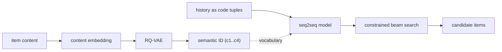
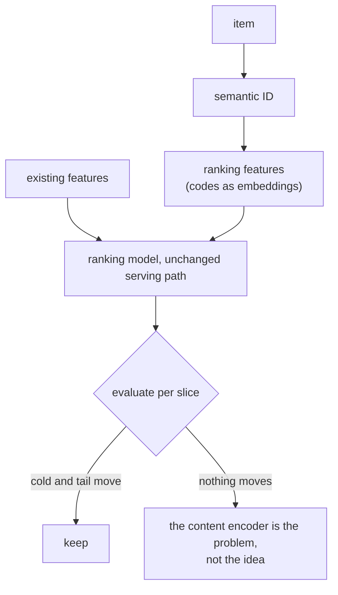
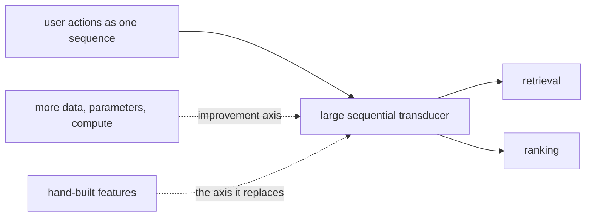
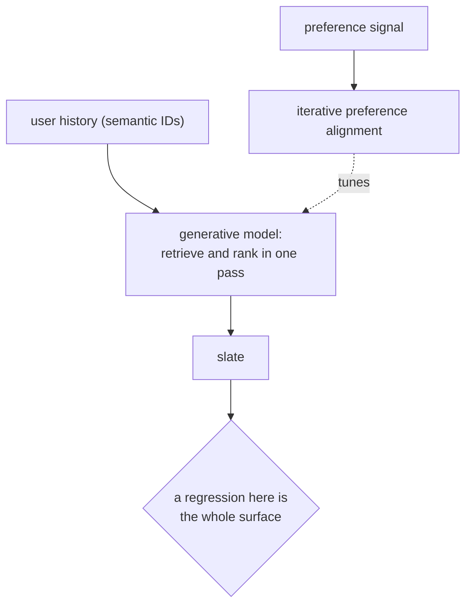
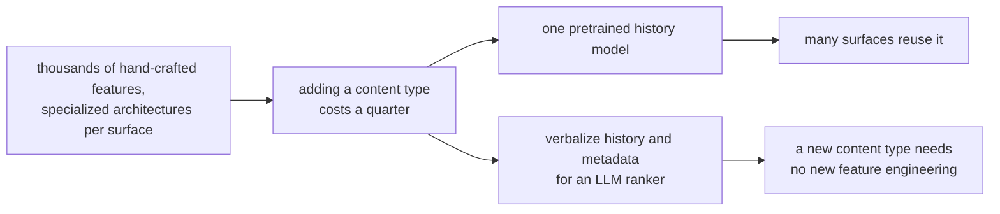
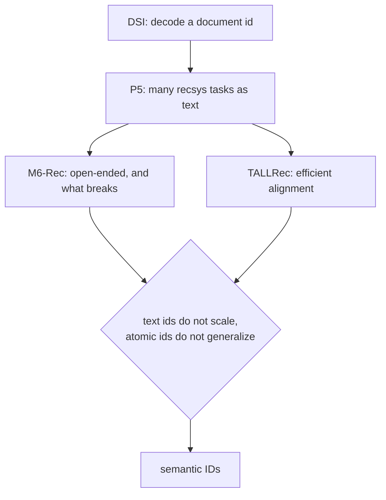

## Generative recommendation

### Google: TIGER, retrieval as decoding ([source](https://arxiv.org/abs/2305.05065))

TIGER is the reference design for generative retrieval. Each item's content embedding is quantized by an RQ-VAE into a short tuple of discrete codes, coarse to fine, and a sequence-to-sequence model is trained to take a user's history (as a sequence of those tuples) and generate the next item's tuple. Retrieval stops being a nearest-neighbour search over an index and becomes a constrained decode over a tiny vocabulary: 256 options per position rather than one logit per item. The reported gains concentrate where they should, on cold-start and long-tail items, because two items with similar content share their leading codes.

**Interview questions this design invites**
- Why does quantizing content into codes help a cold item?
- What is the output vocabulary, and why does that make decoding a 50M catalogue possible?
- What happens when two items quantize to the same tuple?
- What has to be true of the decode for it to only return real items?
- Where does this sit relative to an existing ranker?

**Tricks and gotchas**
- Collisions are expected; the standard fix is an extra disambiguating position, which lengthens every decode.
- The decode has to be constrained to valid prefixes or the model invents items.
- Beams collapse onto the same item, so deduplicate before counting candidates.
- The quantizer is a second model with its own training data and refresh cadence.

**Common mistakes and how to fix them**
- Reporting sampled-candidate metrics; fix by evaluating against the full catalogue, which is where generative retrieval looks least flattering.
- Assuming the ANN index disappears; fix by naming what replaces it, a valid-prefix structure and the item table.
- Ignoring diversity; fix by measuring intra-list diversity, since beam search is mode-seeking.
- Treating cold-start gains as a global lift; fix by reporting head, torso, tail and new-item slices separately.

### Google: semantic IDs as ranking features ([source](https://arxiv.org/abs/2306.08121))

The cheaper half of the same idea. Instead of replacing retrieval, feed the semantic IDs into an existing ranking model as features, so the ranker inherits the content-similarity prior without any change to the serving path. This is the version most teams should try first: the gains land on the same cold and tail slices, the risk is a feature rollback rather than an architecture migration, and it establishes whether your content encoder is good enough before you bet a retrieval system on it.

**Interview questions this design invites**
- Why would a ranker benefit from an ID that encodes content similarity?
- How would you tell whether the quantizer or the ranker is the limiting factor?
- What does this cost at serving time?
- Why is this a better first project than generative retrieval?
- Which slices do you expect to move, and which do you expect not to?

**Tricks and gotchas**
- The codes are categorical features, so they get embedding tables like any other categorical.
- A null result here usually indicts the content encoder rather than the approach.
- It composes with the existing ID embeddings rather than replacing them.
- Serving cost is essentially unchanged, which is the whole point of doing it first.

**Common mistakes and how to fix them**
- Judging on an aggregate metric; fix by reporting the slices where the prior can help.
- Dropping the atomic ID embedding; fix by keeping both, since head items still benefit from memorization.
- Refreshing codes without versioning; fix by treating a code change as a feature schema change.
- Concluding "semantic IDs do not work" from one encoder; fix by testing the encoder separately.

### Meta: HSTU, recommendation as sequential transduction ([source](https://arxiv.org/abs/2402.17152))

HSTU makes the largest claim in this area: reformulate ranking and retrieval as sequential transduction over the user's action history, scale the model like a language model, and let quality track a scaling law instead of feature engineering. The paper is the reference point for the "generative foundation model replaces the cascade" position, at trillion-parameter scale. In an interview it is most useful as the thing you compare against: it names the cost of the alternative (an organizational commitment to data, parameters and compute) rather than pretending the choice is free.

**Interview questions this design invites**
- What exactly is being scaled, and what evidence is there that it scales?
- What does a cascade give you that one model does not?
- What is the serving cost, and how would you bound it?
- Which guarantees (calibration, filters, freshness) still have to be provided separately?
- Would you pilot this, and on what?

**Tricks and gotchas**
- The improvement axis changes from features to compute, which is a budgeting and staffing change more than a modeling one.
- Calibration for anything feeding an auction is still owed, and a generative model does not provide it for free.
- Collapsing stages removes the coordination cost and also removes the places you used to intervene.
- Scale results reported at one company's scale do not transfer to a catalogue two orders of magnitude smaller.

**Common mistakes and how to fix them**
- Quoting the scaling claim without the scale; fix by stating the data and compute the result assumed.
- Assuming the cascade disappears; fix by naming what still has to happen after generation.
- Ignoring calibration; fix by keeping a calibration stage or measuring it explicitly.
- Proposing it as a first project; fix by proposing the ranking-feature version first.

### Kuaishou: OneRec, one model for retrieve and rank ([source](https://arxiv.org/abs/2502.18965))

OneRec unifies retrieval and ranking in a single generative model with an iterative preference alignment step, deployed at production scale. It is the clearest counter-example to "generative recommendation is a research idea", and it is also the clearest statement of the operational risk: when one model produces the whole slate, a regression is not a stage regression, it is the surface. The preference alignment step is worth noting on its own, because it is the recommendation analogue of post-training an LLM: the generative model produces candidates, a preference signal orders them, and the model is tuned toward that signal rather than toward next-item likelihood alone.

**Interview questions this design invites**
- What do you lose by removing the boundary between retrieval and ranking?
- Why add a preference alignment step rather than training on next-item likelihood alone?
- How would you roll this out without risking the whole surface?
- Where do business rules and filters live now?
- What is your rollback story?

**Tricks and gotchas**
- Preference alignment is where non-engagement objectives (diversity, satisfaction, policy) can enter, which likelihood training cannot express.
- A single model needs a shadow path and a fast rollback, because the blast radius is the entire surface.
- Removing stage boundaries removes the natural place to insert business logic; it has to be reintroduced deliberately.
- Serving one large model per request is a different capacity plan from a funnel that discards most candidates early.

**Common mistakes and how to fix them**
- Migrating a whole surface at once; fix with shadow mode, then a traffic slice, with the cascade still live.
- Assuming likelihood training encodes product goals; fix with an explicit preference or alignment stage.
- Losing the filter layer; fix by keeping hard filters after generation and measuring how often they empty the slate.
- Comparing against an untuned cascade; fix by comparing against your actual production baseline.

### Netflix: a foundation model, then an LLM-native ranker ([source](https://netflixtechblog.com/foundation-model-for-personalized-recommendation-1a0bd8e02d39))

Netflix published both halves of this transition. The [foundation model post](https://netflixtechblog.com/foundation-model-for-personalized-recommendation-1a0bd8e02d39) describes one large pretrained model over user interaction history, amortized across many personalization surfaces rather than trained per surface. [GenRec](https://netflixtechblog.com/genrec-towards-llm-native-recommendation-at-netflix-f20be6f643e3) goes further and verbalizes the problem: user histories, context and item metadata as text for an LLM-backed ranker. The stated motivation is the one worth carrying into an interview, because it is not accuracy: their production stack runs on thousands of hand-crafted features and specialized architectures, so onboarding a new content type or surface costs feature engineering, architecture work and experimentation. **Engineering velocity is the argument.**

**Interview questions this design invites**
- What is the argument for a foundation model here, if not offline accuracy?
- What does verbalizing a user history cost per request?
- How do you keep an LLM ranker from recommending items that do not exist?
- Which surfaces would you move first, and why those?
- How do you evaluate a change to a shared foundation model when many surfaces consume it?

**Tricks and gotchas**
- The velocity argument is measurable: count the engineering weeks to onboard a surface before and after.
- A shared model means a shared blast radius; per-surface evaluation gates become mandatory.
- Verbalization makes prompt formatting part of the model, with all the drift that implies.
- LLM rankers inherit position and verbosity biases, which are ranking biases here, not text quality issues.

**Common mistakes and how to fix them**
- Selling a foundation model on offline metrics; fix by making the velocity and consolidation case explicitly.
- Running an LLM ranker on all traffic; fix by scoping it to the surfaces whose features do not exist yet.
- Ignoring item hallucination; fix by constraining outputs to the candidate set and counting violations.
- Assuming one evaluation covers every consuming surface; fix with per-surface gates before the shared model ships.

### The ancestor and the text-to-text line: DSI, P5, M6-Rec and TALLRec ([source](https://arxiv.org/abs/2202.06991))

[DSI](https://arxiv.org/abs/2202.06991) is where the idea starts, in document retrieval rather than recommendation: train a transformer to map a query directly to a document identifier by decoding it, with the index living in the model's parameters. [P5](https://arxiv.org/abs/2203.13366) carried it into recommendation by casting many tasks (rating, sequential, explanation) as one text-to-text problem, [M6-Rec](https://arxiv.org/abs/2205.08084) is an early and unusually honest account of what open-ended generative recommendation breaks, and [TALLRec](https://arxiv.org/abs/2305.00447) showed how little data it takes to align a language model to a recommendation task. Read as a line, they explain why the field arrived at semantic IDs: pure text identifiers do not scale to a catalogue, and pure atomic IDs do not generalize.

**Interview questions this design invites**
- What does it mean for the index to live in the model's parameters, and what breaks when the corpus changes?
- Why did the field move from text identifiers to quantized codes?
- What does casting recommendation as text buy, and what does it cost?
- How much data does it take to align a language model to a recommendation task?
- Where would you still use the text formulation today?

**Tricks and gotchas**
- With the index in the parameters, adding items is a retrain, which is the constraint semantic IDs were designed around.
- Text identifiers are long, so decode cost grows and the model can produce plausible non-existent names.
- The text formulation is strongest where language is genuinely part of the task: explanations, conversational recommendation, new content types.
- Small alignment datasets go surprisingly far, which is why the text path is cheap to pilot even when it is expensive to serve.

**Common mistakes and how to fix them**
- Adopting the text formulation for a large stable catalogue; fix by using semantic IDs, which is what the line converged on.
- Assuming corpus updates are cheap; fix by measuring what a new item costs in each formulation.
- Quoting sampled-candidate results from this literature as production-comparable; fix by re-evaluating full-catalogue.
- Ignoring the explanation use case; fix by scoping the text path to where language is the product, not the plumbing.
