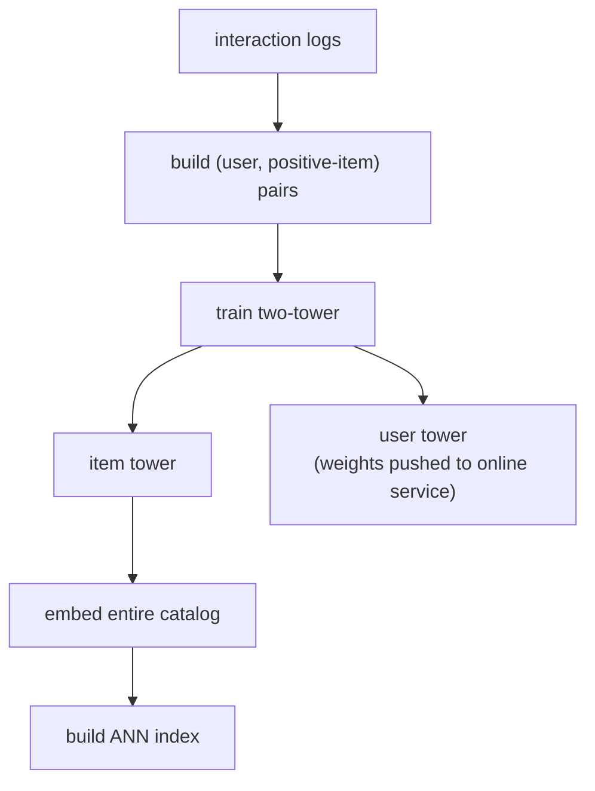
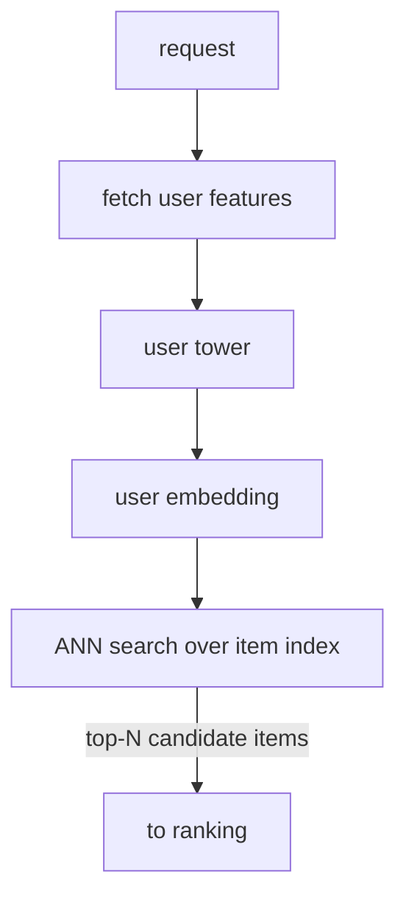
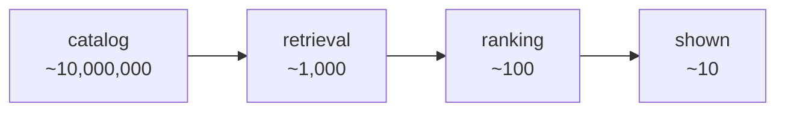

# 01 - Candidate retrieval (two-tower)

> **Interviewer:** "We have a catalog of tens of millions of items and we need to
> recommend a handful to each user in real time. We obviously cannot score the
> whole catalog per request. Design the retrieval stage: how do we get from
> millions of items to a few hundred good candidates in a few milliseconds?"

This is the foundation question for large-scale recommendation, and the most
common place candidates stall. The trap is to reach straight for a big ranking
model and forget that ranking only sees what retrieval hands it. The signal is in
understanding why retrieval is a separate, cheaper stage, and how the two-tower
architecture makes "compare a user against millions of items" tractable.

## 1. Clarify and scope

- **Catalog size and shape?** Say 10M items, with a long tail and a steady stream
  of new items every day. The tail and the freshness both matter.
- **Users and traffic?** Tens of millions of users, peak maybe a few thousand
  recommendation requests per second.
- **Latency budget?** Retrieval is one stage of a larger funnel. It gets a slice
  of a tens-of-milliseconds total budget, so think single-digit to low-tens of
  milliseconds for the retrieval call.
- **Objective?** What counts as a good candidate. Usually "an item this user would
  engage with," with engagement defined by the downstream objective (clicks,
  watches, purchases). Retrieval optimizes recall of those items, not final rank.
- **How many candidates out?** A few hundred to a couple thousand. Enough that the
  ranker has good material, few enough that the ranker can afford to score them.

## 2. Requirements

**Functional**
- Given a user, return a few hundred relevant candidate items from the full
  catalog
- Incorporate new items quickly (a freshly added item should be retrievable)
- Support multiple retrieval sources if needed (personalized, popular, recent)

**Non-functional**
- p99 retrieval latency in the single-digit to low-tens of milliseconds
- Recall@k high enough that the downstream ranker is not starved of good items
- Throughput of a few thousand QPS with headroom
- Item embedding freshness: new and updated items reflected within minutes to
  hours

The non-functional requirement that quietly dominates here is **recall under a
hard latency budget**. You are not trying to rank perfectly; you are trying to
not lose the good items before ranking ever sees them, while staying fast enough
to be one cheap stage of a funnel. Flag that framing early.

## 3. High-level data flow

Two paths. Keep them separate. The whole trick of the two-tower is that the item
side is precomputed offline so the online path is just one query embedding plus a
nearest-neighbor lookup.

### Offline (training and indexing) path

The item tower runs over the whole catalog as a batch job and writes every item
embedding into an approximate-nearest-neighbor (ANN) index. The user tower's
weights ship to the online service. New and changed items get re-embedded and
upserted into the index on a schedule; that cadence is your item freshness.

### Online (serving) path

Per request you embed only the user (one forward pass through the small user
tower) and do one ANN lookup. You never run the item tower online. That asymmetry
is the entire reason this architecture serves at scale.

## 4. Deep dives

### Why two towers, and what each one is

A **two-tower** model has two separate neural networks:

- The **user tower** maps user features (id, history summary, context like
  device or time of day) to a single user embedding vector.
- The **item tower** maps item features (id, category, text, attributes) to a
  single item embedding vector in the same space.

Relevance is the **dot product (or cosine similarity)** of the two embeddings.
That is the key structural fact: because the score is just a dot product, you can
precompute every item vector offline and reduce online scoring to nearest-
neighbor search. A model that mixed user and item features together early (a
cross network, like a ranker does) cannot do this, because the score would depend
on the user, so you could not precompute it. The towers are kept separate **on
purpose**, and they usually do **not** share weights, because users and items
have different features. This is the detail casual diagrams get wrong.

If the interviewer wants to see the structure, this is the moment to open a real
two-tower graph and point at where the two stacks stay separate until the final
dot product, rather than drawing a box labeled "embedding model." See the link at
the end.

### Training with in-batch negatives

You have positives (user engaged with item) but no natural negatives. Sampling
explicit negatives from 10M items is expensive and most random items are trivial
negatives. The standard trick is **in-batch negatives**:

- Take a batch of B positive (user, item) pairs.
- For each user, treat the other B-1 items in the batch as negatives.
- Train with a softmax / contrastive loss that pushes each user's embedding
  toward its own item and away from the others.

This is cheap (the negatives come free with the batch) and effective. Two refinements
worth naming:

- **Sampled-softmax / logQ correction.** Popular items appear as in-batch
  negatives more often, which biases the model against them. Correct the logits
  by the sampling probability so popularity does not get unfairly penalized.
- **Hard negatives.** In-batch negatives are mostly easy. Mixing in harder
  negatives (items similar to the positive but not engaged with) sharpens the
  boundary. Add them carefully; too many hard negatives destabilizes training.

### Serving with approximate nearest neighbor

Exact nearest neighbor over 10M vectors per request is too slow. Use an **ANN**
index (HNSW or IVF-PQ):

- **HNSW:** excellent recall and latency, higher memory.
- **IVF-PQ:** product-quantizes the vectors, much smaller memory footprint, some
  recall loss. At tens of millions of items and tight memory this is often the
  pragmatic choice.

Shard the index across machines and replicate for QPS. The tunable knob is
recall versus latency (how many index cells or graph neighbors to probe); state
that it exists and that you would tune it against the downstream ranker's hunger
for candidates, not in isolation.

### The funnel and embedding freshness

Be explicit about the funnel this stage anchors (illustrative orders of
magnitude):

Retrieval's job is the first arrow: cut four orders of magnitude almost for free.

**Freshness has two clocks here**, and confusing them is a common mistake:

- **Item embedding freshness.** A new item is invisible until the item tower
  embeds it and the index is updated. If items go stale (a new product, a
  breaking news article), you re-embed and upsert frequently, or run a separate
  fresh-item retrieval source that does not wait for the next full index build.
- **User embedding freshness.** The user tower runs online, so the user side can
  reflect right-now context immediately if you feed it fresh features. Reacting
  to the user's very latest actions is more the domain of
  [sequential recommendation](03-sequential-recommendation.md); the two-tower
  user side typically carries a summarized history.

### Multiple retrieval sources

In practice retrieval is rarely one model. A common pattern is to blend several
sources: the personalized two-tower, a popularity source, a recency/fresh-item
source, and sometimes a graph or co-occurrence source. Each returns candidates;
you union them before ranking. Mentioning this shows you know retrieval is a
recall-maximizing ensemble, not a single model.

## 5. Bottlenecks and scaling

| Bottleneck | First sign | Fix | Tradeoff |
|---|---|---|---|
| ANN search latency | p99 retrieval creeps up | Tune probe depth, shard, IVF-PQ | Recall vs latency/memory |
| Index memory at catalog scale | Index does not fit | Product quantization, lower dim | Recall loss |
| Stale item embeddings | New items never surface | Frequent re-embed + upsert, fresh source | Write-path complexity |
| Popularity bias from negatives | Head items over/under-served | logQ / sampled-softmax correction | Tuning effort |
| User feature fetch | Latency before tower runs | Cache user features per session | Slight staleness |
| Recall starving the ranker | Ranker quality plateaus | More candidates, more sources | More ranking cost downstream |

## 6. Failure modes, safety, eval

- **Cold-start items:** a brand-new item has no learned id embedding. Lean on
  content features in the item tower (category, text, attributes) so it still
  lands somewhere sensible in the space, and use a fresh-item retrieval source
  until it accumulates interactions.
- **Cold-start users:** a new user has thin features. Fall back to popularity and
  context (location, device, time) until the personalized tower has signal.
- **Feedback loop:** you only log engagement on items you retrieved and showed,
  so the model reinforces its own past choices. Some exploration (mixing in
  candidates the model is unsure about) keeps the catalog from collapsing onto
  the head.
- **Eval:** measure **recall@k** of the retrieval stage against held-out future
  engagements (did the items the user actually engaged with appear in the
  retrieved set?). Recall is the ceiling on everything downstream, so measure it
  on its own. Then confirm end to end with an online A/B test, because offline
  recall and online engagement do not always move together. Gate any change to
  the towers, the negatives, or the index behind both.

## 7. Likely follow-ups

- "Why not just use one big model to score every item?" Cost. Scoring 10M items
  per request is impossible under the latency budget; the dot-product structure
  is what makes precompute-plus-ANN possible.
- "Do the towers share weights?" Usually no. Users and items have different
  features and live in different distributions; the shared part is the embedding
  space they map into, enforced by the dot-product loss.
- "How do you pick the embedding dimension?" It trades recall against index
  memory and search latency. Larger dims help a bit and cost storage; pick a
  modest dimension and tune.
- "An important item is missing from results." Check recall: is it in the index,
  is its embedding fresh, is ANN probe depth too shallow, or is retrieval fine
  and the ranker dropping it? Localize the funnel stage first.
- "How is this different from matrix factorization?" Two-tower is the neural
  generalization: it learns embeddings from features (so it handles cold start
  and rich context), where classic matrix factorization learns a vector per id
  and cannot embed an unseen item.

---

## Seen in production

Real systems that ship the patterns above. Each is a first-party engineering
writeup; read them for what an interview answer skips: who the system serves,
the product design, the eval bar, and the deployment shape.

- **Pinterest** [Establishing a Large Scale Learned Retrieval System](https://medium.com/pinterest-engineering/establishing-a-large-scale-learned-retrieval-system-at-pinterest-eb0eaf7b92c5): Offline-indexed item embeddings plus a request-time user tower; sampled softmax with popularity correction. *(deployment)*
- **YouTube/Google** [Sampling-Bias-Corrected Neural Modeling for Large Corpus Recommendations](https://research.google/pubs/sampling-bias-corrected-neural-modeling-for-large-corpus-item-recommendations/): In-batch negatives are biased under power-law; logQ correction restores unbiased softmax. *(product design)*
- **Uber** [Innovative Recommendation Applications Using Two Tower Embeddings](https://www.uber.com/blog/innovative-recommendation-applications-using-two-tower-embeddings/): Layer-sharing plus bag-of-words history; one global model replaces thousands of city models. *(product design)*
- **Airbnb** [Embedding-Based Retrieval for Airbnb Search](https://airbnb.tech/ai-ml/embedding-based-retrieval-for-airbnb-search/): Chose IVF over HNSW for high listing-update volume; the listing tower is offline-computable. *(deployment)*
- **Snap** [Embedding-based Retrieval with Two-Tower Models in Spotlight](https://eng.snap.com/embedding-based-retrieval): In-batch negatives for video retrieval; request and retrieval split into independently scaled services. *(deployment)*
- **Etsy** [Unified Embedding Based Personalized Retrieval in Etsy Search](https://arxiv.org/abs/2306.04833): Hard-negative sampling plus unified embeddings; HNSW with 4-bit PQ; +5.58% purchase rate. *(eval bar)*

- **Expedia Group** [Candidate generation using a two-tower approach](https://medium.com/expedia-group-tech/candidate-generation-using-a-two-tower-approach-with-expedia-group-traveler-data-ca6a0dcab83e): Two-tower query and item encoders with dot-product scoring for travel. *(product design)*
- **Pinterest** [Scaling recommendations with request-level deduplication](https://medium.com/pinterest-engineering/scaling-recommendation-systems-with-request-level-deduplication-93bd514142d9): The in-batch-negative false-negative rate fixed via user-level masking. *(eval bar)*
- **Glassdoor** [Improving two-tower candidate generation](https://medium.com/glassdoor-engineering/improving-embedding-based-candidate-generation-for-recommender-systems-with-a-two-tower-model-c222123beb7f): Two-tower user and post embeddings served via OpenSearch ANN. *(deployment)*
- **Spotify** [Introducing Voyager: Spotify's nearest-neighbor search library](https://engineering.atspotify.com/2023/10/introducing-voyager-spotifys-new-nearest-neighbor-search-library): A production HNSW ANN library, 10x faster than Annoy, for recommendations. *(deployment)*
- **Twitter** [Addressing dataset bias in model-based candidate generation](https://arxiv.org/abs/2105.09293): Two-tower candidate generation for the home timeline, fixing sampling bias. *(eval bar)*
- **Walmart** [Enhancing relevance of embedding-based retrieval at Walmart](https://arxiv.org/abs/2408.04884): Neural EBR improved with a relevance reward model and typo-aware training. *(product design)*
- **Allegro** [Two-tower recommendations at Allegro.com](https://arxiv.org/abs/2508.03702): Unified two-tower retrieval serving multiple recommendation surfaces. *(who it serves)*

More production case studies: the [Evidently AI ML system design database](https://www.evidentlyai.com/ml-system-design) (800 case studies from 150+
companies) is the broadest curated index; this section pulls the ones that map
directly onto this topic.

---
## Trace the architectures

Retrieval lives or dies on one structural fact: the user and item towers stay
separate until a final dot product, which is exactly what lets you precompute the
item side and serve with ANN. That is the thing diagrams get wrong, so open the
real graphs and trace where the two stacks meet:

- **Two-tower retrieval:**
  [open it live](https://www.neurarch.com/?import=https://raw.githubusercontent.com/neurarch-ai/awesome-llm-model-zoo/main/architectures/two-tower/model.json).
  Follow the user tower and the item tower down to the similarity layer; note
  that they never mix features before that point, which is what makes precompute
  possible.

  

- **Neural collaborative filtering (NCF), as a contrast:**
  [open it live](https://www.neurarch.com/?import=https://raw.githubusercontent.com/neurarch-ai/awesome-llm-model-zoo/main/architectures/ncf/model.json).
  NCF fuses the user and item embeddings early and pushes them through an MLP, so
  the score depends on both jointly. That is more expressive per pair but you
  cannot precompute item vectors or use ANN, which is exactly why it does not
  scale to catalog-wide retrieval the way the two-tower does.

  

A good exercise before an interview: open both, and notice where the user and item
paths join in each. The position of that join is the whole reason one is a
retrieval model and the other is not. These are validated reference graphs at
real dimensions, shape-checked end to end, not screenshots. Browse all in the
[Model Zoo](https://github.com/neurarch-ai/awesome-llm-model-zoo) or the
[gallery](https://neurarch-ai.github.io/awesome-llm-model-zoo). Built by
[Neurarch](https://www.neurarch.com).
