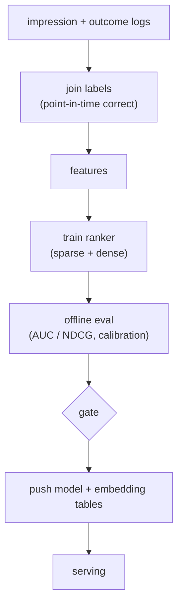
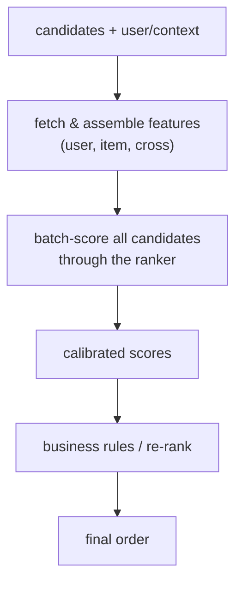

# 02 - Ranking model

> **Interviewer:** "Retrieval hands you a few hundred candidate items for a user.
> Now design the ranking model that scores them and decides the order we actually
> show. Walk me through the features, the architecture, and how you keep it fast
> enough to score hundreds of candidates per request."

This is the stage where accuracy is won. Retrieval maximizes recall cheaply;
ranking spends real compute to get the order right. The trap is to jump to "a
deep network" and skip the two things that actually move the metric: the features
(especially cross features) and the latency budget that constrains the
architecture. The signal is in feature engineering, feature interactions, and the
discipline of scoring a few hundred candidates inside a few milliseconds.

## 1. Clarify and scope

- **What does the ranker optimize?** The business objective: click-through,
  conversion, watch time, or a blend. This sets the label and the loss. Often it
  is several objectives at once, which leads to multi-task ranking.
- **How many candidates in, how many out?** Say a few hundred to ~1,000 in from
  retrieval, and a ranked list of the top tens out. You score all candidates and
  sort.
- **Latency budget?** Ranking gets a slice of the overall tens-of-milliseconds
  request. If ranking has ~20 ms and scores 500 candidates, that is well under a
  tenth of a millisecond per candidate, including feature assembly. That
  constraint shapes the model.
- **Features available?** User features, item features, context, and crucially
  user-times-item **cross features** and the user's recent behavior. What can you
  compute online within budget?
- **Training data volume?** Impressions with engagement labels, typically
  billions of rows. This is why ranking models can be large and why embedding
  tables dominate their parameter count.

## 2. Requirements

**Functional**
- Score every retrieved candidate for the objective(s)
- Produce a final ranked order, after any business rules or re-ranking
- Optionally output **calibrated** probabilities, not just an order
- Log features and outcomes for the next training cycle

**Non-functional**
- p99 ranking latency in the low tens of milliseconds for the whole candidate set
- Calibration stable enough for any downstream use (auctions, thresholds, blends)
- Training cadence fast enough to track distribution drift (often daily or faster)
- Online/offline feature parity (no [training-serving skew](../framework/answer-framework.md))

The non-functional requirement that dominates: **per-candidate cost under a hard
budget**. You are running one model hundreds of times per request. That is the
opposite of the retrieval stage (one model run, millions of items via ANN) and it
is what makes ranking architecture a latency problem as much as an accuracy one.

## 3. High-level data flow

Two paths. The offline path trains and ships the model and refreshes embedding
tables; the online path assembles features for each candidate and scores.

### Offline (training) path

Point-in-time correctness matters: when you join a label to features, use the
feature values **as they were at impression time**, not now, or you leak the
future into training and the offline metric lies.

### Online (serving) path

The candidates all share the same user and context features, so fetch those once
and broadcast them across the batch. Only item and cross features vary per
candidate. That batching is a real latency lever, not a detail.

## 4. Deep dives

### Features are where the accuracy lives

Three families, and naming all three signals experience:

- **User features:** id, demographics if available, aggregated history (counts,
  rates, category affinities), and recent behavior.
- **Item features:** id, category, attributes, content embeddings, historical
  engagement rates (with care about leakage).
- **Cross features:** user-times-item interactions, for example "how many times
  this user engaged with this item's category in the last 7 days." These cannot
  be recovered from user and item features independently, and they are often the
  single biggest accuracy lever. A model that only sees user and item features
  separately is leaving signal on the table.

Sparse categorical features (ids, categories) go through **embedding tables**;
dense numeric features feed the network directly after normalization. The
embedding tables, not the MLP, are usually where the parameters are: millions of
ids times an embedding dimension dwarfs a few dense layers.

### Wide-and-deep: memorization plus generalization

A **wide-and-deep** model combines two paths trained jointly:

- The **wide** part is a linear model over (often crossed) categorical features.
  It **memorizes** specific, frequent feature combinations ("users from this
  segment click this exact item type").
- The **deep** part embeds sparse features and runs them through an MLP. It
  **generalizes** to combinations never seen at training time.

The intuition to deliver: memorization captures the reliable specific rules,
generalization handles the long tail and unseen crosses, and you want both.

### DLRM: explicit feature interactions

A **DLRM-style** model (deep learning recommendation model) is the structure most
worth being able to draw, because the interaction step is precise:

1. Each sparse categorical feature goes through its own **embedding table**,
   producing one vector per feature.
2. Dense features go through a small MLP (the "bottom MLP") into a vector of the
   same width.
3. The model takes **explicit pairwise interactions** between all these vectors
   (a dot product between every pair), which models second-order feature crosses
   directly instead of hoping an MLP learns them.
4. The interactions plus the dense vector go into a **top MLP** that outputs the
   score.

The thing to get right (and the thing diagrams routinely wire wrong) is *where*
the interaction happens: after the embeddings, before the top MLP. That explicit
pairwise dot-product layer is the whole idea. Open the real graph and point at it
rather than describing a generic "deep model." See the link at the end.

### Multi-task ranking

You usually care about more than one outcome (a click and a like and a long
dwell). **Multi-task** ranking shares a lower body and branches into per-task
heads, each predicting one outcome. Benefits: shared representation, fewer models
to serve, and you can combine the per-task scores into a single ranking score
with tunable weights (the business decides how much a "like" is worth versus a
"click"). Architectures like a shared-bottom network or mixture-of-experts gating
(one expert set, per-task gates) are the standard answers; mention that
negatively-correlated tasks can hurt each other and gating helps.

### Calibration

An ordering is enough if all you do is sort. But the moment a score feeds an
auction, a threshold, or a blend across tasks, you need the predicted probability
to mean what it says (a 0.1 prediction should be right about 10 percent of the
time). Training shifts and negative sampling both distort calibration, so apply a
post-hoc **calibration** step (Platt scaling, isotonic regression) and monitor
calibration as a first-class metric, not an afterthought.

### The latency budget, made concrete

This is the constraint that picks the architecture. Illustrative arithmetic:
500 candidates, a ~20 ms p99 ranking budget, so well under 0.1 ms per candidate
end to end. That rules out anything heavy per item and pushes you toward:

- Batched scoring (all candidates in one forward pass).
- Embedding lookups that are cache- and memory-friendly.
- Precomputed user and item features so online work is assembly, not computation.
- A model big enough for accuracy but shaped so the per-candidate cost stays flat
  as you add candidates.

State the budget out loud and design backwards from it. That is the senior move.

## 5. Bottlenecks and scaling

| Bottleneck | First sign | Fix | Tradeoff |
|---|---|---|---|
| Per-candidate scoring cost | Ranking p99 over budget | Batch scoring, shrink top MLP | Accuracy vs latency |
| Embedding table memory | Tables do not fit | Hashing, lower dim, prune rare ids | Collisions, slight quality loss |
| Feature fetch fan-out | Latency before model runs | Fetch user/context once, batch item lookups | Cache staleness |
| Embedding lookup bandwidth | Decode-like memory wall | Quantize embeddings, co-locate hot ids | Quality hit to measure |
| Calibration drift | Scores misused downstream | Periodic recalibration, monitor | Extra pipeline step |
| Training falling behind drift | Online metric decays | Retrain more often, incremental updates | Compute cost |

## 6. Failure modes, safety, eval

- **Training-serving skew:** the most common silent failure. A feature computed
  one way offline (in the training pipeline) and another way online (in the
  serving code) means the model sees a distribution it never trained on. Compute
  features once and share, or log the exact serving features and compare against
  training. Call this out explicitly.
- **Label leakage:** a feature that secretly encodes the outcome (for example an
  item engagement rate that includes the current impression) inflates offline
  metrics and collapses online. Point-in-time joins prevent it.
- **Position bias:** items shown higher get clicked more regardless of relevance,
  so naive labels teach the model to predict position, not quality. Correct with
  position as a feature at train time (dropped or fixed at serve time) or with
  inverse-propensity weighting.
- **Cold start:** new items and users have weak id embeddings. Lean on content
  and contextual features so the ranker still has signal.
- **Eval:** offline use **AUC** (ranking quality of the binary objective) and
  **NDCG** (quality of the ordered list, position-weighted), plus **calibration**
  error. But offline gains routinely fail to survive online, so the real gate is
  an **A/B test** on the business metric. Wire the offline metrics as a fast
  pre-gate and the A/B test as the ship decision.

## 7. Likely follow-ups

- "Why a separate ranking stage at all?" Because you cannot afford the rich
  per-item model over the whole catalog. Retrieval narrows cheaply; ranking
  spends where it changes the answer.
- "Where exactly do feature interactions happen in DLRM?" After the embedding
  tables and bottom MLP, as explicit pairwise dot products, before the top MLP.
- "Wide-and-deep versus DLRM?" Wide-and-deep splits memorization (linear, crossed
  features) from generalization (deep MLP); DLRM makes the second-order
  interactions explicit and structured. Both embed sparse features; they differ
  in how interactions are modeled.
- "Your offline AUC went up but online engagement did not. Why?" Skew,
  calibration, position bias, or an offline metric that does not match the online
  objective. Suspect the seam between training and serving first.
- "How do you serve hundreds of candidates in milliseconds?" Batch the forward
  pass, fetch shared features once, keep embedding lookups cheap, and design the
  per-candidate cost to stay flat.

---

## Seen in production

Real systems that ship the patterns above. Each is a first-party engineering
writeup; read them for what an interview answer skips: who the system serves,
the product design, the eval bar, and the deployment shape.

- **Google** [Wide & Deep Learning for Recommender Systems](https://arxiv.org/abs/1606.07792): Joint wide linear (memorization) plus deep net (generalization) for Google Play ranking. *(product design)*
- **Meta** [Deep Learning Recommendation Model (DLRM)](https://arxiv.org/abs/1906.00091): Dense MLP plus sparse embedding tables with explicit feature interactions, sharded for scale. *(product design)*
- **Instacart** [One Model to Serve Them All: a single deep pCTR model for multiple surfaces](https://company.instacart.com/how-its-made/one-model-to-serve-them-all-how-instacart-deployed-a-single-deep-learning-pctr-model-for-multiple-surfaces-with-improved-operations-and-performance-along-the-way): Consolidating per-surface XGBoost into one wide-and-deep pCTR model; calibration and ops wins. *(deployment)*
- **Pinterest** [Multi-task Learning and Calibration for Utility-based Home Feed Ranking](https://medium.com/pinterest-engineering/multi-task-learning-and-calibration-for-utility-based-home-feed-ranking-64087a7bcbad): A multi-head DNN per action type, with calibrated probabilities combined into a utility score. *(eval bar)*
- **Pinterest** [Multi-task Learning for Related Products Recommendations](https://medium.com/pinterest-engineering/multi-task-learning-for-related-products-recommendations-at-pinterest-62684f631c12): Four engagement heads beat a binary classifier; tune utility weights without retraining. *(product design)*

- **LinkedIn** [Homepage feed multi-task learning using TensorFlow](https://www.linkedin.com/blog/engineering/feed/homepage-feed-multi-task-learning-using-tensorflow): Jointly trains feed objectives (click, comment, reshare) in one ranker. *(product design)*
- **Airbnb** [Applying Deep Learning to Airbnb Search](https://medium.com/airbnb-engineering/applying-deep-learning-to-airbnb-search-7ebd7230891f): The journey from GBDT to neural-network ranking for bookings. *(product design)*
- **DoorDash** [Deep learning for ads conversion in last-mile delivery](https://arxiv.org/abs/2502.10514): Homepage ads ranking moving from tree models to multi-task DNNs. *(product design)*
- **Spotify** [Modality-aware multi-task learning for ad targeting](https://research.atspotify.com/2025/8/modality-aware-multi-task-learning-to-optimize-ad-targeting-at-scale): Multi-task MoE ad ranking with DCN-v2 feature interactions, calibrated. *(product design)*
- **Pinterest** [Improving recommended pins with lightweight ranking](https://medium.com/pinterest-engineering/improving-the-quality-of-recommended-pins-with-lightweight-ranking-8ff5477b20e3): An XGBoost lightweight ranker within a latency budget early in the funnel. *(deployment)*
- **Wayfair** [Time Informed Calibration](https://www.aboutwayfair.com/careers/tech-blog/time-informed-calibration): Calibrates raw ranking scores into time-aware purchase probabilities. *(eval bar)*
- **Walmart** [Improving Walmart Search to help customers save time](https://medium.com/walmartglobaltech/improving-walmart-search-to-help-our-customers-save-time-e9fcd1f03e94): A re-ranker balancing relevance and engagement, lifting relevance 4.5%. *(eval bar)*

More production case studies: the [Evidently AI ML system design database](https://www.evidentlyai.com/ml-system-design) (800 case studies from 150+
companies) is the broadest curated index; this section pulls the ones that map
directly onto this topic.

---
## Trace the architectures

Ranking is where the embedding-table-into-interaction-layer wiring matters, and
it is exactly what static diagrams get wrong (interactions drawn into the wrong
layer, dense and sparse paths merged at the wrong point). Open the real graphs
and trace the path from sparse features through the interaction step to the score:

- **DLRM (explicit feature interactions):**
  [open it live](https://www.neurarch.com/?import=https://raw.githubusercontent.com/neurarch-ai/awesome-llm-model-zoo/main/architectures/dlrm/model.json).
  Find the embedding tables, follow them into the pairwise-interaction layer, and
  confirm it sits after the embeddings and before the top MLP. That placement is
  the whole model.

  

- **Wide-and-deep (memorization plus generalization):**
  [open it live](https://www.neurarch.com/?import=https://raw.githubusercontent.com/neurarch-ai/awesome-llm-model-zoo/main/architectures/wide-and-deep/model.json).
  Trace the two paths: the wide linear branch over crossed categorical features
  and the deep embedding-plus-MLP branch, and see where they join before the
  output.

  

A good exercise before an interview: open DLRM and count where the parameters
actually live (the embedding tables, not the MLPs), then change the embedding
dimension and watch the parameter count move. These are validated reference
graphs at real dimensions, shape-checked end to end, not screenshots. Browse all
in the [Model Zoo](https://github.com/neurarch-ai/awesome-llm-model-zoo) or the
[gallery](https://neurarch-ai.github.io/awesome-llm-model-zoo). Built by
[Neurarch](https://www.neurarch.com).
