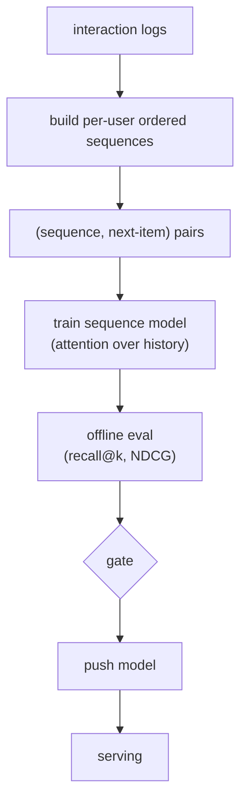
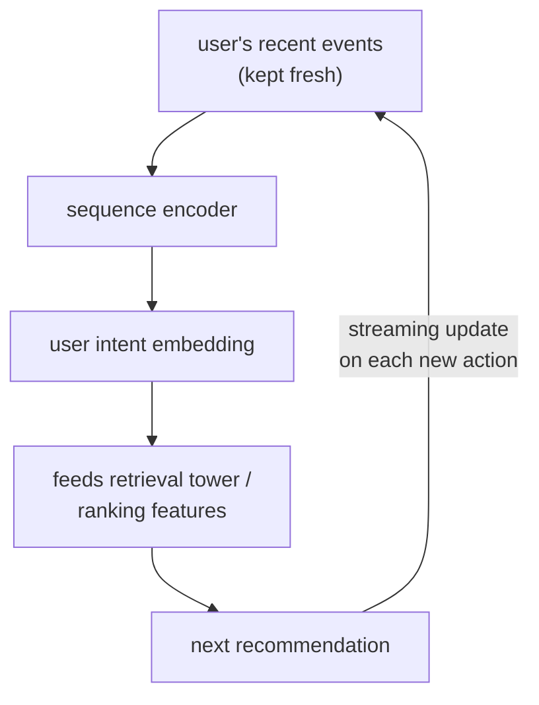
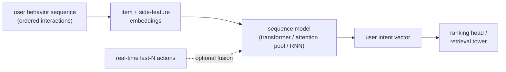

# 03 - Sequential and personalized recommendation

> **Interviewer:** "Our recommendations ignore what the user just did. Someone
> watches three cooking videos in a row and we still show them the same generic
> feed. Design a system that models a user's behavior sequence so the next
> recommendation reflects their recent and evolving intent, in real time."

This is the question that turns a static recommender into a responsive one. The
trap is to treat the user as a bag of aggregated features (lifetime category
counts) and miss that **order and recency carry intent**. The signal is in
modeling the behavior sequence itself, usually with attention, and in the systems
work of getting the latest action into the model fast enough to matter.

## 1. Clarify and scope

- **What is the sequence?** The user's ordered recent interactions: items
  viewed, clicked, watched, purchased, with timestamps and action types. How long
  a window, tens to a few hundred recent events?
- **Where does this model sit?** Usually it powers personalization inside the
  [ranking](02-ranking-model.md) stage (a user-sequence representation as a
  feature) and/or inside [retrieval](01-candidate-retrieval.md) (a sequence-aware
  user tower). Clarify which; it changes the latency budget.
- **How fresh must reactions be?** Reacting within the same session (seconds to
  minutes) is the whole point. This is the demanding requirement.
- **Objective?** Next-item engagement, framed either as predicting the next item
  or as producing a user representation that feeds the funnel.
- **Cold start?** New users have short or empty sequences. The system must degrade
  gracefully, not fail.

## 2. Requirements

**Functional**
- Encode the user's recent behavior sequence into a representation
- Use it to personalize retrieval and/or ranking toward current intent
- Update the sequence with the user's latest actions in near real time
- Handle short, empty, and very long sequences sensibly

**Non-functional**
- Same tight per-request budget as the stage it feeds (single-digit to low-tens
  of milliseconds for the sequence encode)
- User-state freshness within a session (seconds, not next-day)
- Scale to tens of millions of users with constantly changing sequences

The non-functional requirement that dominates: **real-time user-state freshness
under the funnel's latency budget**. Unlike the item side (which can be
precomputed offline), the user's sequence is changing during the session, so the
hard part is updating and encoding it fast. Flag that the value of this whole
model is freshness; a stale sequence model is barely better than aggregates.

## 3. High-level data flow

Two paths, and the interesting twist is that the user-state path is partly online
because the sequence changes mid-session.

### Offline (training) path

Training pairs are causal: given the sequence up to time t, predict the
interaction at t+1. Respect time order strictly; shuffling or peeking past t
leaks the future.

### Online (serving) path

Each new action the user takes is appended to their recent-event list (a fast
store, often updated by a streaming pipeline), so the next request encodes an
up-to-date sequence. That streaming update loop is what makes the system feel
responsive.

## 4. Deep dives

### Why sequence, not aggregates

Aggregated features ("watched 40 cooking videos lifetime") lose two things that
carry intent: **order** and **recency**. A user who just switched from cooking to
travel videos looks the same as a steady cooking fan under lifetime counts. A
sequence model sees the recent shift. The whole premise is that the last few
actions predict the next one better than a lifetime average does.

### The behavior sequence transformer

The standard modern approach applies **self-attention over the user's recent
interactions**, the same mechanism as a language model but over a sequence of
item interactions instead of tokens:

- Each interaction is represented by its item embedding plus side features
  (action type, category) and a **position or time signal** so the model knows
  order and recency.
- **Self-attention** lets the model weigh which past interactions matter for the
  current prediction. Attending over the sequence captures that the three recent
  cooking videos matter more right now than a purchase from six months ago.
- The output is a single user-intent representation (often a pooled or last-
  position vector) that feeds the ranker as a feature or the retrieval user
  tower.

The detail worth naming: **how order and time enter the model**. The base
mechanism is a positional encoding over the sequence (1st, 2nd, 3rd action), the
same idea as a language model. The refinement worth knowing is that pure position
ignores that two actions a second apart differ from two a month apart, so
stronger variants encode the actual **time gaps** between events, not just their
order, which lets the model weight recency properly. Open the real graph and look
at where the positional signal enters the attention block. See the link at the
end.

### Session-based recommendation

When you have little or no long-term user identity (logged-out users, privacy
constraints), you model the **current session** only: the sequence of actions
since the session began. The same attention machinery applies, just over a short,
fresh sequence with no persistent user id. This is also the natural fallback for
cold-start users, so it is worth presenting session-based modeling and cold start
together.

### Cold start

A new user has a short or empty sequence. Degrade in layers:

- **Empty sequence:** fall back to popularity and context (location, device, time
  of day, entry point).
- **Short sequence:** the session-based / sequence model already works on a
  handful of events; even two or three actions give intent signal.
- **Content over ids:** rely on item content features rather than learned id
  embeddings so the cold user still maps somewhere sensible.

The point to make: cold start is not a special model, it is graceful degradation
of the same one as the sequence fills in.

### Real-time feature updates

This is the systems half of the answer and where many candidates go thin. To
react within a session:

- A **streaming pipeline** ingests each user action and appends it to a fast
  online store of recent events (a low-latency key-value store keyed by user).
- The serving path reads the up-to-date sequence and encodes it per request, or
  maintains an incrementally updated user state.
- You must keep the **online and offline sequence construction identical**, or
  you reintroduce [training-serving skew](../framework/answer-framework.md): the
  model trained on sequences built by the batch pipeline but serves on sequences
  built by the streaming pipeline, and if they differ (dedup rules, action
  filtering, ordering of simultaneous events) the model sees a distribution it
  never trained on.

Encoding a transformer over the sequence per request is not free, so cap the
sequence length (recent N events), and consider caching the encoded state and
only updating it as new actions arrive.

## 5. Bottlenecks and scaling

| Bottleneck | First sign | Fix | Tradeoff |
|---|---|---|---|
| Sequence encode latency | Per-request budget blown | Cap sequence length, cache encoded state | Less history considered |
| Long sequences (heavy users) | Tail latency on power users | Truncate to recent N, summarize older history | Lose long-range signal |
| Real-time update lag | Reactions feel stale | Streaming ingest into fast online store | Pipeline complexity |
| Online/offline sequence mismatch | Online metric below offline | Shared sequence-building code | Engineering discipline |
| Item embedding churn | Sequence items go stale | Refresh item embeddings, share with retrieval | Coordination across stages |
| Cold-start coverage | New users get generic feed | Session model + content + popularity fallback | Tuning the fallback ladder |

## 6. Failure modes, safety, eval

- **Training-serving skew in sequence construction:** the headline risk here.
  Sequences built differently online and offline silently degrade the model.
  Share the construction logic.
- **Recency overfit / filter bubble:** weighting recent actions too hard can trap
  the user in a narrow loop (three cooking videos, now only cooking forever).
  Some diversity or exploration in what you show keeps it healthy and keeps the
  feedback loop from collapsing.
- **Cold start:** covered above; the failure mode is showing a new user nothing
  useful. The fallback ladder must always return something.
- **Privacy and retention:** behavior sequences are sensitive. Respect retention
  windows and consent; session-only modeling is sometimes the required mode, not
  just a fallback.
- **Eval:** offline, predict the held-out next interaction and measure
  **recall@k** and **NDCG** on it (did the actual next item rank highly?). Be
  careful to evaluate causally (only past events visible). Because recency effects
  and feedback loops do not show up offline, confirm with an online **A/B test**
  on session-level engagement, and watch a diversity guardrail so you are not just
  tightening a bubble.

## 7. Likely follow-ups

- "Why attention instead of an RNN over the sequence?" Attention weighs arbitrary
  past interactions directly and parallelizes well; it captures "which past
  actions matter now" without the sequential bottleneck of a recurrent model.
- "How do you handle a user with thousands of events?" Truncate to recent N,
  optionally summarize older history into a compact long-term feature, and let
  attention focus on the recent window.
- "How fast does a new action change recommendations?" As fast as your streaming
  pipeline writes the event and the next request reads it, ideally seconds. That
  freshness is the product value.
- "Where does this model plug in, retrieval or ranking?" Both are valid: a
  sequence-aware user tower for retrieval, or a user-intent feature for ranking.
  Be explicit, because the latency budget differs.
- "Isn't this just a language model on items?" Structurally similar (attention
  over a sequence), but the tokens are interactions with side features and real
  time gaps, the objective is next-item engagement, and the freshness and
  cold-start systems work is the hard part.

---

## Seen in production

Real systems that ship the patterns above. Each is a first-party engineering
writeup; read them for what an interview answer skips: who the system serves,
the product design, the eval bar, and the deployment shape.

### The shared pipeline

Every one of these systems turns an ordered list of user interactions into a
compact intent representation and hangs it off the ranking or retrieval stage.
The interactions become embeddings, a sequence model (self-attention, an
activation-unit attention pool, or a recurrent net) weighs which past actions
matter now, and the pooled output either feeds a ranking head as a feature or a
retrieval tower as a user vector. The systems that feel most responsive add a
real-time fusion of the last N actions on top of a slower-moving long-term
representation.

### How they differ

| System | Sequence model | Real-time vs batch | Long / lifelong history | Funnel position |
|---|---|---|---|---|
| Alibaba BST | Self-attention transformer | Batch-built sequence | Recent window | Ranking (CTR) |
| Alibaba DIN | Attention activation unit (pool per candidate) | Batch | Aggregated interests re-weighted per ad | Ranking (CTR) |
| Pinterest TransAct | Transformer encoder | Real-time last-100 actions, twice-weekly retrain | Short-term, paired with long-term embeddings | Ranking (Homefeed) |
| Pinterest PinnerFormer | Transformer, all-action loss | Batch (daily), avoids streaming updates | Long horizon into one user vector | Retrieval + ranking feature |
| Spotify CoSeRNN | Recurrent net, one embedding per session | Real-time at session start | Session-level, long-term plus per-session offset | Retrieval (ANN over tracks) |
| Kuaishou TWIN V2 | Two-stage attention (GSU retrieve, ESU score) | Offline clustering, online inference | Lifelong, up to ~10^6 compressed via clustering | Ranking (CTR) |

### The systems

- **Alibaba** [Behavior Sequence Transformer for E-commerce Recommendation](https://arxiv.org/abs/1905.06874): A transformer over the user behavior sequence lifts CTR in Taobao ranking. *(product design)*
- **Alibaba** [Deep Interest Network for Click-Through Rate Prediction](https://arxiv.org/abs/1706.06978): An attention activation unit adapts the user-interest vector per candidate ad. *(product design)*
- **Pinterest** [How Pinterest Leverages Realtime User Actions (TransAct)](https://medium.com/pinterest-engineering/how-pinterest-leverages-realtime-user-actions-in-recommendation-to-boost-homefeed-engagement-volume-165ae2e8cde8): TransAct fuses the real-time last-100 actions into Homefeed ranking. *(deployment)*
- **Pinterest** [PinnerFormer: Sequence Modeling for User Representation](https://arxiv.org/abs/2205.04507): A batch sequence model with an all-action loss avoids streaming embedding updates. *(deployment)*
- **Netflix** [Integrating Netflix Foundation Model into Personalization](https://netflixtechblog.medium.com/integrating-netflixs-foundation-model-into-personalization-applications-cf176b5860eb): Three ways to plug a large sequence model into production systems. *(deployment)*

- **Spotify** [Contextual and sequential user embeddings for music](https://research.atspotify.com/contextual-and-sequential-user-embeddings-for-music-recommendation/): CoSeRNN models taste as a sequence of per-session embeddings. *(product design)*
- **Instacart** [Sequence models for contextual recommendations](https://tech.instacart.com/sequence-models-for-contextual-recommendations-at-instacart-93414a28e70c): A centralized BERT-style next-action retrieval serving search, browse, recs. *(deployment)*
- **Kuaishou** [TWIN V2: ultra-long user behavior sequence modeling](https://arxiv.org/abs/2407.16357): Two-stage attention over lifelong user behavior sequences in production. *(deployment)*
- **Etsy** [adSformers: personalization from short-term sequences](https://arxiv.org/abs/2302.01255): A transformer encoder over recent user actions for ad CTR and CVR. *(product design)*
- **Wayfair** [MARS: transformer networks for sequential recommendation](https://www.aboutwayfair.com/careers/tech-blog/mars-transformer-networks-for-sequential-recommendation): Self-attention over browsed-item sequences to track changing tastes. *(product design)*
- **LinkedIn** [An industrial-scale sequential recommender for feed ranking](https://arxiv.org/abs/2602.12354): A transformer sequential ranker (Feed SR) replacing a DCNv2 ranker. *(deployment)*
- **Airbnb** [Listing Embeddings in Search Ranking](https://medium.com/airbnb-engineering/listing-embeddings-for-similar-listing-recommendations-and-real-time-personalization-in-search-601172f7603e): Listing embeddings from 800M sessions for real-time in-session personalization. *(product design)*

More production case studies: the [Evidently AI ML system design database](https://www.evidentlyai.com/ml-system-design) (800 case studies from 150+
companies) is the broadest curated index; this section pulls the ones that map
directly onto this topic.

---
## Trace the architectures

Sequential recommendation is attention over a behavior sequence, and the part
that matters (and that flat diagrams miss) is exactly where the item embeddings
and the position/time signal enter the attention block. Open the real graphs and
trace the sequence in:

- **Behavior sequence transformer (BST):**
  [open it live](https://www.neurarch.com/?import=https://raw.githubusercontent.com/neurarch-ai/awesome-llm-model-zoo/main/architectures/bst/model.json).
  Follow the user's interaction sequence into the self-attention block and find
  the positional encoding that gives the model order. That is the base mechanism;
  encoding real time gaps on top of it is the extension discussed above.

  

- **SLi-Rec (sequential recommendation), as a contrast:**
  [open it live](https://www.neurarch.com/?import=https://raw.githubusercontent.com/neurarch-ai/awesome-llm-model-zoo/main/architectures/sli-rec/model.json).
  It models short-term and long-term interests on separate paths and combines
  them, a different take on the same problem of mixing recent intent with durable
  preference, with a time-aware recurrent path that the plain attention stack does
  not have.

  

A good exercise before an interview: open BST and trace one interaction from its
item embedding all the way to the user-intent output, noting every place a time
or position signal touches the path. These are validated reference graphs at real
dimensions, shape-checked end to end, not screenshots. Browse all in the
[Model Zoo](https://github.com/neurarch-ai/awesome-llm-model-zoo) or the
[gallery](https://neurarch-ai.github.io/awesome-llm-model-zoo). Built by
[Neurarch](https://www.neurarch.com).
