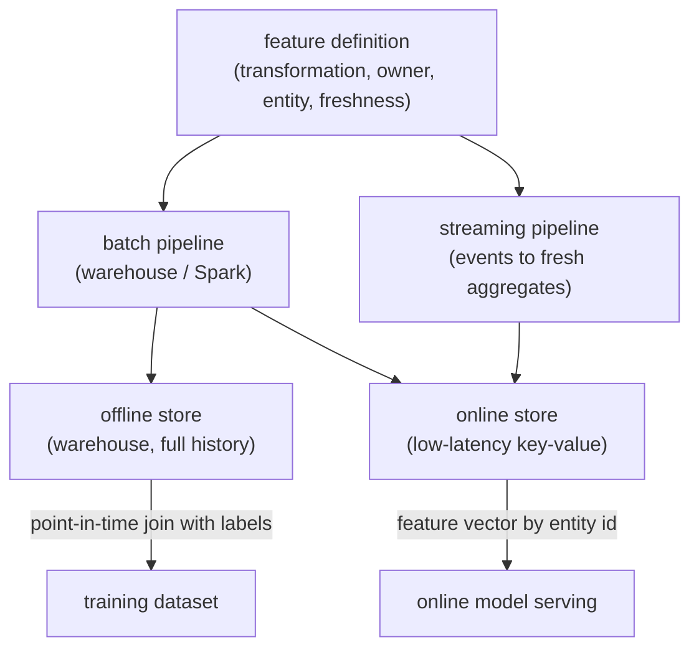
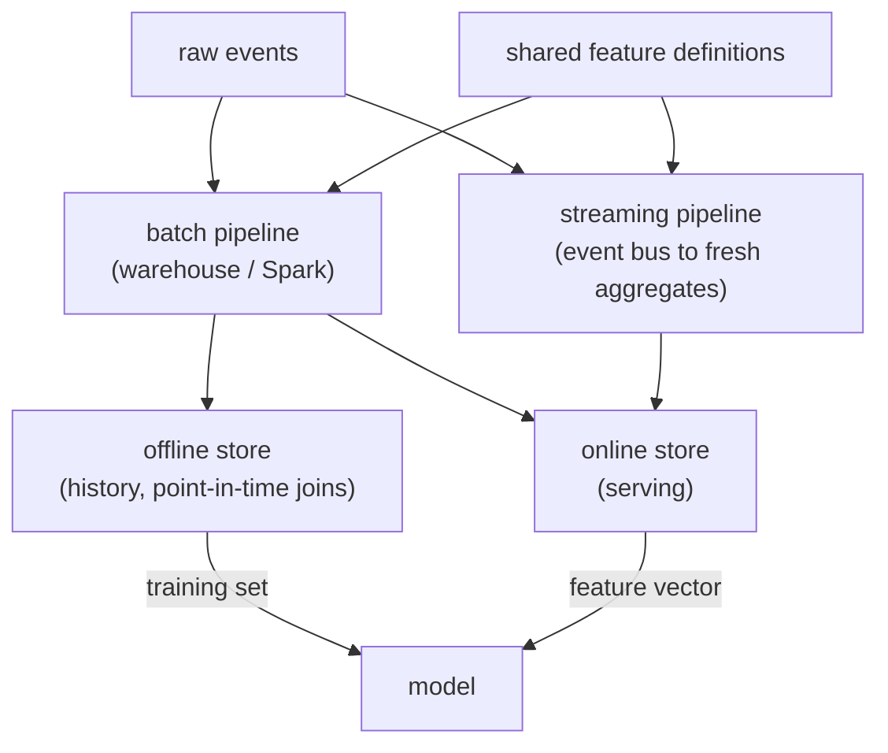

# 04 - Feature store and training-serving skew

> **Interviewer:** "Your team has a dozen models that all need the same features:
> user engagement counts, item popularity, real-time session signals. Right now
> every team recomputes them, and models that look great offline degrade in
> production. Design a feature platform that serves features online and produces
> training data, without the two drifting apart."

This is the infrastructure question underneath every recommendation and ranking
system ([topic 02](02-ranking-model.md), [topic 03](03-sequential-recommendation.md)).
It is less about a clever model and more about a discipline: the exact same
feature must be computed the same way for training and for serving, at the right
point in time. Get that wrong and you ship the single most common silent failure
in production ML, training-serving skew. The signal is that you treat features as
a shared, versioned, point-in-time-correct asset, not as glue code each model
rewrites.

## 1. Clarify and scope

- **What features, and how fresh?** Batch aggregates (a user's 30-day purchase
  count, refreshed daily) and real-time signals (clicks in this session, fresh in
  seconds) have completely different infrastructure. Ask which you need.
- **Who consumes them?** One model or many teams? The value of a feature store
  grows with reuse; for a single model it can be overkill.
- **Latency budget online?** Feature fetch is on the critical path of the ranking
  request ([topic 02](02-ranking-model.md)). It gets a few milliseconds, so the
  online store must be a low-latency lookup, not a computation.
- **Scale?** Number of entities (users, items), number of features, write rate,
  read QPS. This sizes the online and offline stores.
- **Point-in-time needs?** If labels arrive later than features (almost always),
  training must reconstruct feature values *as of the event time*, not as of now.

## 2. Requirements

**Functional**
- Define a feature once and make it available both offline (for training) and
  online (for serving)
- Serve feature vectors for an entity at low latency online
- Generate point-in-time-correct training datasets by joining features to labels
- Support both batch and streaming (real-time) features
- Let multiple models reuse the same feature definitions

**Non-functional**
- Online read p99 in single-digit milliseconds
- Online and offline values that are provably consistent (no skew)
- Freshness targets met per feature (daily for batch, seconds for streaming)
- Reproducibility: a training set pins the feature definitions and data versions
- Governance: discoverable, owned, documented features

The requirement that dominates and that you should name first: **online/offline
consistency**. Everything else is plumbing in service of it.

## 3. High-level data flow

The defining idea is a **single feature definition** that drives two stores: an
offline store for training and an online store for serving.

The two stores hold the *same* feature, one optimized for historical bulk reads
(training), one for low-latency point reads (serving). Because both derive from
the one definition, the values match. That is the whole point.

## 4. Deep dives

### Training-serving skew, the failure this prevents

Skew is when the feature a model trains on differs from the feature it serves on,
so the model meets a distribution at serving time it never saw in training.
Quality silently drops. It happens three ways, and naming them is the signal:

- **Code skew.** The feature is computed by one code path offline (a SQL query in
  the training pipeline) and a different code path online (handwritten service
  code). They drift the moment one is edited. The fix is a **shared definition**
  that generates both, so there is only one computation.
- **Time skew.** The feature is computed with data that was not available at
  prediction time (see point-in-time below), so training sees a "feature" that
  leaks the future.
- **Data skew.** The online source and the offline source diverge (different
  freshness, different filtering, late-arriving events). The store has to make the
  online materialization and the offline backfill agree.

Saying "a feature store exists primarily to kill training-serving skew" frames the
whole answer correctly.

### Point-in-time correctness

This is the subtle one, and interviewers love it. When you build a training row,
you join a label (did the user click at time T) to features. You must use the
feature values **as they were just before T**, not their current values. If you
join "this user's lifetime purchase count" computed today onto an event from six
months ago, you have leaked the future: the model learns from information it will
never have at serving time, and offline metrics look amazing while production
flops.

A correct feature store does a **point-in-time (as-of) join**: for each labeled
event, fetch the feature value valid at that event's timestamp. This requires the
offline store to keep feature history with timestamps, not just the latest value.
Mention it unprompted; it separates people who have built training pipelines from
people who have only read about them.

### The dual-store architecture

- **Offline store:** a data warehouse or lake (columnar, cheap, high-throughput
  scans) holding the full timestamped history. Optimized for the big point-in-time
  joins that build training sets. Latency does not matter; completeness does.
- **Online store:** a low-latency key-value store (think Redis, Cassandra,
  DynamoDB) holding the *latest* (or recent-window) feature value per entity.
  Optimized for "give me this user's features in 2 ms." A **materialization** job
  pushes computed features from the pipelines into it.

The two stores are different technologies for opposite access patterns, fed from
the same definitions. That asymmetry mirrors the offline/online split in the rest
of the recommendation stack.

### Batch versus streaming features

- **Batch features** (daily aggregates) run on a schedule over the warehouse.
  Simple, cheap, but stale by up to a day.
- **Streaming features** (counts in the last few minutes, current session
  activity) are computed by a streaming pipeline from an event bus and pushed to
  the online store within seconds. They power real-time personalization
  ([topic 03](03-sequential-recommendation.md)) but add real operational
  complexity. The hard part is making the streaming materialization and the
  offline backfill compute the *same* aggregate, or you reintroduce skew.

### Backfills

When you add a new feature, you need its historical values to train on, not just
from today forward. A **backfill** recomputes the feature over historical data and
writes it into the offline store with correct timestamps. Backfills are expensive
and easy to get subtly wrong (recomputing with today's logic but stamping it as
historical reintroduces time skew). Call out that a new feature is not usable for
training until it is correctly backfilled.

### Reuse and governance

The economic case for a feature store is reuse: one team builds "user 7-day
category affinity," every other team consumes it instead of rebuilding it. That
only works if features are **discoverable** (a catalog), **owned** (someone
maintains each), **documented**, and **versioned**. Without governance a feature
store becomes a swamp of duplicated, undocumented, subtly different features, which
is its own kind of skew.

## 5. Bottlenecks and scaling

| Bottleneck | First sign | Fix | Tradeoff |
|---|---|---|---|
| Online read latency | Feature fetch eats the ranking budget | Low-latency KV store, batch reads per request | Cost, freshness |
| Online store cost/size | Storing every feature for every entity | Cap to served entities, TTLs, tiering | Coverage |
| Point-in-time join cost | Training-set builds take hours | Pre-materialize, partition by time, incremental | Pipeline complexity |
| Streaming materialization | Real-time features lag | Tune the streaming pipeline, accept bounded staleness | Operational load |
| Backfill expense | New features slow to land | Incremental backfills, sample for iteration | Engineering time |
| Feature sprawl | Duplicated, undocumented features | Catalog, ownership, deprecation policy | Governance overhead |

## 6. Failure modes, safety, eval

- **Training-serving skew:** the headline failure this whole topic prevents.
  Detect it by logging the actual features served at request time and comparing
  them against what the training pipeline would have produced for the same event.
  A persistent mismatch is the alarm.
- **Time leakage:** point-in-time joins done wrong leak the future. Audit by
  checking that no feature in a training row depends on data after the label's
  timestamp.
- **Silent staleness:** a broken materialization job freezes a feature; the model
  keeps serving on stale values and slowly degrades. Monitor feature freshness as
  a first-class signal (this is the bridge to
  [topic 11, monitoring and drift](11-ml-monitoring-and-drift.md)).
- **Eval:** there is no single accuracy number for a feature store; you validate it
  by online/offline parity (served-vs-computed feature match rate), freshness SLAs
  met, and ultimately by the absence of the offline-good-online-bad gap in the
  models it feeds.

## 7. Likely follow-ups

- "What is training-serving skew and how does a feature store stop it?" One shared
  definition generates both the offline training values and the online served
  values, so there is only one computation to drift.
- "Why is point-in-time correctness hard?" You must reconstruct each feature as of
  the event time, which means keeping timestamped history and doing as-of joins,
  not joining current values onto past labels.
- "Batch or streaming for this feature?" Match the freshness need: daily
  aggregates batch, session and real-time signals stream, and make both compute
  the identical aggregate.
- "How do you onboard a new feature?" Define it once, backfill history correctly,
  materialize to the online store, register it in the catalog, then let models
  consume it.
- "When is a feature store overkill?" One model, few features, no reuse: the
  operational cost may exceed the benefit. The value scales with reuse and with
  the number of real-time features.

---

## Trace the architectures

A feature store is infrastructure, not a model, so there is no neural graph for the
store itself. What it feeds is a model: the features land in the **embedding tables
and dense inputs** of a ranking model, which is where most of the parameters and
most of the leakage risk live. Open the consumer to see exactly where your features
enter:

- **The model your features feed (DLRM):**
  [open it live](https://www.neurarch.com/?import=https://raw.githubusercontent.com/neurarch-ai/awesome-llm-model-zoo/main/architectures/dlrm/model.json).
  Trace the sparse categorical features into the embedding tables and the dense
  features into the bottom MLP. Every one of those inputs is a feature the store
  has to serve online exactly as it was computed offline. That is the contract this
  topic is about.

  

This is a validated reference graph at real dimensions, shape-checked end to end,
not a screenshot. Browse all in the
[Model Zoo](https://github.com/neurarch-ai/awesome-llm-model-zoo) or the
[gallery](https://neurarch-ai.github.io/awesome-llm-model-zoo). Built by
[Neurarch](https://www.neurarch.com).

## Seen in production

Real systems and references that ship the patterns above. Read them for what an
interview answer skips: the online/offline split in practice, point-in-time
joins, and how teams keep features consistent across training and serving.

### The shared pipeline

Every system here converges on the same skeleton: raw events flow through feature
pipelines (batch on a warehouse, streaming off an event bus) that write into two
stores from one set of feature definitions. The offline store keeps timestamped
history for point-in-time joins that build training sets; the online store keeps
the latest value per entity for low-latency serving. Because both sides derive from
the same definitions, the feature a model trains on matches the feature it serves,
which is exactly how skew is avoided.

### How they differ

| System | Online store technology | Streaming vs batch | Point-in-time correctness | Ownership / self-serve |
|---|---|---|---|---|
| Uber Michelangelo | Cassandra (P95 under 10ms) | Both: batch precompute from HDFS plus Kafka/Samza near-real-time aggregates | Same data and batch pipeline for training and serving; streaming logged back to HDFS with backfill | ~10,000 shared features, owner/description/SLA metadata, cross-team reuse |
| Feast | Pluggable: Redis, DynamoDB, Bigtable, Cassandra, Postgres, and 20+ more | Both: scheduled materialization plus push-based streaming ingestion (Kafka/Kinesis) | As-of joins produce point-in-time correct sets so future values do not leak | Python SDK, CLI, web UI registry; DataHub/Amundsen governance |
| Google Rules of ML | Not a store; guidance for serving systems | Emphasizes logging serving-time features to reuse for training | Test on data gathered after training data ends; watch for external tables changing between train and serve | Discipline: reuse code between training and serving |

### The systems

- **Uber** [Meet Michelangelo: Uber's Machine Learning Platform](https://www.uber.com/blog/michelangelo-machine-learning-platform/): popularized the Palette feature store and the online/offline materialization split. *(platform)*
- **LinkedIn** [Feathr feature store](https://github.com/feathr-ai/feathr): one feature definition serving both online and offline at scale. *(platform)*
- **Feast** [open-source feature store](https://github.com/feast-dev/feast): a clean reference design for the dual store and point-in-time correct joins. *(reference design)*
- **Tecton** [engineering blog](https://www.tecton.ai/blog/): from the team behind Michelangelo; deep on real-time features and materialization. *(real-time features)*
- **Google** [Rules of Machine Learning](https://developers.google.com/machine-learning/guides/rules-of-ml): training-serving skew called out directly (reuse code between training and serving, log features at serving time). *(discipline)*

More production case studies: the [Evidently AI ML system design database](https://www.evidentlyai.com/ml-system-design) (800 case studies from 150+ companies) is the broadest curated index; filter for feature stores and data platforms.

## Related deep-dive drills

Rapid-fire questions that probe the modeling and systems underneath this topic, from [deep-dives.md](../deep-dives.md):

- [Features, leakage, and training-serving skew](../deep-dives.md#features-leakage-and-training-serving-skew)
- [Statistics and probability for ML](../deep-dives.md#statistics-and-probability-for-ml)
- [Commonly asked, commonly missed](../deep-dives.md#commonly-asked-commonly-missed)
