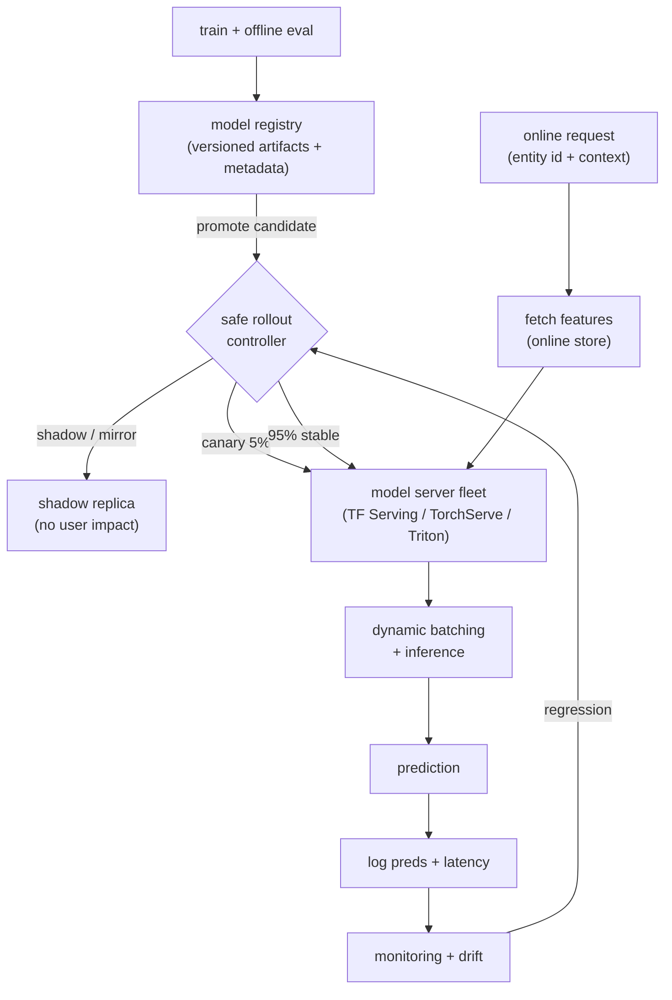

# 05 - Real-time ML serving and model deployment

> **Interviewer:** "You have a trained model that scores well offline. Now design
> how it gets served online at low latency and deployed safely. Walk me through the
> serving stack, the latency budget, how you scale it under load, and how you ship a
> new version without taking the product down."

This is the stage where a good model becomes a reliable product, and it is mostly
an infrastructure question, not a modeling one. The trap is to treat "deploy the
model" as a single step (copy a file, point traffic at it) and skip the two things
that actually keep you employed: the latency budget that shapes the serving stack,
and the safe-deployment toolkit that lets you ship a new version without a global
outage. The signal is that you separate the model (the thing you serve) from the
server (the system that serves it), name p99 and not just average latency, and
reach for shadow, canary, and rollback before anyone asks.

## 1. Clarify and scope

- **What model, and how big?** A small dense net, a large ranker with multi-
  gigabyte embedding tables ([topic 02](02-ranking-model.md)), or an LLM are three
  completely different serving problems (memory footprint, batching behavior, GPU
  vs CPU). Ask before you design.
- **Latency budget?** What p99 must the caller see, and how much of it is the model
  versus feature fetch and network? Serving usually gets a slice of a larger
  request budget, so name the number out loud.
- **Throughput and traffic shape?** Steady QPS or spiky? A diurnal pattern or a
  launch spike sets the autoscaling story.
- **Online or near-line?** Is this synchronous request/response on the user's
  critical path, or async scoring you can batch and write to a store? The boundary
  matters: not everything has to be served live.
- **How often do you redeploy?** Daily model refreshes ([topic 02](02-ranking-model.md))
  versus monthly changes set how much you invest in safe-rollout automation.
- **What does "safe" mean here?** A bad model version that ships to 100 percent of
  traffic is an incident. Establish that rollout is gradual and reversible from the
  start.

## 2. Requirements

**Functional**
- Load a trained model version and serve predictions over an API (the model-as-a-
  service pattern)
- Fetch or accept the features the model needs at request time
  ([topic 04](04-feature-store-and-training-serving-skew.md))
- Support multiple model versions and a registry that records which is live
- Roll a new version out gradually and roll it back fast
- Log requests, predictions, and latencies for monitoring and the next training cycle

**Non-functional**
- p99 latency under the budget, not just a good average
- Horizontal scalability with autoscaling to track traffic
- High availability (a single bad host or version must not take the service down)
- Reproducibility: a served prediction maps to an exact model version and config
- Safe deploys: shadow / canary / gradual rollout with automated rollback

The non-functional requirement that dominates: **tail latency under a hard p99
budget while staying available during deploys**. Average latency is easy and a
lie. The whole design bends around the slow requests (the p99 and p999) and around
never letting a deploy become a tail-latency or correctness cliff for users.

## 3. High-level data flow

Two boundaries to draw. The offline path trains, validates, and registers a model
version; the online path loads that version behind a server and answers requests
inside the latency budget. The registry is the seam between them.

The model server loads a versioned artifact from the registry; the rollout
controller decides how much live traffic each version sees; features arrive at
request time from the online store. Everything served gets logged so monitoring
([topic 11](11-ml-monitoring-and-drift.md)) can catch a bad version and trigger a
rollback. The registry, not a file copy, is what makes a deploy reproducible and
reversible.

## 4. Deep dives

### Model-as-a-service: the server is not the model

The pattern is to wrap the trained model in a dedicated **model server** (TF
Serving, TorchServe, NVIDIA Triton are the canonical examples) that exposes a thin
predict API and owns the boring, hard parts: loading versioned artifacts, warming
them, batching requests, exposing metrics, and hot-swapping versions without
dropping traffic. The application calls it over gRPC or HTTP and stays out of the
inference business.

Say the boundary clearly: the **model** is the trained graph and its weights (the
embedding tables, the layers); the **server** is infrastructure that loads and
runs it. Decoupling them means you can redeploy a model without redeploying the
app, run several versions side by side, and standardize observability across every
model in the company. Treating the server as "part of the model" is the mistake
that produces bespoke, unmonitored, un-rollbackable serving code per team.

### Dynamic batching: the throughput lever

A single request underuses a GPU. **Dynamic batching** (request batching) in the
server collects requests that arrive within a small time window (single-digit
milliseconds) and runs them through the model as one batch, amortizing the per-call
overhead and filling the accelerator. This is the main throughput knob, and it is a
direct **latency-versus-throughput tradeoff**: a bigger max batch and a longer
wait window raise throughput and raise tail latency. You tune the window and max
batch size against the p99 budget, not for peak throughput in isolation. For a
ranker that scores hundreds of candidates per request ([topic 02](02-ranking-model.md)),
the candidates are already a natural batch; dynamic batching is the cross-request
version of the same idea.

### The latency budget, made concrete

This is the constraint that picks the rest of the design. Illustrative arithmetic
(numbers are for shape, not a benchmark): if the caller allows a ~50 ms p99 for the
whole prediction and feature fetch takes ~10 ms ([topic 04](04-feature-store-and-training-serving-skew.md)),
the model plus the batching wait plus network has to fit in the rest. Design
backwards from that:

- Keep the per-request model cost flat and predictable.
- Size the batching window so the wait it adds stays inside the budget.
- Cache features and even whole predictions where inputs repeat.
- Watch p99 and p999, not the mean: a healthy average with a fat tail still misses
  the SLA for the requests that matter.

State the budget first and let it drive batch size, hardware, and model size. That
ordering is the senior move.

### Horizontal scaling and autoscaling

You scale a stateless model server **horizontally**: many identical replicas
behind a load balancer, traffic spread across them. Because the replicas hold no
per-user state, you add and remove them freely. **Autoscaling** adds replicas when
a signal crosses a threshold; the subtlety worth raising is *which* signal. CPU
utilization is a poor proxy for an inference service whose bottleneck is GPU memory
bandwidth or queue depth, so scale on a serving-specific signal (request queue
length, batch latency, GPU utilization) instead. Two gotchas to name: **cold
start** (a new replica must load a multi-gigabyte model and warm caches before it
can serve, so it cannot absorb a spike instantly, which argues for headroom and
pre-warming), and **load-balancer awareness** of readiness so traffic does not hit
a replica still loading.

### Model versioning and the registry

Every deployable model is an immutable, versioned artifact in a **model registry**
with its metadata: training data snapshot, code version, hyperparameters, offline
metrics, and a stage (staging, production, archived). The registry is the source
of truth for "what is live right now" and the thing that makes a deploy
reproducible and a rollback a pointer change rather than a rebuild. Serving loads
**by version** from the registry, and a served prediction can be traced back to the
exact artifact that produced it. Without this, "roll back the model" means "find
and rebuild the old one under pressure," which is how a five-minute fix becomes an
hour.

### The safe-deployment toolkit

The point of this whole topic: a new model version reaches full traffic through a
staged, reversible sequence, never a flip. Know the toolkit and what each step buys:

- **Shadow (dark launch / mirroring).** Send a copy of live traffic to the new
  version, throw its predictions away, and compare them offline against the current
  version. Zero user risk; catches crashes, latency regressions, and large
  prediction shifts before a single user sees the new model. The catch: shadowing
  doubles inference cost while it runs and cannot measure the new model's effect on
  user behavior (no one sees its output).
- **Canary.** Route a small slice (say 5 percent) of real traffic to the new
  version, watch its serving health and online metrics, and widen only if it holds.
  This is where you measure real user impact, gated to a small blast radius.
- **Gradual rollout.** Ramp the canary up in steps (5, 25, 50, 100 percent) with
  health gates between each, so a problem that only shows at scale still surfaces on
  a fraction of traffic.
- **Blue-green.** Stand up the new version (green) as a full parallel fleet beside
  the current one (blue), cut traffic over once it is verified, and keep blue warm
  so rollback is an instant traffic switch back. Fast and clean, but you pay for two
  full fleets during the cutover.

The honest summary: shadow proves it does not break, canary and gradual rollout
prove it helps without a wide blast radius, blue-green makes the cutover and the
undo instant. Most mature setups combine them (shadow, then canary, then ramp).

### Rollback

Rollback must be faster and more boring than rollout. Because the registry holds
the previous version and the rollout controller can shift traffic, a rollback is
"point production back at the last good version," ideally automated off a health or
metric regression rather than waiting for a human to notice. The interview-grade
point: **define the rollback trigger and make it automatic**. A deploy you cannot
reverse in seconds is not a safe deploy.

### The offline-vs-online boundary

Not everything needs live serving. **Online (real-time)** serving answers a
synchronous request on the user's critical path and lives under the p99 budget.
**Offline (batch)** serving precomputes predictions for all entities on a schedule
and writes them to a store the app reads with a simple lookup. Batch trades
freshness for near-zero serving latency and cost, and suits predictions that do not
change request-to-request (a daily user propensity score). Many systems do both:
precompute what is stable, serve live only what depends on real-time context. Stating
this boundary, and pushing work to the cheaper side when freshness allows, shows you
are not over-engineering live serving for everything.

## 5. Bottlenecks and scaling

| Bottleneck | First sign | Fix | Tradeoff |
|---|---|---|---|
| Tail latency (p99/p999) | Average fine, p99 over budget | Tune batch window, add replicas, cap model size | Throughput vs tail |
| GPU/accelerator utilization | Hardware idle under load | Dynamic batching, co-locate models | Latency added by batch wait |
| Model load / cold start | New replicas slow to serve | Pre-warm, keep headroom, smaller artifacts | Cost of idle capacity |
| Autoscaling on the wrong signal | Scales late or thrashes | Scale on queue depth / GPU, not CPU | Tuning complexity |
| Embedding table memory | Model does not fit a replica | Shard, quantize, host-memory tiering | Lookup latency, quality |
| Deploy blast radius | A bad version hits everyone | Shadow + canary + gradual rollout | Slower, costlier rollouts |
| Slow rollback | Incident drags on | Registry + automated traffic switch | Keep old version warm (cost) |
| Feature fetch on critical path | Latency before inference | Cache, batch reads, online store | Freshness vs speed |

## 6. Failure modes, safety, eval

- **Shipping straight to 100 percent.** The cardinal sin. A version that passed
  offline eval can still crash on real inputs, regress latency, or hurt the business
  metric. Shadow then canary then ramp; never flip all traffic at once.
- **Training-serving skew.** A model can serve flawlessly and still be wrong if the
  features at serving time differ from training
  ([topic 04](04-feature-store-and-training-serving-skew.md)). Serving safely does
  not save you from a skewed feature; log served features and compare against
  training.
- **No rollback path.** If you cannot revert in seconds, every deploy is a gamble.
  Pin a previous version in the registry and wire an automated rollback trigger.
- **Silent model staleness.** A broken retrain or registry pointer leaves an old
  version serving while the world moves on; quality decays without an error. This is
  the handoff to monitoring ([topic 11](11-ml-monitoring-and-drift.md)).
- **Tail-latency blindness.** Watching averages hides the slow requests that breach
  the SLA. Alert on p99 and p999.
- **Cold-start outage on a spike.** Autoscaling that cannot warm replicas fast
  enough turns a traffic spike into dropped requests. Keep headroom and pre-warm.
- **Eval:** there is no single accuracy number for serving. You validate it with
  serving SLOs (p99 latency, availability, error rate), shadow-comparison agreement
  between candidate and production, canary online metrics against a control, and
  ultimately the absence of post-deploy regressions caught by monitoring. The ship
  decision is the canary / A/B result, not the offline metric.

## 7. Likely follow-ups

- "Why a dedicated model server instead of loading the model in the app?" Decoupled
  versioning and redeploys, batching, standardized metrics, and hot version swaps.
  The server is infrastructure; the model is the artifact it loads.
- "How does dynamic batching help, and what does it cost?" It fills the accelerator
  by grouping requests in a short window, raising throughput at the cost of added
  tail latency. Tune the window against p99.
- "Shadow vs canary vs blue-green, when each?" Shadow to prove no breakage with zero
  user risk, canary and gradual rollout to measure real impact on a small slice,
  blue-green for an instant cutover and instant rollback at the cost of double
  capacity.
- "How do you roll back?" Keep the previous version in the registry and switch
  traffic to it, triggered automatically off a health or metric regression, in
  seconds.
- "Why p99 and not average latency?" The slow tail is what breaches the SLA; a good
  average can hide a fat tail that misses the budget for the requests that matter.
- "When would you serve offline instead of online?" When the prediction does not
  depend on real-time context and freshness can be a day old, precompute in batch
  and serve from a lookup. Do not build live serving for everything.
- "Your new version looked great in shadow but tanked in canary. Why?" Shadow throws
  predictions away, so it cannot measure user behavior; only canary exposes the real
  effect (and feedback loops) of the model's output reaching users.

---

## Trace the architectures

Serving is infrastructure: there is no neural graph for the server itself, and
pretending the model server is a "model" would be exactly the conflation this topic
warns against. The thing you put behind the server is the model. For an online
ranking service that is typically a **DLRM-style ranker**, and its embedding tables
are precisely what gets loaded into the server's memory and what dominates the
artifact size you version, ship, shadow, and roll back. Open the real graph and see
what the server is actually holding:

- **The model you put behind the server (DLRM, a ranker):**
  [open it live](https://www.neurarch.com/?import=https://raw.githubusercontent.com/neurarch-ai/awesome-llm-model-zoo/main/architectures/dlrm/model.json).
  Find the embedding tables and notice their size relative to the MLPs: those tables
  are the gigabytes the server loads into memory, the reason cold start is slow, and
  the artifact the registry versions. The dense MLPs are cheap; the tables are the
  serving footprint.

  

A good exercise before an interview: open DLRM, change the embedding dimension, and
watch the parameter count (and therefore the memory the server has to hold and warm
on every replica) move. That is the link between the model and the serving cost this
topic is about. This is a validated reference graph at real dimensions, shape-checked
end to end, not a screenshot. Browse all in the
[Model Zoo](https://github.com/neurarch-ai/awesome-llm-model-zoo) or the
[gallery](https://neurarch-ai.github.io/awesome-llm-model-zoo). Built by
[Neurarch](https://www.neurarch.com).

## Seen in production

Real systems and references that ship the patterns above. Read them for what an
interview answer skips: the serving abstraction in practice, staged rollout
discipline, and how teams keep a deployed model from drifting away from training.

- **Berkeley RISELab** [Clipper: A Low-Latency Online Prediction Serving System](https://arxiv.org/abs/1612.03079): a serving system with caching, batching, and model abstraction. *(serving system)*
- **Google** [Rules of Machine Learning](https://developers.google.com/machine-learning/guides/rules-of-ml): deployment discipline, staged rollout, and not letting serving drift from training. *(discipline)*
- **Uber, DoorDash, and Netflix** have all published model-serving and deployment writeups (real-time prediction services, staged rollouts, and model registries); they are indexed in the database below rather than linked individually here. *(platform)*

More production case studies: the [Evidently AI ML system design database](https://www.evidentlyai.com/ml-system-design) (800 case studies from 150+ companies) is the broadest curated index; filter for model serving and deployment.
