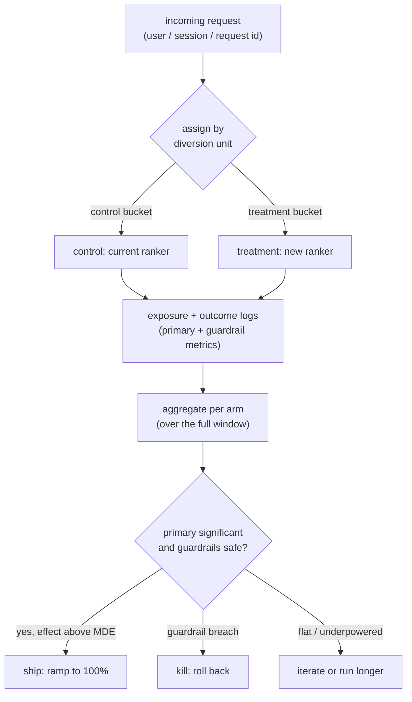
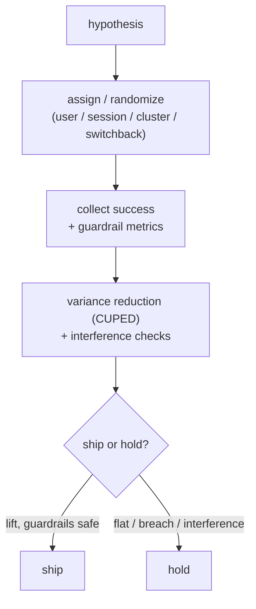

# 06 - Online experimentation and A/B testing

> **Interviewer:** "You trained a new ranking model and it beats the current one
> on every offline metric: higher AUC, higher NDCG, better calibration. Design
> how you decide whether it actually ships. I want to know how you would prove the
> new model is better for the business, not just better on a holdout set."

This is the question that decides whether the work in [topic 02, the ranking
model](02-ranking-model.md), reaches users. The trap is to treat the offline win
as the answer and ask only "how big an A/B test do I run?" The real signal is
understanding *why* an offline win does not guarantee an online win, then building
the controlled experiment that measures the thing you actually care about: a
randomized comparison, the right metrics, enough power to trust the result, and a
ship decision that survives novelty effects, peeking, and interference. A/B
testing is a process, not a model. The model is what you are testing.

## 1. Clarify and scope

- **What is the one metric this should move?** The **primary metric** (the
  Overall Evaluation Criterion). It must be the business outcome the new model is
  supposed to improve (engagement, conversion, revenue per session), measurable
  in the experiment window, and sensitive enough to move. Pin it before you start
  or you will fish for a winner afterward.
- **What must it not break?** The **guardrail metrics**: latency, error rate,
  revenue, churn, complaint rate. The new ranker can win on engagement and quietly
  tank a guardrail. Name these up front.
- **What is the unit of diversion?** Per user? Per session? Per request? This is
  the single most important design choice and it depends on whether effects carry
  across a user's requests (they almost always do for ranking).
- **How much traffic and for how long?** This sets statistical power. Ask the
  baseline rate of the primary metric, its variance, and the smallest effect worth
  shipping (the minimum detectable effect).
- **Are there network effects?** If treating one user changes another user's
  experience (marketplaces, social feeds, shared inventory), a naive user-level
  split is biased and you need a different randomization scheme.
- **What is the cost of a wrong ship?** A risky change wants a slow ramp and tight
  guardrails; a low-risk copy change can move faster.

## 2. Requirements

**Functional**
- Randomly assign traffic to control (current model) and treatment (new model)
- Hold the assignment stable per diversion unit for the experiment's life
- Log exposure plus the primary and guardrail metrics per unit
- Compute the treatment effect and its statistical significance
- Produce a clear ship / kill / iterate decision with a confidence interval

**Non-functional**
- Assignment must be deterministic and low-latency on the serving path
- Randomization must be unbiased: the two arms differ only by the change
- Results must be reproducible: fixed analysis plan, fixed metric definitions
- Safe rollout: ability to ramp exposure up and kill instantly on a guardrail breach
- Trustworthy statistics: control false positives across peeking and many metrics

The requirement that dominates and that you should name first: **a valid,
unbiased comparison**. Every other piece (significance math, ramping, dashboards)
is in service of the claim that the *only* difference between the two arms is the
model. Break randomization and no amount of statistics saves you.

## 3. High-level data flow

The defining idea is a **single point of randomization** on the serving path that
splits traffic, followed by an offline analysis path that turns logged metrics
into a decision.

The assignment node is the whole experiment. It must be a stable hash of the
diversion unit (so the same user lands in the same arm every request, for the
whole experiment) and it must be statistically independent of anything correlated
with the outcome. The analysis path never touches the serving path; it reads logs
after the fact.

## 4. Deep dives

### Why offline wins do not guarantee online wins

This is the heart of the question, and the interviewer is testing whether you can
explain the gap rather than just assert it exists:

- **The offline metric is a proxy.** AUC and NDCG ([topic 02](02-ranking-model.md))
  measure ranking quality on logged data; the business cares about engagement or
  revenue, and the correlation between the two is loose. A model can sort the
  holdout better and move the real metric not at all.
- **The offline data is the old model's data.** Your logs were generated by the
  current ranker, so they reflect what it chose to show. The new model would have
  shown different items, for which you have no labels. Offline eval scores the new
  model on a distribution it would never have produced. This is counterfactual
  evaluation, and it is why offline numbers are optimistic.
- **Training-serving skew** ([topic 04](04-feature-store-and-training-serving-skew.md)).
  If a feature is computed differently online than in training, the model that
  looked great offline meets a different distribution at serve time.
- **Feedback loops.** A new ranker changes what users see, which changes future
  behavior and future training data. Offline eval is static; online is a system
  that reacts.

The clean way to say it: offline metrics are a cheap, fast **pre-gate** that lets
you kill obvious losers without burning traffic. The A/B test is the **decision**,
because it measures the real metric on the real distribution under the real
feedback loop. Lead with this and the rest of the answer follows.

### Randomization and the unit of diversion

Randomization is what buys you causal inference: if assignment is independent of
everything, the only systematic difference between arms is the treatment, so a
difference in the metric is caused by the treatment. Implement it as a
deterministic hash of (unit id, experiment id) into buckets, so assignment is
stable across requests and independent across experiments.

The subtle choice is the **unit of diversion**:

- **Per request** gives the most samples and the tightest variance, but it is
  wrong whenever the effect carries across a user's requests (it almost always
  does for ranking: a user who sees better results behaves differently for the
  rest of the session). Splitting per request contaminates the same user with both
  arms and dilutes the effect.
- **Per user** (or per session) is the standard for ranking changes. It keeps a
  user's whole experience consistent, so you measure the real cumulative effect.
  The cost is fewer independent units and higher variance, because outcomes within
  a user are correlated and the effective sample size is the number of users, not
  requests.

Get this wrong and your test is either biased (request-level when effects carry)
or underpowered. State the rule: **divert at the level at which the effect
operates, and analyze at that same level.** If you divert by user, your variance
calculation must account for within-user correlation (clustered variance), or your
confidence intervals will be too narrow and you will declare false winners.

### Primary versus guardrail metrics

- **Primary metric (OEC):** the one number that decides the experiment. It should
  be the business outcome, sensitive to the change, and measurable in the window.
  Long-term outcomes (retention, lifetime value) are what you truly want but move
  too slowly, so teams use a sensitive short-term proxy chosen to correlate with
  the long-term goal. Choosing the OEC well is more than half the work.
- **Guardrail metrics:** outcomes that must not regress even if the primary wins.
  Latency and error rate ([topic 02](02-ranking-model.md)'s budget), revenue, and
  user-harm signals. A win on engagement that adds 50 ms of latency or drops
  revenue is not a ship.
- **Counter-metrics:** watch for the metric you are gaming. If you optimize clicks,
  watch dwell time and complaint rate, or you ship clickbait that wins the primary
  and loses the user.

Declaring primary, guardrail, and counter-metrics before the test is what stops
you from rationalizing a result after you see it.

### Statistical significance and sample sizing

You are estimating the difference in the primary metric between arms and asking
whether it is real or noise. Two errors to control: a **false positive** (ship a
change that does nothing, type I, controlled by the significance level, commonly
5%) and a **false negative** (miss a real win, type II, controlled by power,
commonly 80%).

The sample size you need grows with variance and shrinks with the effect you want
to detect:

- The **minimum detectable effect (MDE)** is the smallest change worth shipping.
  Detecting a 0.5% lift needs far more traffic than detecting a 5% lift. Required
  sample size scales roughly with 1 / MDE squared, so halving the effect you want
  to catch roughly quadruples the traffic and time. (Numbers illustrative.)
- Higher metric **variance** needs more samples; lower baseline rates (rare
  conversions) need more samples. Variance reduction techniques (for example
  CUPED, which uses pre-experiment data to remove predictable variance) buy
  sensitivity without more traffic.
- Compute the required sample size **before** launching, from the baseline rate,
  the variance, the MDE, the significance level, and the target power. That number
  times your traffic share gives the duration. Running first and asking "is it
  significant yet?" is how you fool yourself.

The senior move is to state the MDE, derive the sample size and duration up front,
and commit to them.

### Experiment duration, novelty and primacy effects

Duration is not just "until significant." Two reasons to run a minimum window even
if significance arrives early:

- **Novelty effect:** users react to *anything* new, click it because it is
  different, and the lift fades as the novelty wears off. An early significant win
  can be pure novelty.
- **Primacy effect:** the opposite, users are anchored on the old experience and
  underperform on the new one at first, then warm up. An early flat result can hide
  a real win.
- **Weekly seasonality:** behavior differs weekday versus weekend, so run in whole
  multiples of a week to avoid a day-of-week artifact.

Plot the daily treatment effect, not just the cumulative number. A real,
shippable effect stabilizes; a novelty spike decays. Running at least one to two
full weeks and watching the curve flatten is the discipline.

### Interleaving: a more sensitive method for ranking

Because this is a ranking change, mention **interleaving**, the ranking-specific
method that is far more sensitive than a standard A/B test. Instead of showing
user A the control list and user B the treatment list, you **blend both rankers'
results into one list for the same user** (alternating picks, team-draft style) and
attribute each click to whichever ranker contributed that item. Every user sees
both rankers, so you compare them within-user and cancel out per-user variance.

The payoff: interleaving can detect a ranking difference with one to two orders of
magnitude less traffic than an A/B test, which matters when traffic is scarce. The
catch is that it measures a within-list preference, not the full business metric or
guardrails. The standard pattern is to **use interleaving as a fast, sensitive
screen** to pick which candidate rankers are worth a full A/B test, then run the
A/B test to measure the actual business effect and guardrails before shipping. Name
both and you show you know the ranking-specific tooling, not just generic stats.

### Network effects and interference

Standard A/B math assumes the **stable unit treatment value assumption**: one
unit's outcome does not depend on another unit's assignment. That breaks whenever
arms interact:

- **Marketplaces / shared inventory:** if the treatment ranker surfaces an item
  more, that item can sell out or get rate-limited, hurting the control arm. The
  arms compete, so the measured difference is biased.
- **Social / feed effects:** treating one user changes what their connections see
  or do, leaking treatment into control.

Fixes: **cluster randomization** (randomize whole graph communities or geographic
regions so interaction stays inside one arm), **switchback experiments**
(alternate the whole system between control and treatment over time windows, common
for marketplaces and logistics), or **budget-split / two-sided designs**. The
interview point is to *recognize* interference and say the naive user split is
biased here, then name a mitigation. Most candidates miss this entirely.

### Peeking and multiple comparisons

Two ways to manufacture false winners, both common:

- **Peeking:** checking the result repeatedly and stopping the moment it crosses
  significance. A fixed-horizon test assumes you look once at the planned sample
  size; if you peek daily and stop on the first significant reading, your real
  false-positive rate is far above 5%. Fixes: commit to the precomputed sample
  size and look once, or use methods built for continuous monitoring (sequential
  testing, always-valid p-values, group sequential boundaries).
- **Multiple comparisons:** test 20 metrics (or 20 variants) at 5% each and you
  expect about one false positive by chance. The primary-metric discipline exists
  precisely to avoid this: one pre-declared metric decides, the rest are guardrails
  read with that context. If you genuinely test many hypotheses, correct for it
  (Bonferroni, Benjamini-Hochberg false discovery rate).

Stating "I fix the sample size and the primary metric in advance to avoid peeking
and multiple comparisons" is exactly the trustworthiness signal interviewers want.

### The ship decision

Tie it together into an explicit decision rule:

1. **Pre-gate offline:** AUC / NDCG / calibration must clear a bar, else do not
   even run the test. Cheap filter, not the decision.
2. **Ramp safely:** start at a small exposure (say 1% to 5%) with guardrails
   wired to auto-kill on a breach, confirm no operational regression, then ramp to
   the planned share.
3. **Run the planned window:** at least one to two full weeks, watching the daily
   effect curve for novelty decay.
4. **Decide on the primary plus guardrails:** ship only if the primary is
   significant, the effect is above the MDE (practically meaningful, not just
   statistically significant), the confidence interval excludes trivial effects,
   and no guardrail regressed. Report the interval, not just a yes/no.
5. **Ramp to 100% and keep a holdback:** roll out fully but optionally keep a small
   long-term holdback to measure whether the win persists and to catch slow effects
   (the bridge to [topic 11, monitoring and drift](11-ml-monitoring-and-drift.md)).

A win that is statistically significant but below the MDE, or that breaches a
guardrail, is a **kill or iterate**, not a ship. Saying that out loud is the
difference between someone who runs tests and someone who makes decisions.

## 5. Bottlenecks and scaling

| Bottleneck | First sign | Fix | Tradeoff |
|---|---|---|---|
| Underpowered test | Result never reaches significance | Larger traffic share, variance reduction (CUPED), longer window | Time, exposure to a possibly worse model |
| Wrong diversion unit | Effect looks tiny or inconsistent | Divert and analyze per user/session, not per request | Fewer independent units, higher variance |
| Within-unit correlation | Confidence intervals too narrow, false winners | Clustered / bootstrap variance at the diversion unit | More complex analysis |
| Peeking | "Significant" results that do not replicate | Fixed horizon and look once, or sequential testing | Slower reads or harder math |
| Multiple metrics / variants | Spurious winner among many | One primary metric, FDR correction for the rest | Less freedom to fish |
| Network interference | Control contaminated by treatment | Cluster / switchback / geo randomization | Far fewer effective units, harder design |
| Many concurrent experiments | Tests collide and confound | Orthogonal layered assignment (independent hashes) | Platform complexity |
| Novelty / seasonality | Early effect decays or flips | Run whole weeks, watch the daily curve | Longer to a decision |

## 6. Failure modes, safety, eval

- **Sample ratio mismatch (SRM):** the single most important sanity check. If you
  asked for a 50/50 split and observe 50.8/49.2 at scale, the randomization or
  logging is broken and **the whole experiment is invalid**, no matter how good the
  result looks. Test the observed ratio against the intended ratio (a chi-squared
  test) on every experiment and refuse to read results when it fails.
- **Peeking and early stopping:** covered above; the most common way teams ship
  noise. Default to a fixed horizon.
- **Guardrail breach masked by a primary win:** always read guardrails alongside
  the primary; auto-kill on a breach during ramp.
- **Interference / SUTVA violation:** in marketplaces and social graphs the naive
  split is biased; detect by comparing user-split results to a cluster or
  switchback design and use the interference-robust design when they disagree.
- **Novelty effect mistaken for a real win:** watch the daily effect curve; a
  decaying spike is novelty, not value.
- **Simpson's paradox:** an aggregate win that reverses inside every important
  segment (or vice versa). Slice by key segments (new vs returning users,
  platform, region) before deciding.
- **Eval of the experiment system itself:** run **A/A tests** (both arms identical)
  regularly. They should show no significant difference about 95% of the time at a
  5% level and zero SRM; a misbehaving A/A test means your pipeline manufactures
  false positives and no real result can be trusted until it is fixed.

## 7. Likely follow-ups

- "Your new model wins offline. Why might it lose online?" Offline metrics are
  proxies measured on the old model's data (counterfactual), training-serving skew,
  and feedback loops the static eval cannot see. The A/B test is the decision.
- "What is your unit of diversion and why?" Per user/session for a ranking change,
  because the effect carries across a user's requests; per-request would
  contaminate users and dilute the effect, and analysis must account for
  within-user correlation.
- "How long do you run it and how big does it need to be?" Compute sample size up
  front from baseline rate, variance, MDE, significance, and power; run at least one
  to two full weeks for novelty and weekly seasonality regardless of early
  significance.
- "What is interleaving and when would you use it?" Blend both rankers into one
  list per user and attribute clicks; far more sensitive than A/B, used as a fast
  screen to pick which rankers earn a full A/B test that measures the business
  metric.
- "Why not stop as soon as it is significant?" Peeking inflates the false-positive
  rate well above the stated level; fix the horizon or use sequential methods.
- "Marketplace: one ranker shows item X more and it sells out. What breaks?"
  Interference (SUTVA violation): treatment affects control, so the user split is
  biased. Use cluster, geo, or switchback randomization.
- "Significant but tiny lift, ship?" No: require the effect above the MDE
  (practically meaningful) and no guardrail regression, and report the confidence
  interval, not a binary.

---

## Trace the architectures

Honest framing: A/B testing is a **process**, not a model, so there is no neural
graph for the experiment itself. The graph here is the **thing under test**, the
candidate ranking model whose variant you route a slice of traffic to. The whole
topic exists to decide whether *this* model replaces the current one, so it helps
to open it and see exactly what you are shipping or killing:

- **The candidate model in your treatment arm (wide-and-deep ranker):**
  [open it live](https://www.neurarch.com/?import=https://raw.githubusercontent.com/neurarch-ai/awesome-llm-model-zoo/main/architectures/wide-and-deep/model.json).
  Trace the two paths: the wide linear branch over crossed categorical features
  (memorization) and the deep embedding-plus-MLP branch (generalization), and see
  where they join before the output. This is the model whose offline win you are
  now trying to confirm online; the experiment routes treatment traffic through
  exactly this graph and control traffic through the current one.

  

This is a validated reference graph at real dimensions, shape-checked end to end,
not a screenshot. Browse all in the
[Model Zoo](https://github.com/neurarch-ai/awesome-llm-model-zoo) or the
[gallery](https://neurarch-ai.github.io/awesome-llm-model-zoo). Built by
[Neurarch](https://www.neurarch.com).

## Seen in production

Real references and writeups that ship the patterns above. Read them for what an
interview answer skips: how teams pick the OEC, run trustworthy tests at scale,
catch SRM and interference, and turn results into ship decisions.

### The shared pipeline

Every platform below runs the same skeleton: form a hypothesis, hash a diversion
unit into stable arms, log a pre-declared success metric alongside guardrail
metrics, then squeeze variance out (CUPED or interleaving) and check for
interference before a ship-or-hold call. The differences are all in the details of
that squeeze and that check, which is where scarce traffic and marketplace bias
actually bite.

### How they differ

| System | Randomization unit | Variance reduction | Guardrail metrics | Interference handling |
|---|---|---|---|---|
| Netflix (interleaving) | Per user, both rankers blended in one list | Interleaving; ~100x fewer subscribers to prune rankers | Business metrics confirmed in the follow-up A/B | Within-user comparison sidesteps cross-user leakage |
| Uber | Per user, flicker (arm-switching) users excluded | CUPED | App crash rate, trip frequency, sequential monitoring | Sequential monitoring, not marketplace-specific here |
| LinkedIn | Individual vs cluster randomization | CUPED | Network-effect metrics under test | Cluster randomization to detect and bound interference |
| Lyft | Session / geo / time (switchback) | Not the focus | Marketplace health metrics | Geo and time switchbacks to contain marketplace spillover |
| Airbnb | Per user | Power and impact gating | Impact, power, stat-sig-negative guardrails | Guardrails flag harmful tests pre-launch |
| Spotify | Per user | Not the focus | Success plus quality metrics combined | Risk-aware decision across multiple metrics |

### The systems

- **Google** [Rules of Machine Learning](https://developers.google.com/machine-learning/guides/rules-of-ml): emphasizes measuring real online impact, not just offline metrics. *(discipline)*
- **Kohavi, Tang, Xu** *Trustworthy Online Controlled Experiments* (the A/B testing book): the canonical reference on OEC choice, sample ratio mismatch, peeking, interference, and running experiments at scale. *(reference)*
- **Netflix, Microsoft (ExP), Airbnb, LinkedIn** experimentation engineering writeups: first-party accounts of large-scale experimentation platforms, variance reduction, interleaving, and interference-robust designs. *(platform)*
- **Netflix** [Innovating faster on personalization using Interleaving](https://netflixtechblog.com/interleaving-in-online-experiments-at-netflix-a04ee392ec55): Interleaving prunes ranking algorithms with 100x fewer subscribers before A/B confirmation. *(eval bar)*
- **Uber** [Under the Hood of Uber's Experimentation Platform](https://www.uber.com/blog/xp/): An XP platform with CUPED variance reduction, monitoring, and statistical methodology. *(deployment)*
- **Netflix** [Reimagining Experimentation Analysis at Netflix](https://netflixtechblog.com/reimagining-experimentation-analysis-at-netflix-71356393af21): Modular analysis infra letting scientists add custom metrics and causal models. *(deployment)*
- **Airbnb** [Designing Experimentation Guardrails](https://medium.com/airbnb-engineering/designing-experimentation-guardrails-ed6a976ec669): Impact, power, and stat-sig-negative guardrails flag harmful experiments before launch. *(eval bar)*
- **Booking.com** [Experimentation quality as the main platform KPI](https://medium.com/booking-product/why-we-use-experimentation-quality-as-the-main-kpi-for-our-experimentation-platform-f4c1ce381b81): Experiment quality as the platform's north-star metric. *(eval bar)*
- **Spotify** [Risk-Aware Product Decisions in A/B Tests with Multiple Metrics](https://engineering.atspotify.com/2024/03/risk-aware-product-decisions-in-a-b-tests-with-multiple-metrics): Combining success, guardrail, and quality metrics into one shipping decision. *(eval bar)*
- **LinkedIn** [Detecting interference: an A/B test of A/B tests](https://www.linkedin.com/blog/engineering/ab-testing-experimentation/detecting-interference-an-a-b-test-of-a-b-tests): Cluster vs individual randomization plus CUPED to detect network-effect interference. *(eval bar)*
- **Lyft** [Experimentation in a Ridesharing Marketplace](https://eng.lyft.com/experimentation-in-a-ridesharing-marketplace-b39db027a66e): Statistical interference biases marketplace tests; session/geo/time randomization as remedy. *(eval bar)*

More production case studies: the [Evidently AI ML system design database](https://www.evidentlyai.com/ml-system-design) (800 case studies from 150+ companies) is the broadest curated index; filter for experimentation and A/B testing.
