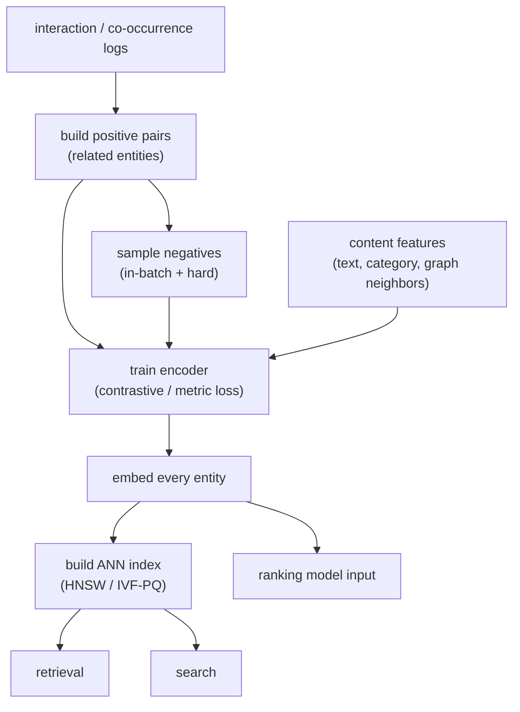

# 07 - Embeddings and representation learning

> **Interviewer:** "Half the systems on your team need a vector for a user, an
> item, or an entity: retrieval, ranking, search, dedup, all of them. Design how
> you actually learn those representations. Where do the vectors come from, how do
> you train them without explicit labels, and how do they end up powering a
> nearest-neighbor lookup in production?"

This is the question underneath [retrieval](01-candidate-retrieval.md), search,
and most of personalization. The trap is to treat "embedding" as a black box that
falls out of some model and move on. The signal is understanding that an embedding
is a *learned* representation, that the entire training problem is one of
contrast (pull related things together, push unrelated things apart), and that the
hardest and most consequential design choice is how you pick the negatives.

## 1. Clarify and scope

- **What entities, and how many?** Users, items, queries, nodes in a graph? Say
  tens of millions of items and tens of millions of users. The count sizes the
  index and the dimension budget.
- **What features does each entity have?** Pure ids (then you can only learn
  transductive embeddings and you are stuck on cold start), or content features
  (text, category, image, attributes) that let you embed unseen entities?
- **What consumes the vectors?** Retrieval via approximate nearest neighbor, a
  ranking model's input, semantic search, clustering? The consumer sets whether
  you optimize a dot product, a cosine, or just a feature vector.
- **What signal do you have?** Explicit labels are rare. Usually you have
  co-occurrence or interaction logs (user engaged with item, two items bought
  together, a query that led to a click). That implicit signal is what defines
  "related" for contrastive training.
- **Latency and freshness?** Are vectors precomputed offline and served from an
  index, or computed online per request? How fast must a new entity become
  retrievable?

## 2. Requirements

**Functional**
- Learn a fixed-length vector for each entity in a shared space where geometric
  closeness means semantic relatedness
- Embed new and unseen entities from their content features (inductive), not just
  ids seen at training time
- Feed the vectors into an approximate-nearest-neighbor index for retrieval and
  search
- Refresh embeddings as entities and behavior change

**Non-functional**
- Dimension chosen to balance recall, index memory, and search latency
- Embedding freshness: new entities embedded and indexed within minutes to hours
- Stable space across refreshes (or a coordinated reindex), so a model trained on
  yesterday's vectors is not silently mismatched today
- Throughput to embed the full catalog on each refresh within the batch window

The requirement that quietly dominates: **the space is only as good as the
negatives you train against**. You can get positives almost for free from logs;
choosing what counts as "not related" is where the model is actually shaped. Name
that early.

## 3. High-level data flow

The shape is always the same: build positive pairs from logs, contrast them
against negatives to train an encoder, run the encoder over every entity to
produce vectors, load the vectors into an ANN index, and serve the index to
everything downstream.

The encoder runs as a batch job over the whole entity set and writes vectors into
the index; new and changed entities get re-embedded and upserted on a schedule,
and that cadence is your freshness. The same vectors that feed
[retrieval](01-candidate-retrieval.md) can be reused as features in ranking, which
is half the economic case for learning them well once.

## 4. Deep dives

### What an embedding is, and why learned beats hand-built

An embedding is a dense vector that places an entity in a continuous space where
distance encodes relatedness. The contrast is with hand-built features: one-hot id
vectors are huge, sparse, and orthogonal (every item is equally far from every
other, so the representation carries no similarity at all), and manually
engineered features (category, price bucket, tags) capture only the axes a human
thought to encode. A learned embedding discovers the axes that actually predict
the behavior you trained on, compresses millions of sparse ids into a few hundred
dense dimensions, and crucially makes "similar" a geometric fact you can query
with nearest-neighbor search. That last property is what turns representation
learning into a serving primitive rather than a modeling nicety.

### Contrastive and metric learning

You rarely have labels saying "these two entities are 0.7 similar." You have
implicit positives (this user engaged with this item, these two items co-occur)
and everything else. **Contrastive learning** trains directly on that: pull the
representations of a positive pair together and push everything else apart. The
common losses:

- **InfoNCE / softmax contrastive.** For an anchor, treat its positive as the
  correct class among a set of candidates (the positive plus sampled negatives)
  and minimize cross-entropy. This is the workhorse, and it is exactly the loss
  the [two-tower retrieval](01-candidate-retrieval.md) model trains under.
- **Triplet / margin loss.** Anchor, positive, negative; require the anchor to be
  closer to the positive than to the negative by a margin. Conceptually clean,
  more sensitive to how you mine triplets.

The throughline is the same: representation quality comes from contrast, and
contrast is defined by what you sample as the negative.

### Negative sampling, the part that actually matters

This is the center of the topic, so spend time here.

- **In-batch negatives.** Take a batch of B positive pairs; for each anchor, use
  the other B-1 positives' items as negatives. The negatives come free with the
  batch, which makes this cheap and the default. Larger batches give more
  negatives and usually better embeddings, which is one reason these models like
  big batches.
- **Sampling bias and logQ correction.** In-batch negatives are sampled from the
  data distribution, so popular items appear as negatives far more often and the
  model learns to push them down unfairly. Correct the logits by subtracting
  log(sampling probability) (the **logQ correction**, equivalently
  sampled-softmax) so the in-batch softmax estimates the true full-corpus softmax
  rather than a popularity-skewed one. Mentioning this unprompted is a strong
  signal; it is the single most cited fix in production retrieval writeups.
- **Hard negatives.** In-batch negatives are mostly trivially easy (a random other
  item is obviously unrelated), so the loss saturates and the boundary stays
  fuzzy. Mining **hard negatives** (items close to the anchor in the current space
  but not actually engaged with) sharpens the decision boundary and is often where
  the real recall gains come from. The risk: some "hard negatives" are actually
  unlabeled positives (false negatives), and too many hard negatives destabilize
  training. The usual recipe is mostly in-batch negatives with a modest, carefully
  tuned fraction of hard ones.

If the interviewer pushes on "how do you make the embeddings actually good," the
honest answer is almost always "better negatives," not "a bigger encoder."

### Two-tower / dual-encoder training

The dominant architecture for entity-vs-entity relatedness is the
**dual-encoder** (two-tower): two separate encoders map the two sides (user and
item, query and document) into the same space, and the score is their dot product
or cosine. Because the score factorizes into one vector per side, you precompute
one side offline and serve the other against an ANN index. The towers usually do
not share weights, because the two sides have different features; what they share
is the output space, enforced by the contrastive loss. This is the same model
that anchors [retrieval](01-candidate-retrieval.md), seen from the representation
side: retrieval is what you *do* with the embeddings, dual-encoder contrastive
training is how you *learn* them.

### Graph embeddings

When relatedness is naturally a graph (users-to-items, items-to-items
co-purchase, social follows), graph structure carries signal that a flat encoder
misses. Two patterns worth naming:

- **GraphSAGE-style, inductive.** Instead of learning a fixed vector per node, learn
  *aggregation functions* that build a node's embedding from its own features plus
  a sample of its neighbors' features (and their neighbors', for more hops).
  Because the embedding is computed from features, you can embed a node that did
  not exist at training time, which is the inductive property that matters for
  cold start.
- **LightGCN-style.** A simplified graph convolution for recommendation: drop the
  feature transforms and nonlinearities, keep only neighborhood aggregation over
  the user-item interaction graph, and use the smoothed embeddings directly. It is
  transductive (vectors for known nodes) but cheap and a strong baseline for
  collaborative-filtering-style relatedness.

The tradeoff to state: inductive graph encoders handle new nodes and rich
features but cost more to train and serve; LightGCN-style methods are simpler and
strong on the fixed interaction graph but need a retrain or fallback for genuinely
new entities.

### Choosing dimensionality

The dimension is a three-way tradeoff, and the interview answer is to name all
three rather than pick a number:

- **Recall / quality.** More dimensions give the space more capacity to separate
  entities; gains are real but diminish, and very high dimensions can overfit and
  hurt ANN recall.
- **Memory.** Index memory is roughly entities times dimension times bytes per
  component. At tens of millions of entities, doubling the dimension doubles a
  large bill.
- **Latency.** Distance computations scale with dimension, so wider vectors make
  every ANN probe slower.

Pick a modest dimension, then tune it against the downstream consumer rather than
in isolation. If memory is the binding constraint, quantization (next section)
often buys more than shrinking the dimension.

### The index the embeddings feed

Embeddings exist to be queried, and at catalog scale that means an **approximate
nearest neighbor (ANN)** index, not exact search:

- **HNSW** (graph-based): excellent recall and latency, higher memory. The default
  when the index fits in RAM and recall matters.
- **IVF-PQ** (inverted file plus product quantization): clusters vectors and
  compresses each into a short code, cutting memory by an order of magnitude with
  some recall loss. The pragmatic choice at very large scale or tight memory, and
  the one that interacts most with your dimension choice, since PQ is another lever
  on the memory-versus-recall curve.

The tunable knob in both is how much of the index you probe: recall versus
latency. State that it exists and that you tune it against the consumer's appetite
for recall. (See [retrieval](01-candidate-retrieval.md) for the serving side of
this in full.)

### Freshness, drift, and a stable space

Two clocks, and confusing them is a classic mistake:

- **Embedding freshness.** A new entity is invisible until the encoder embeds it
  and the index is updated. Inductive encoders (content features, GraphSAGE-style)
  can embed a brand-new entity immediately from its features; id-only embeddings
  cannot, and must wait for a retrain.
- **Space drift.** When you retrain the encoder, the *axes of the space move*. A
  vector from the new model is not comparable to one from the old model, so you
  cannot upsert new vectors into an index full of old ones; you reindex the whole
  set against the new encoder, atomically. Independently, the world drifts:
  behavior shifts, the trained space slowly stops matching reality, and quality
  decays even with a frozen model. Detecting that decay belongs to
  [monitoring and drift](11-ml-monitoring-and-drift.md); the standard guard is to
  monitor downstream metrics and retrain on a cadence, then full-reindex.

### Cold start via content features

The cold-start answer is structural, not a patch: if the encoder consumes
**content features** (text, category, image, attributes, graph neighbors) rather
than only an id, a brand-new entity with no interaction history still maps to a
sensible point in the space from its content alone. This is exactly why inductive
encoders (content-based dual-encoder towers, GraphSAGE-style aggregation) matter:
they make cold start a non-event. Id-only embeddings (classic matrix
factorization, LightGCN on ids) have no vector for an unseen entity at all and
need a content-based fallback or a fresh-entity source until interactions
accumulate.

## 5. Bottlenecks and scaling

| Bottleneck | First sign | Fix | Tradeoff |
|---|---|---|---|
| Weak negatives | Recall plateaus, easy loss saturates | Add mined hard negatives | Training instability, false negatives |
| Popularity bias | Head entities mis-ranked as negatives | logQ / sampled-softmax correction | Tuning effort |
| Index memory at scale | Index does not fit in RAM | IVF-PQ, lower dimension, quantize | Recall loss |
| ANN search latency | p99 retrieval creeps up | Tune probe depth, shard, replicate | Recall vs latency |
| Embedding staleness | New entities never surface | Inductive encoder + frequent re-embed | Write-path complexity |
| Space drift on retrain | Old and new vectors incomparable | Atomic full reindex per model version | Reindex cost, coordination |
| Big-batch training cost | In-batch negatives need large B | More accelerators / gradient accumulation | Compute cost |

## 6. Failure modes, safety, eval

- **False negatives in sampling:** an unlabeled positive sampled as a hard
  negative actively teaches the model the wrong thing. Cap the hard-negative
  fraction and filter obvious near-duplicates of the positive.
- **Representation collapse:** with a weak loss or too-easy negatives, the encoder
  can map everything to a narrow region of the space; all similarities look high
  and ranking is meaningless. Watch the spread of embedding norms and pairwise
  similarities.
- **Popularity collapse:** without bias correction the space over-indexes on head
  entities and the long tail becomes unreachable; logQ correction and tail-aware
  eval guard against it.
- **Silent space drift:** a frozen encoder slowly mismatches a shifting world, or
  a half-finished reindex mixes two model versions; both degrade quietly. This is
  the bridge to [monitoring and drift](11-ml-monitoring-and-drift.md).
- **Eval:** there is no single accuracy number for an embedding. Measure it by what
  it powers: **recall@k** of the retrieval it feeds against held-out future
  positives, plus ranking metrics (NDCG, MRR) on a relatedness probe set. Tail
  recall separately from head, so popularity bias cannot hide. Then confirm end to
  end with an online A/B test, because a space that looks better on an offline
  probe does not always lift the product.

## 7. Likely follow-ups

- "Why not just use one-hot ids or hand features?" One-hot is sparse and carries no
  similarity (every entity equidistant); hand features capture only the axes a
  human picked. Learned embeddings discover predictive axes and make similarity a
  queryable geometric fact.
- "How do you train without labels?" Contrastively: positives come from
  co-occurrence or interaction logs, and you contrast each against sampled
  negatives. The labels are implicit in behavior.
- "Where do negatives come from?" In-batch for free, plus mined hard negatives for
  sharpness, with logQ correction to undo the popularity bias of in-batch
  sampling.
- "How do you pick the dimension?" Trade recall against index memory and search
  latency; pick modest and tune against the consumer, and reach for quantization
  before chasing dimension if memory is the constraint.
- "What happens to old vectors when you retrain?" The space moves; vectors across
  model versions are not comparable, so you full-reindex atomically rather than
  upserting new vectors into an old index.
- "How do you embed something brand new?" Use an inductive encoder that consumes
  content features (or graph neighbors), so a new entity gets a sensible vector
  with zero interaction history.
- "HNSW or IVF-PQ?" HNSW for recall and latency when it fits in RAM; IVF-PQ when
  memory is the binding constraint, accepting some recall loss.

---

## Trace the architectures

Representation learning is structural: the whole game is *where and how* the two
sides (or a node and its neighbors) meet, because that join is what defines the
space and what you can precompute. Open the real graphs and trace the join:

- **Two-tower dual-encoder:**
  [open it live](https://www.neurarch.com/?import=https://raw.githubusercontent.com/neurarch-ai/awesome-llm-model-zoo/main/architectures/two-tower/model.json).
  This is contrastive representation learning made concrete: two encoders map each
  side into a shared embedding space, and relatedness is the dot product at the
  very end. Follow each tower down to the similarity layer and note that the
  features never mix before it, which is exactly what lets you precompute one side
  and serve the other against an ANN index.

  

- **GraphSAGE-style recommender:**
  [open it live](https://www.neurarch.com/?import=https://raw.githubusercontent.com/neurarch-ai/awesome-llm-model-zoo/main/architectures/graph-sage-rec/model.json).
  This is inductive graph representation learning: a node's embedding is built by
  aggregating its own features with a sample of its neighbors' features, so the
  model learns aggregation functions rather than a fixed vector per id. Trace the
  neighbor aggregation and notice that, because the embedding is computed from
  features, a brand-new node gets a vector with no retrain, which is the inductive
  property that makes cold start a non-event.

  

A good exercise before an interview: open both and notice how each defines
"related." The dual-encoder defines it by a final dot product between two towers;
the graph encoder defines it by neighborhood aggregation. Where that join sits is
the whole reason one is a flat contrastive model and the other is a graph model.
These are validated reference graphs at real dimensions, shape-checked end to end,
not screenshots. Browse all in the
[Model Zoo](https://github.com/neurarch-ai/awesome-llm-model-zoo) or the
[gallery](https://neurarch-ai.github.io/awesome-llm-model-zoo). Built by
[Neurarch](https://www.neurarch.com).

## Seen in production

Real systems and references that ship the patterns above. Read them for what an
interview answer skips: how positives and negatives are mined in practice, how
graph structure is folded in, and how the learned vectors are routed into an
index.

- **Stanford / Hamilton et al.** [GraphSAGE: Inductive Representation Learning on Large Graphs](https://arxiv.org/abs/1706.02216): inductive node embeddings by aggregating neighbor features. *(graph embeddings)*
- **He et al.** [LightGCN](https://arxiv.org/abs/2002.02126): simplified graph convolution for recommendation embeddings. *(graph embeddings)*
- **Gao et al.** [SimCSE: Simple Contrastive Learning of Sentence Embeddings](https://arxiv.org/abs/2104.08821): contrastive representation learning with in-batch negatives. *(contrastive learning)*
- **Pinterest** [PinSage: Graph Convolutional Neural Networks for Web-Scale Recommender Systems](https://medium.com/pinterest-engineering/pinsage-a-new-graph-convolutional-neural-network-for-web-scale-recommender-systems-88795a107f48): inductive graph embeddings at billions of nodes, routed into a nearest-neighbor index. *(graph embeddings)*
- **Airbnb** [Listing Embeddings in Search Ranking](https://medium.com/airbnb-engineering/listing-embeddings-for-similar-listing-recommendations-and-real-time-personalization-in-search-601172f7603e): listing embeddings learned from booking sessions with negative sampling, then used for similarity and personalization. *(representation learning)*
- **Spotify** [Introducing Natural Language Search for Podcast Episodes](https://engineering.atspotify.com/2022/03/introducing-natural-language-search-for-podcast-episodes/): dense embeddings for query and episode served through an ANN index for semantic search. *(deployment)*
- **Instacart** [How Instacart uses embeddings to improve search relevance](https://company.instacart.com/how-its-made/how-instacart-uses-embeddings-to-improve-search-relevance): A two-tower transformer projecting queries and products into one scored space. *(eval bar)*
- **Wayfair** [Melange: a customer-journey embedding system](https://www.aboutwayfair.com/careers/tech-blog/introducing-melange-a-customer-journey-embedding-system-for-improving-fraud-and-scam-detection): Self-supervised customer-journey embeddings from browsing sequences for fraud detection. *(who it serves)*

More production case studies: the [Evidently AI ML system design database](https://www.evidentlyai.com/ml-system-design) (800 case studies from 150+ companies) is the broadest curated index; filter for embeddings and representation learning.
