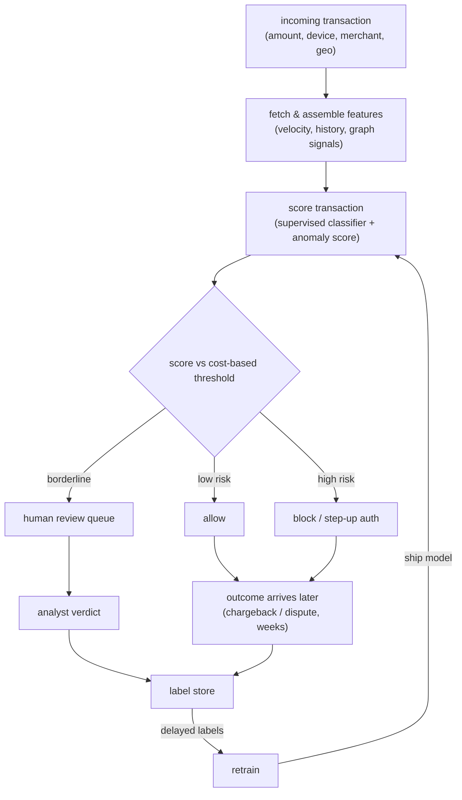
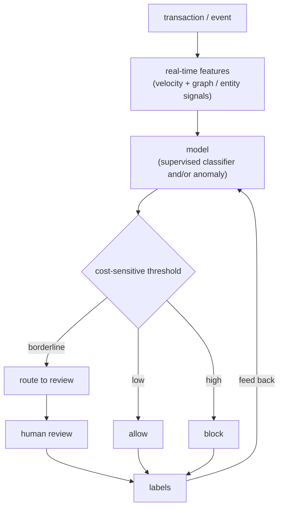

# 08 - Fraud and anomaly detection

> **Interviewer:** "Money is moving through our platform. Design a system that
> flags fraudulent transactions in real time, blocks the bad ones, lets the good
> ones through, and does not enrage legitimate customers in the process. Walk me
> through the model, the imbalance, the threshold, and how you cope with labels
> that arrive weeks late."

This is the question where the modeling instinct (train a classifier) is the easy
part and the trap is everything around it: fraud is rare, so accuracy is a lie;
the decision is cost-sensitive, so the threshold is the product; labels arrive
weeks later as chargebacks, so your training set is always stale and your live
eval is blind; and the adversary adapts on purpose, so the distribution drifts
because someone is paid to make it drift. The signal is that you treat this as a
cost-sensitive decision under extreme imbalance and adversarial drift, not as a
leaderboard accuracy contest.

## 1. Clarify and scope

- **Fraud or abuse, and what action?** Card-not-present payment fraud, account
  takeover, fake-account abuse, and promo abuse have different signals and
  different costs. And what can the system *do*: allow, block, or send to human
  review? The action set shapes the thresholds.
- **What is the base rate?** Fraud is typically well under 1 percent of
  transactions, often a fraction of that. That single number kills accuracy as a
  metric and drives the whole eval and sampling design. Ask for it early.
- **What are the costs?** A **false positive** blocks a real customer (lost sale,
  support cost, churn, brand damage). A **false negative** is a realized loss
  (the chargeback plus fees). These are not symmetric, and the ratio between them
  is what sets the decision threshold. Get the cost matrix, even roughly.
- **Latency budget?** The decision sits inline in the payment authorization flow,
  so it is milliseconds, not seconds. That constrains features to precomputed
  lookups and a cheap model, the same constraint as ranking
  ([topic 02](02-ranking-model.md)).
- **When do labels arrive?** Card-network chargebacks can land 30 to 120 days
  after the transaction. Some labels (a customer disputing instantly) are fast,
  most are slow. This delay is the defining property of the problem.
- **Supervised, unsupervised, or both?** Do we have labeled fraud (then a
  supervised classifier) or are we hunting novel patterns with no labels yet
  (then anomaly detection)? Usually both, for different jobs.

## 2. Requirements

**Functional**
- Score every transaction for fraud risk inline, before authorization completes
- Map the score to an action (allow / block / review) via a tunable threshold
- Route borderline cases to a human review queue and capture their verdicts
- Ingest delayed labels (chargebacks, disputes, manual reviews) as they arrive
  and feed them back into training
- Support both a supervised classifier and an unsupervised anomaly path

**Non-functional**
- p99 scoring latency in low tens of milliseconds, inline with auth
- Optimize **precision / recall / PR-AUC**, never accuracy
- Threshold derived from the **cost matrix**, revisited as costs and base rate move
- Online/offline feature parity, no [training-serving skew](04-feature-store-and-training-serving-skew.md)
- Drift detection on inputs and outputs, because the adversary moves on purpose
  (this is the bridge to [monitoring and drift](11-ml-monitoring-and-drift.md))

The requirement that dominates: **a cost-sensitive decision under extreme
imbalance**. Name it first. Everything else (sampling, metric choice, threshold,
review loop) is in service of getting that one decision right cheaply and fast.

## 3. High-level data flow

Two coupled paths. The inline path scores a transaction and acts in
milliseconds; the delayed-label loop closes weeks later and feeds the next
training cycle. Drawing the slow loop is the part that signals you understand the
problem.

The thing to point at: the only fast feedback is from the human review queue. The
ground-truth label (a chargeback) takes weeks, so the loop from `OUTCOME` back to
`TRAIN` is long, and your live precision/recall estimate is always lagging
reality. Design around that lag rather than pretending labels are instant.

## 4. Deep dives

### Extreme class imbalance, and why accuracy is useless

If 0.2 percent of transactions are fraud, a model that predicts "never fraud"
scores 99.8 percent accuracy and catches nothing. Accuracy rewards ignoring the
positive class, which is the entire job. So:

- **Use the right metrics.** **Precision** (of the transactions we flagged, how
  many were truly fraud) and **recall** (of the true fraud, how much we caught)
  trade off directly, and **PR-AUC** (area under the precision-recall curve)
  summarizes that tradeoff far better than ROC-AUC when positives are rare,
  because ROC-AUC is flattered by the huge true-negative mass. Lead with PR-AUC.
- **Handle the imbalance at train time.** Options, in rough order of preference:
  **class weights** (upweight the fraud class in the loss, cheap and keeps all
  data), **undersampling** the majority (fast, throws away signal), **oversampling
  the minority**, including synthetic methods like **SMOTE** (interpolates new
  minority points; useful but can blur the very boundary you care about and
  invent unrealistic samples). The honest answer: class weights or focal loss
  first, resampling if needed, and always measure on the real (imbalanced)
  distribution, never on a rebalanced eval set.
- **Keep eval honest.** Rebalance training if you like, but evaluate on the true
  base rate, or your precision number is fiction.

### The cost-sensitive decision: the threshold is the product

The model outputs a probability; the **threshold** turns it into an action, and
that threshold is a business decision, not a default 0.5. Build a cost matrix:

- False positive cost: lost sale margin + support contact + churn risk.
- False negative cost: chargeback amount + network fees + operational overhead.

Then pick the threshold that minimizes expected cost given the base rate. If a
false negative costs many times a false positive, you push the threshold down
(catch more, accept more false alarms); if blocking real customers is brutally
expensive, you push it up. Often it is not one threshold but two: below `t_low`
allow, above `t_high` block, in between **review**. Stating "I would choose the
operating point from the cost matrix, not optimize a single accuracy number" is
the senior move here.

### Label delay and its consequences

Chargebacks arrive weeks after the transaction, and this poisons both training
and eval:

- **Training.** Your most recent transactions have no mature label yet. Treating
  unlabeled-recent as "not fraud" is a labeling bug: many are fraud whose
  chargeback has not landed. You must respect a **maturation window**, only
  trusting labels old enough to be settled, which means you train on data that is
  already weeks stale, exactly when the adversary has moved on.
- **Eval.** You cannot measure last week's true precision/recall yet. Use the
  fast-but-partial signals (instant disputes, analyst verdicts from the review
  queue) as a leading indicator, and reconcile against settled chargeback labels
  once they mature. Be explicit that the live metric is an estimate with a lag.
- **Point-in-time correctness.** When you finally join the late label to
  features, use the feature values **as of the transaction time**, not now, or
  you leak the future, the same discipline as the
  [feature store](04-feature-store-and-training-serving-skew.md).

### Real-time features and serving constraints

The decision is inline with payment authorization, so feature assembly is a
lookup, not a computation. The valuable features are **velocity / aggregate**
signals: transactions per card in the last minute/hour/day, distinct devices per
account, amount versus the account's historical distribution, geo-velocity
(impossible travel). These are stateful streaming aggregates, precomputed and
served from a low-latency store, which is precisely the
[feature store](04-feature-store-and-training-serving-skew.md) problem and where
training-serving skew bites hardest: a velocity counter computed one way in batch
and another way in the streaming path means the model scores garbage in
production.

### Supervised versus unsupervised (anomaly detection)

Two tools for two jobs, and knowing when each applies is the signal:

- **Supervised classifier.** When you have labeled fraud, this is the workhorse
  and it is more accurate, because it learns exactly what known fraud looks like.
  It is blind to **novel** attack patterns it has never seen labeled.
- **Unsupervised / anomaly detection.** Isolation Forest, autoencoder
  reconstruction error, density estimation. No labels needed; flags transactions
  that deviate from normal behavior. It catches **new** fraud the supervised
  model has not learned yet, at the cost of more false positives (unusual is not
  the same as fraudulent). Use it as a first line for novel attacks and a feeder
  for the review queue, whose verdicts become labels for the supervised model.

The mature answer runs both: supervised for known fraud at high precision,
anomaly for the unknown, and the human loop converts anomaly hits into labels.

### The adversarial nature, and why drift is the default

Most ML systems drift by accident (the world changes slowly). Fraud drifts **on
purpose**: there is a human adversary actively probing your defenses and changing
behavior the moment a tactic stops working. So model decay is not an edge case,
it is the steady state. Consequences: short retrain cadence, aggressive
**monitoring** of input distributions and score distributions (a sudden shift in
the mix of declined transactions is an attack signature), and acceptance that any
fixed model degrades. Cross-link this directly to
[monitoring and drift](11-ml-monitoring-and-drift.md); fraud is the canonical
case where drift detection is a safety system, not a nicety.

### Graph signals: fraud comes in rings

Individual transactions can look clean while the **network** screams. Fraud rings
share devices, payment instruments, shipping addresses, and IPs across many
accounts. Modeling entities as a graph (accounts, devices, cards as nodes; shared
attributes as edges) surfaces this: a cluster of "new" accounts all transacting
through one device, or a card touching dozens of accounts. You can feed
graph-derived features (component size, shared-device count, ring membership) into
the tabular classifier, or run a graph neural network directly. Mentioning ring
detection shows you see fraud as a coordinated, not per-event, phenomenon.

### The human review loop

Borderline scores go to analysts, and this loop does triple duty: it catches
what the model is unsure about, it generates **fast labels** (the only labels you
get before chargebacks settle), and it provides a feedback signal for retraining.
Design it deliberately: route by expected cost (review the cases where a wrong
automated decision is most expensive), keep the queue sized to analyst capacity,
and capture verdicts as first-class labels. The review queue is where your
supervised and anomaly paths get fed; it is infrastructure, not an afterthought.

## 5. Bottlenecks and scaling

| Bottleneck | First sign | Fix | Tradeoff |
|---|---|---|---|
| Inline scoring latency | Auth p99 over budget | Cheap model, precomputed features, batch lookups | Model capacity vs speed |
| Velocity feature freshness | Counters lag the attack | Streaming aggregates to online store | Operational complexity, skew risk |
| Label delay | Recent data has no mature label | Maturation window, fast review labels as leading signal | Train on stale data |
| Class imbalance | Recall collapses | Class weights / focal loss, careful resampling | Calibration, synthetic-sample noise |
| Threshold drift | FP or FN cost spikes | Recompute operating point from cost matrix periodically | Manual tuning cadence |
| Adversarial drift | Score distribution shifts | Frequent retrain, drift alarms, anomaly path | Compute cost, false-positive churn |
| Review queue overload | Backlog grows, SLAs slip | Route by expected cost, raise review band carefully | Coverage vs analyst load |

## 6. Failure modes, safety, eval

- **Optimizing the wrong metric.** Reporting accuracy (or even ROC-AUC) on a
  0.2 percent base rate hides total failure. Eval on **PR-AUC** plus precision and
  recall **at the chosen operating point**, on the true distribution.
- **Leakage via the label.** A feature that encodes the outcome (for example a
  "was disputed" flag, or an aggregate that includes the current transaction)
  inflates offline metrics and collapses live. Point-in-time joins and an audit
  of each feature's availability at decision time prevent it.
- **Training-serving skew.** Velocity counters computed differently in batch
  versus streaming silently wreck the live model. Compute features once and share,
  or log served features and compare against training
  ([topic 04](04-feature-store-and-training-serving-skew.md)).
- **Treating unmatured data as negative.** Recent transactions whose chargebacks
  have not landed are not all legitimate. Respect the maturation window or you
  teach the model that fresh fraud is fine.
- **Adversarial adaptation.** A model that was great last month can be probed and
  defeated. Monitor input and score drift as a safety signal and retrain on the
  attack cadence, not the calendar.
- **Feedback-loop blind spots.** You only see chargebacks on transactions you
  **allowed**; blocked transactions never generate a label, so the model can never
  learn it was wrong to block a good customer. Mitigate with a small randomized
  hold-out (allow a tiny fraction of would-be-blocked transactions to measure the
  block precision) and lean on review verdicts.
- **Eval gate.** Offline PR-AUC and cost-at-threshold are the fast pre-gate;
  the real ship decision is the live blocked-fraud-dollars versus
  false-positive-rate tradeoff measured against settled labels, plus a human
  review audit.

## 7. Likely follow-ups

- "Why not accuracy?" Because fraud is well under 1 percent, so predicting "never
  fraud" scores ~99.8 percent and catches nothing. Use precision, recall, PR-AUC.
- "How do you set the threshold?" From the cost matrix: false positive blocks a
  real customer, false negative is a realized loss; pick the operating point (or
  two, for an allow/review/block band) that minimizes expected cost at the base
  rate.
- "Labels arrive weeks late, so what?" Respect a maturation window in training,
  treat fast review verdicts as a leading eval signal, reconcile against settled
  chargebacks, and never treat unmatured recent data as legitimate.
- "Supervised or anomaly detection?" Supervised for known fraud at high
  precision; unsupervised anomaly for novel attacks you have no labels for yet;
  run both and let the review queue turn anomalies into labels.
- "The fraudsters keep adapting, how do you keep up?" Treat drift as the default:
  short retrain cadence, drift monitoring on inputs and scores as a safety system
  ([topic 11](11-ml-monitoring-and-drift.md)), and an anomaly path for the
  unknown.
- "How do you catch fraud rings?" Graph signals: shared devices, cards,
  addresses, and IPs across accounts; feed graph features into the classifier or
  run a GNN over the entity graph.

---

## Trace the architectures

Fraud scoring is, at its core, a **tabular classifier**, and many production
systems use gradient-boosted trees for exactly this. A deep model is one valid
choice, and when you go deep the shape is the **wide-and-deep** one: the sparse
categorical signals that dominate fraud (device id, merchant, geo, card BIN) go
through **embedding tables**, the dense velocity and amount features feed the
network directly, and the two paths join before the score. That is the same
embedding-plus-dense wiring as ranking ([topic 02](02-ranking-model.md)), applied
to a binary fraud label. Open the real graph and trace where the sparse
categorical features enter:

- **Deep tabular classifier (wide-and-deep):**
  [open it live](https://www.neurarch.com/?import=https://raw.githubusercontent.com/neurarch-ai/awesome-llm-model-zoo/main/architectures/wide-and-deep/model.json).
  Find the embedding tables for the sparse categoricals (device, merchant, geo),
  follow the dense features through their own path, and see where the wide and
  deep branches join before the output. That is the fraud-model shape when you go
  deep instead of boosted trees.

  

A useful exercise before an interview: open it and change the embedding dimension
of the categorical features, then watch where the parameter count moves (the
embedding tables, not the dense layers). This is a validated reference graph at
real dimensions, shape-checked end to end, not a screenshot. Browse all in the
[Model Zoo](https://github.com/neurarch-ai/awesome-llm-model-zoo) or the
[gallery](https://neurarch-ai.github.io/awesome-llm-model-zoo). Built by
[Neurarch](https://www.neurarch.com).

## Seen in production

Real systems and references that ship the patterns above. Read them for what an
interview answer skips: the imbalance handling, the cost-driven threshold, the
delayed-label reality, and how teams keep models ahead of an adversary.

### The shared pipeline

Under the branding, these systems share one skeleton: an event stream feeds
real-time features (velocity aggregates plus graph and entity signals over shared
devices, cards, and addresses), a model scores it (a supervised classifier, an
unsupervised anomaly detector, or both), a cost-sensitive threshold turns the
score into allow, block, or route-to-review, and analyst verdicts plus settled
outcomes flow back as labels. The only fast feedback is the human queue; the
ground-truth chargeback loop closes weeks later.

### How they differ

| System | Learning | Features | Latency | Optimizes for | When it wins | When it breaks / watch out |
|---|---|---|---|---|---|---|
| PayPal (graph DB) | Supervised + unsupervised embeddings | Graph / entity | Real-time (sub-second) | Speed vs comprehensiveness; links repeat rings live | High-QPS inline scoring where you must resolve shared-entity links (devices, cards, addresses) at decision time | Custom million-QPS graph DB is heavy infrastructure to build and run; only pays off at payment scale |
| Stripe (Radar) | Supervised | Tabular + embeddings | Real-time (sub-100ms) | Precision inline with continuous retraining and explainability | Card-not-present auth where the score must be fast, explainable, and refreshed against fresh labels | Leans on frequent retrain to stay ahead of drift; explainability adds engineering surface |
| Uber (RGCN collusion) | Supervised | Graph | Batch scores into risk model | Precision at low added false positives (+15% reported) | Coordinated collusion across the rider-driver graph that per-event models miss | Needs labeled rings; batch cadence lags a fast-moving attack |
| Uber (Risk Entity Watch) | Unsupervised anomaly | Entity | Batch | Labels-free scoring of novel patterns across business lines | New attacks with no labels yet, scored on entities across many product lines | Unusual is not fraudulent, so more false positives; feeds review rather than auto-blocks |
| Grab (GraphBEAN) | Unsupervised | Graph (bipartite) | Batch | Catching novel fraud over known-fraud accuracy | Novel fraud with no labels, surfaced from bipartite account-device structure | Trades known-fraud precision for novelty coverage; batch, so not inline |
| Grab (RGCN) | Supervised | Graph | Batch | Less labeled data via shared-device/address correlations, explainable clusters | Fraud rings sharing devices and addresses, where explainable clusters aid analysts | Relies on meaningful shared-attribute edges; cold entities with no links are invisible |
| Airbnb (targeted friction) | Supervised | Tabular + entity | Inline | Loss function weighing friction cost vs chargeback cost | Cost-sensitive action choice where blocking outright is too blunt and friction is cheaper | Mis-tuned friction annoys good customers; the friction-vs-loss curve needs constant tuning |
| Wide & Deep (Cheng et al.) | Supervised | Sparse embeddings + dense | Real-time (inline) | Accuracy on known fraud when the model goes deep | Strong categorical signals (device, merchant, geo, BIN) that reward embeddings plus dense velocity features | Blind to novel attacks it never saw labeled; needs mature labels to train |
| SMOTE (Chawla et al.) | Supervised training technique | Tabular | Offline | Minority recall under extreme imbalance | Severe imbalance with limited minority data, to lift recall at train time | Interpolated samples can be unrealistic and blur the decision boundary; evaluate on the true base rate |

The core dividing line is whether the system needs labels: supervised methods score known fraud at high precision, while unsupervised anomaly methods trade precision to catch the novel attacks that have no labels yet.

### The systems

- **Chawla et al.** [SMOTE: Synthetic Minority Over-sampling Technique](https://arxiv.org/abs/1106.1813): the classic approach to extreme class imbalance, synthesizing minority samples instead of naive oversampling. *(class imbalance)*
- **Cheng et al.** [Wide & Deep Learning](https://arxiv.org/abs/1606.07792): the sparse-embedding-plus-dense tabular shape fraud models often use when they go deep. *(model)*
- **Stripe** [Radar engineering writeups](https://stripe.com/blog): how Stripe scores card fraud in real time with continuously retrained models. *(deployment)*
- **PayPal** [engineering blog](https://medium.com/paypal-tech): real-time fraud and risk modeling at payment scale, including graph and streaming signals. *(real-time features)*
- **Airbnb** [fraud and trust engineering](https://medium.com/airbnb-engineering): risk and abuse modeling with human review loops and graph signals. *(human review)*
- **Stripe** [How we built it: Stripe Radar](https://stripe.dev/blog/how-we-built-it-stripe-radar): ML architecture evolution, feature discovery, and explainability at sub-100ms. *(product design)*
- **PayPal** [Real-time graph database and analysis to fight fraud](https://medium.com/paypal-tech/how-paypal-uses-real-time-graph-database-and-graph-analysis-to-fight-fraud-96a2b918619a): A custom sub-second, million-QPS graph DB for real-time fraud queries. *(deployment)*
- **Uber** [Relational Graph Learning to Detect Collusion](https://www.uber.com/blog/fraud-detection/): An RGCN over the rider-driver graph; +15% precision feeding downstream risk models. *(product design)*
- **Uber** [Risk Entity Watch: anomaly detection to fight fraud](https://www.uber.com/us/en/blog/risk-entity-watch/): Unsupervised anomaly detection scoring entities without labels across business lines. *(product design)*
- **Grab** [Unsupervised graph anomaly detection for new fraud](https://engineering.grab.com/graph-anomaly-model): A GraphBEAN autoencoder on bipartite graphs catches novel fraud without labels. *(product design)*
- **Grab** [Graph for fraud detection](https://engineering.grab.com/graph-for-fraud-detection): RGCN exploits shared-device/address correlations; less labeled data, explainable clusters. *(product design)*
- **Airbnb** [Fighting Financial Fraud with Targeted Friction](https://medium.com/airbnb-engineering/fighting-financial-fraud-with-targeted-friction-82d950d8900e): A loss function weighing friction vs chargeback cost; targeted friction cuts losses. *(eval bar)*

More production case studies: the [Evidently AI ML system design database](https://www.evidentlyai.com/ml-system-design) (800 case studies from 150+ companies) is the broadest curated index; filter for fraud and anomaly detection.

## Related deep-dive drills

Rapid-fire questions that probe the modeling and systems underneath this topic, from [deep-dives.md](../deep-dives.md):

- [Class imbalance, calibration, and metrics](../deep-dives.md#class-imbalance-calibration-and-metrics)
- [Loss functions and objectives](../deep-dives.md#loss-functions-and-objectives)
- [Statistics and probability for ML](../deep-dives.md#statistics-and-probability-for-ml)
- [Commonly asked, commonly missed](../deep-dives.md#commonly-asked-commonly-missed)
