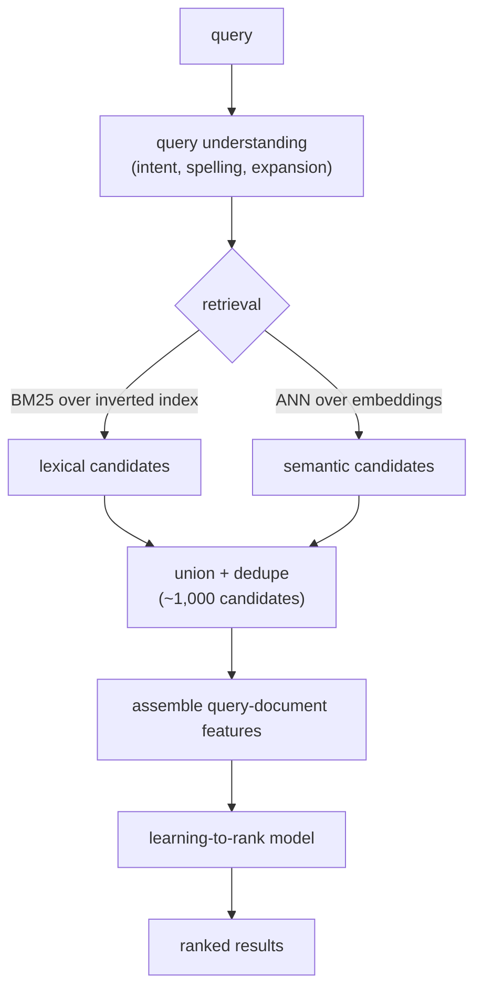
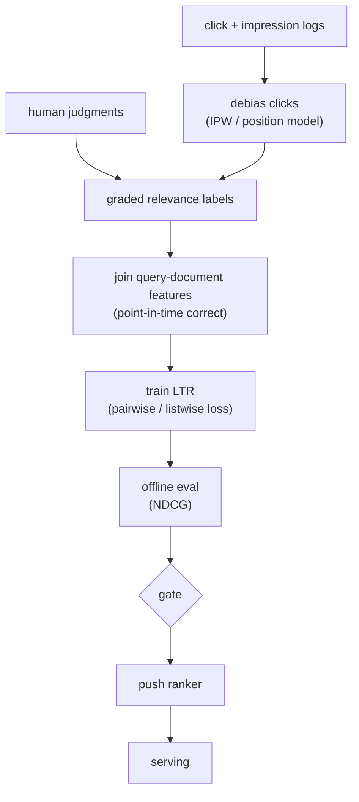
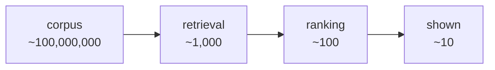
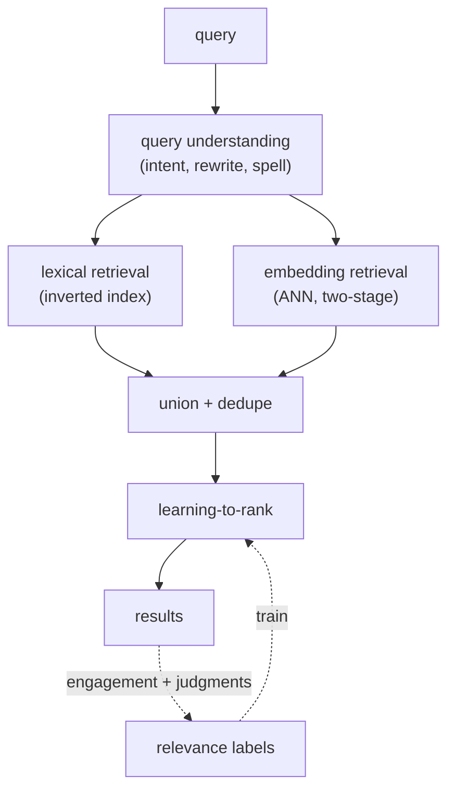

# 09 - Search ranking

> **Interviewer:** "A user types a query into our search box and we have a corpus
> of hundreds of millions of documents. Design the system that ranks documents for
> that query: how do we understand the query, get from the whole corpus to a few
> results, and order them so the best one is on top?"

Search ranking looks like recommendation with a query bolted on, but the query
changes everything. The trap is to treat it as one big relevance model and skip
the two stages that actually carry the load: understanding what the user meant,
and a retrieve-then-rank funnel that is built for an explicit query rather than a
user profile. The signal is in query understanding, in why learning-to-rank uses
pairwise or listwise objectives instead of plain classification, and in how you
deal with labels that are mostly biased clicks.

## 1. Clarify and scope

- **Corpus size and shape?** Say hundreds of millions of documents, with a long
  tail and a constant stream of new and updated documents. Both the tail and
  freshness matter.
- **Query traffic?** Tens of thousands of queries per second at peak, with a heavy
  head (a few queries are enormously common) and a long tail of rare and
  never-before-seen queries.
- **Latency budget?** Search is a single user-facing request. The whole thing
  (query understanding, retrieval, ranking, rendering) lives in low hundreds of
  milliseconds, so ranking itself gets a slice of tens of milliseconds.
- **What does "good" mean?** Relevance of the document to the query intent,
  usually graded (perfect / good / fair / bad), not a single binary. The metric
  is position-weighted, because the top slots are worth far more than the rest.
- **Personalization and context?** Some. The same query can mean different things
  by location, time, or user history. Decide early how much the query dominates
  versus the user, because it shapes the feature set.

## 2. Requirements

**Functional**
- Given a query, return a ranked list of relevant documents from the full corpus
- Understand the query first: intent, spelling, and expansion
- Incorporate new and updated documents quickly (freshness)
- Support both lexical and semantic matching, because neither alone is enough

**Non-functional**
- p99 end-to-end search latency in the low hundreds of milliseconds
- Recall high enough through retrieval that the ranker is not starved of good
  documents
- Throughput of tens of thousands of QPS with headroom
- Document freshness: new and updated documents searchable within minutes

The non-functional requirement that quietly dominates is **graded relevance under
a hard latency budget, against labels you mostly cannot trust**. Unlike
recommendation, your most abundant signal (clicks) is heavily biased by position,
and your trustworthy signal (human judgments) is scarce and expensive. Flag that
tension early; the rest of the answer is about managing it.

## 3. High-level data flow

The online path runs query understanding, then a two-stage funnel adapted to
search: lexical plus semantic retrieval, then a learning-to-rank model. The
offline path turns logged clicks and human judgments into labels and trains the
ranker.

### Online (serving) path

Query understanding runs first because everything downstream keys off it: the
corrected, expanded query drives both retrieval arms, and the parsed intent
becomes a ranking feature. The two retrieval arms are unioned, not chosen between,
because lexical and semantic each catch documents the other misses.

### Offline (label and training) path

The label step is the hard part and the reason this loop is more involved than the
[ranking](02-ranking-model.md) one: clicks come in cheap but biased, human
judgments come in trustworthy but scarce, and you have to fuse them into graded
labels before the loss ever sees them.

## 4. Deep dives

### Query understanding comes first

Before retrieval, you turn the raw query string into something the system can act
on. Three jobs, and naming all three signals you know search is not just matching
strings:

- **Intent classification.** Is this navigational (the user wants one specific
  page), informational (they want to learn something), or transactional (they want
  to do or buy something)? Intent changes what a good result looks like and becomes
  a ranking feature.
- **Spelling correction.** A large fraction of queries are misspelled. Correct
  before retrieval, or the lexical arm matches nothing. This is itself a model
  (noisy-channel or a small seq2seq) trained on query reformulation logs.
- **Query expansion.** Add synonyms, stems, and related terms so "laptop" can
  match "notebook computer." Done carefully, expansion lifts recall; done
  carelessly, it drifts the query and tanks precision. This is also where
  semantic retrieval earns its keep, because an embedding match expands the query
  implicitly without you enumerating synonyms.

A subtle point worth raising: query understanding can run as a quick pre-step or
be folded into the semantic encoder. Both happen in practice; the explicit
pre-step gives you features and debuggability, the encoder route is simpler. Name
the tradeoff.

### The two-stage funnel, adapted to search

Search uses the same retrieve-then-rank funnel as
[recommendation retrieval](01-candidate-retrieval.md), but retrieval is keyed by a
query, not a user, and it has two arms (illustrative orders of magnitude):

- **Lexical retrieval (BM25).** An inverted index maps terms to the documents
  containing them; BM25 scores documents by term frequency and inverse document
  frequency with length normalization. It is fast, interpretable, and unbeatable
  for exact-term and rare-term matches (a product code, a specific name). Its
  weakness is the vocabulary gap: it cannot match "car" to "automobile."
- **Semantic retrieval (dense).** A dual-encoder embeds the query and every
  document into a shared space; an ANN index finds the nearest documents. This is
  the same two-tower structure as recommendation retrieval, with the query taking
  the user's place. It closes the vocabulary gap but can drift on rare terms and
  exact strings, which is exactly where BM25 is strong.

You run both and union the results, because their failure modes are complementary.
This is the search-specific twist on the funnel: retrieval is two arms, and the
ranker sees the union.

### Learning-to-rank objectives: pointwise vs pairwise vs listwise

The ranker is a learning-to-rank (LTR) model, and the choice of objective is the
heart of an interview answer:

- **Pointwise.** Predict an absolute relevance score per document independently
  (regression or classification), then sort. Simple, and it reuses ordinary
  classification machinery, but it optimizes the wrong thing: it cares about
  getting each absolute score right, not about the *order*, and it ignores that
  documents for one query only matter relative to each other.
- **Pairwise.** Take pairs of documents for the same query and learn which one
  should rank higher (RankNet is the canonical example). This matches the task:
  ranking is fundamentally about relative order, and a pairwise loss optimizes
  exactly that. It is the workhorse.
- **Listwise.** Optimize a loss defined over the whole ranked list at once
  (LambdaRank/LambdaMART weight each pair by how much swapping it would change
  NDCG; ListNet defines a probability over permutations). This aligns the training
  objective with the position-weighted metric you actually report.

Why pairwise and listwise fit ranking and pointwise does not: the metric is about
order and is position-weighted, so the top slots dominate. Pointwise spends
capacity getting absolute scores right everywhere, including deep in the list where
it does not matter. Pairwise and listwise concentrate on getting the *order*
right, and listwise can directly weight the swaps that move the metric. That
alignment between loss and metric is the senior point to make.

### Relevance labels: human judgments vs click-derived labels

The model is only as good as its labels, and search labels come from two very
different sources:

- **Human judgments.** Trained raters grade query-document pairs (perfect / good /
  fair / bad) against guidelines. High quality and unbiased, but expensive, slow,
  and impossible to scale to the full query distribution. They cover the head and
  a sample of the tail, and they are the gold standard you calibrate against.
- **Click-derived labels.** Clicks are abundant and free, and they reflect real
  users, but they are biased (see position bias below) and noisy (a click is not
  the same as relevance; the user may bounce back). Techniques like dwell-time
  thresholds, last-click, and skip-above models turn raw clicks into cleaner
  relevance signals.

In practice you fuse them: human judgments anchor and validate, click-derived
labels provide volume and freshness. Saying you would use both, and why each alone
is insufficient, is the answer.

### Position bias and how to fight it

This is the deep dive that separates a search answer from a recommendation answer.
**Users click higher-ranked results more, regardless of relevance**, simply
because they see them first. If you train naively on clicks, the model learns to
predict position, not relevance, and reinforces whatever order you already shipped.
Two standard corrections, often combined:

- **Inverse-propensity weighting (IPW).** Estimate the probability that a result
  at position *p* gets examined (the propensity), then weight each click by the
  inverse of that propensity. A click at position 10 is rarer and so counts for
  more than a click at position 1. This debiases the loss so it estimates true
  relevance rather than examination. You need a propensity estimate, usually from
  a position model or small randomization (result-swap) experiments.
- **Position as a train-time feature.** Feed the displayed position into the model
  during training so it can explain away the position-driven part of the click,
  then fix or drop that feature at serving time (set it to a constant). The model
  learns relevance net of position.

Mention that you would estimate propensities carefully (randomization experiments
are the clean way, even if a little expensive) because the whole debiasing rests
on them.

### Features

The ranker's features fall into a few families, and naming them shows you know
where search relevance actually comes from:

- **Query-document match.** The core signal: BM25 score, field-level matches
  (title vs body), the semantic similarity from the dual-encoder, exact-phrase and
  proximity features. This is what makes it a *ranking* model and not a generic
  recommender.
- **Document popularity and quality.** Click-through history, links or
  authority, spam and quality scores. A relevant-but-low-quality page should not
  win.
- **Freshness.** For time-sensitive queries (news, events), recency is decisive;
  for evergreen queries it barely matters. A freshness feature plus an intent
  signal lets the model learn when to care.
- **Personalization and context.** Location, language, device, and (lightly) user
  history disambiguate queries that mean different things to different people.
  Keep it secondary to the query itself for most queries.

### The metric: NDCG and the offline-online gap

The standard offline metric is **NDCG** (normalized discounted cumulative gain).
It rewards putting highly relevant documents near the top: each result contributes
its graded relevance discounted by a function of its position, and the sum is
normalized by the ideal ordering so it lands in [0, 1]. It is the right offline
metric precisely because it is graded (matches your label scale) and
position-weighted (matches that the top slots dominate), which is also why you want
a listwise loss that optimizes something close to it.

But offline NDCG and online success do not move together reliably. Offline NDCG is
computed against your labels, which are themselves biased clicks plus a thin layer
of human judgments, so it can lie. The online truth is an interleaving experiment
or an A/B test on engagement and reformulation rate. Wire NDCG as a fast offline
pre-gate and the online test as the ship decision; never ship on offline NDCG
alone.

### Latency

Search is user-facing and synchronous, so the budget is tight and split across
stages. Query understanding must be milliseconds (small models, cached
corrections). Retrieval runs the inverted-index and ANN lookups in parallel, not
in series, and unions the results. Ranking then scores the union, so you batch the
forward pass over candidates and fetch the shared query features once. The lever
nobody states out loud: the deeper the ranker and the more candidates it scores,
the better the relevance and the worse the latency, so you size the candidate set
and the model backwards from the budget.

### When to use which

Two separate calls here: which retrieval arm carries the load, and which learning-to-rank objective you train.

Retrieval arm:

| Option | Reach for it when | Cost / skip it when |
|---|---|---|
| Lexical (BM25) | Exact-term and rare-term matches (a product code, a specific name), fast and interpretable | Vocabulary gap: cannot match "car" to "automobile" |
| Dense semantic (dual-encoder) | Synonyms and paraphrase, closing the vocabulary gap | Drifts on rare terms and exact strings; needs an ANN index and encoders |
| Hybrid union | Production default, because lexical and semantic failure modes are complementary | Two indexes to run and dedupe; more serving surface |

Learning-to-rank objective:

| Option | Reach for it when | Cost / skip it when |
|---|---|---|
| Pointwise | A simple baseline that reuses ordinary classification machinery | Optimizes absolute scores, not order, wasting capacity deep in the list |
| Pairwise (RankNet) | The workhorse when relative order is what matters | Pair count grows; does not directly target the position-weighted metric |
| Listwise (LambdaMART, ListNet) | You want the loss to track position-weighted NDCG directly | Heavier and more complex loss to train and tune |

## 5. Bottlenecks and scaling

| Bottleneck | First sign | Fix | Tradeoff |
|---|---|---|---|
| Inverted-index fan-out on common terms | Tail-latency spikes on broad queries | Shard by document, early-termination / WAND | Recall vs latency |
| ANN search latency at corpus scale | p99 retrieval creeps up | Tune probe depth, shard, IVF-PQ | Recall vs latency/memory |
| Per-candidate ranking cost | Ranking p99 over budget | Batch scoring, shrink model, fewer candidates | Accuracy vs latency |
| Position-bias in labels | Model predicts position, not relevance | IPW + position-as-feature | Needs propensity estimates |
| Scarce human judgments | Tail relevance unmeasured | Active-sample tail, fuse click labels | Labeling cost |
| Stale document index | New documents not searchable | Frequent incremental index updates | Write-path complexity |
| Offline-online metric gap | NDCG up, engagement flat | Interleaving / A/B as the gate | Slower iteration |

## 6. Failure modes, safety, eval

- **Position bias (the headline failure):** naive click training teaches the model
  to predict rank, not relevance, and locks in a feedback loop. Correct with IPW
  and position-as-a-feature, and inject a little randomization so you can keep
  estimating propensities.
- **Query understanding errors cascade:** a wrong spelling correction or an
  over-aggressive expansion poisons both retrieval arms before ranking ever runs.
  Be conservative on expansion, and keep the original query as a fallback.
- **Vocabulary gap:** lexical-only retrieval misses synonyms and paraphrases;
  semantic-only drifts on rare terms and exact strings. The union of both is the
  guard, which is why neither arm is optional.
- **Tail and zero-result queries:** rare or never-seen queries have no click
  history and may retrieve nothing. Lean on semantic retrieval and aggressive (but
  safe) expansion, and detect zero-result cases to relax the query rather than
  return an empty page.
- **Label leakage and point-in-time correctness:** join features as they were at
  query time, not now, or popularity and click features leak the future and the
  offline NDCG lies.
- **Eval:** offline use **NDCG** (and companions like MRR for navigational
  queries), computed on a held-out, debiased label set. Treat it as a pre-gate,
  not the verdict. The ship decision is an **interleaving** experiment or an
  **A/B test** on engagement and query-reformulation rate, because offline gains
  routinely fail to survive online.

## 7. Likely follow-ups

- "Why not just use BM25?" It cannot bridge the vocabulary gap (synonyms,
  paraphrases) and it has no way to learn from clicks or rich features. It is a
  great retrieval arm and a poor final ranker.
- "Why pairwise or listwise instead of just predicting a relevance score?" Because
  the metric is about order and is position-weighted. Pointwise optimizes absolute
  scores everywhere, including where it does not matter; pairwise and listwise
  optimize the order, and listwise can target NDCG directly.
- "Your clicks say result 1 is best. Do you trust that?" Not on its own. Result 1
  gets clicks because it is on top. Debias with inverse-propensity weighting and
  treat position as a train-time feature before believing any click.
- "Offline NDCG went up but engagement did not. Why?" Your labels are biased
  clicks plus thin human judgments, so offline NDCG can be optimistic. Suspect the
  label pipeline and position debiasing first, and trust the online interleaving
  or A/B test.
- "How is this different from recommendation ranking?" There is an explicit query,
  so query understanding is a first-class stage, retrieval has a lexical arm, and
  the dominant label problem is position-biased clicks rather than multi-task
  engagement. The funnel shape is shared with
  [retrieval](01-candidate-retrieval.md) and [ranking](02-ranking-model.md); the
  query is what changes.

---

## Seen in production

Real systems that ship the patterns above. Each is a first-party engineering
writeup or a foundational paper; read them for what an interview answer skips: who
the system serves, the product design, the eval bar, and the deployment shape.

### The shared pipeline

Under the product-specific detail these systems share one skeleton. A raw query is
first understood (intent, category or entity mapping, spelling, rewrites), then run
through retrieval that almost always fuses a lexical arm with an embedding arm,
often in two stages. The surviving candidates flow into a learning-to-rank stage,
and human judgments plus debiased engagement logs feed the labels that train it.
The differences are in which arm dominates and where each team spends its labeling
budget, not in the shape.

### How they differ

| System | Query understanding | Retrieval | Ranking model | Relevance-label source | When it wins | When it breaks / watch out |
|---|---|---|---|---|---|---|
| Amazon | Structured query parse | Learning-to-rank-and-retrieve (unified) | Contextual-bandit LTR | Logged engagement | Structured catalog search where one model retrieves and ranks, and the bandit keeps exploring new documents | Bandit exploration needs traffic; thin on cold and tail queries with little engagement |
| LinkedIn | IQL query translation | Hybrid (lexical + embedding EBR) | GBDT first pass, neural second pass | Crowdsourced ratings + click/engagement | Cheap GBDT casts a wide net, neural second pass adds precision within budget | Two-model stack doubles training and serving complexity; crowdsourced ratings lag |
| Pinterest SearchSage | DistilBERT query encoder | Neural ANN (HNSW) blended with text | Multi-objective relevance/engagement | Query-to-engaged-Pin pairs (saves, long clicks) | Discovery search rich in engagement pairs, where embeddings bridge the vocabulary gap | Engaged-Pin labels blur relevance with engagement; weak on exact strings and rare terms |
| Instacart (hybrid) | Category and attribute parse | Hybrid text + embedding | Two-stage ranker | Engagement + conversion logs | Grocery catalog with crisp categories and conversion as a clean downstream label | Conversion optimizes buying, not relevance; sparse signal for new items |
| Instacart (intent engine) | LLM intent + category mapping | Feeds downstream retrieval | Downstream LTR | LLM-labeled intents + engagement | Broad or ambiguous queries needing intent, where an LLM scales the labeling | LLM cost and latency; LLM label errors propagate without guardrails |
| Yelp | Business-matching features | Lexical business match | Learning-to-rank (from hand-tuned) | Human labels + engagement | Local business match where lexical plus location signals dominate; migrating off hand-tuned rules | Lexical-only retrieval misses paraphrase; no embedding arm for the vocabulary gap |
| Wayfair WANDS | n/a (eval dataset) | n/a | n/a | Human-judged relevance labels | Reproducible offline benchmarking of product-search relevance | Static dataset: no engagement, no freshness, not a live serving system |
| DCN V2 (Wang et al.) | n/a (ranking model) | n/a | Deep & Cross, explicit efficient feature crosses | n/a (ranking model) | Many sparse features where explicit crosses carry the signal, at web scale | Adds cross-layer params; solves ranking only, not retrieval or query understanding |
| Wide & Deep (Cheng et al.) | n/a (ranking model) | n/a | Wide linear over crossed features + deep net | n/a (ranking model) | Need memorization of seen feature crosses plus generalization to unseen | Wide side needs hand-engineered crosses; two-part training |
| RankNet to LambdaMART (Burges) | n/a (LTR reference) | n/a | Pairwise/listwise LTR (RankNet, LambdaMART) | Graded relevance / pairwise preferences | Metric is order and position-weighted (NDCG), over tabular ranking features | Pairwise cost grows with pair count; trees weaker on raw dense or text inputs |

The core dividing line is which retrieval arm a team leans on (lexical exactness versus embedding recall) and whether its labels come mostly from scarce human judgments or from abundant debiased engagement.

### The systems

- **Wang et al.** [DCN V2: Improved Deep & Cross Network](https://arxiv.org/abs/2008.13535): Explicit, efficient feature crosses in a ranking model used at web scale. *(ranking model)*
- **Cheng et al.** [Wide & Deep Learning](https://arxiv.org/abs/1606.07792): Memorization (wide linear over crossed features) plus generalization (deep net) for ranking. *(ranking model)*
- **Burges** "From RankNet to LambdaRank to LambdaMART: An Overview": the canonical learning-to-rank reference, walking from a pairwise RankNet loss to LambdaRank's NDCG-weighted gradients to the LambdaMART tree ensemble. The clearest single source on why ranking losses are pairwise and listwise rather than pointwise. *(learning-to-rank)*
- **Amazon** [From structured search to learning-to-rank-and-retrieve](https://www.amazon.science/blog/from-structured-search-to-learning-to-rank-and-retrieve): Unifies retrieval and ranking via learning-to-rank-and-retrieve with contextual bandits. *(product design)*
- **LinkedIn** [Improving Post Search at LinkedIn](https://www.linkedin.com/blog/engineering/search/improving-post-search-at-linkedin): Multi-stage retrieval plus learning-to-rank for member post search. *(product design)*
- **Pinterest** [SearchSage: learning search query representations](https://medium.com/pinterest-engineering/searchsage-learning-search-query-representations-at-pinterest-654f2bb887fc): A query embedding model powering search retrieval and ranking relevance. *(deployment)*
- **Instacart** [Optimizing search relevance using hybrid retrieval](https://tech.instacart.com/optimizing-search-relevance-at-instacart-using-hybrid-retrieval-88cb579b959c): Hybrid text plus embedding retrieval feeding two-stage ranking. *(deployment)*
- **Instacart** [Building the Intent Engine: query understanding with LLMs](https://company.instacart.com/tech-innovation/building-the-intent-engine-how-instacart-is-revamping-query-understanding-with-llms): An LLM-based query-understanding pipeline for intent and category mapping. *(product design)*
- **Yelp** [Learning to Rank for Business Matching](https://engineeringblog.yelp.com/2014/12/learning-to-rank-for-business-matching.html): Moving business matching from hand-tuned scoring to learning-to-rank. *(product design)*
- **Wayfair** [WANDS: a public e-commerce product-search relevance dataset](https://www.aboutwayfair.com/careers/tech-blog/wayfair-releases-wands-the-largest-and-richest-publicly-available-dataset-for-e-commerce-product-search-relevance): A public human-judged relevance-label dataset for search evaluation. *(eval bar)*
- **GetYourGuide** [Powering Millions of Real-Time Rankings with Production AI](https://www.getyourguide.careers/posts/powering-millions-of-real-time-rankings-with-production-ai): 30M+ daily ranking predictions served under 80ms, with a Tecton feature store, Airflow training, FastAPI/Kubernetes serving, and Arize drift and NDCG monitoring. *(deployment)*
- **Booking** [The Engineering Behind High-Performance Ranking Platform: A System Overview](https://medium.com/booking-com-development/the-engineering-behind-booking-coms-ranking-platform-a-system-overview-2fb222003ca6): System overview of Booking.com's ML ranking platform that personalizes search by scoring properties on user behavior and real-time price and availability signals. *(product design)*
- **Shopify** [How Shopify improved consumer search intent with real-time ML](https://shopify.engineering/how-shopify-improved-consumer-search-intent-with-real-time-ml): Semantic search using ML embeddings to understand consumer search intent beyond keyword matching for more relevant product results. *(deployment)*
- **Spotify** [Introducing Natural Language Search for Podcast Episodes](https://engineering.atspotify.com/2022/03/introducing-natural-language-search-for-podcast-episodes/): Deep-learning semantic search that matches natural-language queries to podcast episodes by meaning rather than exact keywords. *(product design)*
- Company search writeups (Etsy search, Airbnb search, Amazon) live in the curated index below; filter for search to find the production deployments and their eval bars.

More production case studies: the [Evidently AI ML system design database](https://www.evidentlyai.com/ml-system-design) (800 case studies from 150+ companies) is the broadest curated index; filter for search and ranking.

---
## Trace the architectures

Search ranking is two models wired in sequence: a dual-encoder that retrieves
semantically, and a feature-rich ranker that scores the survivors. Both have a
structural detail that static diagrams get wrong, so open the real graphs and
trace them:

- **Two-tower (query/document dual-encoder for semantic retrieval):**
  [open it live](https://www.neurarch.com/?import=https://raw.githubusercontent.com/neurarch-ai/awesome-llm-model-zoo/main/architectures/two-tower/model.json).
  Read the query tower and the document tower down to the similarity layer; note
  that they never mix features before the final dot product, which is exactly what
  lets you precompute every document vector offline and serve the semantic arm
  with ANN. This is the retrieval side of the funnel, before ranking.

  

- **DLRM (the feature-rich ranker scoring retrieved documents):**
  [open it live](https://www.neurarch.com/?import=https://raw.githubusercontent.com/neurarch-ai/awesome-llm-model-zoo/main/architectures/dlrm/model.json).
  Find the embedding tables for the sparse query-document features, follow them
  into the pairwise-interaction layer, and confirm it sits after the embeddings
  and before the top MLP. This is the learning-to-rank model that orders the
  documents retrieval handed it.

  

A good exercise before an interview: open both and trace the full path a document
takes, from the dual-encoder that retrieves it semantically to the ranker that
scores its query-document features. The position of the join in each (a late dot
product in the tower, a mid-graph interaction layer in DLRM) is the whole reason
one retrieves and the other ranks. These are validated reference graphs at real
dimensions, shape-checked end to end, not screenshots. Browse all in the
[Model Zoo](https://github.com/neurarch-ai/awesome-llm-model-zoo) or the
[gallery](https://neurarch-ai.github.io/awesome-llm-model-zoo). Built by
[Neurarch](https://www.neurarch.com).

## Related deep-dive drills

Rapid-fire questions that probe the modeling and systems underneath this topic, from [deep-dives.md](../deep-dives.md):

- [Modeling depth: which architecture moves which metric](../deep-dives.md#modeling-depth-which-architecture-moves-which-metric)
- [Loss functions and objectives](../deep-dives.md#loss-functions-and-objectives)
- [Class imbalance, calibration, and metrics](../deep-dives.md#class-imbalance-calibration-and-metrics)
- [Commonly asked, commonly missed](../deep-dives.md#commonly-asked-commonly-missed)
