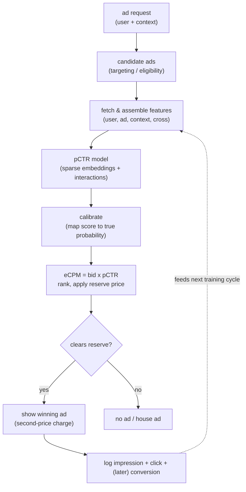
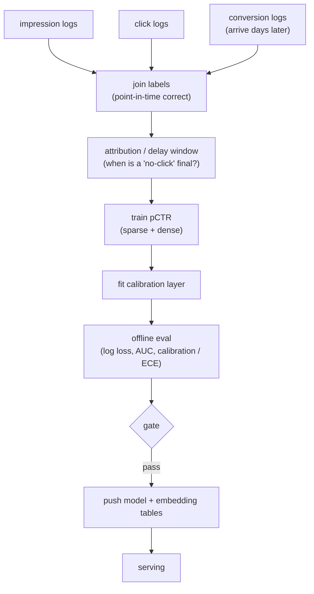
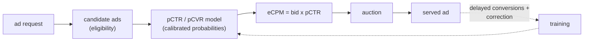

# 10 - Ads CTR prediction

> **Interviewer:** "A user loads a page and we have a slot to fill with an ad. An
> auction picks the winner from a set of eligible ads. Design the click-through-rate
> prediction system behind that auction: the model that estimates how likely each ad
> is to be clicked, fast enough and calibrated enough to set the price."

This looks like [ranking](02-ranking-model.md), and the model family overlaps, but
one requirement makes it a different problem: the predicted probability is not just
used to sort, it is **multiplied into a bid**. Expected value to the platform is
roughly bid times pCTR, so a score that is off by 20 percent does not reorder a few
ads, it mis-prices every auction it touches. In pure ranking only the order matters;
here the **number** matters. The signal in this interview is that you treat
calibration as a first-class, non-negotiable output, you know the sparse-embedding
model family, and you can reason about the auction, delayed conversions, and the
feedback loop that the logging creates.

## 1. Clarify and scope

- **What does the model predict, exactly?** Probability of click given (user, ad,
  context). Sometimes also p(conversion | click) if we bill on conversions. Be
  explicit: the label is a click on a shown ad, which is already a biased sample.
- **What consumes the score?** An **auction**. eCPM (expected cost per mille) is
  roughly bid times pCTR (times 1000), ads are sorted by eCPM, the top one wins, and
  pricing is usually **second-price-style** (you pay roughly what you needed to beat
  the runner-up, not your own bid). This is why calibration is load-bearing, not
  cosmetic.
- **How many candidates, what latency?** Tens to a few hundred eligible ads per
  request, scored inside an auction that itself sits inside a page-load budget. Tens
  of milliseconds, often less.
- **What is the feature space?** Massive and sparse: user ids, ad ids, advertiser
  ids, creative ids, placement, device, geo, plus crosses. Millions to billions of
  distinct categorical values. This sizes the embedding tables.
- **How do labels arrive?** Clicks come back in seconds. **Conversions can arrive
  days later**, or never. That delay shapes both the label pipeline and the model.

## 2. Requirements

**Functional**
- Estimate pCTR (and optionally pCVR) for every eligible ad per request
- Output a **calibrated probability**, not just an order
- Feed eCPM = bid times pCTR into the auction and apply reserve prices
- Log impressions, clicks, and (delayed) conversions for the next training cycle

**Non-functional**
- p99 scoring latency in the low tens of milliseconds for the full candidate set
- **Calibration error small and stable**: predicted probabilities must match
  observed rates, continuously, because they set prices
- Continuous or near-continuous training to track drift (new ads, new campaigns,
  shifting demand)
- Online/offline feature parity, no [training-serving skew](04-feature-store-and-training-serving-skew.md)

The requirement that dominates and that you should name first: **calibration**. In
ranking you can ship a model with great AUC and poor calibration and still win,
because you only sort. Here a miscalibrated score over-bids or under-bids in the
auction, which burns advertiser budget or leaves revenue on the table. Say this out
loud before you draw a single box.

## 3. High-level data flow

Two paths. The online path turns a request into a priced auction; the offline path
turns logged outcomes (including delayed ones) back into a fresh model.

### Online (serving) path

The dashed edge is the part that makes ads different from a static ranking system:
**you only log outcomes for ads you chose to show**, so today's model decides
tomorrow's training data. That loop is a deep dive on its own.

### Offline (training) path

The `delay window` box is doing real work: a click that has not arrived yet is not
the same as a confirmed no-click, and treating it as negative biases the model down.
More on that below.

## 4. Deep dives

### Why calibration is non-negotiable here

Repeat the chain because it is the crux: the auction computes eCPM from pCTR, ranks
on it, and charges a second-price-style amount derived from it. If pCTR is
systematically high, the platform over-values every ad and advertisers overpay (or
the auction picks the wrong winner); if it is systematically low, real revenue is
left unbilled. A model can have identical AUC before and after a calibration shift,
because **AUC only sees order**, while the auction reads the absolute value. So:

- Train with a proper loss (log loss / cross-entropy) that rewards probability
  accuracy, not just separation.
- Add a post-hoc **calibration** step (Platt scaling, isotonic regression, or a
  learned calibration layer) because negative sampling, class imbalance, and
  distribution shift all distort the raw head.
- Monitor calibration (reliability curves, expected calibration error) as a
  first-class production metric, sliced by ad, placement, and segment, not just a
  single global number. A model calibrated on average can be badly miscalibrated on
  the slices the auction cares about. This is the bridge to
  [monitoring and drift](11-ml-monitoring-and-drift.md).

### The model family: from logistic regression to deep crosses

The progression is worth narrating because each step buys one thing:

- **Logistic regression** over one-hot sparse features. Naturally calibrated, fast,
  interpretable, and for years the workhorse of ads. Its weakness is that it sees no
  feature interactions unless you hand-craft crosses.
- **GBDT + logistic regression.** Gradient-boosted trees discover useful feature
  combinations; their leaf indices become features for a linear layer. The classic
  Facebook recipe. Buys automatic interactions without a full deep model.
- **Factorization machines (FM).** Learn a latent vector per feature and model all
  pairwise interactions via dot products, which handles sparse crosses that a linear
  model cannot. The conceptual ancestor of embedding-based deep models.
- **Deep models: DeepFM, DCN, DLRM, wide-and-deep.** Sparse features go through
  **embedding tables**; the architectures differ in how they model interactions.
  **DeepFM** runs an FM component and a deep MLP in parallel sharing embeddings.
  **DCN** (deep and cross network) stacks explicit bounded-degree **cross layers**
  beside an MLP. **DLRM** takes explicit pairwise dot products between embeddings
  before a top MLP. **Wide-and-deep** pairs a linear memorization branch with a deep
  generalization branch. The shared idea: embed the sparse stuff, then model
  interactions explicitly rather than hoping an MLP discovers them.

### Where the parameters live: sparse embedding tables

The MLP at the top is small. The parameters live in the **embedding tables**: one
row per distinct categorical value times an embedding dimension. With hundreds of
millions of ad ids and user ids, the tables run to billions of parameters and
gigabytes of memory, far larger than the dense network. Two consequences:

- The tables often have to be **sharded** across machines for both training and
  serving.
- The feature space is open-ended (new ad ids appear constantly), so you cannot
  pre-allocate a row per id. The standard fix is **feature hashing**: hash each id
  into a fixed-size table. Collisions are accepted as a controlled quality cost in
  exchange for a bounded table size and graceful handling of unseen ids. Mention the
  collision tradeoff explicitly; it is the senior detail.

### The auction context, at the level an ML interview needs

You are not designing the auction, but your score has to be fit for it:

- **eCPM ranking.** Ads are ranked by expected value to the platform, roughly bid
  times pCTR (times 1000 for "per mille"). pCTR is the only learned term, so its
  scale directly moves which ad wins.
- **Reserve prices.** A floor below which the slot goes unfilled. A miscalibrated
  pCTR can push ads over or under the reserve incorrectly.
- **Second-price intuition.** The winner pays roughly the minimum eCPM it needed to
  beat the runner-up, not its own bid. This is why honest, calibrated pCTR keeps the
  auction incentive-compatible: the price is derived from the predicted value, so a
  biased prediction biases the price for everyone.

### Delayed and biased conversions

Clicks are fast, conversions are slow. A purchase attributed to an ad click might
land hours or days later, inside an attribution window. This creates two problems:

- **Delayed feedback.** At training time, a click with no conversion *yet* is not
  confirmed negative, it may convert tomorrow. Labeling it negative now biases pCVR
  downward. **Delayed-feedback modeling** addresses this, for example by jointly
  modeling the probability of conversion and the delay distribution, or by waiting a
  bounded window and correcting for the remaining tail.
- **Biased labels.** Even for clicks, you only observe outcomes for ads the system
  chose to show, and at the position it showed them. The label distribution is a
  product of past policy, not of the world.

### Feedback loops and the logging policy

You only get a click label for an ad you displayed, and you only display ads the
current model scored highly. So the model trains on data its predecessor selected, a
self-reinforcing loop: ads the model under-rates rarely get shown, so they never
accumulate the data that would correct the under-rating. Mitigations to name:

- **Exploration.** Deliberately show some ads off-policy (epsilon-greedy, Thompson
  sampling, or a small randomized slice) to gather counterfactual data.
- **Inverse-propensity weighting.** Weight logged examples by the inverse of the
  probability the old policy showed them, to debias training toward what a uniform
  policy would have seen.
- **Position bias correction.** Higher slots get clicked more regardless of
  relevance; model position as a feature at train time and neutralize it at serving.

This is the same family of biases as ranking's position bias, but here the auction
makes the loop tighter because the model literally controls the data it will learn
from.

### Real-time serving latency

Same shape as ranking ([topic 02](02-ranking-model.md)): score the whole candidate
set inside a hard budget. Batch the forward pass, fetch shared user/context features
once and broadcast across candidates, keep embedding lookups cache-friendly, and
precompute features so online work is assembly rather than computation. The
[feature store](04-feature-store-and-training-serving-skew.md) is what makes the
lookup a few-millisecond point read instead of a recomputation.

### Freshness and continuous training

Ads move fast: campaigns launch, budgets flip, creatives rotate, demand shifts
hourly. A model trained last week is stale on this morning's new ad ids (their
embeddings are untrained). The standard answer is **continuous / incremental
training**: stream fresh labeled data in and update the model (often the embedding
tables most aggressively) on a tight cadence, sometimes online learning that updates
near-continuously. The catch is that fast updates make calibration drift faster too,
so recalibration has to ride along with retraining.

## 5. Bottlenecks and scaling

| Bottleneck | First sign | Fix | Tradeoff |
|---|---|---|---|
| Embedding table size | Tables do not fit in memory | Hashing, lower dim, prune rare ids, shard | Collisions, quality loss |
| Per-candidate scoring cost | Auction p99 over budget | Batch scoring, shrink top MLP | Accuracy vs latency |
| Calibration drift | eCPM mis-prices, revenue/spend off | Frequent recalibration, monitor sliced ECE | Extra pipeline step |
| Delayed conversions | pCVR biased low, late labels | Delay-aware loss, bounded attribution window | Label latency vs freshness |
| Feedback loop / selection bias | New ads starve for data | Exploration, IPW, position correction | Short-term revenue cost |
| Feature freshness | New campaigns under-served | Continuous / incremental training | Compute cost, calibration churn |
| Feature fetch fan-out | Latency before model runs | Fetch shared features once, batch lookups | Cache staleness |

## 6. Failure modes, safety, eval

- **Miscalibration:** the signature failure of this system. A model with great AUC
  but drifted calibration silently mis-prices every auction. Detect with reliability
  curves and expected calibration error, sliced, in production, continuously.
- **Training-serving skew:** a feature computed one way offline and another online
  feeds the model a distribution it never trained on, and it corrupts calibration
  too. Compute features once and share them, or log served features and compare.
  See [feature store](04-feature-store-and-training-serving-skew.md).
- **Delayed-feedback bias:** counting not-yet-converted clicks as negatives drags
  pCVR down and under-bids real value. Use a delay-aware label pipeline.
- **Feedback-loop collapse:** without exploration the model narrows to what it
  already shows and stops learning the rest of the inventory. Budget for exploration.
- **Position bias:** naive labels teach the model to predict slot, not relevance.
  Correct at train time.
- **Cold start:** new ads, advertisers, and users have untrained id embeddings. Lean
  on content, advertiser-level, and contextual features until the id warms up.
- **Eval:** offline use **log loss** (rewards calibrated probabilities, unlike AUC),
  **AUC** (ranking quality), and **calibration error**. But the score sets prices
  and shapes future data, so the real gate is an **online A/B test** on revenue,
  advertiser ROI, and calibration stability together, never a single offline number.

## 7. Likely follow-ups

- "Why is calibration non-negotiable for ads but optional for ranking?" Because the
  auction multiplies pCTR into a bid and derives a price from it, so the absolute
  value sets money. Pure ranking only sorts, where order is all that matters.
- "AUC went up but revenue dropped, what happened?" Suspect calibration first: the
  new model orders better but its probabilities shifted, so eCPM and pricing moved.
  Also check skew, delayed-feedback bias, and the feedback loop.
- "Where do the parameters live and how do you bound them?" In the sparse embedding
  tables, not the MLP. Bound them with feature hashing into a fixed-size table,
  accepting collisions, plus low dimensions and pruning rare ids.
- "A conversion arrives three days after the click. How does training handle it?"
  Delayed-feedback modeling: do not treat a not-yet-converted click as a confirmed
  negative; jointly model conversion probability and delay, or use a bounded window
  with a correction.
- "Your model only sees clicks on ads it chose to show. Isn't that circular?" Yes,
  that is the feedback loop. Break it with exploration (off-policy traffic),
  inverse-propensity weighting, and position-bias correction.
- "DeepFM vs DCN vs DLRM vs wide-and-deep?" All embed sparse features; they differ in
  how interactions are modeled: FM-plus-deep in parallel (DeepFM), explicit stacked
  cross layers (DCN), explicit pairwise dot products before a top MLP (DLRM),
  linear-memorization plus deep-generalization branches (wide-and-deep).

---

## Trace the architectures

CTR models are exactly where the embedding-table-into-interaction wiring matters, and
where static diagrams mislead: the sparse and dense paths merged at the wrong point,
the interaction drawn into the wrong layer, the table sizes invisible. Open the real
graphs and trace sparse features through the interaction step to the score:

- **DLRM (the canonical CTR model):**
  [open it live](https://www.neurarch.com/?import=https://raw.githubusercontent.com/neurarch-ai/awesome-llm-model-zoo/main/architectures/dlrm/model.json).
  This is the structure to be able to draw: sparse categorical features into their own
  **embedding tables**, dense features through a bottom MLP, then **explicit pairwise
  interactions** (a dot product between every pair) feeding a top MLP that outputs the
  score. Find the embedding tables and confirm the interaction sits after them and
  before the top MLP. Then notice that the embedding tables, not the MLPs, dominate
  the parameter count.

  

- **Wide-and-deep (memorize plus generalize, the CTR baseline):**
  [open it live](https://www.neurarch.com/?import=https://raw.githubusercontent.com/neurarch-ai/awesome-llm-model-zoo/main/architectures/wide-and-deep/model.json).
  Trace the two paths: the wide linear branch over crossed categorical features that
  **memorizes** frequent specific combinations, and the deep embedding-plus-MLP branch
  that **generalizes** to unseen crosses, and see where they join before the output.

  

A good exercise before an interview: open DLRM, find where the parameters actually
live (the embedding tables, not the MLPs), then change the embedding dimension and
watch the parameter count move. These are validated reference graphs at real
dimensions, shape-checked end to end, not screenshots. Browse all in the
[Model Zoo](https://github.com/neurarch-ai/awesome-llm-model-zoo) or the
[gallery](https://neurarch-ai.github.io/awesome-llm-model-zoo). Built by
[Neurarch](https://www.neurarch.com).

## Seen in production

Real systems and references that ship the patterns above. Read them for what an
interview answer skips: the calibration discipline, the embedding-table scale, the
delayed-feedback and feedback-loop handling, and the deployment shape.

### The shared pipeline

Every one of these systems collapses to the same skeleton: a request pulls a set of
eligible ads, a sparse-embedding model scores each into a **calibrated** pCTR (and
often pCVR), and the auction turns that probability into money via eCPM = bid times
pCTR. Because clicks are fast but conversions land days later, the training loop has
to correct for labels that have not arrived yet, and it only ever sees outcomes for
ads the previous model chose to show. The differences below are mostly about which
model family carries the interactions and how honestly each team keeps the
probability calibrated as it drifts.

### How they differ

| System | Model family | Calibration approach | Delayed feedback | Task shape |
|---|---|---|---|---|
| Meta DLRM | Embeddings + explicit dot-product interactions | Proper loss (log loss) | Not the paper's focus | Single-task |
| Facebook GBDT + LR | Boosted-tree leaves feeding a linear model | Naturally calibrated linear head | Data-freshness cadence | Single-task |
| Wide & Deep (Google Play) | Wide linear + deep embedding MLP | Proper loss on the joint model | Not addressed | Single-task |
| Pinterest | AutoML shared-bottom, multi-tower MLPs | Per-head Platt scaling (up to 80% error cut) | Not addressed | Multi-task |
| LinkedIn | Three-tower DNN (wide, deep, shallow) | Isotonic + shallow calibration tower | Not the focus (exposure-bias fix) | Single-task |
| Instacart | Deep CTR with transfer learning | Transfer-learned calibration to observed rates | Not the focus | Single-task |
| Twitter | Continuous-training CTR | Proper loss under corrected labels | Fake-negative weighted loss | Single-task |
| Criteo | Display CTR / CVR | Proper loss on corrected labels | Two-model delay approach | Single-task |
| Google (Factory Floor) | Large sparse CTR with feature crosses | Calibration as a first-class metric | Bounded windows | Single-task |

### The systems

- **Meta** [Deep Learning Recommendation Model (DLRM)](https://arxiv.org/abs/1906.00091): sparse embeddings plus explicit interactions, the canonical CTR architecture. *(model)*
- **Guo et al.** [DeepFM](https://arxiv.org/abs/1703.04247): factorization-machine plus deep network for CTR. *(model)*
- **Wang et al.** [DCN V2](https://arxiv.org/abs/2008.13535): explicit bounded-degree feature crosses for CTR ranking. *(model)*
- **Cheng et al.** [Wide & Deep Learning](https://arxiv.org/abs/1606.07792): memorization plus generalization, the Google Play CTR model. *(model)*
- **Facebook** Practical Lessons from Predicting Clicks on Ads (GBDT + logistic regression): the classic recipe of boosted-tree features feeding a calibrated linear model, with hard-won notes on calibration and data freshness. Find it via the index below. *(deployment)*
- **Pinterest** [AutoML, multi-task, multi-tower models for Pinterest Ads](https://medium.com/pinterest-engineering/how-we-use-automl-multi-task-learning-and-multi-tower-models-for-pinterest-ads-db966c3dc99e): A Platt-scaling calibration layer cut day-to-day error up to 80%. *(product design)*
- **LinkedIn** [Lessons from a deep-learning ads CTR prediction model](https://www.linkedin.com/blog/engineering/machine-learning/challenges-and-practical-lessons-from-building-a-deep-learning-b): Replacing GLMix with a three-tower DNN; calibration under exposure bias. *(deployment)*
- **Instacart** [Calibrating CTR Prediction with Transfer Learning](https://tech.instacart.com/calibrating-ctr-prediction-with-transfer-learning-in-instacart-ads-3ec88fa97525): Transfer learning aligns predicted CTR with observed click frequency. *(eval bar)*
- **Twitter** [Addressing Delayed Feedback in CTR prediction](https://arxiv.org/abs/1907.06558): A fake-negative weighted loss for delayed labels in continuous training. *(product design)*
- **Google** [On the Factory Floor: ML engineering for industrial-scale ads](https://arxiv.org/abs/2209.05310): A search-ads CTR model: calibration, feature crosses, reproducibility at scale. *(deployment)*
- **Criteo** [Modeling delayed feedback in display advertising](https://bibtex.github.io/KDD-2014-Chapelle.html): A two-model approach deciding when an unconverted click counts as negative. *(product design)*

More production case studies: the [Evidently AI ML system design database](https://www.evidentlyai.com/ml-system-design) (800 case studies from 150+ companies) is the broadest curated index; filter for ads and CTR prediction.
