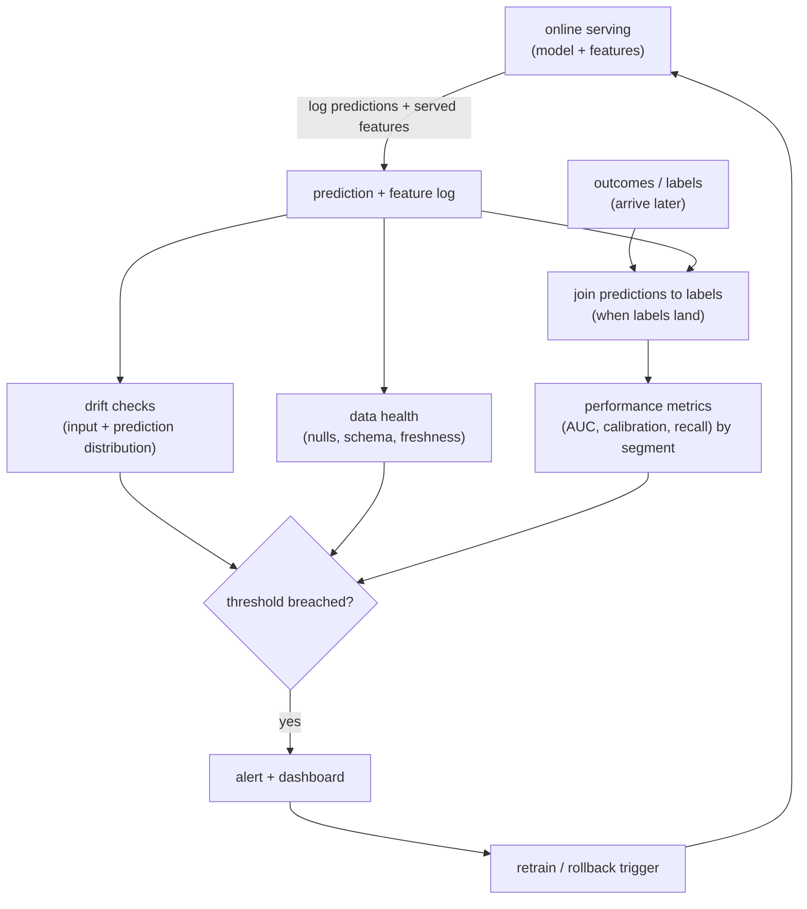
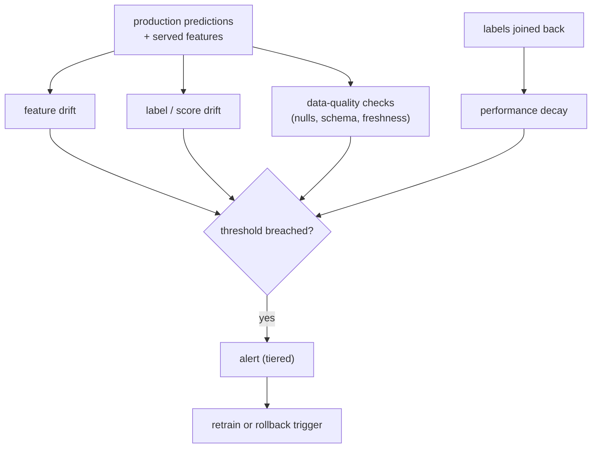

# 11 - ML monitoring and drift

> **Interviewer:** "A recommendation model you launched six months ago was great
> at launch. Engagement has been quietly sliding ever since and nobody noticed
> until a product manager complained. Design the monitoring that would have caught
> this before users did, and the loop that keeps the model healthy."

This is the topic that separates people who have *operated* a model from people who
have only trained one. A model is not a deploy-and-forget artifact; the world it
predicts on moves, and accuracy decays. The signal here is that you monitor inputs,
predictions, and outcomes (not just uptime), that you understand *why* models
degrade, and that you close the loop back to retraining.

## 1. Clarify and scope

- **What is the model and its objective?** A CTR ranker, a retrieval model, a fraud
  classifier? The metric you ultimately care about (and how fast labels arrive)
  differs.
- **How fast do labels arrive?** This is the crucial question. If you learn the
  truth in seconds (did they click), you can monitor accuracy almost live. If
  labels are delayed by days or weeks (did the loan default, did the user churn),
  you cannot, and you need proxy signals in the meantime.
- **What is the cost of a silent regression?** A slightly worse feed is tolerable;
  a degraded fraud or pricing model is expensive. This sets alert sensitivity.
- **What can we log?** Predictions, the exact features served, and eventually the
  labels. Without logging the *served* features you cannot diagnose skew or drift.
- **How often can we retrain?** The monitoring loop is only useful if it can
  trigger a response, so the retrain cadence bounds how tight the loop can be.

## 2. Requirements

**Functional**
- Log predictions, the features that produced them, and outcomes when they arrive
- Detect input drift, prediction drift, and (when labels arrive) performance decay
- Detect pipeline and data-health failures (nulls, schema changes, stale features)
- Alert a human, and feed a retraining trigger
- Slice every signal by segment, not just in aggregate

**Non-functional**
- Catch degradation before users feel it, and before the next scheduled retrain
- Low false-alarm rate, or alerts get ignored
- Cheap enough to run continuously
- Diagnosable: an alert should point at *what* changed, not just *that* something did

## 3. High-level data flow

Monitoring is a loop that runs alongside serving, not a one-time check.

The key structural fact: drift and data-health checks run **immediately** on the
prediction log, while true performance metrics wait for labels. A good system uses
the fast signals as an early warning for the slow one.

## 4. Deep dives

### Why models decay (name the three causes)

- **Data drift (covariate shift).** The input distribution moves: new users, new
  items, seasonality, a marketing campaign changing the traffic mix. The model is
  unchanged but now sees inputs unlike its training data.
- **Concept drift.** The relationship between inputs and the label changes: what
  made users click last year does not this year. Even with identical inputs, the
  right answer moved.
- **Pipeline and data-quality bugs.** The most common cause in practice, and the
  least glamorous: an upstream schema change, a feature that silently started
  returning nulls, a broken materialization freezing a feature
  ([topic 04](04-feature-store-and-training-serving-skew.md)). This looks like
  drift but is really a bug, and you must distinguish them.

Naming all three, and saying that pipeline bugs are the most frequent real cause,
signals operational experience.

### The label-delay problem

You cannot measure accuracy until you know the truth, and the truth often arrives
late. This is the central constraint of ML monitoring. Two consequences:

- **You need leading indicators.** While labels are pending, watch what you *can*
  see now: input drift and prediction drift. If the input distribution or the
  distribution of the model's own scores shifts sharply, that is an early warning
  the delayed performance metric is about to move.
- **Performance metrics lag.** When labels do arrive, compute the real metrics
  (AUC, calibration, recall, depending on the model) and treat them as the ground
  truth that confirms or clears the early warning.

Articulating "monitor input and prediction drift as the fast proxy, confirm with
performance once labels land" is exactly the senior framing.

### What to monitor, in layers

1. **Data health.** Nulls, out-of-range values, schema changes, feature freshness.
   Cheap, catches the most common (pipeline-bug) failures fastest.
2. **Input drift.** Has each feature's distribution moved from a reference window?
   Catches covariate shift before performance is measurable.
3. **Prediction drift.** Has the distribution of the model's output scores shifted?
   A sudden change in the score distribution often precedes a measured drop, and it
   needs no labels.
4. **Performance, by segment.** Once labels arrive: AUC, calibration, recall, the
   business metric. Always sliced, because an aggregate hides a regression that
   hits one segment (a language, a region, a new user cohort).

### Detecting drift

You compare a current window against a reference (usually the training
distribution or a healthy recent baseline):

- **Population Stability Index (PSI)** and **KL divergence** for how much a
  distribution has moved.
- **Kolmogorov-Smirnov (KS) test** for continuous features, **chi-square** for
  categorical.
- Set thresholds from observed historical variation, not from guesses, or you
  drown in false alarms. The hard part of drift detection is calibrating "how much
  movement is normal" so alerts mean something.

### Alerting without alert fatigue

A monitor nobody trusts is worse than none. Keep false positives low: alert on
sustained breaches, not single noisy points; tier severity (a page for a fraud
model, a dashboard note for a feed model); and make every alert **diagnosable** by
pointing at the specific feature or segment that moved. An alert that says "AUC
dropped, and feature X drifted in segment Y" gets acted on; "something is wrong"
gets muted.

### Closing the loop to retraining

Monitoring is only worth it if it drives a response:

- **Scheduled retraining** on fresh data handles slow, steady drift, and is the
  baseline.
- **Triggered retraining** fires when a monitor breaches: drift or a performance
  drop kicks off a retrain on recent data, which then goes through the eval gate
  before promotion (the same gate as any model change).
- **Rollback** is the fast path: if a freshly promoted model is the cause, revert
  to the previous version in one step while you investigate.

Tie this back to [feature monitoring](04-feature-store-and-training-serving-skew.md):
a frozen or skewed feature shows up here as drift, so feature freshness is one of
the first things monitoring should watch.

## 5. Bottlenecks and scaling

| Bottleneck | First sign | Fix | Tradeoff |
|---|---|---|---|
| Label delay | Cannot measure accuracy in time | Lead with input/prediction drift as proxy | Proxy is indirect |
| Alert fatigue | Real alerts get ignored | Thresholds from history, sustained breaches, severity tiers | Slower to fire |
| Aggregate blind spots | A segment regresses unnoticed | Slice every metric by segment | More dashboards/cost |
| Monitoring cost | Continuous checks over high volume | Sample, aggregate windows, cheap drift stats first | Coverage vs cost |
| Distinguishing bug vs drift | Chasing "drift" that is a pipeline break | Data-health checks first, then drift | Extra checks |
| Slow response | Drift caught but model stays stale | Triggered retraining + one-step rollback | Pipeline complexity |

## 6. Failure modes, safety, eval

- **Silent decay:** the failure in the prompt. No monitoring, so a slow slide goes
  unnoticed until a human complains. Leading drift signals plus segmented
  performance are the defense.
- **Mistaking a bug for drift:** retraining to "fix drift" that is actually a
  broken feature wastes a cycle and can bake the bug in. Data-health checks first.
- **Feedback loops:** the model influences the data it is later trained on (you
  only see outcomes for what you showed). Monitor for the distribution narrowing
  over time, and keep some exploration ([topic 01](01-candidate-retrieval.md)).
- **Reference-window staleness:** comparing against an outdated baseline flags
  normal seasonal change as drift. Refresh the reference deliberately.
- **Eval of the monitor itself:** track its precision (did alerts correspond to
  real regressions) and recall (did real regressions get caught). A monitor is a
  detector and deserves its own quality bar.

## 7. Likely follow-ups

- "The model is degrading but you have no labels yet. What do you watch?" Input
  drift and prediction-score drift as leading indicators, confirmed by performance
  once labels arrive.
- "Data drift versus concept drift?" Drift is the inputs moving; concept drift is
  the input-to-label relationship moving. Different fixes (retrain on fresh data
  helps drift more cleanly than concept drift).
- "How do you avoid alert fatigue?" Thresholds set from historical variation,
  alert on sustained breaches, tier by severity, make alerts diagnosable.
- "How is this different from normal service monitoring?" Latency and error rate
  tell you the service is up; they say nothing about whether the predictions are
  still any good. ML monitoring watches the data and the outcomes, not just the
  process.
- "How do you close the loop?" Scheduled retraining as baseline, triggered
  retraining on breach through the eval gate, one-step rollback for a bad promote.

---

## Trace the architectures

Monitoring is a process, not a model, so there is no neural graph for the monitor
itself. What you monitor is a served model whose behavior drifts as the world
moves. For a retrieval model, "drift" is concrete: the user and item embeddings
that were well-separated at training time slowly stop matching real engagement as
the catalog and user base change. Open the model you would be watching:

- **A served model you monitor for drift (two-tower retrieval):**
  [open it live](https://www.neurarch.com/?import=https://raw.githubusercontent.com/neurarch-ai/awesome-llm-model-zoo/main/architectures/two-tower/model.json).
  The embeddings each tower produces are exactly what goes stale as the world
  shifts; recall drift against held-out recent engagement is the performance signal
  this topic tells you to watch.

  

This is a validated reference graph at real dimensions, shape-checked end to end,
not a screenshot. Browse all in the
[Model Zoo](https://github.com/neurarch-ai/awesome-llm-model-zoo) or the
[gallery](https://neurarch-ai.github.io/awesome-llm-model-zoo). Built by
[Neurarch](https://www.neurarch.com).

## Seen in production

Real references and tooling for the patterns above. Read them for what an
interview answer skips: how teams handle label delay, calibrate drift thresholds,
and tell a pipeline bug apart from genuine drift.

### The shared pipeline

Every system here logs production predictions alongside the exact features that produced them, then runs cheap distribution and data-quality checks on that log immediately while true performance metrics wait for labels to land. Detectors watch three things: feature drift (a feature's distribution moving off its reference), label or score drift (the prediction distribution shifting before labels confirm it), and performance decay once outcomes join back. Breaches feed an alerting layer tiered by severity, which either pages a human, triggers a retrain, or fires a rollback. The consistent move is to lead with the fast, label-free signals as an early warning for the slow performance metric.

### How they differ

| System | Drift type detected | Detection method | Alerting | Action taken |
|---|---|---|---|---|
| Evidently AI | Feature + prediction drift | PSI, KS, chi-square distribution tests | Report / dashboard driven | Feeds retrain decision (tooling) |
| Uber D3 | Partial data / feature drift | Column stats vs Prophet dynamic thresholds | PagerDuty oncall on breach | Detect + alert, manual response |
| Uber deploy-safety | Feature drift + online-offline skew | Statistical tests, schema validation, shadow testing | Alerts can block promotion | Auto-rollback, gradual rollout, shadow |
| Lyft | Score + performance drift | Feature validation, anomaly + drift detection | Anomaly-based alerts | Retrain trigger |
| Netflix | Prediction + data drift | Logging, monitoring, explainability layer | Observability dashboards | Diagnose, then retrain |
| Shopify | Feature drift | Distribution monitoring (fraud example) | Monitoring surfaces | Retrain on drift |

### The systems

- **Chip Huyen** [Data Distribution Shifts and Monitoring](https://huyenchip.com/2022/02/07/data-distribution-shifts-and-monitoring.html): the clearest single read on covariate vs concept drift, label delay, and what to actually monitor. *(foundations)*
- **Google** [Rules of Machine Learning](https://developers.google.com/machine-learning/guides/rules-of-ml): the production discipline, including watching for silent failures in the data feeding the model. *(discipline)*
- **Evidently AI** [open-source drift detection](https://github.com/evidentlyai/evidently): concrete drift metrics (PSI, KS, distribution tests) and report tooling; the methods implemented and runnable. *(tooling)*
- **"Hidden Technical Debt in Machine Learning Systems"** (Sculley et al., NeurIPS 2015): the classic paper on why ML systems rot in production: entanglement, feedback loops, the CACE principle. *(foundations)*
- **Uber** [D3: an automated system to detect data drifts](https://www.uber.com/blog/d3-an-automated-system-to-detect-data-drifts/): Column-level data-drift detection with Prophet anomaly detection across 300+ datasets. *(deployment)*
- **Uber** [Model Excellence Scores: enhancing ML quality at scale](https://www.uber.com/en-GB/blog/enhancing-the-quality-of-machine-learning-systems-at-scale/): An SLA-style scoring framework measuring model quality across lifecycle phases. *(eval bar)*
- **Uber** [Raising the Bar on ML Model Deployment Safety](https://www.uber.com/us/en/blog/raising-the-bar-on-ml-model-deployment-safety/): Shadow testing, automated rollbacks, and real-time data-quality checks. *(deployment)*
- **Lyft** [Full-Spectrum ML Model Monitoring at Lyft](https://eng.lyft.com/full-spectrum-ml-model-monitoring-at-lyft-a4cdaf828e8f): Feature validation, score monitoring, anomaly and performance-drift detection. *(eval bar)*
- **Netflix** [ML Observability: transparency for payments and beyond](https://netflixtechblog.com/ml-observability-bring-transparency-to-payments-and-beyond-33073e260a38): A logging, monitoring, and explaining framework for ML observability. *(deployment)*
- **Shopify** [Shopify's Playbook for Scaling Machine Learning](https://shopify.engineering/shopify-playbook-scaling-machine-learning): A scaling playbook covering monitoring and feature drift with a mobile-fraud example. *(who it serves)*

More production case studies: the [Evidently AI ML system design database](https://www.evidentlyai.com/ml-system-design) (800 case studies from 150+ companies) is the broadest curated index; filter for monitoring and observability.

## Related deep-dive drills

Rapid-fire questions that probe the modeling and systems underneath this topic, from [deep-dives.md](../deep-dives.md):

- [Features, leakage, and training-serving skew](../deep-dives.md#features-leakage-and-training-serving-skew)
- [Statistics and probability for ML](../deep-dives.md#statistics-and-probability-for-ml)
- [Class imbalance, calibration, and metrics](../deep-dives.md#class-imbalance-calibration-and-metrics)
- [Commonly asked, commonly missed](../deep-dives.md#commonly-asked-commonly-missed)
