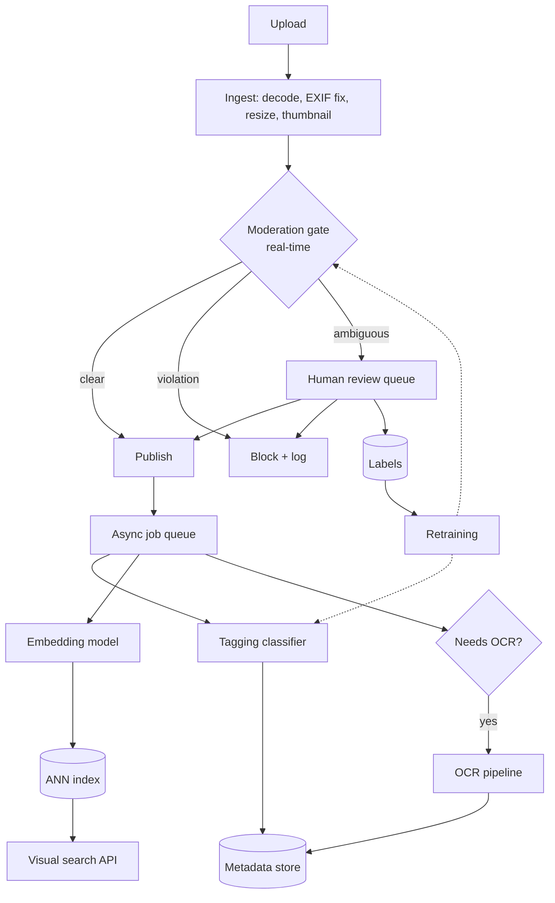
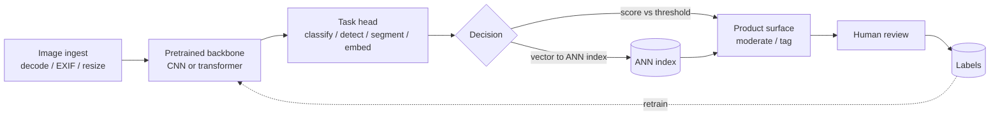

# 12 - Computer vision

> **Interviewer:** "We let hosts and sellers upload photos to our marketplace. Product wants three things off the same pipeline: auto-tag each photo (bedroom, kitchen, exterior), block anything unsafe or off-policy before it goes live, and let buyers search the catalog by uploading a picture of something they like. Tens of millions of images a day, a long tail of weird categories, and legal is nervous about the moderation part. Walk me through how you would build it."

The naive answer is "fine-tune a CNN and serve it." The signal is whether you see that this is not one model but a family of tasks (classification, detection, segmentation, embedding, OCR) with different label costs, different metrics, and wildly different failure economics. A tagging mistake is cosmetic; a moderation miss that lets illegal content go live is a legal and trust event, so you tune moderation for recall at a fixed precision floor, not accuracy. A strong candidate anchors on pretrained backbones and transfer learning (you almost never train from scratch), treats labeling as the real budget line, and reasons about GPU serving cost per million images the same way they reason about model quality. Accuracy is the wrong headline metric for almost everything here.

## 1. Clarify and scope

Questions I would ask before drawing anything:

- **Which tasks are actually in scope?** "Tag, moderate, search" hides four or five distinct model types. I want to enumerate them so we size labeling and serving per task, not in aggregate.
- **Real-time or batch?** Moderation on upload is a real-time gate (blocks publish, needs a latency budget). Tagging can be async and batched. Visual search index-build is offline; query is online. These have opposite cost profiles.
- **What is the harm taxonomy for moderation?** Nudity, violence, weapons, hate symbols, PII in images, off-marketplace items. Each is a separate policy with its own precision and recall target and possibly its own legal reporting obligation.
- **Do we have labeled data or a cold start?** If cold, the first milestone is a labeling pipeline and weak supervision, not a model.
- **Image characteristics.** Resolution range, EXIF orientation, aspect ratios, color vs grayscale, screenshots vs photos, presence of text (drives whether OCR matters).
- **Volume and growth.** Photos per day, peak upload rate, total corpus size for the search index. This sets GPU count and index sharding.
- **Human review capacity.** Moderation almost always has a human queue behind it. The model's job is to route, not to be the final arbiter for hard cases.
- **Latency and freshness SLAs.** How long can a photo sit in "pending review" before it hurts the host experience?

Scope for this design: real-time moderation gate, async multi-label tagging, and an offline-indexed visual search. I will note OCR as a conditional sub-pipeline.

## 2. Requirements

**Functional**

- Multi-label classify each uploaded photo into a room/category taxonomy (tens to low hundreds of classes, long-tailed).
- Moderate each photo against N policy classes before publish; auto-block clear violations, route ambiguous cases to human review.
- Embed each catalog photo into a vector space; support "search by image" and "similar items" via nearest neighbor.
- Optionally extract text from photos (OCR) when the category suggests documents, receipts, or signage.

**Non-functional**

- **Moderation latency:** p99 under a few hundred ms so publish is not visibly blocked; degrade to async-hold if the model is slow rather than letting content through.
- **Tagging latency:** async, minutes is fine; optimize throughput and cost per million.
- **Search query latency:** p99 tens of ms for the ANN lookup, plus one embedding forward pass.
- **Availability:** moderation is on the critical publish path, so it needs a defined fail-closed vs fail-open policy (I would fail-closed to human review for the highest-harm classes).
- **Cost:** GPU inference is the dominant line item at this volume; the design must state cost per million images, not just per request.

**Metrics (state these explicitly, do not say "accuracy")**

- Classification/tagging: per-class precision and recall, macro-averaged to expose the long tail, plus a confusion matrix on the head classes.
- Detection: mAP at IoU thresholds (COCO-style mAP@[.5:.95]), and precision/recall at the chosen confidence operating point.
- Segmentation: mean IoU (and boundary IoU if edges matter).
- Moderation: recall at a fixed precision floor per harm class, and the human-review queue rate that operating point implies.
- Search/embedding: recall@k and mAP over a labeled relevance set, plus click or conversion as the online proxy.

## 3. High-level data flow

The shared foundation is the ingest stage (decode, correct EXIF orientation, resize to a canonical resolution, strip metadata, generate thumbnails) and a set of pretrained backbones. Moderation runs synchronously on the publish path. Everything else runs off a job queue after publish. Human review decisions flow back as fresh labels, which is the single most valuable data source in the whole system.

## 4. Deep dives

### 4.1 Pick the right task per requirement

The most common junior mistake is using classification for a job that needs detection or segmentation.

- **Classification / tagging:** "what is in this whole image." Multi-label because a photo can be both "kitchen" and "renovated." Output is a set of tags with per-class thresholds.
- **Detection:** "what objects, and where." Needed for amenity detection (find the fireplace, the pool), counting, and for moderation when the harmful thing is a small region. Metric is mAP.
- **Segmentation:** "which pixels." Needed for cutout (background removal, "shop the look" garment isolation), medical or satellite masks. Metric is IoU. Instance segmentation (Mask R-CNN style) when you need per-object masks, semantic segmentation (U-Net style) when you need per-pixel classes.
- **Embedding / retrieval:** "map image to a vector so near means similar." Powers visual search and dedup. No fixed class list, which is exactly why it handles an open, growing catalog where classification cannot.
- **OCR:** "read the text in the image." A pipeline in itself (text detection, then recognition), not a single classifier.

I would map our three product asks to: tagging = multi-label classification, moderation = classification plus targeted detection for small-region harms, search = embedding + ANN, with OCR conditionally attached.

### 4.2 Transfer learning from pretrained backbones

You almost never train from scratch. Start from a backbone pretrained on a large corpus (ImageNet-scale supervised, or a self-supervised / image-text pretrained model) and adapt:

- **Linear probe** (freeze backbone, train a new head) when labeled data is scarce and the domain is close to pretraining. Cheap, fast, a strong baseline.
- **Fine-tune** (unfreeze some or all layers with a low learning rate) when you have enough labels and the domain drifts from natural images (satellite, medical, receipts).
- **Backbone choice is a cost/accuracy knob:** ResNet-50 is the boring reliable default. EfficientNet gives similar accuracy at lower FLOPs (good for high-volume batch tagging). Vision transformers (ViT, Swin) scale better with data and pretraining but want more compute and more data to shine. Swin's windowed attention makes it friendlier for detection and segmentation than plain ViT.

Practical rule: share one backbone across tasks where you can (multi-head), because it cuts serving cost and lets improvements to the trunk lift every task at once. Pinterest's unified embedding is the productionized version of this idea.

### 4.3 Labeling cost and active learning

Labels are the budget, not GPUs, in the early phase. Levers:

- **Weak / programmatic supervision:** EXIF, upload context, seller-provided category, filename text. Noisy but free, good for bootstrapping the head classes.
- **Human-in-the-loop from moderation:** every human review decision is a gold label. Wire this back automatically.
- **Active learning:** label the images the model is most uncertain about (low margin, high entropy) or most disagreed-on across an ensemble, rather than a random sample. This is where you get the steepest accuracy-per-label curve, especially for the long tail.
- **Consensus and quality control:** multiple annotators per hard image, adjudication for disagreements, a hidden gold set to score annotators. Cheap labels with 20% error can cap your ceiling below the product bar.

State the labeling loop as a first-class system component, not an afterthought.

### 4.4 Class imbalance and the long tail

Real taxonomies are Zipfian: a few classes dominate, hundreds are rare. Consequences and fixes:

- **Do not report or optimize plain accuracy;** a model can score 95% by ignoring every rare class. Use macro precision/recall and inspect per-class.
- **Sampling:** oversample rare classes or class-balanced batch sampling; be careful oversampling does not just memorize the few rare examples.
- **Loss:** class-balanced or focal loss to down-weight the easy, abundant negatives (focal loss came out of dense detection for exactly this reason).
- **Per-class thresholds:** one global threshold is wrong for multi-label. Calibrate a threshold per class on a validation set to hit its precision or recall target.
- **Tail strategy:** for the extreme tail, consider folding rare classes into a coarser bucket or handling them with retrieval (embedding nearest neighbor) instead of a dedicated classifier head, since you cannot get enough labels to train a reliable head.

### 4.5 Data pipeline and augmentation

- **Canonicalize on ingest:** fix EXIF orientation (a classic silent bug where sideways phone photos wreck accuracy), resize with a consistent policy, normalize with the backbone's expected mean/std.
- **Augmentation:** random crop, flip, color jitter, and stronger policies (RandAugment, mixup, cutmix) for classification. Be careful which augmentations are label-preserving: horizontal flip breaks OCR and anything orientation-sensitive; heavy color jitter can destroy a "is this photo too dark to publish" signal.
- **Train/serve consistency:** the exact same decode-resize-normalize path must run in training and serving, or you get a train/serve skew that no metric on the offline set will catch.
- **Store derived thumbnails** so downstream tasks and the review UI do not re-decode full-res originals.

### 4.6 Image-text embeddings for visual search

Search-by-image and text-to-image retrieval both want a shared embedding space. An image-text contrastive model (CLIP-style) trained to pull matching image and caption pairs together gives you:

- **Query by image:** embed the query photo, ANN lookup in the catalog index.
- **Query by text:** embed the text with the same model's text tower, search the same image index. This is how "in-video search" and text-driven catalog search work.
- **Zero-shot tagging:** score an image against embedded class-name prompts, useful to bootstrap tail classes before you have labels.

Serving shape: embeddings are precomputed offline for the whole catalog and stored in an ANN index (HNSW or IVF-PQ). Query time is one forward pass plus one ANN lookup. Re-embed the catalog when you retrain the embedding model, which is a heavy offline job you must budget for. Netflix's in-video search precomputes embeddings and serves them through Elasticsearch, which is a sane pattern when you already run that infra.

### 4.7 Moderation-specific traps

Moderation is not "classification with scary labels." What is different:

- **Operating point:** tune for high recall at a fixed precision floor per harm class. Missing a violation is far worse than a false flag that a human clears. Publish the confusion cost explicitly.
- **Human review is part of the model:** the classifier routes (auto-block, auto-pass, or escalate). The escalate band is where you set the ambiguous threshold. Size the review team against the queue rate that band produces.
- **Adversarial inputs:** bad actors perturb, crop, overlay text, add borders, or embed the payload in a small region to evade a whole-image classifier. Defenses: detection for small-region harms, augmentation with adversarial-style transforms, perceptual-hash matching against known-bad content, and never treating the model as the only line.
- **Fail-closed on high harm:** if the model is down or times out on a high-harm class, hold the content for review rather than publish. Define this per class; failing closed on everything would break the product.
- **Legal and reporting:** some categories carry mandatory reporting or retention rules. The pipeline needs an audit log of every decision, the model version, and the score.
- **Drift:** harm evolves (new symbols, new evasion tricks). Continuous relabeling and scheduled retraining are non-optional here in a way they are not for room tagging.

## 5. Bottlenecks and scaling

- **GPU inference is the cost center.** At tens of millions of images a day, cost per million is the number that matters. Levers: batch aggressively on the async paths, use a smaller/efficient backbone (EfficientNet) where quality allows, quantize (int8) and compile (TensorRT / ONNX Runtime), and run moderation on a distilled model with the big model only on the escalate band.
- **Real-time vs batch split.** Keep moderation on low-latency GPU serving with dynamic batching under a tight window. Push tagging and embedding to a throughput-optimized batch fleet that can run on cheaper spot capacity and tolerate delay.
- **Decode and preprocess can bottleneck the GPU.** Image decode is CPU-heavy; if it is serial it starves the GPU. Use a dedicated decode/resize stage, GPU decode where available, and prefetch.
- **ANN index scale.** For a large catalog, a flat index does not fit or does not answer fast enough. Use IVF-PQ or HNSW with sharding, and rebuild offline. Watch the recall-vs-latency-vs-memory tradeoff of the quantization.
- **Backbone sharing.** Running one trunk with multiple heads cuts per-image compute versus one model per task. This is the biggest structural cost win and why unified-embedding designs exist.
- **Caching.** Dedup identical uploads by perceptual hash so you do not re-run the whole pipeline on reposts.

## 6. Failure modes, safety, eval

- **Train/serve skew** from a mismatched preprocessing path is the most common silent killer. Assert the pipeline is byte-identical across train and serve.
- **Distribution shift:** new phone cameras, new photo styles, seasonal content. Monitor input embeddings for drift, not just output labels.
- **Calibration:** raw softmax scores are not probabilities. Calibrate (temperature scaling) so thresholds mean what you think, especially for the moderation escalate band.
- **Long-tail blind spots:** a headline macro metric can still hide a rare class at near-zero recall. Track per-class and alert on the worst class, not the average.
- **Bias and fairness:** classifiers can behave differently across skin tone, geography, or listing type. Evaluate sliced metrics, not just aggregate, and treat a large gap as a launch blocker.
- **Adversarial and evasion monitoring:** track flag rates over time; a sudden drop can mean evasion, not improvement.
- **Eval discipline:** a frozen labeled test set per task, refreshed periodically; report mAP/IoU/PR at the operating point; shadow-run new models before promotion; and always pair offline metrics with an online proxy (review overturn rate for moderation, click/conversion for search).
- **Human-review feedback quality:** overturn rate on auto-blocks is your live precision signal. If it spikes, the model regressed or policy changed.

## 7. Likely follow-ups

- "The rare 'illegal item' class has 40 labeled examples. How do you ship moderation for it?" Retrieval / hash matching plus zero-shot embedding scoring and a tighter human-review band, not a dedicated head, until labels accumulate.
- "Moderation p99 blew past budget at peak. What gives?" Distill to a fast gate model, run the heavy model only on the escalate band, add dynamic batching, and define the fail-closed-to-review behavior for the timeout case.
- "Visual search returns visually similar but irrelevant items." The embedding optimizes visual similarity, not purchase intent; add a multi-task objective with engagement signal, or re-rank the ANN candidates with a supervised model.
- "How do you know it works before launch?" Frozen per-task test sets, sliced metrics for fairness, shadow traffic, and an online proxy metric with a rollback trigger.
- "Cost doubled after we added ViT. Justify it." Only if mAP/recall at the operating point moved enough to matter; otherwise stay on the efficient backbone. Quality per dollar, not quality alone.
- "OCR: build or buy?" If text is core (Dropbox-style document search) build the detection+recognition pipeline; if incidental, a managed OCR API is cheaper than owning it.

## Trace the architectures

Reading these graphs beats reading a paper diagram because you can follow real tensor shapes through every block and see where each task's structure lives. These are the backbones and heads the deep dives referenced.

**ResNet-50** (backbone / classification). Trace how the residual bottleneck blocks stack and downsample, and why this is the default trunk you fine-tune for tagging and reuse under detection heads.

`https://www.neurarch.com/?import=https://raw.githubusercontent.com/neurarch-ai/awesome-llm-model-zoo/main/architectures/resnet-50/model.json`

**EfficientNet-B0** (efficient classifier). Trace the mobile inverted-bottleneck blocks and compound scaling; this is the backbone you reach for when cost per million images dominates, as in high-volume batch tagging and moderation gates.

`https://www.neurarch.com/?import=https://raw.githubusercontent.com/neurarch-ai/awesome-llm-model-zoo/main/architectures/efficientnet-b0/model.json`

**U-Net** (segmentation). Trace the encoder-decoder with skip connections that carry fine detail to the output; this is the per-pixel workhorse for cutout, medical masks, and satellite building maps.

`https://www.neurarch.com/?import=https://raw.githubusercontent.com/neurarch-ai/awesome-llm-model-zoo/main/architectures/unet/model.json`

**ViT-B/16** (vision transformer). Trace how the image is split into patches, embedded, and run through transformer blocks; useful for seeing why ViT wants more data and pretraining than a CNN to pay off.

`https://www.neurarch.com/?import=https://raw.githubusercontent.com/neurarch-ai/awesome-llm-model-zoo/main/architectures/vit-b16/model.json`

**Swin-Tiny** (hierarchical vision transformer). Trace the windowed and shifted-window attention and the hierarchical downsampling that make it a better trunk for detection and segmentation than plain ViT.

`https://www.neurarch.com/?import=https://raw.githubusercontent.com/neurarch-ai/awesome-llm-model-zoo/main/architectures/swin-tiny/model.json`

**CLIP ViT-B/32** (image-text embeddings). Trace the two towers (image and text) that project into a shared space; this is the structure behind visual search, text-to-image retrieval, and zero-shot tagging.

`https://www.neurarch.com/?import=https://raw.githubusercontent.com/neurarch-ai/awesome-llm-model-zoo/main/architectures/clip-vit-b32/model.json`

These are validated reference graphs at real dimensions, shape-checked end to end, not screenshots. Browse all in the [Model Zoo](https://github.com/neurarch-ai/awesome-llm-model-zoo) or the [gallery](https://neurarch-ai.github.io/awesome-llm-model-zoo). Built by [Neurarch](https://www.neurarch.com).

## Seen in production

Real systems that ship the patterns above. Each is a first-party engineering writeup; read them for what an interview answer skips: who the system serves, the product design, the eval bar, and the deployment shape.

### The shared pipeline

Despite different tasks, these systems share one skeleton: a canonical ingest stage feeds a pretrained backbone whose features drive a task-specific head, and a human review loop turns its decisions into fresh labels. The backbone is where the transfer-learning leverage lives; the head is swapped per task (classify, detect, segment, or embed). Whether the output gates a publish, tags a photo, or lands in an index is the only part that really varies.

### How they differ

| System | Task | Backbone | Serving | Headline metric | When it wins | Watch out |
| --- | --- | --- | --- | --- | --- | --- |
| Airbnb categorize | Classification | CNN (ResNet-50) | Batch | Per-class precision / recall | Whole-image label from a fixed taxonomy, cheap image-level labels | Long tail sinks macro recall; one global threshold is wrong for multi-label |
| Airbnb amenity | Detection | CNN | Batch | mAP | The target is a localized object, not the whole scene | Box labels cost more; small or occluded objects drag mAP down |
| Meta Mask R-CNN | Instance segmentation | CNN | Batch | COCO mask AP | Need per-object masks (count and shape), not just a box | Mask labels are the most expensive; heaviest head to serve |
| Dropbox OCR | OCR (detect then recognize) | CNN plus corner detection | Batch | Text / search accuracy | The value is the text inside the image, at billions-of-images scale | Two-stage pipeline, not one classifier; orientation-sensitive, flips break it |
| Pinterest unified | Embedding | CNN (SE-ResNeXt) | Offline index | Retrieval plus engagement | Open, growing catalog with no fixed class list; one trunk feeds many surfaces | Re-embed the whole catalog on retrain; visual similarity is not purchase intent |
| Zalando Shop the Look | Segmentation plus matching | CNN plus U-Net | Offline index | Retrieval relevance | Isolate a garment from a busy real-world photo, then match to catalog | Two models to keep in sync; segmentation errors propagate into retrieval |
| Google Africa buildings | Segmentation | CNN (U-Net) | Batch | mAP | Per-pixel maps over huge, static satellite imagery | Domain shift from natural images forces full fine-tune; dense pixel labels |
| Netflix pixel error | Detection / classification | Full-res CNN over frames | Batch | Defect precision / recall | Find rare, pixel-scale defects that downsizing would erase | Cannot resize away the cost; full-resolution inference is compute-heavy |
| Netflix in-video | Embedding | Image-text (CLIP-style) | Offline index | Recall on text queries | Text-to-image search over an open set, zero-shot, no label list | Precompute and re-embed cost; needs paired image-text pretraining |
| Google diabetic eye | Classification | CNN | Batch | F-score at clinician level | High-stakes single-label medical grading against an expert bar | Calibration and slice / fairness gaps are launch blockers; expert labels only |
| Bumble Private Detector | Binary classification | CNN (EfficientNetV2) | Real-time gate | Accuracy at fixed precision / recall | Fast yes/no gate on the publish path with a tight latency budget | Needs a fail-closed policy and adversarial-evasion defense; accuracy hides recall |

The core dividing line is what the head emits: a fixed-class label, a localized box or mask, or an open-set vector, and that one choice sets the label cost, the serving shape (batch, offline index, or real-time gate), and which metric you report.

### The systems

- **Airbnb** [Categorizing Listing Photos at Airbnb](https://medium.com/airbnb-engineering/categorizing-listing-photos-at-airbnb-f9483f3ab7e3): ResNet-50 classifies 500M+ listing photos by room type to organize home tours. *(product design)*
- **Airbnb** [Amenity Detection and Beyond](https://medium.com/airbnb-engineering/amenity-detection-and-beyond-new-frontiers-of-computer-vision-at-airbnb-144a4441b72e): Object detection finds amenities in listing photos for moderation and consumer features. *(product design)*
- **Meta (FAIR)** [Mask R-CNN](https://ai.meta.com/research/publications/mask-r-cnn/): Instance segmentation extending Faster R-CNN with a mask branch; top COCO results. *(eval bar)*
- **Dropbox** [Using machine learning to index text from billions of images](https://dropbox.tech/machine-learning/using-machine-learning-to-index-text-from-billions-of-images): In-house classifier, corner detection, and OCR make scanned text searchable at 20B-image scale. *(deployment)*
- **Pinterest** [Unifying visual embeddings for visual search](https://medium.com/pinterest-engineering/unifying-visual-embeddings-for-visual-search-at-pinterest-74ea7ea103f0): One multi-task embedding replaces per-product models across Lens, crop, and Shop the Look. *(deployment)*
- **Zalando** [Shop the Look with Deep Learning](https://engineering.zalando.com/posts/2018/09/shop-look-deep-learning.html): ConvNet matching plus U-Net segmentation finds catalog items from real-world photos. *(product design)*
- **Netflix** [Accelerating Video Quality Control with Pixel Error Detection](https://netflixtechblog.com/accelerating-video-quality-control-at-netflix-with-pixel-error-detection-47ef7af7ca2e): A full-resolution CNN over 5 frames detects pixel defects, cutting manual QC to minutes. *(eval bar)*
- **Netflix** [Building In-Video Search](https://netflixtechblog.com/building-in-video-search-936766f0017c): Contrastive image-text embeddings, precomputed and served via Elasticsearch, let editors search footage by text. *(deployment)*
- **Google Research** [Mapping Africa's Buildings with Satellite Imagery](https://research.google/blog/mapping-africas-buildings-with-satellite-imagery/): A U-Net trained on 1.75M labeled buildings maps 516M structures across Africa. *(eval bar)*
- **Google Research** [Deep Learning for Detection of Diabetic Eye Disease](https://research.google/blog/deep-learning-for-detection-of-diabetic-eye-disease/): A CNN on 128K retinal images detects diabetic retinopathy at ophthalmologist-level F-score. *(who it serves)*
- **Bumble** [Open-sourcing Private Detector](https://medium.com/bumble-tech/bumble-inc-open-sources-private-detector-and-makes-another-step-towards-a-safer-internet-for-women-8e6cdb111d81): An EfficientNetV2 binary classifier flags and blurs unsolicited lewd images at over 98% accuracy. *(product design)*

More production case studies: the [Evidently AI ML system design database](https://www.evidentlyai.com/ml-system-design) (800 case studies from 150+ companies) is the broadest curated index; this section pulls the ones that map onto this topic.

## Related deep-dive drills

Rapid-fire questions that probe the modeling and systems underneath this topic, from [deep-dives.md](../deep-dives.md):

- [Modeling depth: which architecture moves which metric](../deep-dives.md#modeling-depth-which-architecture-moves-which-metric)
- [Class imbalance, calibration, and metrics](../deep-dives.md#class-imbalance-calibration-and-metrics)
- [Normalization and regularization](../deep-dives.md#normalization-and-regularization)
- [Commonly asked, commonly missed](../deep-dives.md#commonly-asked-commonly-missed)
