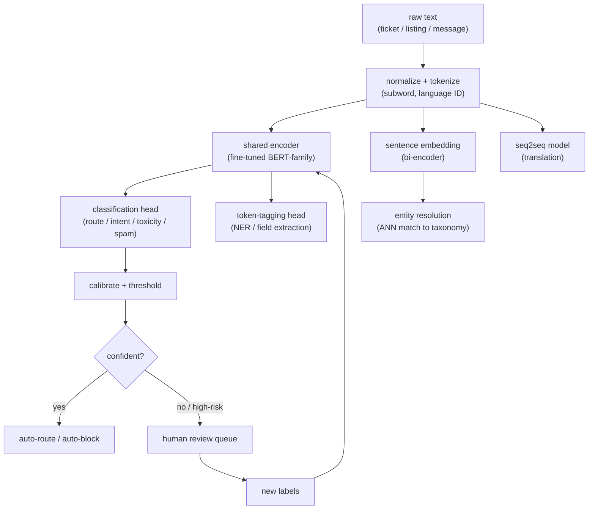
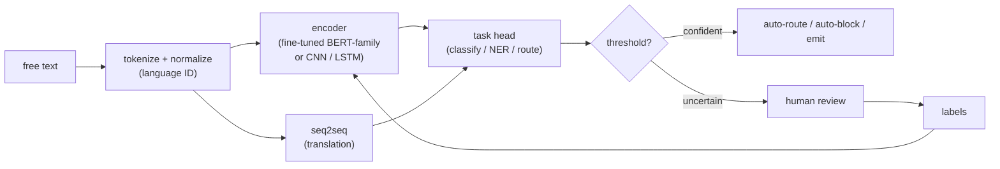

# 13 - Natural language processing

> **Interviewer:** "We get millions of support tickets, listing descriptions, and
> user messages a day, all free text. Product wants them routed to the right queue,
> the important fields pulled out, and the abusive ones held back before a human
> ever sees them. Design the NLP system. Assume you cannot afford to send every
> message to a large LLM."

The trap here is answering "call an LLM." Real NLP in production is a portfolio of
narrow, task-specific models that run at high volume, low latency, and low cost. The
signal is that you pick the right tool per task (a fine-tuned encoder for
classification and extraction, a seq2seq model for translation, sentence embeddings
for matching), treat labeling and class imbalance as first-class problems, and
evaluate with per-class F1 and human review, not accuracy. A big LLM is one tool in
the box, usually the wrong one for a task you run a billion times a day.

## 1. Clarify and scope

- **Which tasks, concretely?** "NLP" is a family, not a task. Routing is
  classification, pulling out fields is NER/information extraction, blocking abuse is
  toxicity/spam classification, matching a listing to a canonical entity is entity
  resolution. Each has a different model, label, and eval, so make the interviewer
  name the tasks before you design anything.
- **Latency and volume budget.** Millions per day at interactive latency changes
  everything. If routing must happen in tens of milliseconds inline, a distilled
  encoder is the answer, not a large decoder behind an API.
- **Languages.** One or forty? Multilingual pushes you toward multilingual encoders
  and shared tokenization, and complicates labeling (annotators per language).
- **How much labeled data exists?** None, a little, or a lot decides between zero-shot
  LLM prompting, weak supervision to bootstrap labels, and full fine-tuning.
- **Cost of each error type.** A misrouted ticket is cheap and recoverable; a missed
  abusive message or a false toxicity block is expensive and visible. Asymmetric costs
  drive per-class thresholds, not one global cutoff, and usually a human-in-the-loop
  for safety tasks.

## 2. Requirements

**Functional**
- Classify text into task-specific label sets (queue, intent, toxicity, spam)
- Extract structured fields from free text (NER, information extraction)
- Resolve and standardize entities against a canonical taxonomy
- Translate across the required language pairs
- Return calibrated scores, and route uncertain or high-risk items to human review

**Non-functional**
- Inline tasks meet a tight latency budget (tens of milliseconds) at high QPS
- Cost per inference low enough to run on the full firehose, not a sample
- Multilingual coverage without a separate stack per language
- Retrainable as language, slang, and abuse patterns shift; safety decisions auditable

## 3. High-level data flow

Text comes in, is normalized and tokenized once, then fans out to the specific model
each task needs. Most tasks share the encoder stack; only the head differs.

The structural point: one tokenization and (often) one encoder backbone serves many
heads. The high-volume path stays small and fast; the LLM, if it appears at all, sits
offline generating labels or handling the hard case, not in the inline firehose.

## 4. Deep dives

### The task taxonomy (name it before you model it)

NLP interview prompts collapse several distinct problems into one sentence. Separate
them, because each has its own model, label, and metric:

- **Text classification.** One label (or a few) per document: which queue, which
  intent, spam or not. A fine-tuned encoder with a softmax or sigmoid head.
- **NER / information extraction.** A label per token or span: amenities out of a
  listing, the product and date out of a ticket. A token-tagging head (BIO scheme) or
  a span model on the encoder.
- **Intent and query understanding.** Short, ambiguous text (a search query, a chat
  opener). Classification plus light parsing; brevity means little context, so priors
  and user features matter more.
- **Entity resolution / record matching.** Map messy user strings to a canonical
  entity ("2br near Union Sq" to a standardized attribute). Embedding-and-match, not
  classification.
- **Machine translation.** Sequence to sequence: a different architecture class
  (encoder-decoder) with its own eval (BLEU/COMET, human adequacy).
- **Toxicity / spam.** Classification, but with brutal class imbalance, adversarial
  drift, and asymmetric error costs. The modeling is easy; the labels, thresholds, and
  human loop are the hard part.

Saying "these are several different problems, here is the model for each" is most of
the signal in this question.

### Fine-tuned encoder vs a big LLM (state the tradeoff explicitly)

This is the decision the prompt is really testing. A fine-tuned BERT-family encoder
(or a distilled variant) beats a large LLM on most production NLP tasks at scale:

- **Latency and cost.** A distilled encoder classifies in single-digit milliseconds
  on commodity hardware; a large decoder LLM is orders of magnitude slower and
  pricier per call. At millions of calls a day the encoder is the only sane inline
  choice.
- **Determinism and calibration.** An encoder head emits a score you can calibrate
  and threshold. An LLM emits text you must parse, and its "confidence" is not a
  probability you can threshold on.
- **Accuracy on narrow tasks.** With even a few thousand labels, a fine-tuned encoder
  matches or beats a zero-shot LLM on a fixed label set, being specialized to your
  exact distribution and taxonomy.
- **Where the LLM actually wins.** Cold start with no labels (zero/few-shot to get
  moving), generating weak labels to bootstrap the encoder, open-ended extraction
  with no fixed schema, and the long tail of hard cases you route to it after the
  cheap model abstains. It is a label factory and a fallback, not the firehose.

The mature answer: fine-tune a small encoder for the inline path, use the LLM offline
to label and catch the tail, never on the hot path just because it prompts easily.

### Tokenization and multilingual issues

- **Subword tokenization** (WordPiece, BPE, SentencePiece) is the interface between
  raw text and the model. It handles out-of-vocabulary words by splitting them, but
  token counts (hence latency and cost) vary by language: morphologically rich
  languages and non-Latin scripts fragment into many more tokens than English.
- **Multilingual encoders** share one subword vocabulary across languages, giving
  cross-lingual transfer (train on high-resource languages, get some ability in
  low-resource ones) but diluting per-language capacity, so they can underperform a
  dedicated monolingual model on any single one.
- **Normalization is a safety control, not just tidiness.** Casing, Unicode
  normalization, emoji, and script mixing all change tokenization, and spam/toxicity
  adversaries exploit exactly this (homoglyphs, zero-width characters, l33tspeak).
- **Language ID first.** Detect language up front to route to the right model and
  annotator pool; a misdetected language poisons everything downstream.

### Labeling and weak supervision

Models are cheap; labels are the bottleneck, and how you get them is often the design:

- **Weak supervision.** Write labeling functions (regexes, keyword lists, heuristics,
  an existing model, an LLM prompt) that each vote noisily, then combine the votes into
  probabilistic labels. This bootstraps a training set without hand-labeling millions.
- **LLM as annotator.** Prompt a large model to label a sample, treat its output as a
  noisy label source, and distill it into the small encoder. You pay the LLM once per
  training example, not once per inference.
- **Active learning.** Spend scarce human labeling budget where the model is least
  certain or errors are most costly, not at random. Every decision in the review queue
  is itself a fresh label; close that loop back into training.

### Class imbalance for abuse and spam

Toxicity, spam, and fraud share a defining property: the positive class is rare (often
well under 1%) and adversarial. Consequences:

- **Accuracy is meaningless, resample instead.** A model that predicts "not spam" for
  everything is 99%+ accurate and useless. Oversample positives, downsample easy
  negatives or weight the loss, and mine hard negatives for the confusable cases.
- **Adversarial drift.** Spammers and abusers adapt on purpose, so yesterday's labels
  decay fast. You need continuous fresh labels and frequent retraining, and you assume
  the distribution is non-stationary by design.
- **Precision/recall is a business choice.** More recall catches more abuse but blocks
  more innocent users; more precision does the reverse. The operating point is a
  policy decision, set per class and revisited as costs change.
- **Not all "text" is a document.** Much abuse detection reads a user's sequence of
  actions the way an NLP model reads tokens: scraping, coordinated inauthentic
  behavior, and account takeover show up as patterns over time, not in one message. An
  LSTM or transformer over the event sequence classifies the behavior with the same
  machinery as language, so framing abuse as "sequence classification over member
  activity" shows range and matches how real trust-and-safety systems work.

### Calibration and thresholds

A raw model score is not a decision. Two steps turn scores into actions:

- **Calibration.** Fine-tuned classifiers are often over- or under-confident.
  Temperature scaling or Platt/isotonic calibration makes the score behave like a real
  probability, so "0.9" means roughly 90% of such cases are positive. Without it,
  thresholds are guesses.
- **Per-class, cost-aware thresholds.** Set the cutoff from the cost of each error,
  per class, not one global number. Auto-act on the confident tail, send the uncertain
  middle to humans, and tune the band against review capacity. Calibrated scores make
  "route the uncertain to review" a principled rule, not a magic constant.

### Eval: per-class F1, not accuracy, plus human review

- **Per-class F1 and PR curves.** Report precision, recall, and F1 per class,
  especially the rare one; aggregate accuracy hides the failure that matters, and the
  confusion matrix shows which classes bleed into which.
- **Slice by language and segment.** A model fine in English can be broken in Turkish
  or on a new cohort. Never report a single global number for a multilingual system.
- **Task-appropriate metrics.** NER uses span-level F1 (exact and partial),
  translation uses BLEU/COMET plus human adequacy and fluency, entity resolution
  pairwise precision/recall on matched pairs.
- **Human review for safety.** For toxicity and abuse, offline metrics are necessary
  but not sufficient: sample production decisions for audit and track the false block
  rate (innocent users hit) as carefully as the miss rate, both as release gates.

## 5. Bottlenecks and scaling

| Bottleneck | First sign | Fix | Tradeoff |
|---|---|---|---|
| LLM on the hot path | Latency and cost blow the budget | Distilled encoder inline, LLM offline for labels/tail | More models to train and maintain |
| Label scarcity | Model stalls, tail classes weak | Weak supervision, LLM annotation, active learning | Noisy labels need cleanup |
| Class imbalance | High accuracy, useless recall | Resampling, loss weighting, per-class thresholds | Precision/recall must be traded |
| Adversarial drift | Abuse recall decays weekly | Continuous fresh labels, frequent retrain | Ongoing labeling cost |
| Multilingual coverage | One language much worse | Multilingual encoder, per-language eval and annotators | Capacity diluted per language |
| Human review capacity | Review queue backs up | Tighten auto-act band, prioritize by risk | Fewer items auto-handled |

## 6. Failure modes, safety, eval

- **Silent tail-class collapse.** The model looks great in aggregate while recall on
  the rare, important class (abuse, a minority intent) quietly falls to zero.
  Per-class F1 and segment slices are the defense.
- **Adversarial evasion.** Homoglyphs, obfuscation, and code-switching route around a
  toxicity model. Normalization, character-level features, and adversarial retraining
  help; assume evasion is constant.
- **False blocks on safety tasks.** Over-aggressive spam or toxicity thresholds
  silence innocent users, often more damaging than a miss. Track false block rate as a
  first-class metric and keep a fast appeal path.
- **Miscalibration after retrain.** A new model can shift the score distribution so
  old thresholds now over- or under-act. Recalibrate and re-tune on every promotion.
- **Weak-label bias baked in.** If labeling functions or an LLM annotator share a
  blind spot, the encoder inherits it and looks confident while wrong. Audit weak
  labels against a small gold set, and gate on per-language eval so English metrics do
  not mask a broken language.

## 7. Likely follow-ups

- "Why not just use an LLM for all of this?" Latency, cost, calibration, and
  accuracy on a fixed label set at scale. A fine-tuned encoder is milliseconds and
  cents; a large LLM is neither. Use the LLM offline to label and for the hard tail.
- "You have almost no labeled data. What now?" Weak supervision plus LLM-generated
  labels to bootstrap, distill into a small encoder, then active-learn on uncertain
  cases and fold in human review decisions.
- "The spam class is 0.5% of traffic. How do you train and evaluate?" Resample or
  weight the loss, mine hard negatives, set a per-class cost-aware threshold, and
  evaluate with PR curves and per-class F1, never accuracy.
- "How do you handle forty languages?" A multilingual encoder with shared subword
  tokenization for transfer, language ID up front, per-language eval and annotator
  pools, and awareness that token counts and quality vary by language.
- "Classification versus extraction versus resolution: which model?" Encoder plus
  classification head, encoder plus token-tagging head, and a bi-encoder plus ANN
  match, respectively: different heads, sometimes a shared backbone.
- "Translation quality: how do you measure it?" BLEU or COMET for automatic tracking,
  plus human adequacy and fluency ratings, since automatic metrics miss meaning.

---

## Trace the architectures

NLP in production is mostly these backbones with a task-specific head bolted on. Open
each one and look at where the head attaches, the decision the whole system turns on.

- **Encoder for classification and NER (BERT base):**
  [open it live](https://www.neurarch.com/?import=https://raw.githubusercontent.com/neurarch-ai/awesome-llm-model-zoo/main/architectures/bert-base/model.json).
  Trace the encoder stack to the pooled output, where a classification softmax head or
  a per-token NER tagging head attaches: the default workhorse for the inline path.

  

- **Modern long-context encoder (ModernBERT base):**
  [open it live](https://www.neurarch.com/?import=https://raw.githubusercontent.com/neurarch-ai/awesome-llm-model-zoo/main/architectures/modernbert-base/model.json).
  Trace how it extends the BERT recipe for longer inputs, for when a ticket or listing
  overruns the original 512-token window and truncation would cut needed context.

  

- **Seq2seq for translation and extraction (T5 small):**
  [open it live](https://www.neurarch.com/?import=https://raw.githubusercontent.com/neurarch-ai/awesome-llm-model-zoo/main/architectures/t5-small/model.json).
  Trace the encoder-decoder split: the architecture class behind translation and any
  text-to-text task (extraction as generation), distinct from the encoders above.

  

- **Sentence embeddings for entity resolution and dedup (all-MiniLM-L6):**
  [open it live](https://www.neurarch.com/?import=https://raw.githubusercontent.com/neurarch-ai/awesome-llm-model-zoo/main/architectures/all-minilm-l6/model.json).
  Trace the pooling that turns a sentence into one vector, which you ANN-match to
  collapse messy user strings onto a canonical entity: the embedding-and-match pattern.

  

- **Retrieval embeddings (BGE base en):**
  [open it live](https://www.neurarch.com/?import=https://raw.githubusercontent.com/neurarch-ai/awesome-llm-model-zoo/main/architectures/bge-base-en/model.json).
  Trace the same bi-encoder shape as MiniLM but tuned for retrieval-quality matching,
  which is what standardizing and deduplicating entities against a taxonomy needs.

  

These are validated reference graphs at real dimensions, shape-checked end to end,
not screenshots. Browse all in the
[Model Zoo](https://github.com/neurarch-ai/awesome-llm-model-zoo) or the
[gallery](https://neurarch-ai.github.io/awesome-llm-model-zoo). Built by
[Neurarch](https://www.neurarch.com).

## Seen in production

Real systems that ship the patterns above. Each is a first-party engineering
writeup; read them for what an interview answer skips: who the system serves, the
product design, the eval bar, and the deployment shape.

### The shared pipeline

Under the product framing, these systems share one skeleton. Free text is normalized
and tokenized once, then fed to a task backbone: a fine-tuned encoder (or an earlier
CNN/LSTM) for classification and tagging, or a seq2seq model for translation. A thin
task head turns the representation into a decision (classify, tag, route, translate),
which a threshold either auto-acts on or hands to human review, and those reviews feed
labels back for retraining.

### How they differ

| System | Task | Model | Multilingual | Labels / supervision |
|---|---|---|---|---|
| Uber Maps | classification (ticket routing) | WordCNN + Word2Vec | English (planned expansion) | manual labels, unsupervised embeddings |
| Airbnb Listings | NER / extraction | CNN tagger | not stated | taxonomy-mapped labels |
| Meta hate speech | classification | RIO + Linformer | not stated | proactive, adversarial |
| Google GNMT | translation | seq2seq RNN + attention | many language pairs | bilingual human ratings |
| Meta NMT | translation | LSTM + attention | 2,000+ directions | bilingual corpora |
| LinkedIn Knowledge Graph | entity resolution | standardization / matching | not stated | canonical taxonomy |
| Pinterest spam | classification | DNN + clustering + graph label-prop | not stated | graph label propagation |
| LinkedIn abuse | sequence classification | LSTM over activity | not stated | behavioral labels |
| Uber COTA | classification / routing | NLP + ML | not stated | ticket labels |
| Airbnb voice support | classification (contact reason) | NLP classifier | not stated | contact-reason labels |
| Grammarly GECToR | token tagging (GEC) | BERT-based tagger | English | synthetic + real learner data |

### The systems

- **Uber** [Applying Customer Feedback: NLP and Deep Learning Improve Uber's Maps](https://www.uber.com/gb/en/blog/nlp-deep-learning-uber-maps/): Word2Vec plus a word-level CNN classify support tickets to find map-data errors. *(product design)*
- **Airbnb** [Building Airbnb's Listing Knowledge from big text data](https://medium.com/airbnb-engineering/wisdom-of-unstructured-data-building-airbnbs-listing-knowledge-from-big-text-data-7c533466a63c): A CNN-based NER extracts amenities and facilities from free-text listings into a taxonomy. *(product design)*
- **Meta** [How AI is getting better at detecting hate speech](https://ai.meta.com/blog/how-ai-is-getting-better-at-detecting-hate-speech/): RIO plus Linformer proactively detect toxic text and image content at scale. *(deployment)*
- **Google** [A Neural Network for Machine Translation, at Production Scale](https://research.google/blog/a-neural-network-for-machine-translation-at-production-scale/): GNMT seq2seq cuts translation errors 55 to 85% over phrase-based systems. *(deployment)*
- **Meta** [Transitioning entirely to neural machine translation](https://engineering.fb.com/2017/08/03/ml-applications/transitioning-entirely-to-neural-machine-translation/): LSTM-plus-attention NMT deployed across 2,000+ directions, 4.5B daily translations. *(deployment)*
- **LinkedIn** [Building The LinkedIn Knowledge Graph](https://www.linkedin.com/blog/engineering/knowledge/building-the-linkedin-knowledge-graph): Entity resolution and standardization of user-generated entities into a canonical taxonomy. *(deployment)*
- **Pinterest** [How Pinterest Fights Spam Using Machine Learning](https://medium.com/pinterest-engineering/how-pinterest-fights-spam-using-machine-learning-d0ee2589f00a): A DNN plus clustering plus graph label-propagation flag spam domains and users. *(deployment)*
- **LinkedIn** [Using deep learning to detect abusive sequences of member activity](https://www.linkedin.com/blog/engineering/trust-and-safety/using-deep-learning-to-detect-abusive-sequences-of-member-activi): An LSTM classifies member activity sequences as scraping or abuse. *(eval bar)*
- **Uber** [COTA: Improving Uber Customer Care with NLP and ML](https://www.uber.com/blog/cota/): An NLP model suggests top issue types and solutions to route and resolve tickets. *(product design)*
- **Airbnb** [How ML Transforms Airbnb's Voice Support Experience](https://airbnb.tech/ai-ml/listening-learning-and-helping-at-scale-how-machine-learning-transforms-airbnbs-voice-support-experience/): Contact-reason detection classifies issues to self-serve or route to an agent. *(product design)*
- **Grammarly** [Grammatical Error Correction: Tag, Not Rewrite](https://www.grammarly.com/blog/engineering/gec-tag-not-rewrite/): GECToR tags word-level transformations instead of generating, for fast correction. *(eval bar)*

More production case studies: the [Evidently AI ML system design database](https://www.evidentlyai.com/ml-system-design) (800 case studies from 150+ companies) is the broadest curated index; this section pulls the ones that map onto this topic.
