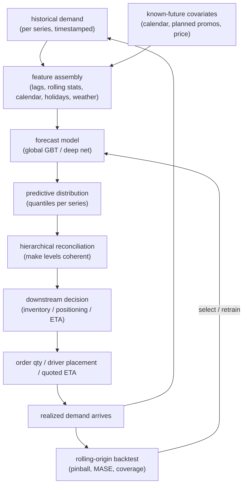

# 14 - Demand forecasting and time series

> **Interviewer:** "We run a marketplace with millions of items across thousands
> of stores. Design a system that forecasts demand for every item at every
> location so we can decide how much to stock, how many drivers to position, and
> what ETA to quote. Give me the horizon, the metric, and what the forecast feeds
> into. Do not hand me a single MAPE number and call it done."

This is the topic where the naive instinct (fit one model, minimize MAPE on a
point forecast) is exactly the trap. Real demand forecasting is **probabilistic**
(the decision needs the whole distribution, because stocking to the median stocks
out half the time), **hierarchical** (item, store, region, and total must add up,
and they will not unless you make them), **non-stationary** (holidays, promos, and
shocks move the distribution under you), and **decision-coupled** (the forecast
feeds an optimizer, it is not the deliverable). The signal is that you frame this
as coherent probabilistic forecasts feeding a downstream decision, evaluated by
proper scoring rules on a rolling backtest, not as point-forecast accuracy golf.

## 1. Clarify and scope

- **What decision does the forecast feed?** The first question, and it changes
  everything. Replenishment needs a high quantile (stock for P90 so you rarely
  stock out); driver positioning needs the spatial demand distribution over the
  next hour; ETA needs a per-trip point estimate with a calibrated interval. The
  forecast is never the product; the **decision** is. Ask what consumes the output.
- **What horizon and granularity?** Next hour, next day, next 12 weeks? Per item
  per store, or category per region? Horizon and granularity set the model class:
  intraday spatiotemporal is a different problem from weekly SKU replenishment.
- **How many series, and how related?** A dozen series is a per-series classical
  problem; millions of related series (every item at every store) is where a global
  ML or deep model earns its keep by borrowing strength, and decides the family.
- **What covariates do we have, and are they known in the future?** Calendar and
  holidays are known ahead; promotions and price may be planned or not; weather is
  a forecast of a forecast. Known-future covariates go into the model; unknown ones
  need their own forecast or a scenario.
- **What is the cost of over versus under?** Overstock is holding cost and waste;
  understock is lost sales and churn. That asymmetry is the whole reason you want
  quantiles, not a mean. Get the rough ratio, and the update cadence (retrain
  nightly, forecast hourly?) that sets the freshness budget.

## 2. Requirements

**Functional**
- Produce forecasts for every series at the required granularity and horizon
- Emit a **distribution** (quantiles or full predictive density), not just a mean
- Guarantee **coherence**: forecasts at child levels sum to their parent level
- Ingest known-future covariates (calendar, holidays, planned promos, price)
- Handle **cold-start**: new items and new locations with little or no history
- Feed the forecast into the downstream decision (optimizer or policy) cleanly

**Non-functional**
- Backtested with **rolling-origin** evaluation, never a single random split
- Scored with proper metrics: **pinball loss / WQL** for the distribution, **MASE**
  for scale-free point accuracy, not raw MAPE
- Retrain and inference within the cadence budget across millions of series
- Drift detection on inputs and residuals, because the series are non-stationary
  ([monitoring and drift](11-ml-monitoring-and-drift.md))
- Online/offline feature parity so lag and calendar features match between train
  and serve ([topic 04](04-feature-store-and-training-serving-skew.md))

The requirement that dominates: **a coherent probabilistic forecast that feeds a
decision**. Name it first. Point accuracy is a diagnostic; the distribution and
coherence are the product, because the optimizer consumes a quantile and needs the
levels to reconcile.

## 3. High-level data flow

Two things to draw: covariate assembly (history plus known-future features) and
the fact that the forecast is an **input to a decision**, not the endpoint. The
forecast-then-optimize handoff and the backtest loop are what signal seniority.

The thing to point at: `DIST` is a distribution, `RECON` makes the hierarchy add
up, and `DECIDE` is a separate optimization step. Collapse `DIST` to a mean and
skip `RECON`, and the optimizer makes coherent-looking but wrong decisions.

## 4. Deep dives

### Classical baselines versus ML versus deep, and when each wins

The honest ordering, because reaching for a Transformer first is a red flag:
- **Classical (ARIMA, ETS, Prophet, Theta).** One model **per series**. ARIMA
  models autocorrelation and differencing; ETS (exponential smoothing) models
  level, trend, and seasonality; Prophet is a robust additive trend + seasonality +
  holiday regression. These win with **few series, long clean history, and stable
  seasonality**, and are the fast baseline you benchmark against before claiming a
  deep model helps.
- **ML (gradient-boosted trees on engineered features).** Reframe forecasting as
  tabular regression: target is future demand, features are lags, rolling stats,
  and calendar signals. One **global** model learns across all series and borrows
  strength. The workhorse for **many related series**, and cheap to operate.
- **Deep learning (DeepAR, N-BEATS, TFT, PatchTST).** Global neural models that
  emit distributions natively (DeepAR parameterizes a likelihood; TFT emits
  quantiles) and handle cold-start via learned series embeddings. They earn their
  keep at **scale, long horizons, or rich covariates**, but do **not** reliably
  beat a well-tuned global GBT on short-horizon tabular demand. Say this out loud.

The mature answer: baseline with ETS/Prophet, ship a global GBT, reach for deep
only when scale, horizon, or many-related-series structure justifies it.

### Probabilistic and quantile forecasts: why a point forecast is not enough

A point forecast answers "how much on average," but no decision cares about the
average. Replenishment stocks to the quantile that hits the target service level
(P90, not the mean, or you stock out roughly half the time). The output must be a
**distribution**:

- **Quantile regression / pinball loss.** Emit multiple quantiles (P10, P50, P90)
  by minimizing **pinball loss** at each; gives the operating point directly.
- **Parametric likelihood.** DeepAR-style models predict distribution parameters
  (negative binomial for counts, non-negative and over-dispersed) and sample paths.
- **Conformal prediction.** A distribution-free wrapper calibrating intervals to
  nominal coverage on residuals; cheap honest intervals on a point model.

The tell is **calibration**: a P90 forecast should be exceeded about 10 percent of
the time. Report empirical coverage, not just the loss value.

### Hierarchical and coherent forecasting, and reconciliation

Demand is hierarchical: item rolls up to category to region to total; store to
district to national. Forecast each level independently and the numbers **will not
add up**, and the business cannot act on incoherent numbers.

- **Bottom-up.** Forecast leaves, sum up. Coherent by construction, but inherits
  leaf noise.
- **Top-down.** Forecast the top, split by historical proportions. Stable
  aggregate, misses leaf dynamics.
- **Optimal reconciliation (MinT).** Forecast **every** level, then project onto
  the coherent subspace with a trace-minimizing step using the residual
  covariance. The principled answer: uses all levels, provably reduces error, and
  extends to the probabilistic case. An end-to-end model can also emit coherent
  probabilistic forecasts directly, skipping the post-hoc step. Reconciliation is
  not optional: the decision consumes multiple levels and they must be consistent.

### Feature engineering and cold-start

For the ML path the features are the model, and they carry the leakage trap: any
lag or rolling feature must use data available **at forecast time**, or the
backtest reports fantasy accuracy.

- **Lags** at t-1, t-7, t-364 capture seasonality; a 7-day-ahead forecast cannot
  use the t-1 lag, so choose lags by horizon.
- **Rolling statistics** (mean, std, min, max over 7/28/90-day windows) capture level and volatility.
- **Calendar** (day-of-week, week-of-year, month) encoded cyclically so December sits next to January.
- **Holidays, events, promotions, and price** are known-future covariates (use
  lead/lag windows) and often the single largest demand driver.
- **Weather** is a strong exogenous driver, but it is itself a forecast, so you
  inherit its error.

**Cold-start** breaks lag features entirely (new item, no history), which is where
**global** models shine: learned series/attribute embeddings forecast a brand-new
item from similar items, attribute priors blend toward its own history as sales
accrue, and hierarchical shrinkage borrows the parent-level pattern until the leaf
stands alone. Keep intervals wide until history accrues.

### Non-stationarity and drift

Time series are non-stationary: trend shifts, seasonality evolves, regimes break,
and a model fit on last year's regime silently degrades. Handle it with
**differencing/detrending** for the mean and log/Box-Cox for variance (also keeps
counts non-negative); **regime awareness** via recent-data weighting, sliding
windows, and change-point detection that triggers a refit; and **residual
monitoring**, where sustained bias or widening error is drift and your retrain
trigger ([topic 11](11-ml-monitoring-and-drift.md)). Non-stationarity is the
default, so retrain cadence and drift alarms are part of the design.

### The forecast-then-optimize pattern

The forecast is an intermediate; the value lands in the **decision** it feeds.
Replenishment turns a demand distribution plus lead time and cost into an order
quantity (a newsvendor stocking to the service-level quantile); positioning turns a
spatial forecast into a rebalancing plan. Two consequences candidates miss: the
optimizer needs the **distribution, not the mean** (a newsvendor stocks to a
quantile from the over/under cost ratio and cannot compute safety stock from a
point forecast), and the metric that matters is the **decision cost, not the
forecast error**. Where feasible, evaluate against the downstream cost (realized
stockouts and waste, or a Monte Carlo of the decision under the distribution).

### Backtesting, rolling-origin evaluation, and the right metrics

You cannot random-split time series; that leaks the future. Use **rolling-origin**
(walk-forward) evaluation: fix a cutoff, forecast forward, score, roll the cutoff,
repeat. It mirrors production and exposes horizon-dependent decay. On metrics:

- **MAPE is broken:** undefined at zero demand (common at the item-store leaf),
  asymmetric, and explosive on small denominators.
- **MASE** scales error by a naive seasonal baseline, so it is unit-free,
  comparable across series, and defined at zero. Use it for point accuracy.
- **Pinball loss / WQL** scores the whole quantile set, the right objective for a
  probabilistic forecast; report it plus **coverage**, and weight by business value
  (revenue or volume) so a million tiny-volume series do not dominate the average.

### ETA and spatiotemporal (graph) forecasting

ETA and demand-over-a-map are time series with **spatial structure**; ignoring
geography leaves accuracy on the table, because travel time and demand diffuse
across connected road segments and adjacent zones. **Graph neural networks** over
the road or region graph combined with a temporal model (recurrent or temporal
convolution) capture that diffusion, the shape behind modern map-scale ETA.
**Residual learning** (predict a correction on a routing baseline rather than
absolute time) is easier to learn and meets tight latency. Latency is what makes
ETA distinct: it is inline in a quote, so the model is cheap and features are
precomputed lookups, the same discipline as [ranking](02-ranking-model.md).

## 5. Bottlenecks and scaling

| Bottleneck | First sign | Fix | Tradeoff |
|---|---|---|---|
| Millions of series to fit | Nightly retrain overruns cadence | One global model over all series, not per-series | Loses some per-series nuance |
| Feature assembly at scale | Lag/rolling backfill is slow | Precompute lags/rolling in a feature store | Storage, freshness, skew risk |
| Long-horizon accuracy decay | Error grows with horizon | Direct multi-horizon over recursive | Model complexity, per-horizon training |
| Hierarchy incoherence | Levels do not sum | MinT reconciliation or end-to-end coherent model | Extra compute, covariance estimation |
| Cold-start series | New items forecast poorly | Global model with learned embeddings, attribute priors | Wide intervals until history accrues |
| Non-stationary drift | Residual bias widens | Sliding window, change-point retrain, drift alarms | Retrain cost, reactivity vs stability |
| ETA serving latency | p99 over budget inline | Residual-on-baseline model, precomputed features | Model capacity vs speed |

## 6. Failure modes, safety, eval

- **Point forecast where a distribution is needed.** Handing the optimizer a mean
  makes safety stock uncomputable and stocks out at the target quantile. Emit
  quantiles and report coverage.
- **MAPE on intermittent demand, or a random split.** MAPE is undefined at zero
  and explosive; a random train/test split leaks the future. Use MASE and
  pinball/WQL on a rolling-origin backtest at the production horizon.
- **Feature leakage via lags.** Using a lag or rolling stat not yet available at
  forecast time inflates offline metrics and collapses live. Enforce point-in-time
  availability per horizon ([topic 04](04-feature-store-and-training-serving-skew.md)).
- **Ignoring known-future covariates.** Dropping holidays and planned promotions
  guarantees a miss on exactly the high-demand days that matter most.
- **Deep model by default, or silent drift.** A Transformer before benchmarking a
  global GBT rarely wins at short horizons (baseline first); and without residual
  monitoring a regime change degrades every forecast until a stockout surfaces it.
- **Eval gate.** Rolling-origin pinball/WQL, MASE, and coverage are the fast
  pre-gate; the ship decision is the downstream decision cost (realized stockouts
  and waste), measured against the incumbent.

## 7. Likely follow-ups

- "Why not just minimize MAPE?" MAPE is undefined at zero, asymmetric, and explodes
  on small demand, and the decision needs a quantile, not a mean. Use MASE and
  pinball/WQL with coverage.
- "Classical, ML, or deep?" Classical (ETS/Prophet) for few series with long clean
  history; a global GBT for many related series (the workhorse); deep only at
  scale, long horizons, or rich covariates. Baseline before going deep.
- "The levels do not add up, how do you fix it?" Hierarchical reconciliation:
  bottom-up, top-down, or optimal (MinT), or an end-to-end coherent model.
- "New item with no history?" Global model with learned series/attribute
  embeddings, attribute priors, and hierarchical shrinkage toward the parent, with
  wide intervals until history accrues.
- "How do you evaluate?" Rolling-origin (walk-forward) backtest at the production
  horizon, scored with MASE and pinball/WQL plus coverage, ideally against the
  downstream decision cost.
- "How is ETA different?" Spatial structure: graph neural nets over the road graph
  plus a temporal model, often as a residual on a routing baseline, under tight
  inline serving latency.

---

## Trace the architectures

Open the graphs to see how the sequence structure wires up rather than trusting a
block diagram. These two span the classic deep baseline and the long-horizon Transformer.

- **PatchTST (patch-based Transformer for long-horizon multivariate forecasting):**
  [open it live](https://www.neurarch.com/?import=https://raw.githubusercontent.com/neurarch-ai/awesome-llm-model-zoo/main/architectures/patch-tst/model.json).
  Trace how the input series is split into **patches** (subsequences) that become
  tokens before the attention stack, which is what lets a Transformer handle long
  horizons cheaply and channel-independently. Reach for it when the horizon is long
  and there are many correlated series.

  

- **CNN-LSTM 1D (the classic deep baseline):**
  [open it live](https://www.neurarch.com/?import=https://raw.githubusercontent.com/neurarch-ai/awesome-llm-model-zoo/main/architectures/cnn-lstm-1d/model.json).
  Trace how the 1D convolution extracts local temporal features that feed the LSTM
  for the longer-range dependency. It is the workhorse deep hybrid you benchmark
  before anything fancier, and makes the conv-then-recurrent pattern concrete.

  

Worth saying plainly: many production forecasters still run gradient-boosted trees
on lag and calendar features, and the deep models above earn their keep mainly at
scale, with many related series, or long horizons. These are validated reference
graphs at real dimensions, shape-checked end to end, not screenshots.
Browse all in the [Model Zoo](https://github.com/neurarch-ai/awesome-llm-model-zoo)
or the [gallery](https://neurarch-ai.github.io/awesome-llm-model-zoo). Built by
[Neurarch](https://www.neurarch.com).

## Seen in production

Real systems that ship the patterns above. Each is a first-party engineering
writeup; read them for what an interview answer skips: who the system serves, the
product design, the eval bar, and the deployment shape.

### The shared pipeline

Under the branding these systems share one skeleton: assemble historical series
plus calendar and covariates into features, fit a model that emits a probabilistic
or quantile forecast, hand that distribution to a downstream decision (a
replenishment optimizer, a rebalancing policy, an ETA quote), and close the loop
with a rolling backtest that retrains as the series drift. The forecast is the
intermediate; the decision it feeds is the product.

### How they differ

| System | Model class | Point vs probabilistic | Decision it feeds | Structure | When this shape wins | Watch out / key metric |
|---|---|---|---|---|---|---|
| Uber (forecasting intro) | Classical + ML + deep | Both (prediction intervals stressed) | Driver positioning, capacity, marketing | Plain series | Broad portfolio of business series where no single family dominates, so you pick per problem | Report interval coverage, not a lone point error |
| Uber (uncertainty estimation) | Bayesian neural net | Probabilistic (model + misspecification + noise split) | Capacity confidence, anomaly flagging | Plain series | High-stakes calls that need to know why the model is unsure, not just how much | Decomposed variance adds inference cost; the split is the deliverable |
| Uber (DeepETA) | Transformer residual on a routing baseline | Point (calibrated) | ETA quote inline in the app | Spatiotemporal | A strong routing baseline exists to correct, under a global inline latency budget | p99 serving latency; features must be precomputed lookups |
| Amazon (hierarchical) | Deep, end-to-end coherent | Probabilistic | Supply-chain / resource planning | Hierarchy | Many levels must reconcile out of the box without a post-hoc step | Coherence and calibration jointly; covariance estimation cost |
| Google DeepMind (Maps ETA) | Graph neural net + temporal | Point | Google Maps routing / ETA | Spatiotemporal graph | Travel time diffuses across a connected road graph, so geography carries signal | ETA accuracy uplift versus graph build and serve cost |
| Instacart (Building for Balance) | Unified supply-vs-demand engine | Probabilistic (supply and demand) | Shopper interventions / market balance | Plain series | Two-sided marketplace where the gap between sides drives the action | The imbalance, not either side alone, is the target |
| Instacart (availability) | Layered general/trending/real-time | Probability of availability | Item availability surfacing | Plain series | Hundreds of millions of items under a tight cost-per-prediction budget | Layered fallback and cost per prediction (about 80% cut) |
| Zalando (inventory) | Probabilistic forecast + Monte Carlo | Probabilistic | Replenishment optimization | Plain series | The optimizer consumes the full distribution to set safety stock | Monte Carlo over the forecast; realized stockouts and waste |
| Grab (supply-demand) | Geo-temporal ratios | Point ratios | Matching and rebalancing | Spatiotemporal | Matching where the supply-over-demand ratio per geo-cell is the signal | Ratio stability at sparse cells and short windows |
| Lyft (causal) | Causal-DAG forecasting | Point under confounding | Marketplace policy decisions | Plain series | Policy changes confound the metric you forecast, so correlation misleads | DAG assumptions hold; forecasts hold under intervention |

The core dividing line is the data's structure (plain series, a hierarchy that must reconcile, or a spatial graph) crossed with whether the decision consumes a point estimate or a full distribution.

### The systems

- **Uber** [Forecasting at Uber: An Introduction](https://www.uber.com/blog/forecasting-introduction/): An overview of Uber's classical, ML, and deep-learning forecasting stack with prediction intervals. *(product design)*
- **Uber** [Engineering Uncertainty Estimation in Neural Networks for Time Series](https://www.uber.com/blog/neural-networks-uncertainty-estimation/): A Bayesian neural net decomposing model, misspecification, and noise uncertainty. *(eval bar)*
- **Uber** [DeepETA: How Uber Predicts Arrival Times Using Deep Learning](https://www.uber.com/us/en/blog/deepeta-how-uber-predicts-arrival-times/): A Transformer-based ETA residual model meeting global latency and accuracy constraints. *(deployment)*
- **Amazon Science** [End-to-end learning of coherent probabilistic forecasts for hierarchical time series](https://www.amazon.science/publications/end-to-end-learning-of-coherent-probabilistic-forecasts-for-hierarchical-time-series): One model producing coherent probabilistic hierarchical forecasts without post-hoc reconciliation. *(product design)*
- **Google DeepMind** [Traffic prediction with advanced Graph Neural Networks](https://deepmind.google/blog/traffic-prediction-with-advanced-graph-neural-networks/): Graph neural nets over road Supersegments improving Google Maps ETA accuracy up to 50%. *(deployment)*
- **Instacart** [Building for Balance](https://company.instacart.com/how-its-made/building-for-balance): A unified engine forecasting shopper supply versus customer demand to guide interventions. *(product design)*
- **Instacart** [Modernizing real-time availability prediction for hundreds of millions of items](https://company.instacart.com/tech-innovation/how-instacart-modernized-the-prediction-of-real-time-availability-for-hundreds-of-millions-of-items-while-saving-costs): A hierarchical general, trending, and real-time model, cutting cost about 80%. *(deployment)*
- **Zalando** [Building a dynamic inventory optimisation system](https://engineering.zalando.com/posts/2025/06/inventory-optimisation-system.html): Probabilistic demand forecasts plus Monte Carlo optimization for replenishment. *(product design)*
- **Grab** [Understanding Supply and Demand in Ride-hailing Through Data](https://engineering.grab.com/understanding-supply-demand-ride-hailing-data): Measuring geo and time supply-demand ratios to improve matching and rebalance. *(eval bar)*
- **Lyft** [Causal Forecasting at Lyft (Part 1)](https://eng.lyft.com/causal-forecasting-at-lyft-part-1-14cca6ff3d6d): Causal-DAG-based forecasting of marketplace metrics for policy decisions under confounding. *(product design)*
- **Ocado** [Finding the sweet spot](https://careers.ocadogroup.com/blogs/careers-blogs/our-technologies/finding-the-sweet-spot): Neural-network demand forecasting for grocery ecommerce that balances inventory availability against product waste. *(product design)*
- **Mercado Libre** [Marketplace Forecasting: Sales or Demand? Why not both?](https://medium.com/mercadolibre-tech/global-time-series-forecasting-models-for-item-level-demand-and-sales-forecasts-in-our-marketplace-aee2956957ae): Separate global time-series models forecasting both realized sales and latent demand at the item level across regions. *(eval bar)*
- **Wayfair** [How Wayfair uses "Predicted Winners" Models to Accelerate Success for New Products](https://www.aboutwayfair.com/careers/tech-blog/how-wayfair-uses-predicted-winners-models-to-accelerate-success-for-new-products): Cold-start demand models that predict which new products will sell so they can be surfaced and stocked early. *(product design)*
- **Oda** [How we went from zero insight to predicting service time with a machine learning model (Part 2/2)](https://medium.com/oda-product-tech/how-we-went-from-zero-insight-to-predicting-service-time-with-a-machine-learning-model-part-2-2-ad8b0c3e4838): ML service-time prediction feeding grocery-delivery route planning, with a look at real-world routing impact. *(deployment)*

More production case studies: the [Evidently AI ML system design database](https://www.evidentlyai.com/ml-system-design) (800 case studies from 150+ companies) is the broadest curated index; this section pulls the ones that map onto this topic.

## Related deep-dive drills

Rapid-fire questions that probe the modeling and systems underneath this topic, from [deep-dives.md](../deep-dives.md):

- [Loss functions and objectives](../deep-dives.md#loss-functions-and-objectives)
- [Statistics and probability for ML](../deep-dives.md#statistics-and-probability-for-ml)
- [Classical models: when and why](../deep-dives.md#classical-models-when-and-why)
- [Commonly asked, commonly missed](../deep-dives.md#commonly-asked-commonly-missed)
