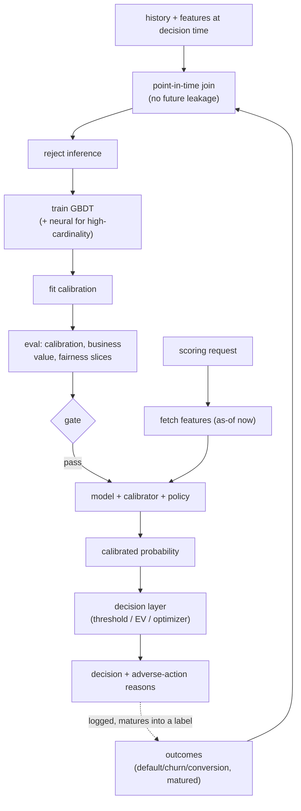
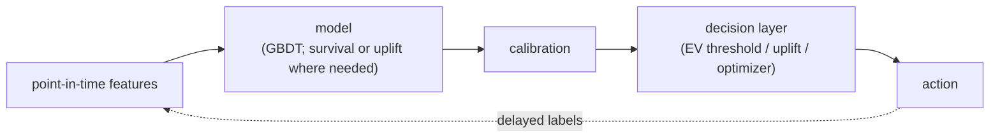

# 15 - Predictive modeling on tabular data

> **Interviewer:** "We issue credit cards. For every application, and later for every
> line-increase decision, we need a probability that the customer defaults in the next
> 12 months. That number sets who we approve, what limit we give, and what price we
> charge. Design the system that produces it. Assume regulators can ask us to explain
> any decline."

This looks like a Kaggle problem and it is not. The deliverable is not an AUC on a
held-out split, it is a **calibrated probability** that a business rule or an optimizer
consumes to make a money decision, under labels that arrive months late, are biased by
the decisions you already made, and under a regulator who can demand the reason for any
adverse action. The signal here is that you separate the **prediction** from the
**decision it feeds**, know why gradient-boosted trees still win on tabular data and when
they do not, treat calibration and point-in-time correctness as first-class, and can talk
about delayed and selection-biased labels without hand-waving.

## 1. Clarify and scope

- **What is the target and horizon, exactly?** "Default" is not a fact, it is a
  definition: 90+ days past due within 12 months of the decision. Nail the label window,
  observation point, and performance window first. Same care for churn (cancels within
  N days), conversion (buys within a window), and LTV (net margin over a horizon). Note
  the dynamics too: defaults mature over a year, chargebacks and conversions lag, churn
  is time-to-event, so the freshest data has no mature label yet.
- **What decision does the score feed?** Approve/decline is a threshold. A credit line
  is an optimization. A price or an incentive is a **causal** question (what changes if
  I intervene), not a predictive one. The modeling choice follows the decision, so pin
  the decision down first.
- **What is the selection bias?** In credit you only observe repayment for people you
  approved. The rejected population is invisible to the label, but you still have to
  score them tomorrow. This is the reject-inference problem, and it is unavoidable.
- **What are the regulatory and fairness constraints?** Credit and insurance are
  regulated: you may owe an **adverse-action reason** for every decline, protected
  attributes are off-limits as features (and often as proxies), and the model may need
  documented, reproducible governance. Ask whether this is a regulated decision early,
  because it constrains the model family.
- **Volume and latency?** Usually modest: batch or near-real-time scoring (seconds, not
  milliseconds). The hard part is almost never QPS, it is label quality, calibration,
  and explainability.

## 2. Requirements

**Functional**
- Produce a calibrated probability (or expected value) per entity per decision point
- Feed a **decision layer**: a threshold, an expected-value rule, or an optimizer
- Emit an explanation for regulated decisions (top adverse-action reasons)
- Log features **as known at decision time** for point-in-time-correct training later

**Non-functional**
- Calibration error small and monitored, because the probability sets money, not order
- Point-in-time correctness: zero leakage from the future into training features
- Reproducible, auditable, documented models where regulation demands it
- Drift monitoring on features, scores, and (delayed) label maturation; stable under
  population shift (new products, macro cycles, marketing changes)

The requirement to name first is that **the probability is the product**. A threshold
model that only sorts can tolerate poor calibration; a model whose score is multiplied
into an expected loss, an approved limit, or a bid cannot. Say that before you draw a
box, the same way you would for [ads CTR](10-ads-ctr-prediction.md).

## 3. High-level data flow

Two paths. The offline path turns matured, point-in-time-correct history into a
calibrated model plus a decision policy; the online path scores an entity and hands back
a **decision**, not just a number, then logs everything for the next cycle.

The dashed edge is the whole difficulty: today's decisions become tomorrow's biased,
delayed training data. The `point-in-time join` and `reject inference` boxes are where
most projects live or die.

## 4. Deep dives

### Why gradient-boosted trees still dominate, and when neural helps

On heterogeneous tabular data (mixed numeric and categorical columns, skewed
distributions, missing values, non-smooth relationships), **gradient-boosted decision
trees** (XGBoost, LightGBM, CatBoost) remain the default and usually the winner: they
are invariant to monotone transforms, handle missing values natively, capture non-linear
thresholds and interactions without feature engineering, train fast, and are far easier
to inspect than a deep net. Deep learning's edge, learning representations from raw
signal, does not apply when the features are already meaningful columns.

Neural nets earn their place in two situations: **very high-cardinality categoricals**
(user, merchant, item ids with millions of values) where learned **embeddings** beat
one-hot or target encoding, which is why recommender-style architectures (wide-and-deep,
DeepFM, DLRM) show up here, and when tabular features must be **fused with unstructured
signal** (text, images, event sequences). Otherwise, reach for a tree.

### Calibration: the probability is the product

A score of 0.05 has to mean a 5 percent real-world rate, because a threshold or an
optimizer reads the absolute value. GBDTs, especially regularized or class-weighted ones,
are often not calibrated out of the box, and sampling or reweighting for imbalance
distorts the head further. So:

- Train with a **proper scoring rule** (log loss) that rewards probability accuracy.
- Fit a post-hoc calibrator on a held-out slice: **Platt scaling** for a smooth monotone
  correction, **isotonic regression** with enough data. If you sampled or reweighted for
  imbalance, apply the analytic **prior correction** back to the true base rate first.
- Monitor calibration with reliability curves and expected calibration error, **sliced**
  by segment, product, and vintage. A model calibrated on average can be badly off on the
  slices the decision cares about.

### The decision layer: prediction is not the decision

The section that separates a senior answer: a probability is an input, the system's
output is an action, and the mapping is a design choice.

- **Expected-value thresholds.** For approve/decline, do not threshold the probability
  directly, threshold the **expected value**: approve when expected profit times p(good)
  exceeds expected loss (exposure times loss-given-default) times p(bad). The optimal
  cutoff falls out of the cost matrix, not out of an F1 score.
- **Uplift and causal models for interventions.** Pricing, discounts, incentives, and
  retention offers are **interventions**: the question is not "who will churn" but "whose
  behavior changes if I act." You want the **persuadables**, which needs **uplift
  modeling** (two-model, a single model on the treatment interaction, or causal-forest
  estimators of the treatment effect). A pure churn predictor wastes budget on lost
  causes and on people who would have stayed anyway.
- **Budget-constrained allocation.** When incentives share a fixed budget, the decision
  is an optimization on top of the scores: rank by uplift-per-dollar and fill a
  **knapsack**, or solve a convex allocation. The ML produces the coefficients, an
  optimizer makes the call. Draw the two as separate boxes.

### Delayed and biased labels, and reject inference

- **Maturation lag.** A 12-month default label leaves the last year of applications with
  no final label. Train only on matured data and the model is a year stale; count
  immature accounts as "good" and you bias risk downward. Options: restrict the target to
  matured vintages, use a faster-maturing proxy (early delinquency) that correlates with
  the true label, or use **survival analysis** so censored accounts still contribute.
- **Selection bias / reject inference.** You only see repayment for approved applicants,
  so a model trained on approvals is only valid on the approved region of feature space.
  To score the whole population you need **reject inference**: infer outcomes for rejected
  applicants (reweighting, parceling, external bureau performance), or run a small
  **randomized approval** slice below the cutoff for unbiased ground truth. The tradeoff:
  exploration costs real losses but is the only clean way to break the loop. Chargeback
  and conversion lag are the same shape as ads [delayed feedback](10-ads-ctr-prediction.md).

### Survival analysis and LTV

Churn, time-to-default, and time-to-conversion are naturally **time-to-event**, not
fixed-window binary. Framing them as "churned in 30 days: yes/no" throws away **when**
it happens and the **censored** customers still active at the cutoff. Survival models
keep both: Cox proportional hazards for interpretable covariate effects, or survival
forests / gradient-boosted survival for non-linear interactions. The output is a
**survival curve** per customer (probability still active over time), strictly more
useful than a single number: read off risk at any horizon, drive retention timing, and
feed LTV directly. Evaluate with the concordance index (C-index).

**LTV** is then an expected discounted sum of future margin, and the honest version
separates the pieces: retention each period (the survival curve) times expected spend
per active period times margin, discounted over a horizon (buy-till-you-die models play
the same role in non-contractual settings). Two traps: do not regress raw historical
revenue and call it LTV (survivorship bias, ignores the horizon), and be explicit about
**baseline vs incremental** LTV when the number justifies a marketing spend, that is
again a causal (uplift) question, not a predictive one.

### Fairness, regulation, and explainability

For credit, insurance, and hiring-adjacent decisions these constraints are legal.

- **Protected attributes and proxies.** You cannot use race, sex, age (in credit), and
  must watch for **proxies** (zip code correlating with protected class). Test for
  disparate impact across groups, and be ready to trade a little AUC for fairness.
- **Adverse-action reasons.** A decline usually requires the top few reasons in plain
  language. Per-decision attributions (SHAP on a tree, or reason codes from a
  monotone/scorecard model) map the score back to features. A strong argument for trees
  or **monotonic GBDTs** over an opaque deep net: you can constrain "more income never
  lowers approval odds," which is defensible and intuitive. Regulated models also need
  documentation and reproducibility, so factor governance in up front.

### Leakage, point-in-time correctness, and drift

The most common way a tabular project fails silently is **target leakage**: a feature
that encodes the outcome or is only knowable after it. Classic offenders: an account
status updated post-default, an aggregate over a window that includes the label period,
a "collections calls" count that only happens because the customer already defaulted.
The discipline is **point-in-time correctness**: every feature computed **as of the
decision timestamp**, using only data available then. This is why a
[feature store](04-feature-store-and-training-serving-skew.md) with time-travel joins
matters, and why you log served features rather than recomputing later. If a feature
looks too predictive, suspect leakage before you celebrate.

Because the label is slow, you cannot wait for defaults to tell you the model broke.
Monitor a ladder: **feature drift** (input distributions shifting, via population
stability index or divergence), **score drift** (approval rate or mean predicted risk
moving), and eventually **label / calibration drift** once outcomes mature. Population
shift is expected here (macro cycles, new products, marketing changing the applicant
mix), so treat it as a signal to investigate and recalibrate, not an automatic rollback.
See [monitoring and drift](11-ml-monitoring-and-drift.md).

## 5. Bottlenecks and scaling

| Bottleneck | First sign | Fix | Tradeoff |
|---|---|---|---|
| Label maturation lag | Recent data has no target | Matured vintages or proxy label or survival | Staleness vs bias |
| Selection bias | Model only valid on approvals | Reject inference, randomized slice | Real losses from exploration |
| Target leakage | Suspiciously high offline AUC | Point-in-time joins, feature audit | Slower feature pipeline |
| High-cardinality categoricals | Trees choke on millions of ids | Embeddings / neural, or target encoding | Complexity, leakage risk |
| Explainability demand | Regulator asks for reasons | Monotone GBDT, SHAP reason codes | Some accuracy for constraint |
| Population / concept drift | Feature and score drift alarms | Recalibrate, scheduled retrain | Compute, governance churn |

## 6. Failure modes, safety, eval

- **Target leakage:** the signature failure. Great offline metrics, useless in
  production, because a feature encoded the future. Point-in-time correctness and a
  feature audit are the defense.
- **Miscalibration:** the score sets money via a threshold or optimizer, so a drifted
  calibration mis-approves or mis-prices at scale even with unchanged ranking. Monitor
  sliced calibration continuously.
- **Selection-bias collapse:** a credit model trained only on approvals grows confident
  about a shrinking, self-selected region and never learns the rest. Reject inference
  plus a small randomized slice.
- **Optimizing prediction when you needed causation:** spending retention or pricing
  budget on a churn/propensity score instead of an uplift model wastes it on sure things
  and lost causes. Use uplift for interventions.
- **Fairness violation / unexplainable decline:** a proxy feature reintroduces a
  protected attribute and disparate impact shows in outcomes; an opaque model cannot
  produce an adverse-action reason. Test slices, drop proxies, constrain monotonicity,
  choose an explainable family.
- **Eval:** offline, report **calibration** (reliability, ECE, Brier), **ranking** (AUC,
  or C-index for survival), and above both **business value** under the actual cost
  matrix, every metric sliced by segment, vintage, and protected group. But the score
  changes future data and behavior, so the real gate is an **online / champion-challenger**
  test on the business outcome, never a single offline number.

## 7. Likely follow-ups

- "Why not just use a deep net for everything?" On heterogeneous columns GBDTs match or
  beat neural nets with less tuning, native missing-value and categorical handling, and
  better explainability; neural helps only for high-cardinality ids or fused text/image.
- "Your offline AUC is 0.95, ship it?" Suspect leakage first: some feature knows the
  outcome. Audit point-in-time correctness, then check calibration, because AUC says
  nothing about whether the probability sets prices correctly.
- "You want to reduce churn with a discount. Which model?" **Uplift**, not a churn
  predictor. Target the persuadables whose behavior the treatment actually changes, and
  allocate the budget with a knapsack or convex optimizer on uplift-per-dollar.
- "Your default label takes a year. How do you train on recent data?" Restrict the label
  to matured vintages, use a faster-maturing proxy (early delinquency), or use survival
  analysis so censored accounts still contribute.
- "You only see repayment for people you approved. Isn't that circular?" Yes, selection
  bias. Break it with reject inference and a small randomized approval slice below the
  cutoff for unbiased ground truth.
- "A regulator asks why you declined this applicant." Produce the top adverse-action
  reasons via reason codes or SHAP on a monotone-constrained model, which is why the
  regulated model family is chosen for explainability up front.

---

## Trace the architectures

Be honest in the interview: the production model here is usually a gradient-boosted tree,
which is not a neural graph and has no layer diagram to trace. Where tabular problems do
go neural is **high-cardinality categorical features** (millions of user, item, or
merchant ids), where learned embeddings beat encodings. These are the reference graphs
for that case, the same ones behind [ads CTR](10-ads-ctr-prediction.md):

- **Wide-and-deep (memorize plus generalize):**
  [open it live](https://www.neurarch.com/?import=https://raw.githubusercontent.com/neurarch-ai/awesome-llm-model-zoo/main/architectures/wide-and-deep/model.json).
  Trace the two branches: a wide linear path over crossed sparse features that memorizes
  frequent combinations, and a deep embedding-plus-MLP path that generalizes to unseen
  ones, joining before the output. It fits because tabular decisions often need both a
  memorized rule and a smooth generalization.

  

- **DeepFM (learned interactions, no manual crosses):**
  [open it live](https://www.neurarch.com/?import=https://raw.githubusercontent.com/neurarch-ai/awesome-llm-model-zoo/main/architectures/deepfm/model.json).
  Trace how the factorization-machine component and the deep MLP **share the same
  embeddings** and run in parallel: the FM half learns pairwise feature interactions
  automatically, so you stop hand-crafting crosses. It fits categoricals that interact in
  ways you cannot enumerate.

  

- **DLRM (embeddings plus an interaction layer):**
  [open it live](https://www.neurarch.com/?import=https://raw.githubusercontent.com/neurarch-ai/awesome-llm-model-zoo/main/architectures/dlrm/model.json).
  Trace sparse categoricals into their own **embedding tables**, dense features through a
  bottom MLP, then an **explicit pairwise dot-product interaction** feeding a top MLP.
  Notice the parameters live in the embedding tables, not the MLPs. It fits the extreme
  high-cardinality end of tabular modeling.

  

These are validated reference graphs at real dimensions, shape-checked end to end, not
screenshots. Browse all in the [Model Zoo](https://github.com/neurarch-ai/awesome-llm-model-zoo)
or the [gallery](https://neurarch-ai.github.io/awesome-llm-model-zoo). Built by
[Neurarch](https://www.neurarch.com).

## Seen in production

Real systems that ship the patterns above. Each is a first-party engineering writeup;
read them for what an interview answer skips: who the system serves, the product design,
the eval bar, and the deployment shape.

### The shared pipeline

Every system below builds point-in-time features (state as known at decision time), scores an entity, then hands the number to a **decision layer** that turns it into money: a credit limit, a churn action, a price, an LTV budget, or a voucher. Most predict with gradient-boosted trees; the ones that model **when** an event happens use survival curves, and the ones that decide **whether to intervene** switch to uplift or causal models. Calibration sits between the score and the decision because the absolute probability, not the ranking, sets the money.

### How they differ

| System | Model type | Decision it feeds | Delayed / biased labels | Regulation / explainability | When it wins | Watch out / where it breaks |
|---|---|---|---|---|---|---|
| Nubank | Survival curves + ranking | Credit line increase | Default matures over months | Regulated credit; simple robust methods | Risk that keeps maturing and must be read at any horizon, at 122M-customer scale | Selection bias from approving only some applicants; calibration and adverse-action reasons must hold under audit |
| Block (Square) | Conditional survival forest | Churn timing | Time-to-event, censored accounts | Low | Churn where **when** it happens matters and censored active accounts still carry signal | C-index scores ranking, not calibration; needs enough matured event history |
| Airbnb (listing LTV) | ML LTV framework | Marketing / LTV budget | 365-day horizon, incremental vs baseline | Low | Splitting baseline from incremental LTV so a marketing spend is justified honestly | Incremental LTV is a causal (uplift) question, not predictive; horizon truncation and survivorship bias |
| Airbnb (home value) | XGBoost, 150+ features | Listing value estimate | Modest | Low | Many already-meaningful engineered columns feeding a straightforward point estimate | Leakage risk across 150+ features; estimate drifts as the market moves |
| Expedia | CatBoost CLV | LTV budget | Long horizon | Low | Cross-brand categoricals unified on one platform for long-horizon CLV | Long-horizon labels go stale; heavy deployment and monitoring burden |
| Wayfair | Propensity + uplift | Programmatic marketing | Treatment response | Low | Deciding whom to target across a large customer base | Propensity alone spends on sure things and lost causes; needs uplift for persuadables |
| Uber | Causal DL (S-learner) + convex opt | Incentive / promotion budget | Causal, business-metric labels | Low | Allocating a fixed incentive budget where the ML sets coefficients and an optimizer decides | Causal estimates need experimental variation; S-learner can bias the treatment effect |
| Gojek | Deep causal uplift + knapsack | Voucher allocation | Observed past treatment effects | Low | Spreading a fixed voucher budget by targeting persuadables via uplift-per-dollar | Uplift from observational treatment is fragile; knapsack is only as good as the calibrated uplift |
| Zalando | Forecast-then-optimize | Markdown / price steering | Forecast horizon | Low | Price steering across 1M+ products where a demand forecast feeds a pricing optimizer | Forecast-horizon error compounds into prices; the optimizer inherits every forecast miss |

The core dividing line is what the score must answer: rank risk (GBDT), model **when** an event lands (survival), or decide **whether to intervene** (uplift / causal), with calibration required whenever the absolute probability, not the ordering, sets the money.

### The systems

- **Nubank** [How Nubank models risk for scalable credit limit increases](https://building.nubank.com/how-nubank-models-risk-for-smarter-scalable-credit-limit-increases/): Survival curves plus two-phase ranking-then-calibration for default risk across 122M customers. *(product design)*
- **Block (Square)** [PySurvival Tutorial: Churn Modeling](https://developer.squareup.com/blog/pysurvival-tutorial-churn-modeling/): A conditional survival forest predicting subscription churn timing, C-index 0.83. *(eval bar)*
- **Airbnb** [How Airbnb measures Listing Lifetime Value](https://medium.com/airbnb-engineering/how-airbnb-measures-listing-lifetime-value-a603bf05142c): An ML framework for baseline, incremental, and marketing-induced listing LTV over 365 days. *(product design)*
- **Airbnb** [Using Machine Learning to Predict Value of Homes on Airbnb](https://medium.com/airbnb-engineering/using-machine-learning-to-predict-value-of-homes-on-airbnb-9272d3d4739d): XGBoost on 150+ tabular features for listing value, with a full productionization pipeline. *(deployment)*
- **Expedia Group** [Expedia Group's Customer Lifetime Value Prediction Model](https://medium.com/expedia-group-tech/expedia-groups-customer-lifetime-value-prediction-model-7927cdd44342): A cross-brand CatBoost CLV model on a unified platform with deployment and monitoring. *(deployment)*
- **Wayfair** [Building Scalable Marketing ML Systems at Wayfair](https://www.aboutwayfair.com/careers/tech-blog/building-scalable-and-performant-marketing-ml-systems-at-wayfair): Propensity and uplift models scoring customers for programmatic marketing decisions. *(product design)*
- **Uber** [Practical Marketplace Optimization Using Causally-Informed ML](https://arxiv.org/abs/2407.19078): Causal ML plus convex optimization to allocate driver-incentive and rider-promotion budgets. *(product design)*
- **Gojek** [How Gojek Allocates Personalised Vouchers At Scale](https://medium.com/gojekengineering/how-gojek-allocates-personalised-vouchers-at-scale-41cad5d6f218): A causal uplift persuadables model plus a knapsack optimizer for voucher allocation. *(product design)*
- **Zalando** [How Zalando optimized large-scale inference and streamlined ML operations](https://aws.amazon.com/blogs/machine-learning/how-zalando-optimized-large-scale-inference-and-streamlined-ml-operations-on-amazon-sagemaker/): A forecast-then-optimize markdown and discount-steering pricing system across 1M+ products. *(deployment)*

More production case studies: the [Evidently AI ML system design database](https://www.evidentlyai.com/ml-system-design) (800 case studies from 150+ companies) is the broadest curated index; this section pulls the ones that map onto this topic.

## Related deep-dive drills

Rapid-fire questions that probe the modeling and systems underneath this topic, from [deep-dives.md](../deep-dives.md):

- [Classical models: when and why](../deep-dives.md#classical-models-when-and-why)
- [Ensembles and boosting](../deep-dives.md#ensembles-and-boosting)
- [Class imbalance, calibration, and metrics](../deep-dives.md#class-imbalance-calibration-and-metrics)
- [Loss functions and objectives](../deep-dives.md#loss-functions-and-objectives)
- [Commonly asked, commonly missed](../deep-dives.md#commonly-asked-commonly-missed)
