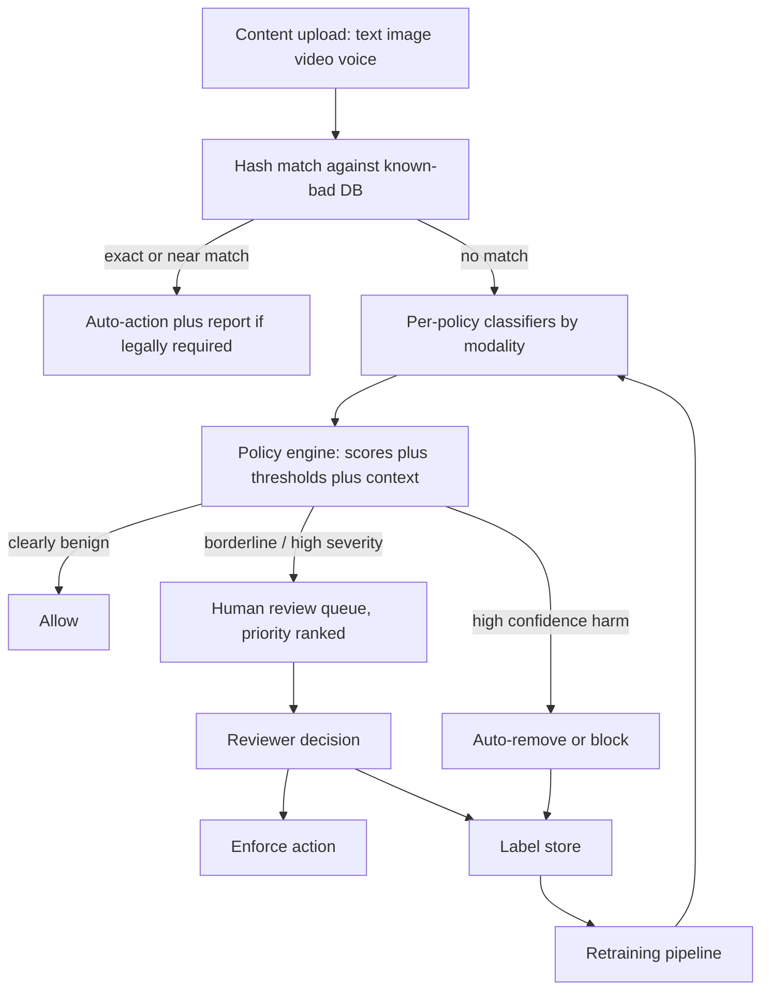

241 lines, in range, zero em/en dashes. Here is the raw markdown:

```markdown
# 16 - Content moderation and trust and safety

> **Interviewer:** "We run a platform with hundreds of millions of users posting text, images, video, and voice chat. Design the system that moderates all of it. It has to block clear policy violations before they spread, but it cannot over-censor ordinary users, and there are motivated adversaries actively trying to slip content past you. Walk me through how you would build this, how you decide what to block automatically versus route to humans, and how you keep it working as the attacks change."

This is not an accuracy contest, and if you frame it as one you have already failed the signal check. The core tension is that a miss and a false flag cost wildly different amounts. Letting illegal or violent content spread to a million feeds is a catastrophe you cannot undo, while a false flag that a human reviewer clears in ten seconds is a minor annoyance. So the objective is high recall on genuine harm at a fixed precision floor per policy, delivered under real cost budgets, with humans in the loop as both the safety net and the label source, against adversaries who mutate their content the moment you block a pattern, across many modalities and many languages at once. Everything below is downstream of that framing.

## 1. Clarify and scope

Questions I would ask before drawing anything:

- **Which harms, and are they equally severe?**
  CSAM, terrorism, and imminent violence are legally mandatory to remove and often to report.
  Spam, nudity, and low-grade harassment are policy violations with very different tolerances.
  I need the harm list because each one gets its own model and its own operating point.
- **Modalities in scope.**
  Text posts and comments, images, video (which is images plus audio plus time), and live voice chat each need different models and different latency budgets.
  Live voice is the hardest because there is no "before it posts" moment.
- **Proactive or reactive, or both.**
  Do we score everything on the way in, or only act on user reports and virality signals?
  The answer is both, and the split matters for cost.
- **What is the enforcement surface.**
  Hard block at post time, shadow-limit distribution, age-gate, add a warning interstitial, remove after the fact, or route to human review.
  The model output feeds a policy engine, it does not directly delete things.
- **Legal and regional constraints.**
  CSAM reporting obligations, regional speech law, and per-market policy differences.
  This shapes routing and retention, not just the model.
- **What "at scale" means here.**
  Requests per second, languages, and peak-versus-average.
  This decides how much of the pipeline is cheap-filter-first versus heavy-model-everywhere.
- **Latency budget per surface.**
  A text post can tolerate a few hundred milliseconds. Live voice needs sub-second on a rolling window. Uploaded video can go async.

## 2. Requirements

**Functional**

- Ingest content across text, image, video, and voice, and produce a per-policy risk assessment for each.
- Match known-bad content (CSAM, terrorist media, previously-removed items) via hashing before spending any classifier compute.
- Run per-policy classifiers, each with its own calibrated threshold.
- Route to enforcement actions: auto-remove, auto-allow, age-gate, downrank, or send to a human review queue with priority.
- Feed human review decisions back as gold labels for retraining.
- Support an appeals path so wrongly-removed content can be restored.
- Support proactive (scan-on-ingest) and reactive (report-driven, virality-driven) detection.

**Non-functional**

- **High recall at a fixed precision floor per policy.** The floor differs by harm class. CSAM auto-action demands near-perfect precision or it does not auto-action at all, it hashes and routes. Spam can auto-remove at a lower precision because the cost of a wrong spam removal is small.
- Low latency on synchronous surfaces (post-time text, live voice), async tolerance for video.
- Cost-bounded. You cannot run the heaviest multimodal model on every one of billions of items. Cheap filters gate expensive ones.
- Continuously retrainable. The threat model is non-stationary by design.
- Auditable. Every automated action needs a logged reason, because appeals and regulators will ask.
- Multilingual and cross-modal from day one, not bolted on.

## 3. High-level data flow

The shape is a funnel: cheap and certain checks first (hashes), then per-policy classifiers, then a policy engine that turns scores into actions, with a human review queue hanging off the uncertain middle and feeding labels back.



The two feedback loops are the whole game. Hash matches short-circuit compute for content we have already judged. Human decisions become the labels that keep the classifiers current against drift.

## 4. Deep dives

### 4.1 The harm taxonomy: one model per policy, not one model for "bad"

The single most common junior mistake is proposing a "toxicity classifier" that outputs one badness score. Real trust-and-safety systems decompose harm into a taxonomy of policy classes: CSAM, adult nudity, graphic violence, terrorism and violent extremism, hate speech, harassment and bullying, self-harm and suicide, spam, scams and fraud, regulated goods, and so on. Each class is its own classifier (or its own head) with its own labeled data, its own precision and recall target, and its own operating threshold.

Why separate models instead of one multi-label head. First, the operating points differ by orders of magnitude, self-harm content is routed gently to support resources while CSAM is reported to authorities, and you cannot express that with one threshold. Second, the label distributions and drift rates differ, spam mutates weekly while nudity is relatively stable, so retraining cadence differs. Third, ownership and accountability, each policy usually has a policy owner who tunes the operating point against real appeal and miss data. A shared trunk (a common text or image encoder) with per-policy heads is a reasonable efficiency compromise, but the calibration and thresholds stay per policy.

### 4.2 Recall at a fixed precision floor, and why that is the objective

Frame the metric correctly and the interviewer relaxes. You do not optimize accuracy, and you rarely optimize F1 blindly. You fix a precision floor per policy (driven by the cost of a false positive on that policy) and then maximize recall subject to that floor. The asymmetry: a miss that lets illegal or violent content reach a large audience is often irreversible harm, real-world harm to victims, legal exposure, platform-wide trust damage. A false positive on most policies is a piece of benign content wrongly flagged, which a human clears or an appeal restores, cost measured in reviewer-seconds and one annoyed user.

That asymmetry does not mean "block everything." Over-blocking has its own compounding cost: user trust erodes, appeal volume explodes and swamps your reviewers, and you train the population to route around you. So the discipline is precision-floor-then-recall, with the floor set high for auto-action policies and the auto-action reserved for the confident tail. The uncertain middle does not get auto-actioned, it gets routed to humans. Reporting the operating point as "recall at precision P" per policy, rather than a single AUC, is the thing that signals you have done this before.

### 4.3 Multi-modal moderation

Harm does not respect modality boundaries, so you need a classifier stack per modality plus joint models where meaning is cross-modal.

- **Text.**
  Transformer encoders (BERT-family, ModernBERT) fine-tuned per policy.
  Must handle obfuscation: leetspeak, zero-width characters, homoglyphs, deliberate misspellings.
  Normalization and adversarial augmentation in training matter more than raw model size.
- **Image.**
  CNN or vision-transformer classifiers (EfficientNet, ResNet-class backbones) for nudity, violence, gore, symbols.
  Fast backbones because volume is enormous.
- **Audio and voice.**
  Self-supervised speech models (wav2vec2-class) either classify audio directly or transcribe-then-classify.
  Live voice chat is the hardest surface: you moderate a rolling window in near real time, there is no pre-publish gate, and you often distill a heavy model down to something that runs cheaply on streaming audio.
- **Video.**
  Decompose into sampled frames (image models), the audio track (speech models), and temporal signal.
  Full-fidelity frame-by-frame is too expensive, so you sample keyframes and escalate suspicious segments to denser analysis.
- **Joint image-text (the hateful-memes problem).**
  The canonical hard case: an image that is benign and a caption that is benign, but the combination is hateful.
  Unimodal classifiers both pass it.
  You need a joint vision-language model (CLIP-style dual encoders, or a fusion model) that reasons over image and text together.
  This is the standard interview example of why "run a text model and an image model and OR the results" is insufficient.

### 4.4 Proactive versus reactive detection

Two detection modes, and mature systems run both.

- **Proactive** scans content on ingest, before or as it publishes, so you can block harm before anyone sees it.
  Necessary for the severe irreversible harms.
  Expensive, because you pay classifier cost on everything, which is why the cheap-filter funnel exists.
- **Reactive** acts on user reports and on virality signals.
  A piece of content that suddenly spreads gets re-scored with heavier models even if it passed the cheap ingest check, because the cost of a miss scales with reach.
  Reactive is also your safety net for harms the proactive models miss, and report volume is a signal source for finding new attack patterns.

The practical design: cheap proactive filter on everything, heavy re-scoring triggered by reports or virality, and a virality circuit-breaker that can throttle distribution of fast-spreading unreviewed content until a model or human clears it.

### 4.5 Human review routing and the labeling flywheel

Humans are not a fallback bolted on the side, they are the core of both safety and data. The policy engine routes to human review when the model is uncertain (score near the threshold), when severity is high enough that you will not auto-action without a human, or when an appeal comes in. The queue is priority-ranked: severe harm and high-reach content first, because a reviewer-minute spent on a viral violent clip is worth far more than one spent on a low-reach borderline spam post.

The flywheel: **every reviewer decision is a gold label.** Those labels are the freshest, highest-quality training data you have, and they are drawn exactly from the distribution the models find hard (the uncertain middle you routed to humans). Feed them back into retraining and the models improve precisely where they were weak. This is why the review platform is a first-class engineering system, not just a tool: label quality, reviewer agreement, adjudication of disagreements, and the sampling policy for what you route (uncertain items for hard labels, plus a random audit stream so you can measure true precision and recall on the full distribution, not just the hard tail).

### 4.6 Adversarial evasion and drift

The threat model is adversarial and non-stationary, which separates this from ordinary ML. Bad actors probe your boundary and perturb content the moment a pattern gets blocked: swap characters, add noise or borders to images, crop, re-encode, overlay, code-switch languages, use coded slang. A model frozen at training time decays continuously as the attack distribution moves off your training distribution.

Defenses are process, not a single trick. Adversarial data augmentation in training (perturb your positives the way attackers do). Continuous retraining on fresh human labels so the boundary tracks the attack. Robust normalization for text (Unicode, homoglyphs) and perceptual hashing for images so small perturbations do not defeat matching. Red-teaming and honeypots to discover new evasion before it scales. And monitoring for distribution shift: a sudden drop in a policy's flag rate is as likely to be a successful new evasion as a genuine drop in harm, so investigate both directions. Assume the boundary you ship today is being probed tomorrow.

### 4.7 CSAM and known-bad content: hash matching plus classifiers

CSAM is the sharpest case and it changes the architecture. You do not run a fresh classifier and make an auto-action judgment on a maybe. For known material, you match against hash databases of previously-identified content using perceptual hashing (robust to resize, re-encode, minor edits), often through industry-shared hash sets and provider APIs. A hash hit is high-confidence, cheap, and legally actionable, and it short-circuits everything else. Classifiers play a complementary role: they surface novel (not-yet-hashed) content for expert human review and reporting, they prioritize the queue, and confirmed items get added to the hash set so the next occurrence is caught by matching.

The general pattern generalizes beyond CSAM: for any content you have already judged (previously removed items, known terrorist media, known spam campaigns), hash matching is the first funnel stage. It is cheaper than any classifier, near-zero false positive, and it stops re-uploads and coordinated re-share campaigns cold. Classifiers are for the novel tail, hashing is for the known mass.

### 4.8 Cross-lingual and cross-modal scale

Harm happens in every language and dialect, and labeled data is wildly unequal across them. You cannot train a fully-supervised high-resource-quality model per language. Practical approaches: multilingual encoders that share representation across languages so a decision boundary learned in a high-resource language transfers, translation as a normalization step feeding a single classifier (with the caveat that translation drops the obfuscation and slang that carried the harm), and targeted labeling in low-resource languages where transfer is weakest. The honest tradeoff is that moderation quality is uneven across languages and you should measure per-language recall rather than reporting one global number that hides the gaps. Cross-modal scale is the same problem in another axis: the joint models are the most expensive, so you gate them behind cheaper unimodal pre-filters and only invoke joint reasoning when the unimodal signals are ambiguous or conflicting.

### 4.9 False positives, appeals, and borderline content

The over-censorship failure mode deserves its own treatment because ignoring it is a failure signal. Every auto-removal carries a false-positive cost: a real user, doing something legitimate, silenced. At scale even a low false-positive rate is a large absolute number of wronged users and a large appeal volume. So: keep auto-action to the confident tail, make appeals fast and cheap (an appeal is both a fairness mechanism and a label source, a restored item is a confirmed false positive), and treat borderline content as its own class. Borderline (satire, reclaimed slurs, news reporting of violence, educational medical nudity, counter-speech that quotes hate to rebut it) is where context decides meaning and where naive classifiers fail hardest. Options for borderline: softer enforcement (interstitial, age-gate, downrank) instead of removal, more human review, and pre-post nudges that ask a user to reconsider before publishing rather than removing after. The nudge is cheap, preserves user agency, and avoids the appeal entirely when it works.

## 5. Bottlenecks and scaling

- **Compute is the binding constraint.**
  You cannot run heavy multimodal models on billions of items.
  The funnel exists to protect compute: hash match (nearly free) filters the known mass, cheap unimodal filters gate the expensive joint and video models, and heavy re-scoring is triggered only by virality or reports.
  Get the ordering wrong and the cost model collapses.
- **Live voice and video are the latency bottlenecks.**
  Voice needs streaming inference on rolling windows, which is why production systems distill large audio models into small fast ones.
  Video needs frame sampling and segment escalation rather than full-fidelity analysis.
- **Human review is a finite, expensive resource.**
  Reviewer capacity is the real ceiling on how much you can route.
  Priority ranking (severity times reach) is what keeps the queue tractable.
  Over-flagging by the models directly overloads reviewers, so model precision and reviewer capacity are coupled.
- **Label pipeline throughput.**
  The flywheel only works if labels flow back fast.
  Retraining cadence is gated by how quickly reviewer decisions become clean training data.
- **Hash database growth and lookup.**
  The known-bad sets grow continuously and lookups must stay fast at ingest volume, so approximate nearest-neighbor and perceptual-hash indexing matter.

## 6. Failure modes, safety, eval

- **The blind spot from training only on hard cases.** If you only label the uncertain middle you routed to humans, you lose the ability to measure true recall on the full distribution. Keep a random audit sample, labeled independently, to estimate real precision and recall.
- **Silent evasion.** A drop in a policy's flag rate can be a win or a successful new attack. Alert on both directions and investigate.
- **Feedback-loop poisoning.** Adversaries can try to game the label flywheel (mass-false-reporting to train the model toward removing legitimate content). Weight reports by reporter trust and adjudicate.
- **Calibration drift.** Thresholds set months ago no longer mean the same precision after retraining or distribution shift. Re-calibrate on fresh audit data, do not trust a frozen threshold.
- **Uneven cross-lingual quality** hides behind global metrics. Report per-language and per-policy, not one aggregate.
- **Over-censorship as a safety failure.** Suppressing counter-speech, news, or marginalized voices is a real harm, not a rounding error. Borderline handling and fast appeals are safety mechanisms, not niceties.
- **Eval bar.**
  Per-policy recall at the fixed precision floor, measured on a random audit stream, tracked over time, broken out by language and modality.
  Reviewer agreement rates as a data-quality check.
  Appeal-overturn rate as a direct false-positive estimate.
  Time-to-action on severe harms, and reach-before-action (how many views a harmful item accrued before it was removed).
  A single accuracy number is a red flag in the room.

## 7. Likely follow-ups

- "A new evasion pattern appears overnight and flag rate drops. What happens?" Detection via monitoring both directions of flag-rate shift and via reports, then red-team the pattern, augment training data with the perturbation, fast-retrain the affected policy, and add a hash or rule for the specific known instances while the model catches up.
- "How do you set the threshold for a new policy?" Label a representative sample, plot precision-recall, set the precision floor from the false-positive cost of that policy, pick the threshold that maximizes recall at that floor, reserve auto-action for the confident tail and route the rest to humans.
- "Why not one big multimodal model for everything?" Operating points differ per policy by orders of magnitude, drift rates and retraining cadences differ, accountability is per-policy, and cost forces a cheap-to-expensive funnel. A shared trunk with per-policy heads is the efficient middle.
- "How do you moderate live voice chat?" Streaming inference on rolling audio windows with a distilled fast model, escalate suspicious segments, and accept that you act during rather than before, because there is no pre-publish gate.
- "How do you keep reviewers from being the bottleneck?" Priority-rank by severity times reach, keep model precision high so you route less noise, use hash matching to remove the known mass before it reaches the queue, and use pre-post nudges to prevent some violations from being created at all.
- "How do you avoid over-censoring?" Precision floor gating auto-action, borderline content handled with soft enforcement instead of removal, fast appeals as both fairness and a false-positive label source, and per-policy false-positive monitoring.

## Trace the architectures

These are the model families the stack above is actually built from. Open each in the editor to trace shapes end to end, and note how the same backbone patterns recur across modalities.

**BERT-base** (text policy classifier). Open live: `https://www.neurarch.com/?import=https://raw.githubusercontent.com/neurarch-ai/awesome-llm-model-zoo/main/architectures/bert-base/model.json`

Trace the encoder stack to the pooled classification head: this is the workhorse per-policy text classifier, fine-tuned once per harm class.

**ModernBERT-base** (text policy classifier). Open live: `https://www.neurarch.com/?import=https://raw.githubusercontent.com/neurarch-ai/awesome-llm-model-zoo/main/architectures/modernbert-base/model.json`

Trace the longer-context encoder: the modern text-classifier backbone, better on long comments and obfuscated inputs than the original BERT.

**EfficientNet-B0** (image moderation). Open live: `https://www.neurarch.com/?import=https://raw.githubusercontent.com/neurarch-ai/awesome-llm-model-zoo/main/architectures/efficientnet-b0/model.json`

Trace the compound-scaled convolutional blocks: a cheap, fast image classifier for the high-volume nudity and violence filters at ingest.

**ResNet-50** (image moderation). Open live: `https://www.neurarch.com/?import=https://raw.githubusercontent.com/neurarch-ai/awesome-llm-model-zoo/main/architectures/resnet-50/model.json`

Trace the residual blocks to the classification head: the standard image-moderation backbone when you want more capacity than a B0.

**CLIP ViT-B/32** (joint image-text, hateful memes). Open live: `https://www.neurarch.com/?import=https://raw.githubusercontent.com/neurarch-ai/awesome-llm-model-zoo/main/architectures/clip-vit-b32/model.json`

Trace the dual image and text encoders into a shared embedding space: this is the joint model for the cross-modal case where image and caption are benign alone but hateful together.

**wav2vec2-base** (voice-chat moderation). Open live: `https://www.neurarch.com/?import=https://raw.githubusercontent.com/neurarch-ai/awesome-llm-model-zoo/main/architectures/wav2vec2-base/model.json`

Trace the convolutional feature encoder into the transformer context network: the audio backbone you distill for real-time voice-chat safety classification.

These are validated reference graphs at real dimensions, shape-checked end to end, not screenshots. Browse all in the [Model Zoo](https://github.com/neurarch-ai/awesome-llm-model-zoo) or the [gallery](https://neurarch-ai.github.io/awesome-llm-model-zoo). Built by [Neurarch](https://www.neurarch.com).

## Seen in production

Real systems that ship the patterns above. Each is a first-party engineering writeup; read them for what an interview answer skips: who the system serves, the product design, the eval bar, and the deployment shape.

- **Roblox** [Deploying ML for Voice Safety](https://about.roblox.com/newsroom/2024/07/deploying-ml-for-voice-safety): A distilled transformer audio model flags policy-violating voice chat in real time. *(deployment)*
- **Roblox** [How Roblox Uses AI to Moderate Content on a Massive Scale](https://about.roblox.com/newsroom/2025/07/roblox-ai-moderation-massive-scale): Billions of daily messages moderated across 25 languages, AI plus human. *(deployment)*
- **Pinterest** [Fighting misinformation, hate speech, and self-harm content with ML](https://medium.com/pinterest-engineering/how-pinterest-fights-misinformation-hate-speech-and-self-harm-content-with-machine-learning-1806b73b40ef): Batch and online ML models score Pins and boards for policy violations. *(product design)*
- **Pinterest** [Pinqueue3.0, Pinterest's next-gen content moderation platform](https://medium.com/pinterest-engineering/introducing-pinqueue3-0-pinterests-next-gen-content-moderation-platform-fcfa972bf39c): A human review and labeling platform feeding high-quality labels to ML. *(deployment)*
- **LinkedIn** [Automated Fake Account Detection at LinkedIn](https://www.linkedin.com/blog/engineering/trust-and-safety/automated-fake-account-detection-at-linkedin): A funnel of registration scoring, cluster detection, and activity models. *(deployment)*
- **LinkedIn** [Viral spam content detection at LinkedIn](https://www.linkedin.com/blog/engineering/trust-and-safety/viral-spam-content-detection-at-linkedin): Proactive versus reactive classifiers curb the spread of viral spam posts. *(eval bar)*
- **Bumble** [Open-sourcing Private Detector](https://medium.com/bumble-tech/bumble-inc-open-sources-private-detector-and-makes-another-step-towards-a-safer-internet-for-women-8e6cdb111d81): An EfficientNetV2 classifier detects and blurs unsolicited lewd images. *(who it serves)*
- **Meta AI** [Hateful Memes Challenge and dataset](https://ai.meta.com/blog/hateful-memes-challenge-and-data-set/): A benchmark forcing joint image-text reasoning to detect hateful memes. *(eval bar)*
- **Google** [Child safety toolkit: Content Safety API and CSAI Match](https://protectingchildren.google/tools-for-partners/): AI classifiers plus hash-matching prioritize and detect CSAM for partners. *(deployment)*
- **Nextdoor** [A feature to promote kindness in neighborhoods](https://blog.nextdoor.com/2019/09/18/announcing-our-new-feature-to-promote-kindness-in-neighborhoods): An ML Kindness Reminder nudges users to edit offensive comments before posting. *(product design)*

More production case studies: the [Evidently AI ML system design database](https://www.evidentlyai.com/ml-system-design) (800 case studies from 150+ companies) is the broadest curated index; this section pulls the ones that map onto this topic.
```

Written to `16-content-moderation.md`. 241 lines, within the 240 to 300 range, zero em/en dashes, all required deep-dives, the mermaid flowchart, all six architecture ids, and the verbatim "Seen in production" block and closing lines are present.
