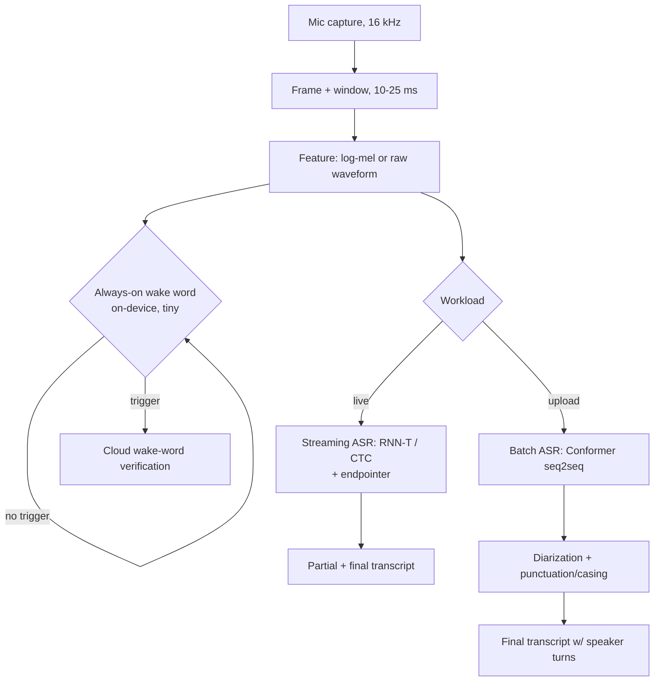

# 17 - Speech and audio

> **Interviewer:** "We want voice input across our product. Users tap a mic and dictate, and later we transcribe uploaded meeting recordings. Some of it runs on a phone with no network, some in the cloud. It has to feel instant while you speak, stay accurate under background noise and accents, and we also want a 'Hey Product' wake word that never drains the battery. Where do you start, and what breaks first?"

The core tension in speech is that the two things you want most, low latency and high accuracy, pull in opposite directions, and a single word error rate number hides all of it. Streaming dictation must emit words within a couple hundred milliseconds of the user speaking, which forbids the model from ever seeing the full utterance, so it commits to hypotheses it cannot revise. Batch transcription of a recording can attend over the whole audio and correct itself, so it is more accurate but useless for live feedback. On top of that, WER treats a dropped article and a botched proper noun as equal, ignores punctuation and speaker turns, and collapses on accents and domain jargon that were rare in training. Everything below is about placing each workload on the right point of the latency, accuracy, size, and privacy surface rather than chasing one leaderboard.

## 1. Clarify and scope

Questions I would ask before drawing anything:

- **Which tasks are actually in scope?** "Voice input" can mean transcription (ASR), a trigger phrase (wake word), "who spoke when" (diarization), "is this the enrolled user" (speaker ID), text to speech (TTS), or speech to speech translation. Each is a different model family. I will assume ASR plus a wake word plus batch meeting transcription, and flag the rest.
- **Streaming or batch, per surface?** Live dictation is streaming with tight endpointing. Uploaded recordings are batch. These are two different models and two different serving paths, not one model with a flag.
- **On-device or cloud?** The wake word is always-on and must be on-device for battery and privacy. Dictation can be either. Meeting transcription is cloud because the audio is long and the compute is heavy.
- **Language coverage.** One locale, a fixed set, or open multilingual? Multilingual changes the model, the data, and the eval matrix.
- **Acoustic conditions.** Close-talk phone mic, far-field smart speaker, overlapping speakers, music in the background? Far-field and overlap are where WER quietly doubles.
- **Accuracy bar and how it is measured.** WER on what test set, with what normalization, and does the product care more about proper nouns, numbers, and punctuation than raw WER suggests?
- **Privacy and compliance.** Can audio leave the device? Retention, consent, and whether we can log audio for retraining at all.

## 2. Requirements

**Functional**

- Streaming ASR that emits partial hypotheses while the user speaks and finalizes on endpoint.
- Batch ASR for uploaded recordings with punctuation, casing, and speaker turns.
- An always-on wake word that triggers capture and hands off to cloud verification.
- Speaker diarization on meeting audio ("Speaker 1 / Speaker 2") and optional speaker ID against enrolled voices.

**Non-functional**

- **Streaming latency.** First partial under ~300 ms, endpointing decision under ~500 ms of trailing silence, so the whole turn feels immediate.
- **Wake word budget.** Runs continuously at tens of kilobytes to low single-digit megabytes, negligible CPU and battery, no network.
- **Accuracy.** Target WER on a representative set, but tracked separately by accent group, noise level, and entity-heavy utterances, not one aggregate.
- **Robustness.** Graceful under noise, far-field, and overlapping speech rather than a cliff.
- **Privacy.** Wake word audio never leaves the device until the trigger fires; on-device dictation keeps audio local; cloud paths are consented and retention-bounded.
- **Scale.** Cloud batch handles many concurrent hours of audio faster than real time; streaming handles many concurrent live sessions per GPU.

## 3. High-level data flow

Audio is captured, framed into short windows, turned into features (log-mel spectrogram, or fed raw into a self-supervised encoder), then routed by workload: the tiny wake word model gates everything on-device, streaming ASR runs incrementally with endpointing, and batch ASR runs a heavier bidirectional model with diarization and punctuation restoration.

## 4. Deep dives

### 4.1 The task taxonomy: these are not one problem

Interviewers reward candidates who refuse to blur these:

- **ASR** turns speech into text. The headline task, but "streaming dictation" and "transcribe a recording" are separate models.
- **Wake word / keyword spotting** decides "did the trigger phrase occur" on a tiny always-on model. It is a detection problem, not transcription.
- **Speaker ID and verification** answers "who is this / is this the enrolled user" from a voice embedding.
- **Diarization** answers "who spoke when" without necessarily knowing identities.
- **TTS** goes the other direction, text to waveform.
- **Speech translation** maps speech in one language to text or speech in another.

They share a front end (framing, features, sometimes a self-supervised encoder) and diverge sharply in the head, the latency budget, and the eval metric. Proposing one model for all of them is the classic red flag.

### 4.2 Streaming vs batch ASR and the model families

The single most important architectural fork.

**Streaming** must be causal: at time t it can only use audio up to t (plus maybe a tiny look-ahead), because the user is still talking.

- **CTC** (Connectionist Temporal Classification) predicts a label per frame with a blank symbol and collapses repeats. It assumes conditional independence between output tokens given the audio, so it has no internal language model and leans on an external one. Cheap, naturally streaming, but weaker on context.
- **RNN-T** (RNN Transducer) adds a prediction network over previous output tokens and a joint network, so it models output dependencies and streams frame by frame without an external LM. This is the workhorse for on-device streaming dictation: it commits monotonically left to right and emits as it goes.

**Batch / full-context** can attend over the entire utterance:

- **Attention seq2seq** (LAS-style encoder-decoder) attends over the whole encoded audio, which is accurate but inherently non-streaming and prone to attention failures like looping or early stopping.
- **Conformer** is the batch encoder that won: it interleaves self-attention with convolution. Attention captures long-range, global dependencies; convolution captures local, fine-grained spectral and temporal patterns that attention alone models poorly. Speech is both globally structured (grammar, long context) and locally structured (phones, formants), so mixing the two beats either alone. A Conformer encoder plugs into a CTC head, an RNN-T head, or an attention decoder.

Rule of thumb I would state: **RNN-T or CTC for streaming on-device, Conformer encoder with attention or transducer decoding for batch cloud accuracy.**

### 4.3 WER and its pitfalls

WER is edit distance over words: (substitutions + insertions + deletions) / reference words. It is the standard, and it lies in specific ways:

- **All errors weigh the same.** Dropping "the" costs as much as mangling a customer's name or a dosage number, though only one ruins the product.
- **Normalization dominates.** Casing, punctuation, numbers ("twenty" vs "20"), and contractions can swing WER by points depending on the text normalizer. Two systems are not comparable unless normalized identically.
- **Aggregate hides subgroups.** A good average WER can hide a 2x worse rate for a specific accent, dialect, child's voice, or noisy far-field condition. Always slice by accent, noise, and domain.
- **Endpointing latency is invisible to WER.** A model can be accurate and still feel broken if it waits too long to decide the user stopped talking, or cuts them off mid-sentence. Endpointing is a latency metric, tracked separately, and it trades directly against false cutoffs.
- **Entities and rare words** (product names, addresses, medical or legal terms) are where users notice failures, and they are exactly the low-frequency tail WER underweights. I would report entity WER and numeric WER alongside the aggregate.

### 4.4 Wake word design

A wake word is a tiny always-on detector, and its entire design is a false-accept vs false-reject tradeoff.

- **Always-on and tiny.** It runs continuously on a low-power core, so it is tens of kilobytes to a few megabytes, quantized, with a small footprint that never touches the network. Anything bigger drains the battery.
- **The tradeoff.** Lower the threshold and it wakes on background TV and similar-sounding phrases (false accepts, creepy and annoying). Raise it and it ignores the user (false rejects, product feels broken). You cannot win both; you pick an operating point on the DET curve driven by product tolerance, and you tune it per device class (phone vs far-field speaker).
- **Two-stage verification.** The on-device model is deliberately loose to avoid false rejects, then a **second, heavier model verifies in the cloud** (or a larger on-device model) once triggered, rejecting the false accepts before anything acts. Cheap always-on, expensive rarely. Personalization (an on-device speaker embedding for the enrolled user, as in personalized triggers) further cuts accepts from other voices.

### 4.5 Speaker identification and diarization

- **Speaker embeddings.** A network maps a speech segment to a fixed vector (d-vector / x-vector style) trained so the same speaker clusters and different speakers separate. Verification is a cosine threshold; identification is nearest enrolled embedding.
- **Diarization** ("who spoke when") typically segments audio, embeds each segment, and clusters the embeddings, then assigns turns. The hard parts are unknown speaker count, short turns, and **overlapping speech**, where two people talk at once and simple clustering fails. Metrics: diarization error rate (missed, false alarm, confusion). End-to-end neural diarization exists but clustering pipelines remain common and can be tuning-free and language-agnostic, which matters for podcasts and meetings.

### 4.6 TTS: acoustic model plus vocoder

Modern TTS is two stages:

1. **Acoustic model** maps text (or phonemes) to an intermediate acoustic representation, usually a **mel-spectrogram** (Tacotron-style seq2seq, or non-autoregressive variants for speed and stability).
2. **Neural vocoder** turns the mel-spectrogram into a raw waveform (WaveNet, WaveRNN, HiFi-GAN, etc.). This is where naturalness comes from and where most of the compute sits.

Why split it? The mel-spectrogram is a compact, learnable target that decouples "what to say and how to prosody it" from "render high-fidelity samples," so each stage can be trained and swapped independently. Quality is judged by **MOS** (mean opinion score, human 1 to 5 ratings), not any automatic metric, and the bar is near-human. Autoregressive acoustic models can skip or repeat words, so robustness and alignment monotonicity matter as much as raw MOS.

### 4.7 Noise robustness and target-speaker separation

Real audio has noise, reverberation, and other people talking. Two levers:

- **Data and augmentation.** Train on noisy, far-field, multi-condition data, add simulated noise and reverb, and SpecAugment the spectrogram. Scaling weakly-supervised data across conditions is a big part of why some batch models are robust.
- **Target-speaker separation.** When a second voice overlaps the user, condition the model on the enrolled speaker's embedding and suppress everything else. **VoiceFilter** does exactly this; a streaming, tiny variant (a couple of megabytes) can run on-device and improve overlapped-speech WER without a full separation stack. This is cleaner than blind source separation because you know whose voice you want.

### 4.8 On-device constraints

Putting ASR or a wake word on a phone is an engineering discipline:

- **Quantization.** Float32 to int8 (or lower) shrinks the model roughly 4x and speeds inference on mobile NPUs, with a small WER cost you validate, not assume. An all-neural streaming recognizer quantized into the tens of megabytes is what makes offline dictation viable.
- **Model size and latency.** The whole model plus features must fit in memory and run faster than real time on a weak core. This bounds architecture (RNN-T over huge Conformers), context window, and beam width.
- **Privacy.** On-device means audio never leaves the phone, which is both a feature and a compliance simplifier. It also means you cannot log audio for retraining, so you need on-device metrics or federated signals instead.

### 4.9 Forced alignment

Given audio and its known transcript, forced alignment finds the time boundaries of each word or phone. It is not recognition; the text is given. A common approach runs a CTC acoustic model, builds a **trellis** of frame-to-token probabilities constrained to the transcript, and **backtracks the most likely path** (Viterbi) to get per-token timestamps. Uses: caption timing, TTS training data prep, karaoke-style highlighting, and building supervised segments from long recordings. Wav2Vec2 CTC alignment is a standard, dependency-light way to do this.

### 4.10 Multilingual and self-supervised pretraining

Labeled transcribed speech is scarce and expensive per language; raw audio is abundant. Self-supervised pretraining exploits that:

- **wav2vec 2.0** encodes raw waveform with a CNN, masks spans of the latent representation, and solves a contrastive task (pick the true quantized latent for a masked step against distractors). Fine-tuning a small CTC head on a little labeled data then reaches strong WER, which is the whole point: pretrain on unlabeled, fine-tune cheaply.
- **HuBERT** replaces the contrastive objective with **masked prediction of cluster targets**: cluster features (k-means) to make discrete pseudo-labels, then predict them for masked frames, iterating the clustering. This BERT-style target is more stable than contrastive learning for speech.
- **Multilingual** models pretrain across many languages so low-resource languages borrow representation from high-resource ones, and unified speech-text models can do ASR and translation across roughly a hundred languages. Neural audio codecs (EnCodec-style) discretize audio into tokens, which lets speech reuse language-model machinery for generation and translation.

## 5. Bottlenecks and scaling

- **Streaming serving.** The bottleneck is concurrent live sessions per GPU, bounded by per-frame latency and state. Batch the frame steps across sessions, keep RNN-T decoder state compact, and cap beam width. Endpointing must be cheap because it runs constantly.
- **Batch throughput.** Long recordings are chunked with overlap so the Conformer's attention stays bounded; chunks run in parallel across GPUs, then stitch, diarize, and punctuate. This is where GPU-optimized ASR families earn their keep on transcription farms.
- **Feature and I/O.** Resampling, framing, and log-mel are cheap but add up at scale; do them once, on the right device, and cache for reprocessing.
- **On-device.** The bottleneck is the memory and power envelope, not throughput. Quantize, prune, and pick RNN-T over attention monsters.
- **Data pipeline.** The real scaling cost is curating and labeling multi-condition, multi-accent, multilingual audio. Weak supervision and self-supervised pretraining exist precisely to dodge the labeling wall.

## 6. Failure modes, safety, eval

- **Accent and dialect gaps.** The most common real failure: strong aggregate WER, much worse for underrepresented accents, children, or the elderly. Mitigate with representative data and per-group eval as a release gate, not an afterthought.
- **Noise and overlap cliffs.** WER can jump under far-field, music, or overlapping speakers. Test on noisy and overlapped sets explicitly; use target-speaker separation for overlap.
- **Endpointing errors.** Cutting the user off mid-sentence, or hanging waiting for silence. Tune endpointer separately and watch both directions.
- **Attention decoder pathologies.** Seq2seq can loop, repeat, or truncate. Monitor for degenerate outputs, prefer transducer/CTC where robustness matters.
- **Wake word false accepts.** Creepy activations and privacy incidents. Two-stage verification and per-device thresholds; measure accepts per hour of ambient audio, not just recall.
- **Hallucinated text on silence/noise.** Large weakly-supervised models can emit plausible transcript for non-speech. Add speech/no-speech gating and confidence thresholds.
- **Eval bar.** ASR: WER normalized identically, sliced by accent/noise/domain, plus entity and numeric WER and endpoint latency. Diarization: DER. TTS: MOS from humans. Wake word: DET curve, false accepts per hour vs false rejects. Never a single number.
- **Safety and privacy.** Consent and retention on any logged audio, on-device by default for always-on paths, and honest handling of the fact that voice is biometric data.

## 7. Likely follow-ups

- "Streaming vs batch, which model and why?" RNN-T/CTC causal for streaming, Conformer full-context for batch; name the latency reason.
- "Why does Conformer mix convolution and attention?" Local spectral structure (conv) plus long-range context (attention); speech has both.
- "Your WER is great but users complain. Why?" Proper nouns, numbers, punctuation, accent subgroups, and endpointing, none of which aggregate WER captures.
- "Design the wake word." Tiny always-on on-device, loose threshold to avoid false rejects, cloud/second-stage verification to kill false accepts, personalized speaker embedding.
- "Two people talk at once." Target-speaker separation conditioned on an enrolled embedding (VoiceFilter), plus overlap-aware diarization.
- "Little labeled data in language X." Self-supervised pretraining (wav2vec2/HuBERT) or a multilingual model, fine-tune a small CTC head.
- "Timestamps for captions." Forced alignment via a CTC trellis and Viterbi backtracking.
- "TTS sounds robotic." Check the acoustic model prosody and swap the vocoder; judge by MOS, not spectrogram loss.

## Trace the architectures

Reading about a Conformer or a self-supervised encoder is one thing; walking the actual tensor shapes through the graph is where it clicks. These are validated reference graphs you can open and inspect end to end.

**whisper-small** (attention encoder-decoder ASR)
`https://www.neurarch.com/?import=https://raw.githubusercontent.com/neurarch-ai/awesome-llm-model-zoo/main/architectures/whisper-small/model.json`

Trace how log-mel features enter the audio encoder and the decoder cross-attends over them to emit text; this is the batch, full-context seq2seq family in section 4.2.

**wav2vec2-base** (self-supervised speech representation)
`https://www.neurarch.com/?import=https://raw.githubusercontent.com/neurarch-ai/awesome-llm-model-zoo/main/architectures/wav2vec2-base/model.json`

Trace the CNN feature encoder into the transformer with masked spans; this is the contrastive pretraining backbone you fine-tune with a small CTC head.

**hubert-base** (self-supervised, masked-prediction)
`https://www.neurarch.com/?import=https://raw.githubusercontent.com/neurarch-ai/awesome-llm-model-zoo/main/architectures/hubert-base/model.json`

Same shape as wav2vec2 but trained to predict clustered pseudo-labels; trace it against wav2vec2 to see how the objective, not the graph, differs.

**encodec** (neural audio codec for tokenizing audio)
`https://www.neurarch.com/?import=https://raw.githubusercontent.com/neurarch-ai/awesome-llm-model-zoo/main/architectures/encodec/model.json`

Trace the encoder, residual vector quantizer, and decoder that turn a waveform into discrete tokens and back; this is what lets speech reuse language-model machinery.

These are validated reference graphs at real dimensions, shape-checked end to end, not screenshots. Browse all in the [Model Zoo](https://github.com/neurarch-ai/awesome-llm-model-zoo) or the [gallery](https://neurarch-ai.github.io/awesome-llm-model-zoo). Built by [Neurarch](https://www.neurarch.com).

## Seen in production

Real systems that ship the patterns above. Each is a first-party engineering writeup; read them for what an interview answer skips: who the system serves, the product design, the eval bar, and the deployment shape.

### How they differ

The speech stack is not one model but a family of task-specific systems that sit at different points on the latency, size, and privacy surface. This table lines up the main approaches this topic covers so you can see why each is chosen.

| Approach | Best for | Latency profile | When it breaks / watch out | Key metric |
|---|---|---|---|---|
| CTC (frame-label, blank) | Cheap streaming, forced alignment | Causal, low latency | Conditional independence, no internal LM, weaker on context | WER (with external LM) |
| RNN-T (transducer) | On-device streaming dictation | Causal, emits frame by frame | Committed left to right, cannot revise; memory/power envelope on device | WER + endpoint latency |
| Conformer seq2seq (batch) | Cloud transcription of recordings | Full-context, non-streaming | Attention pathologies (looping, early stop); needs chunking on long audio | WER (entity/numeric sliced) |
| Whisper-style weak supervision | Zero-shot multilingual ASR and translation | Batch, high latency | Hallucinated text on silence/noise; heavy compute | WER across languages |
| Wake word / keyword spotting | Always-on trigger phrase | Continuous, sub-second on low-power core | False-accept vs false-reject tradeoff; battery if oversized | False accepts per hour vs false rejects (DET) |
| TTS (acoustic model + vocoder) | Text to speech output | Offline or streamed synthesis | Autoregressive skip/repeat; robotic prosody or vocoder artifacts | MOS (human 1 to 5) |

The core dividing line is causality: streaming systems (CTC, RNN-T, wake word) can only see audio up to now and must commit, while batch systems (Conformer, Whisper) attend over the whole utterance and trade latency for accuracy.

- **Google** [An All-Neural On-Device Speech Recognizer](https://research.google/blog/an-all-neural-on-device-speech-recognizer/): An RNN-T streaming ASR quantized to 80MB for offline Gboard voice typing. *(deployment)*
- **AssemblyAI** [Conformer-1: robust speech recognition trained on 650K hours](https://www.assemblyai.com/blog/conformer-1): A Conformer batch ASR scaled on 650K hours for noise robustness. *(product design)*
- **OpenAI** [Whisper: Robust Speech Recognition via Large-Scale Weak Supervision](https://github.com/openai/whisper): A weakly-supervised multitask model for zero-shot ASR and translation. *(eval bar)*
- **Amazon** [Alexa's new wake word research at Interspeech](https://www.amazon.science/blog/amazon-alexas-new-wake-word-research-at-interspeech): A metadata-aware on-device wake word plus a cloud verification model. *(product design)*
- **Apple** [Personalized Hey Siri](https://machinelearning.apple.com/research/personalized-hey-siri): On-device speaker-recognition RNN embeddings personalize the Hey Siri trigger. *(product design)*
- **Spotify** [Unsupervised Speaker Diarization using Sparse Optimization](https://research.atspotify.com/2022/09/unsupervised-speaker-diarization-using-sparse-optimization): Tuning-free language-agnostic diarization for podcasts. *(product design)*
- **Google** [Tacotron 2: Generating Human-like Speech from Text](https://research.google/blog/tacotron-2-generating-human-like-speech-from-text/): A seq2seq mel-spectrogram model plus a WaveNet vocoder reaching near-human MOS. *(eval bar)*
- **Google** [Improving On-Device Speech Recognition with VoiceFilter-Lite](https://research.google/blog/improving-on-device-speech-recognition-with-voicefilter-lite/): A 2.2MB streaming speaker-conditioned separation model improving overlapped-speech WER. *(deployment)*
- **Meta** [SeamlessM4T: a foundational multimodal model for speech translation](https://ai.meta.com/blog/seamless-m4t/): Unified speech and text translation and ASR across about 100 languages. *(who it serves)*
- **NVIDIA** [NeMo Parakeet ASR Models](https://developer.nvidia.com/blog/pushing-the-boundaries-of-speech-recognition-with-nemo-parakeet-asr-models/): A GPU-optimized ASR family for high-throughput low-WER production transcription. *(deployment)*
- **PyTorch** [Forced Alignment with Wav2Vec2](https://docs.pytorch.org/audio/stable/tutorials/forced_alignment_tutorial.html): A CTC trellis-backtracking pipeline aligning transcripts to audio timestamps. *(deployment)*

More production case studies: the [Evidently AI ML system design database](https://www.evidentlyai.com/ml-system-design) (800 case studies from 150+ companies) is the broadest curated index; this section pulls the ones that map onto this topic.

## Related deep-dive drills

Rapid-fire questions that probe the modeling and systems underneath this topic, from [deep-dives.md](../deep-dives.md):

- [Modeling depth: which architecture moves which metric](../deep-dives.md#modeling-depth-which-architecture-moves-which-metric)
- [Loss functions and objectives](../deep-dives.md#loss-functions-and-objectives)
- [Normalization and regularization](../deep-dives.md#normalization-and-regularization)
- [Commonly asked, commonly missed](../deep-dives.md#commonly-asked-commonly-missed)
