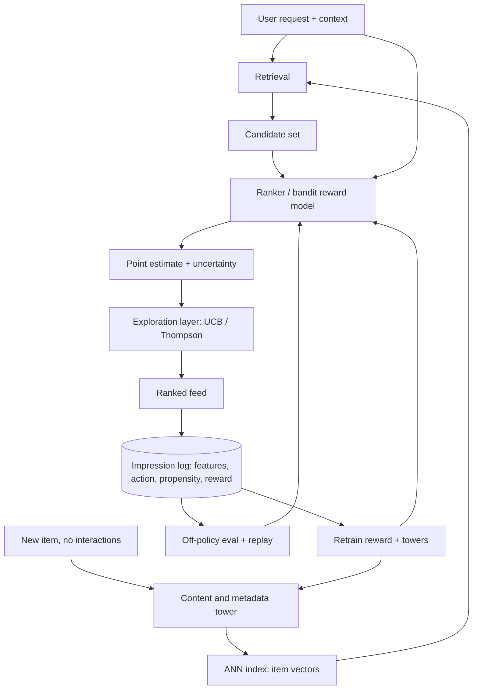

# 18 - Cold start and exploration

> **Interviewer:** "Design the recommender for a marketplace app. Two hard cases: a brand-new user who just signed up with zero interaction history, and a brand-new item uploaded a minute ago that nobody has ever clicked. On top of that, product is worried the feed feels stale, it keeps recommending the same few things and new content never gets a chance. How do you serve good recommendations on day zero for both sides, and how do you keep the system from ossifying around what it already knows?"

The signal here is that cold start and exploration are the same problem viewed from two angles, and the naive collaborative-filtering answer fails both. A model that keys off learned ID embeddings has nothing to say about an entity with no interactions: a fresh user ID and a fresh item ID map to untrained (effectively random) vectors. The fix is to stop treating identity as the primary signal and lean on content and metadata, so a new entity inherits a location in embedding space from things it resembles rather than earning one only after data accrues. The second half is subtler and is where strong candidates separate themselves: even a perfect model degrades over time under pure exploitation, because the logging policy only collects labels for what it already promotes. Items you never show never get fresh feedback, their estimates go stale, and the feedback loop calcifies. Escaping that costs you something now: you must sometimes show a less-certain item to learn about it. That is explore-exploit, and it is only rational under a long-horizon objective where the value of information counts. Frame the whole answer as: content towers solve the day-zero problem, and uncertainty-aware exploration solves the ossification problem, both paid for against long-term value, not this session's click.

## 1. Clarify and scope

Questions I would ask before drawing anything:

- **Which cold start dominates?** Item-side (lots of new supply, e.g. UGC, listings, news) and user-side (lots of new demand, e.g. viral signups) have different fixes. Often both, but the volume ratio changes priorities.
- **How fast do items churn?** If most impressions go to items less than a day old (news, short video), cold start is the steady state, not an edge case, and exploration is load-bearing.
- **What is the metadata quality?** Content towers are only as good as the features. Rich structured metadata (category, creator, text, thumbnail) makes the content path strong; sparse metadata pushes you toward exploration.
- **What is the reward, and how delayed?** A click is immediate and cheap but a poor proxy for value. Retention, completion, or a downstream conversion may be the true target but arrive hours or days later.
- **How large is the action space?** Tens of arms (artwork variants, ranked modules) admits classic bandits. Millions of items (catalog) needs a different tractability story.
- **Is there an experimentation platform I should integrate with?** Bandits are often best delivered as a first-class experiment type rather than a bespoke service.
- **What are the guardrails?** Exploration on a payments or safety-sensitive surface has a floor of quality below which we will not drop for the sake of learning.

Scope I will commit to: cold-start representation for both users and items, an exploration policy layered on top of the ranker, a reward-proxy choice, and an off-policy evaluation loop so we can ship policy changes without a live A/B for every one.

## 2. Requirements

**Functional**

- Serve reasonable recommendations for a user with zero history (fall back to context, then popularity priors, then bandit exploration).
- Give a brand-new item a fair, bounded shot at impressions without needing a manual boost.
- Support an exploration policy that trades short-term reward for information, tunable per surface.
- Log every decision with enough context (features, chosen action, propensity) to evaluate a new policy offline.

**Non-functional**

- Ranking latency budget unchanged by exploration (order tens of milliseconds); exploration must be a cheap layer, not a second model call.
- Freshness: a new item should be eligible within minutes of upload, so the content tower must be servable without waiting for a training cycle.
- Reproducibility: logged propensities must match the policy that actually ran, or off-policy evaluation is garbage.
- Safety floor: exploration is bounded so the worst exploratory impression is still above a quality threshold.

## 3. High-level data flow

Two-stage retrieval-then-rank, with a content-tower path that handles cold entities and an exploration layer that sits on the final scores.

The key structural choice: cold entities get a vector from the content tower, so they are retrievable and rankable on day zero, and the exploration layer reads an uncertainty estimate the reward model already produces, so exploring costs almost nothing extra at serve time.

## 4. Deep dives

### 4.1 Item cold start: content and metadata towers, not ID embeddings

The failure mode is concrete. A pure collaborative model represents item `i` as a learned embedding indexed by ID. For a just-uploaded item that embedding is untrained, so retrieval and ranking treat it as noise and it never surfaces, so it never earns interactions, so its embedding stays untrained. The loop is self-sealing.

The fix is a content tower: the item vector is a function of features (category, creator, text tokens, thumbnail embedding, price, language) rather than an ID lookup. Two towers, user-side and item-side, each map their features into a shared space; relevance is a dot product. Now a new item's vector is computed from its metadata the moment it is uploaded, and it lands *near* similar items that already have interaction signal. It inherits a location from its neighbors instead of starting at the origin. This is what makes a new listing retrievable minutes after upload with no training cycle in the loop: you run the item features through the tower and insert the vector into the ANN index.

Nuance worth stating: pure content towers underperform ID-based models once an item is warm, because IDs capture idiosyncratic behavioral signal that no feature set fully explains. The practical design is hybrid, an ID embedding that is *added* to the content-derived vector, with the ID part naturally near-zero for cold items and dominating as interactions accrue. You get content generalization for free at the cold end and behavioral sharpness at the warm end, on one model.

### 4.2 User cold start: context is the metadata

Symmetric problem, symmetric fix. A brand-new user has no history, so the user tower keys off whatever context exists at request time: signup source, device, locale, coarse geo, time of day, and any onboarding declared preferences. That places the user in a plausible region of the space on the very first request. The DoorDash cuisine-filter case is a clean example of this in practice: geographic hierarchy priors (district, city, region) give a new user or a new district a sensible starting distribution that then personalizes as data arrives. The general pattern is a prior that backs off up a hierarchy (this user -> this segment -> this geo -> global) and blends toward the specific level as evidence accumulates.

### 4.3 Why pure exploitation ossifies

This is the conceptual heart. Suppose your ranker is well calibrated *today*. If you always serve the argmax, you only ever collect labels for the items you already rank highly. Items you rank low get zero fresh impressions, so their estimates are frozen at whatever they were when you stopped showing them, which may be wrong or stale (tastes shift, an item's audience grows). The model has no way to discover that a demoted item is now good, because it never lets it prove itself. Over time the served distribution collapses onto a shrinking set and the corpus effectively narrows. This is not a bug in the model, it is a property of greedy data collection: the logging policy and the training data are entangled, and a greedy policy produces biased, self-confirming data. The only escape is to deliberately spend some impressions on items the model is *uncertain* about, to keep the label distribution wide enough that the model can correct itself.

### 4.4 Explore-exploit algorithms and their tradeoffs

- **Epsilon-greedy:** with probability epsilon show a random item, otherwise the argmax. Trivial to implement and to log (uniform propensity on the explore branch), and a fine baseline. Weakness: it explores *uniformly*, wasting impressions on obviously-bad items as often as on promising-but-uncertain ones.
- **UCB (upper confidence bound):** score each arm by mean plus a bonus that grows with uncertainty, then pick the argmax of that optimistic score. Exploration is now *directed*: you explore where you are uncertain, not everywhere. Deterministic given the counts, which some infra prefers.
- **Thompson sampling:** maintain a posterior over each arm's reward, draw a sample from each posterior, pick the arm with the highest sample. Uncertain arms have wide posteriors so they win draws often enough to get explored, and the randomness gives you clean propensities for logging. Empirically robust and the default many teams reach for.
- **Contextual bandits (LinUCB and friends):** the reward is a function of context (user, item, time), not a fixed per-arm mean. LinUCB assumes a linear reward in the feature vector and derives a closed-form confidence bonus, which is why it scales and why it was the workhorse in the Yahoo news work. Neural-linear variants keep the linear-uncertainty head on top of a learned feature extractor to get both expressiveness and cheap uncertainty.

The unifying point for the interviewer: uncertainty-driven exploration beats uniform exploration because it concentrates the cost of learning on decisions where learning is actually possible. Epsilon-greedy pays a flat tax; UCB and Thompson pay only where the payoff in information is high.

### 4.5 Large action spaces: making bandits tractable

Textbook bandits assume a small, fixed arm set. A catalog has millions of items, and per-arm posteriors do not scale. The moves:

- **Two-stage funnel.** Retrieval (ANN over tower vectors) cuts millions to hundreds; the bandit only operates over that candidate set. You never maintain a posterior over the whole catalog.
- **Parametric, shared-across-arms models.** In a contextual bandit the reward model is shared: an arm is described by its features, not by an independent parameter vector. Uncertainty comes from the model over features, so a new item with no history still gets an uncertainty estimate from its features. This is the Instacart large-action-space pattern.
- **Structure the action space.** Explore over clusters, categories, or a geo hierarchy rather than raw items, then drill down. Cheaper and gives new items a group-level prior.

### 4.6 Delayed and long-term reward: choosing the proxy

The reward you can measure instantly (click) is rarely the reward you want (retention, satisfaction, long-term engagement). If you optimize the immediate proxy you get clickbait; if you wait for the true signal you cannot update the policy for days. The resolution is to *choose a proxy that predicts long-term value* and to model the delay explicitly. The Spotify "Impatient Bandits" work is the reference: rather than waiting for the full delayed reward or naively using a myopic one, they model the reward-formation process so the bandit can act on a partially-observed signal that is predictive of the eventual long-term outcome. In an interview, name the tension (myopic-but-fast versus true-but-slow) and propose a learned or structured early proxy plus a correction as the true label lands.

### 4.7 Off-policy evaluation and replay

You cannot A/B test every candidate policy, it is too slow and too expensive. Off-policy evaluation (OPE) estimates how a *new* policy would have performed using logs generated by the *old* policy. The mechanics: log the propensity (the probability the serving policy assigned to the action it took) alongside each impression, then reweight logged rewards by the ratio of new-policy to old-policy probability (importance sampling / inverse-propensity scoring). Replay evaluation, as in the Yahoo LinUCB paper on 33M events, is the clean special case when logs contain uniformly-random exploration traffic: you replay the stream and only score events where the new policy's choice matches the logged choice, giving an unbiased estimate with no model of the reward. Two hard requirements fall out of this: exploration must be *stochastic with known propensities* (a reason to prefer Thompson/epsilon-greedy over a deterministic argmax), and logged propensities must exactly match the policy that ran. Get either wrong and OPE lies to you.

### 4.8 Long-term value of exploration and warm-up

Exploration's payoff is not this session, it is the *corpus*. By giving uncertain and new items impressions, you keep discovering good content, which grows the effective catalog and breaks the ossification loop from 4.3. The Google "Long-Term Value of Exploration" work makes this explicit: neural-linear bandit exploration is justified by corpus growth and feedback-loop breaking, measured on a long horizon, not by short-term engagement (which exploration slightly lowers by construction). Concretely, warm-up strategies for new content:

- **Bounded exploration budget per new item:** guarantee each new item a small number of impressions to well-matched users (via its content-tower neighbors), enough to get an initial reward estimate.
- **Uncertainty decay:** the exploration bonus is large when interaction count is low and shrinks as data accrues, so a new item automatically graduates from explored to exploited.
- **Recency-aware bandits** (Duolingo's recovering/sleeping bandit) for surfaces where an arm's reward regenerates over time, so you re-explore a rested arm rather than assuming its old estimate holds.
- **Pure-exploration phases** (Spotify's infinitely-armed podcast bandit) when the goal is specifically to find broadly-appealing new items without popularity bias, decoupled from the exploit feed.

### 4.9 Bandits as a first-class experiment type

The cleanest deployment is not a bespoke bandit service bolted onto ranking but a bandit that lives inside the experimentation platform, as Stitch Fix describes. The platform already handles assignment, logging, and metric computation; adding a reward service and a Thompson-sampling allocator turns "which variant" A/B tests into adaptive experiments that shift traffic toward winners while they run. This reuses infrastructure, gives you propensity logging for free, and makes exploration a governed, auditable thing rather than a hidden knob in the ranker.

## 5. Bottlenecks and scaling

- **Serving the content tower fresh.** New items must be embeddable without a training cycle, so the item tower has to be servable at upload time and the ANN index has to accept online inserts. Batch-only indexing kills item cold start.
- **Uncertainty at ranking latency.** UCB/Thompson need a per-candidate uncertainty. A full Bayesian posterior per request is too slow; the practical answer is a linear (or neural-linear) head where the confidence bonus is a cheap closed form over the candidate features.
- **Log volume and propensity fidelity.** Every impression carries features and a propensity, which is a large, high-write log. It is also the single point of failure for OPE, so schema and propensity correctness are load-bearing, not incidental telemetry.
- **Retrain cadence versus staleness.** Cold start is worst right after upload; the longer the gap between impression and the reward model incorporating it, the longer new items stay uncertain. Near-real-time feature updates help more here than a bigger model.

## 6. Failure modes, safety, eval

- **Feedback-loop collapse (the core failure):** greedy serving narrows the corpus. Mitigation is the whole point of the exploration layer; monitor served-item diversity and new-item impression share as first-class health metrics, not vanity charts.
- **Exploration on the wrong surface:** exploring on a checkout or safety-sensitive surface is reckless. Bound exploration by a quality floor and disable it where a bad impression is costly.
- **Propensity leakage / mismatch:** if logged propensities do not match the serving policy, OPE and IPS estimates are silently wrong. Test this directly by replaying logged random traffic and checking the estimator recovers known outcomes.
- **Proxy gaming:** optimizing an immediate proxy (click, dwell) produces clickbait and erodes the true objective. Guard with the long-term-value reward from 4.6 and hold-out cohorts measured on the real target.
- **Cold-start popularity bias:** falling back to popularity for new users is safe but self-reinforcing (popular gets more popular). Pure-exploration or calibrated bandits counteract it.
- **Eval bar:** ship policies on offline replay / OPE first (does the new policy beat the logged one on IPS?), then a live experiment measuring both short-term engagement *and* a long-horizon corpus/retention metric, because exploration is expected to cost a little short-term reward and must be judged on the long horizon.

## 7. Likely follow-ups

- "The content tower is worse than the ID model for warm items, why keep it?" Because it is additive: hybrid ID-plus-content gives generalization at the cold end and behavioral sharpness at the warm end on one model.
- "Why not just always explore uniformly (epsilon-greedy everywhere)?" It pays a flat tax and wastes impressions on obviously-bad items; uncertainty-driven exploration concentrates the cost where information is available.
- "How do you evaluate a new bandit without a live test?" Off-policy evaluation via inverse-propensity weighting, or replay on logged random-exploration traffic for an unbiased estimate, which is why stochastic policies with logged propensities matter.
- "Isn't exploration just lost revenue?" Short-term yes, and you must justify it on long-term value: corpus growth and breaking ossification, measured on a long horizon.
- "How do you pick the reward when the real signal is days out?" Choose or learn an early proxy predictive of long-term value and model the delay, rather than optimizing a myopic click.

## Trace the architectures

A bandit is a decision policy, not a single neural graph, so there is no "bandit architecture" to trace. But the parts that make it work *are* ordinary graphs: the reward or scoring model behind a contextual bandit, and the content-and-metadata towers that solve cold start. These are the graphs worth opening.

**Two-tower (content-and-metadata towers)** places a cold-start item without interaction IDs. Trace how the item tower consumes only features (category, text, thumbnail) and emits a vector in the same space as the user tower, so a brand-new item is retrievable from its metadata alone.

[Open in Neurarch](https://www.neurarch.com/?import=https://raw.githubusercontent.com/neurarch-ai/awesome-llm-model-zoo/main/architectures/two-tower/model.json)

**Wide-and-deep** is a natural contextual-bandit reward model over user-context and item features. Trace how the wide cross-features and the deep embedding path combine into one reward estimate, the point estimate a UCB or Thompson layer then adds an uncertainty bonus to.

[Open in Neurarch](https://www.neurarch.com/?import=https://raw.githubusercontent.com/neurarch-ai/awesome-llm-model-zoo/main/architectures/wide-and-deep/model.json)

**DLRM** is the feature-interaction scoring model behind a bandit. Trace the explicit dot-product interaction over dense and sparse features, which is exactly the shared, feature-parameterized reward that lets a bandit score a never-seen item from its features instead of an ID.

[Open in Neurarch](https://www.neurarch.com/?import=https://raw.githubusercontent.com/neurarch-ai/awesome-llm-model-zoo/main/architectures/dlrm/model.json)

These are validated reference graphs at real dimensions, shape-checked end to end, not screenshots. Browse all in the [Model Zoo](https://github.com/neurarch-ai/awesome-llm-model-zoo) or the [gallery](https://neurarch-ai.github.io/awesome-llm-model-zoo). Built by [Neurarch](https://www.neurarch.com).

## Seen in production

Real systems that ship the patterns above. Each is a first-party engineering writeup; read them for what an interview answer skips: who the system serves, the product design, the eval bar, and the deployment shape.

### How they differ

The topic covers a few distinct levers, and interviewers probe whether you know which one to reach for. This table lines up the main exploration policies against the content-tower cold-start fix across the dimensions that decide between them.

| Approach | Exploration behavior | When it wins | When it breaks / watch out | Serving cost |
|----------|----------------------|--------------|----------------------------|--------------|
| Epsilon-greedy | Uniform random on the explore branch, argmax otherwise | A quick baseline; clean uniform propensity for off-policy eval | Pays a flat tax, wastes impressions on obviously-bad arms as often as promising ones | Trivial: one coin flip per request |
| UCB (upper confidence bound) | Directed toward high-uncertainty arms via an optimistic mean-plus-bonus score | You want deterministic, directed exploration and infra prefers no randomness | Deterministic choice gives no logged propensity, so replay-style OPE is harder | Cheap if the bonus is a closed form over counts / features |
| Thompson sampling | Directed via posterior draws; wide-posterior arms win often enough to get explored | Robust default; randomness yields clean propensities for logging | Needs a maintainable posterior per arm, which does not scale to millions of raw arms | Cheap with a linear head; costly with a full Bayesian posterior |
| Contextual bandits (LinUCB, neural-linear) | Directed; reward is a function of context and features, uncertainty comes from the shared model | Large or shifting catalogs; a never-seen item still gets an uncertainty estimate from its features | Linear assumption can underfit; needs a two-stage funnel to bound the arm set | Moderate: shared parametric model plus a closed-form confidence bonus |
| Content-and-metadata tower (cold-start representation) | Not exploration; places a fresh entity in embedding space from its features | Day-zero retrievability for a brand-new user or item with zero interactions | Underperforms ID embeddings once an entity is warm; only as good as the metadata | Low at serve time; needs an online-insertable ANN index |

The core dividing line is uncertainty-directed spend versus flat spend for the exploration policies, and feature-derived placement versus ID lookup for the cold-start representation.

- **Netflix** [Artwork Personalization at Netflix](https://netflixtechblog.com/artwork-personalization-c589f074ad76): Contextual bandits pick per-member title artwork, small action space, cache-served at scale. *(product design)*
- **Netflix** [Infra for Contextual Bandits and Reinforcement Learning](https://netflixtechblog.com/ml-platform-meetup-infra-for-contextual-bandits-and-reinforcement-learning-4a90305948ef): Production infra for reward computation, logging, and offline policy evaluation of bandits. *(deployment)*
- **Spotify** [Identifying New Podcasts with a Pure-Exploration Infinitely-Armed Bandit](https://research.atspotify.com/publications/identifying-new-podcasts-with-high-general-appeal-using-a-pure-exploration-infinitely-armed-bandit-strategy): A pure-exploration bandit surfaces broadly-appealing new podcasts without popularity bias. *(who it serves)*
- **Spotify** [Calibrated Recommendations with Contextual Bandits on the Homepage](https://research.atspotify.com/2025/9/calibrated-recommendations-with-contextual-bandits-on-spotify-homepage): A contextual bandit balances the music, podcast, audiobook mix per user context. *(product design)*
- **Spotify** [Impatient Bandits: Optimizing for the Long-Term Without Delay](https://research.atspotify.com/publications/impatient-bandits-optimizing-for-the-long-term-without-delay): A delayed-reward bandit picks a reward signal to optimize long-term engagement. *(eval bar)*
- **DoorDash** [Personalized Cuisine Filter](https://careersatdoordash.com/blog/personalized-cuisine-filter/): A multi-armed bandit with geo-hierarchy priors handles new-user and new-district cold start. *(who it serves)*
- **Yahoo** [A Contextual-Bandit Approach to Personalized News Article Recommendation](https://arxiv.org/abs/1003.0146): The LinUCB news bandit plus offline replay evaluation on 33M events. *(eval bar)*
- **Stitch Fix** [Multi-Armed Bandits and the Experimentation Platform](https://multithreaded.stitchfix.com/blog/2020/08/05/bandits/): Thompson-sampling bandits as a first-class experiment type with a reward service. *(deployment)*
- **Instacart** [Contextual Bandit models in large action spaces](https://company.instacart.com/tech-innovation/using-contextual-bandit-models-in-large-action-spaces-at-instacart): Contextual bandits for product recs when the catalog action space is very large. *(deployment)*
- **Duolingo** [A Sleeping, Recovering Bandit for Optimizing Recurring Notifications](https://research.duolingo.com/papers/yancey.kdd20.pdf): A recovering bandit picks the daily reminder with a recency penalty, lifting retention. *(product design)*
- **Google** [Long-Term Value of Exploration](https://arxiv.org/abs/2305.07764): Neural-linear bandit exploration grows the content corpus, breaking feedback-loop ossification. *(eval bar)*

More production case studies: the [Evidently AI ML system design database](https://www.evidentlyai.com/ml-system-design) (800 case studies from 150+ companies) is the broadest curated index; this section pulls the ones that map onto this topic.

## Related deep-dive drills

Rapid-fire questions that probe the modeling and systems underneath this topic, from [deep-dives.md](../deep-dives.md):

- [Embeddings and representation learning](../deep-dives.md#embeddings-and-representation-learning)
- [Statistics and probability for ML](../deep-dives.md#statistics-and-probability-for-ml)
- [Modeling depth: which architecture moves which metric](../deep-dives.md#modeling-depth-which-architecture-moves-which-metric)
- [Commonly asked, commonly missed](../deep-dives.md#commonly-asked-commonly-missed)
