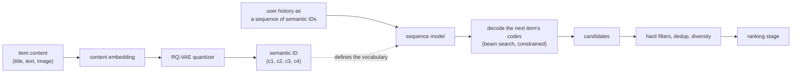

# 19 - Generative recommendation

**The question, as an interviewer poses it:** "Our recommender is a four-stage cascade
with thousands of hand-built features, and it takes a quarter to launch a new surface.
Should we replace it with one generative model, and what would that actually cost?"

This is the live architectural argument in recommendation right now, and it is asked
in two forms: as a design question ("build generative retrieval") and as a judgment
question ("would you"). Both have the same entry point, and it is not the model. It is
**how you represent an item**, because that one decision determines whether retrieval
is a lookup or a decode, whether cold-start items generalize, what your training data
even looks like, and what a request costs.

The rest of this topic is that decision and its consequences. For the cascade this
would replace, start from [01 candidate retrieval](01-candidate-retrieval.md),
[02 ranking](02-ranking-model.md) and
[03 sequential recommendation](03-sequential-recommendation.md).

## 1. Clarify and scope

- **Which stage are we talking about?** "Generative recommendation" means at least
  three different systems: generative retrieval (replace the ANN index), generative
  ranking (replace the ranker with a scaled sequence model), and an LLM in the loop
  (verbalize the problem). Assume retrieval first, with ranking as the follow-up.
- **What is the catalogue, and how fast does it change?** A million stable items and
  a hundred million items with a long tail of new ones are different problems, because
  the item representation has to be recomputed when the catalogue moves. Assume 50M
  items with 100k new per day.
- **What is the latency budget for retrieval?** ANN over a two-tower index is a
  handful of milliseconds. Decoding a semantic ID is a forward pass per token with a
  beam. Assume 30 ms p99 for the retrieval stage.
- **Why are we doing this?** Cold start and long-tail generalization, or engineering
  velocity (one model instead of many hand-built sources), or a scaling-law bet. These
  motivate different designs and only the second is usually the true one.
- **What do we have to keep?** Business rules, freshness constraints, diversity and
  policy filters. A generative retriever that cannot be filtered is not shippable.
- **How will we know it worked?** Offline recall on a sampled candidate set is exactly
  the metric that misleads here. Assume an online test with a stated guardrail set.

## 2. Requirements

**Functional**

- Retrieve a few hundred candidates from a 50M-item catalogue given a user's history.
- Cover new items within hours of ingestion, without a full retrain.
- Support hard filters (availability, policy, locale) and a diversity constraint.
- Provide a path to reuse the same representation in ranking.

**Non-functional**

- p99 under 30 ms for retrieval, and no increase in ranking latency.
- Serving cost per request within a small multiple of the current ANN path.
- Item representation refreshed daily, and stable enough that yesterday's model still
  works with today's codes.

**Out of scope**

- Replacing the entire cascade in one step. That is the ambition of the frontier work
  and it is not a first project.

## 3. The item representation is the whole design

Three ways to name an item to a model, and everything else follows from the choice.

| Representation | What the model sees | Buys | Costs |
|---|---|---|---|
| **Atomic item ID** | One embedding per item, learned from interactions | Precision on head items, simple serving | Nothing generalizes to a new item; the embedding table grows with the catalogue |
| **Semantic ID** | A short sequence of discrete codes from a content embedding | Cold-start and long-tail generalization, a fixed small vocabulary, retrieval by decoding | A quantizer to train and refresh, collisions to resolve, a new failure mode when codes drift |
| **Verbalized text** | The item's metadata as natural language | An LLM's world knowledge, zero-shot on new content types, explanations | Latency and cost per request, and prompt-shaped failure modes |

**Semantic IDs**, the middle row, are what most production generative retrieval means.
An item's content embedding is quantized by a residual quantizer (RQ-VAE) into a tuple
of codes, coarse to fine:

$$
\text{item} \rightarrow e \in \mathbb{R}^{d} \rightarrow (c_1, c_2, \ldots, c_m), \quad c_i \in \{1, \ldots, K\}
$$

With $m = 4$ levels and a codebook of $K = 256$, the representable space is
$256^4 \approx 4.3 \times 10^{9}$, which comfortably covers a 50M catalogue while the
model's output vocabulary stays at 256 per position instead of 50 million. That
vocabulary collapse is the mechanical reason this works at all.

Two things to notice in that diagram, because interviewers probe both. The quantizer
is a **separate model with its own training and refresh cycle**, and the decode is
**constrained**: nothing stops an unconstrained decoder from emitting a code tuple that
maps to no item, so valid prefixes have to be enforced during beam search.

## 4. Deep dives

### Semantic IDs: what they buy, and the bill

The claim is generalization. Two items with similar content share their coarse codes,
so a model that has never seen a new item still puts it in roughly the right region of
the space, which is why the cold-start and long-tail slices are where reported gains
concentrate. That is the honest scope of the claim: it is a **content-similarity prior
expressed in the vocabulary**, not new information.

The bill, in the order it arrives:

- **Collisions.** Distinct items can quantize to the same tuple. The standard fix is
  an extra disambiguating position, which grows the sequence length and therefore the
  decode cost.
- **Refresh and drift.** The content encoder and the codebooks are trained on a
  snapshot. Retrain them and every item's ID changes, which invalidates the sequence
  model that consumed those IDs. Plan the two refreshes together, or version the
  codebook and keep the mapping stable for a deprecation window.
- **New items.** A new item gets codes from the existing codebook at ingestion time,
  which is cheap and is the actual cold-start mechanism. But codebook coverage decays
  as the catalogue's content distribution shifts, and nothing alerts you.
- **Content quality becomes recommendation quality.** If the metadata is thin or
  wrong, the codes are wrong, and the error is now structural rather than a feature
  bug.

### Generative retrieval: decoding instead of searching

Retrieval becomes: feed the user's history, decode the next item's codes with beam
search, map the beams to items. The often-quoted benefit is "no ANN index to build".
Examine that in an interview rather than repeating it:

| Claim | The reality |
|---|---|
| No index to maintain | You maintain a prefix structure of valid codes instead, plus the item table. Different, not absent |
| Cold items work | True at the representation level, and still gated by whatever filters and freshness rules sit downstream |
| One model replaces the funnel | Only in the frontier papers; in production a generative retriever feeds an existing ranker |
| Cheaper serving | Usually not. One ANN lookup is a few milliseconds; a beam decode is several forward passes |

The serving arithmetic is the part candidates skip. With $m$ code positions and beam
width $b$, retrieval costs on the order of $m$ sequential decoder steps with a batch of
$b$ hypotheses, against a single index probe for ANN. It is a real cost, paid per
request, and it is why the first production deployments target the surfaces where
generalization is worth the most rather than the whole system.

Practical requirements that turn a demo into a service: constrained decoding to valid
prefixes, deduplication across beams (several beams reaching the same item), diversity
control (beam search is a mode-seeking procedure and will happily return ten items from
one franchise), and a fallback path when the decode returns too few valid candidates.

### Generative ranking, and the scaling-law bet

The larger claim is that the whole cascade can be reformulated as sequential
transduction over the user's action history, so quality tracks a scaling law rather
than feature engineering. [HSTU](https://arxiv.org/abs/2402.17152) is the reference
point: actions as a sequence, one large model, and the explicit ambition of collapsing
retrieval and ranking into it.

What is genuinely different from a classic sequence recommender is the target of the
investment: the cascade improves by adding features and stages, and this improves by
adding parameters, data and compute, which is a different organizational commitment.
What is unchanged is that you still owe the same guarantees: calibration for anything
that feeds an auction, filters, diversity and freshness.

The honest interview framing, and it is the one the
[sequential recommendation chapter](../book/sequential-recommendation/) already uses:
the cascade is what nearly everyone runs today; the generative foundation model is
where the frontier is, not a drop-in replacement. Say both, and say which you would
pilot first and why.

### The LLM in the loop

Verbalizing the problem (user history and item metadata as text, an LLM as the ranker
or the retriever) is the third form. It is the most expensive per request and the most
capable on exactly the cases the other two handle worst: brand-new content types,
surfaces with no interaction history, and anything that needs an explanation.

Netflix's [GenRec](https://netflixtechblog.com/genrec-towards-llm-native-recommendation-at-netflix-f20be6f643e3)
is the clearest production statement of the motivation, and it is not accuracy: their
production stack relies on thousands of hand-crafted features and specialized
architectures, so **onboarding a new content type or surface costs feature engineering,
architecture work and experimentation**. Engineering velocity, not offline metrics, is
what the LLM path is bought with.

The costs are the ones you would expect: token cost and latency per request, a prompt
that is now part of your model, and the standard LLM failure modes (hallucinating an
item that does not exist, position and verbosity biases in a ranking prompt). Most
designs use it for a subset of traffic or as a teacher, not as the online ranker for
everything.

### Evaluation is where these systems mislead you

Generative recommenders break several evaluation habits at once:

- **Sampled-candidate metrics inflate.** Ranking the true item against 99 sampled
  negatives is standard and is not what happens in production. Report full-catalogue
  metrics or say plainly that yours are sampled.
- **Hallucinated and unavailable items** must be counted, not filtered silently. The
  rate of decoded IDs that map to nothing, or to an item the user cannot see, is a
  metric with a target.
- **Cold-start gains live in a slice**, so report per-slice: head, torso, tail, and
  items younger than a week. An aggregate hides exactly the effect being claimed.
- **Popularity collapse** is the failure to watch for. Beam search plus a
  popularity-skewed training set concentrates output; measure catalogue coverage and
  intra-list diversity alongside accuracy.
- **The offline-online gap is wider here** than for a two-tower model, because the
  candidate distribution changes, so an online test is not optional.

## 5. Bottlenecks and scaling

1. **Decode cost per request.** The beam and the code length set it. It is the first
   thing that stops you rolling this out to every surface.
2. **The quantizer refresh.** Coupled to the sequence model, and the coupling is a
   deployment problem rather than a modeling one.
3. **Training data volume.** Sequence models want long histories; the catalogue's tail
   provides few interactions per item, which is the reason semantic IDs help at all.
4. **Filter integration.** Hard filters after a decode can empty the candidate set,
   so over-generate and expect the fallback to fire.
5. **Two systems in parallel.** During migration you run the cascade and the generative
   path together, and that is the real cost of the project.

## 6. Failure modes, safety, eval

- **Codebook drift with no alarm.** New content quantizes into an increasingly wrong
  region as the catalogue shifts. Monitor reconstruction error and code usage entropy.
- **Hallucinated items.** Decode produces a valid-looking tuple that maps to nothing.
  Constrain the decode and count the rate.
- **Feedback loops.** The model trains on its own recommendations, so popularity
  concentration compounds faster than in a cascade with explicit exploration. Keep the
  exploration path from [18 cold start and exploration](18-cold-start-and-exploration.md).
- **Thin metadata becomes a quality bug** that looks like a model problem.
- **Explanations that are not grounded**, when an LLM is in the loop. An explanation
  the system cannot support is a product liability, not a feature.

## 7. Likely follow-ups

- **"Why does a semantic ID help a cold item?"** Because the codes come from content,
  not interactions, so a new item lands near similar items and inherits their prior.
- **"What happens when you retrain the quantizer?"** Every item's ID changes and the
  sequence model that consumed the old IDs is invalid. Version the codebook, migrate
  both together, or keep a mapping for a deprecation window.
- **"Is this cheaper than ANN?"** No. A beam decode is several forward passes against
  one index probe. It buys generalization and a simpler pipeline, not latency.
- **"How do you enforce business rules?"** After the decode, with over-generation and a
  fallback, and you measure how often the fallback fires.
- **"How would you migrate?"** One surface, shadow first, then a slice of traffic, with
  the cascade still serving. Slice-level metrics decide, not the aggregate.
- **"When would you not do this?"** A stable catalogue with rich interaction data and
  no cold-start pain, where the cascade is already tuned. The gains land where
  generalization is scarce.

## Seen in production

Papers and engineering writeups from teams that have built this. The three
representations from section 3 are what separates them.

### The shared pipeline

Quantize or verbalize the item, model the user's history as a sequence, generate rather
than look up, then filter and rank as before. Everyone converges on that shape; the
divergence is which representation they chose and how much of the cascade they were
willing to replace.

### How they differ

| System | Representation | Replaces | Watch out |
|---|---|---|---|
| TIGER (Google) | Semantic IDs from RQ-VAE | The retrieval index | Collisions, and the quantizer refresh cycle |
| Semantic IDs for ranking (Google) | Semantic IDs as ranking features | Nothing; it augments | The gain is on cold and tail slices |
| HSTU (Meta) | Actions as a sequence | The ambition is the whole cascade | Serving cost at that scale |
| OneRec (Kuaishou) | Generative retrieve-and-rank in one model | Retrieval and ranking | A single-model failure is a full-surface failure |
| Netflix foundation model | A pretrained user-history model | Nothing directly; it feeds surfaces | Integration effort per surface |
| Netflix GenRec | Verbalized history and metadata for an LLM | The ranker, for some surfaces | Token cost and latency per request |
| P5, TALLRec, M6-Rec | Text prompts to a language model | Varies by task | Sampled-metric optimism, and prompt drift |

### The systems

- **Google** [Recommender Systems with Generative Retrieval (TIGER)](https://arxiv.org/abs/2305.05065): RQ-VAE semantic IDs plus a sequence-to-sequence model that decodes the next item, and the reference design for generative retrieval. *(model)*
- **Google** [Better Generalization with Semantic IDs](https://arxiv.org/abs/2306.08121): Semantic IDs used as features in a production ranking model, with the gains reported on cold-start and long-tail slices. *(product design)*
- **Meta** [Actions Speak Louder than Words (HSTU)](https://arxiv.org/abs/2402.17152): Recommendation as sequential transduction at trillion-parameter scale, and the clearest statement of the scaling-law bet. *(model)*
- **Kuaishou** [OneRec](https://arxiv.org/abs/2502.18965): Retrieval and ranking unified in one generative model with iterative preference alignment, deployed at scale. *(deployment)*
- **Netflix** [Foundation Model for Personalized Recommendation](https://netflixtechblog.com/foundation-model-for-personalized-recommendation-1a0bd8e02d39): One pretrained sequence model over user history, amortized across many personalization surfaces. *(deployment)*
- **Netflix** [GenRec: Towards LLM-Native Recommendation](https://netflixtechblog.com/genrec-towards-llm-native-recommendation-at-netflix-f20be6f643e3): An LLM ranker over verbalized histories and item metadata, motivated by how expensive it is to onboard a new content type onto a stack of thousands of hand-crafted features. *(deployment)*
- **Google** [Transformer Memory as a Differentiable Search Index](https://arxiv.org/abs/2202.06991): The document-retrieval ancestor of all of this: map a query directly to a document identifier by decoding it. *(model)*
- **Alibaba** [M6-Rec](https://arxiv.org/abs/2205.08084): Open-ended recommendation from a generative pretrained language model, an early and honest account of what breaks. *(model)*
- **TALLRec** [Aligning an LLM with recommendation](https://arxiv.org/abs/2305.00447): Tuning a language model on recommendation data efficiently, and where the sample efficiency comes from. *(model)*
- **P5** [Recommendation as Language Processing](https://arxiv.org/abs/2203.13366): Many recommendation tasks as one text-to-text model, the paper that framed the paradigm. *(model)*
- **RQ-VAE** [Autoregressive Image Generation using Residual Quantization](https://arxiv.org/abs/2203.01941): The quantizer semantic IDs are built on, from a different field. *(model)*
- **Scaling laws** [Understanding Scaling Laws for Recommendation Models](https://arxiv.org/abs/2208.08489): What actually scales in a recommender, which is the evidence base for the bet the frontier is making. *(eval bar)*

## Trace the architectures

The sequence backbone underneath every design here is the same one from
[03 sequential recommendation](03-sequential-recommendation.md), which is worth
tracing before adding a quantizer on top of it:

- **SASRec, the causal sequence recommender:**
  [open it live](https://www.neurarch.com/?import=https://raw.githubusercontent.com/neurarch-ai/awesome-llm-model-zoo/main/architectures/sasrec/model.json).
  Follow the item embeddings into the causal self-attention block and note what the
  output layer is: a score over the full item vocabulary. Generative retrieval is the
  same picture with that output layer replaced by a small per-position codebook, which
  is the change that makes a 50M-item catalogue tractable to decode.

  

- **BERT4Rec, the bidirectional contrast:**
  [open it live](https://www.neurarch.com/?import=https://raw.githubusercontent.com/neurarch-ai/awesome-llm-model-zoo/main/architectures/bert4rec/model.json).
  Useful here because it makes the decoding constraint concrete: a masked bidirectional
  model scores, it does not generate, so it cannot be the retriever in this design.

The quantizer itself is not in the zoo, which is worth saying plainly: the RQ-VAE that
produces the codes is a separate model with its own training and refresh cycle, and
that separateness is most of the operational cost of this architecture.

## Related deep-dive drills

Rapid-fire questions that probe what is underneath this topic, from
[deep-dives.md](../deep-dives.md):

- [Modeling depth: which architecture moves which metric](../deep-dives.md#modeling-depth-which-architecture-moves-which-metric)
- [Embeddings and representation learning](../deep-dives.md#embeddings-and-representation-learning)
- [Class imbalance, calibration, and metrics](../deep-dives.md#class-imbalance-calibration-and-metrics)
- [Commonly asked, commonly missed](../deep-dives.md#commonly-asked-commonly-missed)
